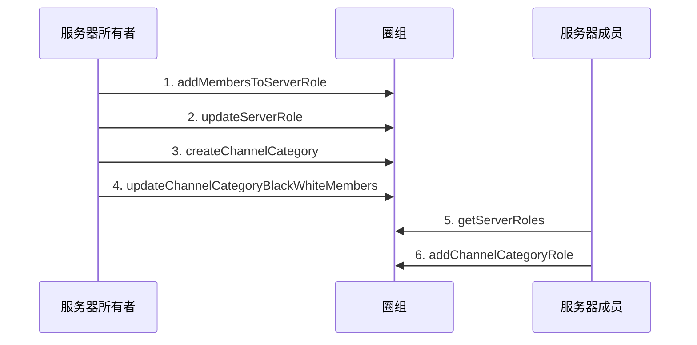

<!--keywords: 频道分组身份组, 频道分组身份组, 身份组 -->


本文以多用户交互的典型场景为例，介绍在频道分组维度对用户进行权限控制的实现方法和示例代码。


## 技术原理

网易云信即时通讯 NIM Android SDK 的[`QChatRoleService`](https://doc.yunxin.163.com/docs/interface/messaging/android/doxygen/Latest/zh/interfacecom_1_1netease_1_1nimlib_1_1sdk_1_1qchat_1_1_q_chat_role_service.html)接口提供管理频道分组身份组的相关方法，助您快速实现在频道分组维度对不同用户的权限控制。 
调用管理频道分组身份组的相关方法，需要管理角色的权限（即[`QChatRoleResource`](https://doc.yunxin.163.com/docs/interface/messaging/android/doxygen/Latest/zh/classcom_1_1netease_1_1nimlib_1_1sdk_1_1qchat_1_1enums_1_1_q_chat_role_resource.html)枚举中的`MANAGE_ROLE`）。

新创建的频道分组身份组的权限设置，默认继承自指定的服务器身份组（通过服务器身份组的 ID 指定）。如果需要在频道分组维度设置和服务器维度有区分的用户权限，需在创建频道分组身份组后调用 [`updateChannelCategoryRole`](https://doc.yunxin.163.com/docs/interface/messaging/android/doxygen/Latest/zh/interfacecom_1_1netease_1_1nimlib_1_1sdk_1_1qchat_1_1_q_chat_role_service.html#a32f43951a3a89b75e6781d3ddd767ddd) 方法对权限做更改；或者调用[`addChannelCategoryMemberRole`](https://doc.yunxin.163.com/docs/interface/messaging/android/doxygen/Latest/zh/interfacecom_1_1netease_1_1nimlib_1_1sdk_1_1qchat_1_1_q_chat_role_service.html#a8ad0292cbcb7b1f4155e35a6772fe6d1)方法创建成员在频道分组的定制权限，再调用[`updateChannelCategoryMemberRole`](https://doc.yunxin.163.com/docs/interface/messaging/android/doxygen/Latest/zh/interfacecom_1_1netease_1_1nimlib_1_1sdk_1_1qchat_1_1_q_chat_role_service.html#a2b578376d90979327a8cb3e4b20d6786)方法设置具体的权限。


## 实现方法

本节以服务器所有者和服务器成员的交互为例（服务器成员仅被授予管理角色权限的场景），介绍服务器成员**创建频道分组身份组**的实现流程。

::: note note :::
- 服务器所有者可以在创建服务器和频道分组后直接调用[`addChannelCategoryRole`](https://doc.yunxin.163.com/docs/interface/messaging/android/doxygen/Latest/zh/interfacecom_1_1netease_1_1nimlib_1_1sdk_1_1qchat_1_1_q_chat_role_service.html#ae17a18dae83e3decdda2b0b6734d9c9f)方法创建频道分组身份组。
- 用户创建频道分组身份组后， 可更新、删除、查询频道分组身份组，相关方法请参见本文的[API参考](https://doc.yunxin.163.com/docs/TM5MzM5Njk/DQwMzEwNzI?platformId=60002#API参考)。
- 服务器成员**创建频道分组某人的定制权限**的实现，可参考本场景的流程。
:::

### **前提条件**


已创建服务器。 

### **实现流程**

1. 服务器所有者调用[`addMembersToServerRole`](https://doc.yunxin.163.com/docs/interface/messaging/android/doxygen/Latest/zh/interfacecom_1_1netease_1_1nimlib_1_1sdk_1_1qchat_1_1_q_chat_role_service.html#acc76632038649a99e3154e67c512fe4e)方法，将服务器成员加入身份组。
2. 服务器所有者调用[`updateServerRole`](https://doc.yunxin.163.com/docs/interface/messaging/android/doxygen/Latest/zh/interfacecom_1_1netease_1_1nimlib_1_1sdk_1_1qchat_1_1_q_chat_role_service.html#ad5a7fc43e0f983997d47314933fdeb33)方法，授予该身份组管理角色的权限。

    **结果**：
    
    服务器成员将拥有管理角色的权限。
    
3. 服务器所有者调用[`createChannelCategory`](https://doc.yunxin.163.com/docs/interface/messaging/android/doxygen/Latest/zh/interfacecom_1_1netease_1_1nimlib_1_1sdk_1_1qchat_1_1_q_chat_channel_service.html#addf98871cbdb043a8acc76be6ed16377)方法，创建频道分组。
4. 如果创建的是私密频道分组，服务器所有者需调用 [`updateChannelCategoryBlackWhiteMembers`](https://doc.yunxin.163.com/docs/interface/messaging/android/doxygen/Latest/zh/interfacecom_1_1netease_1_1nimlib_1_1sdk_1_1qchat_1_1_q_chat_channel_service.html#ab73c2bdd415252392e0fd9e7a25aec03)方法，将该成员加入频道分组白名单。

    ::: note note :::
    如果创建的是公开频道分组，请跳过这一步。
    :::

5. 服务器成员调用[`getServerRoles`](https://doc.yunxin.163.com/docs/interface/messaging/android/doxygen/Latest/zh/interfacecom_1_1netease_1_1nimlib_1_1sdk_1_1qchat_1_1_q_chat_role_service.html#a86219a4022d830877c5aa53c10b94649)方法获取目标服务器身份组的 ID。

    ::: note notice :::
    如果服务器成员在服务器维度没有管理角色的权限，但在频道分组维度有该权限时，调用`getServerRoles`方法时传入频道分组 ID（`categoryId`）才能查询服务器的身份组列表，进而获取目标服务器身份组 ID。
    :::
    
6. 服务器成员调用[`addChannelCategoryRole`](https://doc.yunxin.163.com/docs/interface/messaging/android/doxygen/Latest/zh/interfacecom_1_1netease_1_1nimlib_1_1sdk_1_1qchat_1_1_q_chat_role_service.html#ae17a18dae83e3decdda2b0b6734d9c9f)方法，创建频道分组身份组。 

    <div style="width:100px">入参</div> | <div style="width:80px">类型</div> | 是否必传 | 说明
    ---- | -------------- | ---------
    `serverId` | long | 是 | 频道分组所在的服务器的 ID
    `serverRoleId` | long | 是 | 服务器身份组 ID。生成的频道分组身份组从该服务器身份组继承，以此 ID 作为频道身份组的`parentRoleId`
    `categoryId` | long | 是 | 频道分组 ID

    ::: note important :::
    服务器成员可通过圈组的内置系统通知（[`QChatSystemNotificationType`](https://doc.yunxin.163.com/docs/interface/messaging/android/doxygen/Latest/zh/enumcom_1_1netease_1_1nimlib_1_1sdk_1_1qchat_1_1enums_1_1_q_chat_system_notification_type.html)枚举中的`CHANNEL_CATEGORY_CREATE`）获知`categoryId`。如服务器成员人数超过目前默认的阈值 2,000（可联系商务经理调整），成员需调用[`subscribeServer`](https://doc.yunxin.163.com/docs/interface/messaging/android/doxygen/Latest/zh/interfacecom_1_1netease_1_1nimlib_1_1sdk_1_1qchat_1_1_q_chat_server_service.html#a38fb7b5e0e4beab5f7717818a0935840)方法订阅服务器才能接收到该系统通知。服务器成员人数在阈值内，则不需要订阅服务器也能接收到。
    :::


### **API 调用时序图**



### **示例代码**

```
//************************1.将服务器成员加入身份组************************/
//服务器Id
long serviceId = 2114708;
//服务器身份组Id
long roleId = 21343;
//需要加入服务器的成员账户
String accid = "test1";
List<String> accidList = new ArrayList<>();
accidList.add(accid);

QChatAddMembersToServerRoleParam addMembersToServerRoleParam = new QChatAddMembersToServerRoleParam(serviceId,roleId,accidList);
NIMClient.getService(QChatRoleService.class).addMembersToServerRole(addMembersToServerRoleParam).setCallback(
        new RequestCallback<QChatAddMembersToServerRoleResult>() {
            @Override
            public void onSuccess(QChatAddMembersToServerRoleResult result) {
                List<String> failedAccids = result.getFailedAccids();
                //如果失败列表中成员accid，表示成功了
                if(!failedAccids.contains(accid)){
                    //成功的UI操作
                }
            }

            @Override
            public void onFailed(int code) {

            }

            @Override
            public void onException(Throwable exception) {

            }
        });

//************************2.授予该身份组管理频道权限************************/
//如果该身份组没有管理频道权限，则授予该身份组管理频道权限
QChatUpdateServerRoleParam updateServerRoleParam = new QChatUpdateServerRoleParam(serviceId,roleId);
//开启管理频道权限
Map<QChatRoleResource, QChatRoleOption> resourceAuths = new HashMap<>();
resourceAuths.put(QChatRoleResource.MANAGE_CHANNEL,QChatRoleOption.ALLOW);
updateServerRoleParam.setResourceAuths(resourceAuths);

NIMClient.getService(QChatRoleService.class).updateServerRole(updateServerRoleParam).setCallback(
        new RequestCallback<QChatUpdateServerRoleResult>() {
            @Override
            public void onSuccess(QChatUpdateServerRoleResult result) {
                //  返回更新后的服务器身份组
                QChatServerRole role = result.getRole();
            }

            @Override
            public void onFailed(int code) {

            }

            @Override
            public void onException(Throwable exception) {

            }
        });

//************************3.创建频道分组************************/
QChatCreateChannelCategoryParam categoryParam = new QChatCreateChannelCategoryParam(serviceId);
categoryParam.setName("频道分组名称");
categoryParam.setCustom("频道分组自定义扩展字段");
//设置频道查看模式为私密模式
categoryParam.setViewMode(QChatChannelMode.PRIVATE);
NIMClient.getService(QChatChannelService.class).createChannelCategory(categoryParam).setCallback(
        new RequestCallback<QChatCreateChannelCategoryResult>() {
            @Override
            public void onSuccess(QChatCreateChannelCategoryResult result) {
                //返回创建好的频道分组
                QChatChannelCategory category = result.getCategory();
            }

            @Override
            public void onFailed(int code) {

            }

            @Override
            public void onException(Throwable exception) {

            }
        });

//************************4.将该成员加入频道分组白名单************************/
long categoryId = 17790;
QChatUpdateChannelCategoryBlackWhiteMembersParam updateChannelCategoryBlackWhiteMembersParam = new QChatUpdateChannelCategoryBlackWhiteMembersParam(serviceId,categoryId,
        QChatChannelBlackWhiteType.WHITE, QChatChannelBlackWhiteOperateType.ADD,accidList);
NIMClient.getService(QChatChannelService.class).updateChannelCategoryBlackWhiteMembers(updateChannelCategoryBlackWhiteMembersParam).setCallback(
        new RequestCallback<Void>() {
            @Override
            public void onSuccess(Void result) {
                //加入白名单成功
            }

            @Override
            public void onFailed(int code) {

            }

            @Override
            public void onException(Throwable exception) {

            }
        });

//************************5.查询服务器下身份组列表************************/
QChatGetServerRolesParam getServerRolesParam = new QChatGetServerRolesParam(serviceId,0,100);
getServerRolesParam.setCategoryId(categoryId);
NIMClient.getService(QChatRoleService.class).getServerRoles(getServerRolesParam).setCallback(
        new RequestCallback<QChatGetServerRolesResult>() {
            @Override
            public void onSuccess(QChatGetServerRolesResult result) {
                //返回服务器身份组列表
                List<QChatServerRole> roleList = result.getRoleList();
            }

            @Override
            public void onFailed(int code) {

            }

            @Override
            public void onException(Throwable exception) {

            }
        });

//************************6.创建频道分组身份组************************/
QChatAddChannelCategoryRoleParam addChannelCategoryRoleParam = new QChatAddChannelCategoryRoleParam(serviceId,categoryId,roleId);
NIMClient.getService(QChatRoleService.class).addChannelCategoryRole(addChannelCategoryRoleParam).setCallback(
        new RequestCallback<QChatAddChannelCategoryRoleResult>() {
            @Override
            public void onSuccess(QChatAddChannelCategoryRoleResult result) {
                //返回创建成功的频道分组身份组
                QChatChannelCategoryRole role = result.getRole();
            }

            @Override
            public void onFailed(int code) {

            }

            @Override
            public void onException(Throwable exception) {

            }
        });
```
