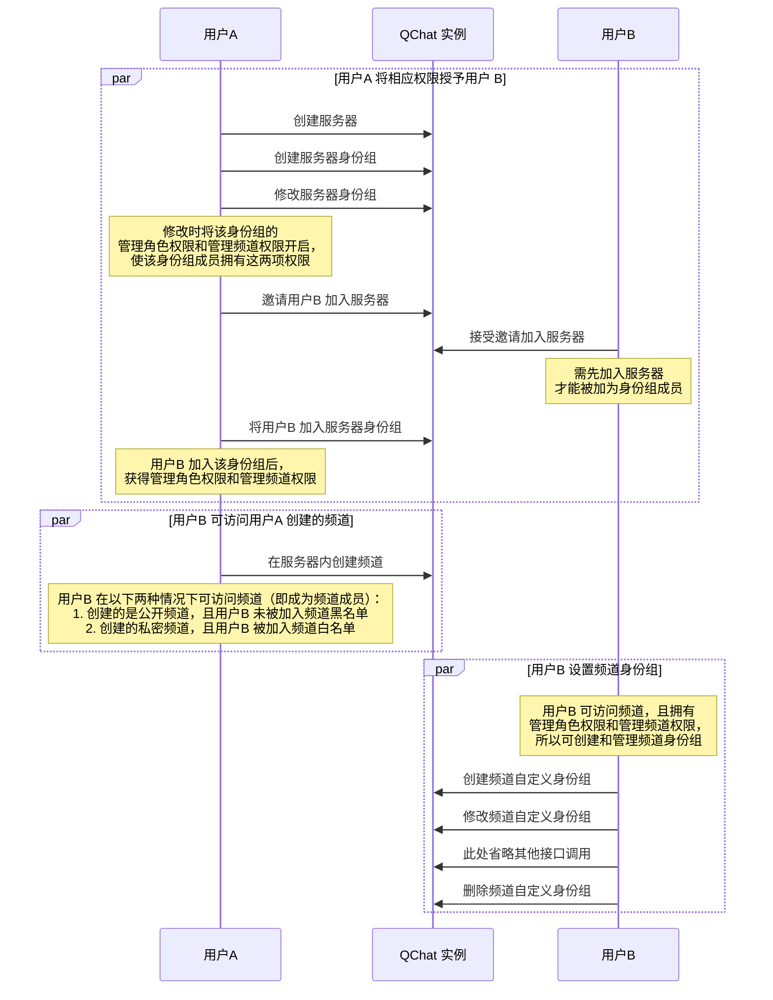
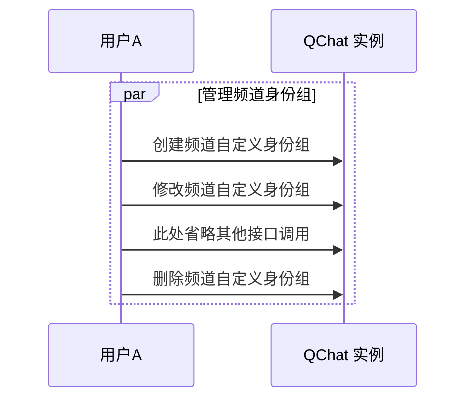

频道身份组用于对用户在频道维度进行权限控制。频道身份组分为两种，@everyone 身份组和自定义身份组。其中 @everyone 身份组在频道创建时默认自动创建，自定义身份组需要用户手动创建。

::: note note
频道下 @everyone 身份组的属性和权限默认继承自服务器的 @everyone 身份组。
:::

## 频道身份组定义
SDK 内定义频道身份组的结构为`QChatChannelRole`接口类。该接口类的内置方法如下：

<br>

<details><summary>单击展开查看 QChatChannelRole 的内置方法</summary>

方法 | 返回数据类型 |说明
:---- | :-------------- | :---------
`getRoleId`  |  long |  返回身份组 ID
`getServerId` | long | 返回身份组所属服务器的 ID
`getChannelId` | long | 返回身份组所属的频道的 ID
`getParentRoleId` | long | 返回频道身份组所继承的服务器身份组的 ID 
`getName` | String  | 返回身份组名称
`getIcon` | String  | 返回身份组图标的 URL 
`getExt`| String  | 返回身份组的扩展字段 
`getResourceAuths`   |Map<`QChatRoleResource`, <a href="https://doc.yunxin.163.com/docs/interface/messaging/android/doxygen/Latest/zh/enumcom_1_1netease_1_1nimlib_1_1sdk_1_1qchat_1_1enums_1_1_q_chat_role_option.html" target="">`QChatRoleOption`</a>>|   返回身份组的权限列表，其中:<ul><li>`QChatRoleResource`的说明请参见<a href="https://doc.yunxin.163.com/messaging/guide/DU4NzI0NjU?platform=android##身份组权限类型" target="_blank">身份组权限类型</a></li><li>`QChatRoleOption`定义了权限的配置状态（即权限开启或关闭），包括：<ul><li>`ALLOW`：开启，表示身份组成员将拥有该权限</li><li>`DENY`：关闭，表示身份组成员无该权限</li><li>`INHERIT`：继承（针对频道自定义身份组来说，指继承自频道的 @everyone 身份组中对应的相同权限项的配置状态）</li></ul></li></ul>
`getType`|  `QChatRoleType`    |返回身份组的类型，1 表示@everyone 身份组，2 表示自定义身份组 
`getCreateTime`  | long  | 返回身份组的创建时间
`getUpdateTime` | long  | 返回身份组配置的更新时间
</details>


## 前提条件

- 已注册[`observeReceiveSystemNotification`](https://doc.yunxin.163.com/docs/interface/messaging/android/doxygen/Latest/zh/interfacecom_1_1netease_1_1nimlib_1_1sdk_1_1qchat_1_1_q_chat_service_observer.html#a243ce250bbef08d40a52f24f12d1007c)监听圈组的系统通知。示例代码参见[圈组系统通知收发](https://doc.yunxin.163.com/messaging/guide/Tc3MDM2MTQ?platform=android)。

  具体**与频道身份组相关**的系统通知类型，见本文末尾的[相关系统通知](#相关系统通知)。


- 已创建服务器和频道。 
  
## 实现方法

以下两个时序图分别展示了服务器普通成员（用户B）和服务器创建者（用户A）进行频道身份组管理前需要实现的业务逻辑。普通成员需要拥有管理频道和管理角色的权限才能创建和管理频道身份组，而服务器创建者默认拥有全量权限，可以在频道内直接创建并管理频道身份组。

:::::: div custom-tabs
::: tab 服务器普通成员管理频道身份组


:::
::: tab 服务器创建者管理频道身份组

:::
::::::


### **创建频道自定义身份组**

默认情况下，频道直接使用服务器身份组来控制权限。如有需要，可调用<a href="https://doc.yunxin.163.com/docs/interface/messaging/android/doxygen/Latest/zh/interfacecom_1_1netease_1_1nimlib_1_1sdk_1_1qchat_1_1_q_chat_role_service.html#a2aac3000af4a2ee6cf74a7b21bf04a3b" target="_blank">`addChannelRole`</a>方法新增一个频道身份组，新增的频道身份组的权限配置默认继承自服务器身份组（调用时必须通过`serverRoleId`指定新增的频道身份组继承自哪个服务器身份组）。


::: note notice 
调用该方法必须先拥有`MANAGE_ROLE`权限和`MANAGE_CHANNEL`权限，且必须是该频道的成员。如果没有权限，调用该方法将返回 `403` 错误码。
:::


新创建的频道身份组和被继承的服务器身份组有以下联系：

- 公开频道的身份组成员等于被继承的服务器身份组成员去掉频道黑名单成员和频道黑名单身份组成员；私密频道的身份组成员是同时存在于频道白名单和被继承的服务器身份组的公共成员。
- 刚创建时两者权限一样。频道身份组刚创建时所有权限配置都为继承（`INHERIT`），因此实际权限和被继承的服务器身份组一样，之后可以调用`updateChannelRole`方法手动修改，使频道身份组和服务器身份组拥有不一样的权限。
- 频道身份组的`parentRoleId`等于被继承的服务器身份组的`roleId`。


- API 原型 

    ```
    InvocationFuture<QChatAddChannelRoleResult> addChannelRole(QChatAddChannelRoleParam param);
    ```

- 示例代码

    ```
    QChatServerRole serverRole = getServerRole();
    NIMClient.getService(QChatRoleService.class).addChannelRole(new QChatAddChannelRoleParam(serverRole.getServerId(),serverRole.getRoleId(),885305L)).setCallback(
            new RequestCallback<QChatAddChannelRoleResult>() {
                @Override
                public void onSuccess(QChatAddChannelRoleResult result) {
                    //操作成功,返回Channe身份组信息
                    QChatChannelRole channelRole = result.getRole();


                }

                @Override
                public void onFailed(int code) {
                    //操作失败，返回错误code
                }

                @Override
                public void onException(Throwable exception) {
                    //操作异常
                }
            });

    ```


### **修改频道自定义身份组**

调用<a href="https://doc.yunxin.163.com/docs/interface/messaging/android/doxygen/Latest/zh/interfacecom_1_1netease_1_1nimlib_1_1sdk_1_1qchat_1_1_q_chat_role_service.html#ac404d411ebb78d009828d79b25b19f74" target="_blank">`updateChannelRole`</a>方法可修改频道自定义身份组的权限配置。

该方法的入参结构为`QChatUpdateChannelRoleParam`，需要传入频道身份组所属的服务器 ID、频道 ID、频道身份组 ID 和待更新的权限 Map。


::: note notice 
- 调用该方法必须先拥有`MANAGE_ROLE`权限和`MANAGE_CHANNEL`权限，且必须是该频道的成员。如果没有权限，调用该方法将返回 `403` 错误码。
- 用户无法配置自己没有的权限。例如用户没有权限A，则无法修改权限A 的配置。
- 用户无法将自己拥有的某个权限在全部所属身份组中都设置为关闭（`DENY`）。例如用户属于 10 个身份组且这 10 个身份组都开启了权限A，那么用户最多可以将其中 9 个身份组的权限A 设置为`DENY`。
:::

- API 原型

    ```
    InvocationFuture<QChatUpdateChannelRoleResult> updateChannelRole(QChatUpdateChannelRoleParam param);
    ```

- 示例代码
    ```
    QChatChannelRole channelRole = getChannelRole();
    Map<QChatRoleResource, QChatRoleOption> resourceAuths = new HashMap<>();
    resourceAuths.put(QChatRoleResource.DELETE_MSG,QChatRoleOption.ALLOW);
    NIMClient.getService(QChatRoleService.class).updateChannelRole(new QChatUpdateChannelRoleParam(channelRole.getServerId(),channelRole.getChannelId(),channelRole.getRoleId(),resourceAuths)).setCallback(
            new RequestCallback<QChatUpdateChannelRoleResult>() {
                @Override
                public void onSuccess(QChatUpdateChannelRoleResult result) {
                    //操作成功,返回修改后的Channel身份组信息
                    QChatChannelRole channelRole = result.getRole();
                }

                @Override
                public void onFailed(int code) {
                    //操作失败，返回错误code
                }

                @Override
                public void onException(Throwable exception) {
                    //操作异常
                }
            });
    ```

### **删除频道身份组**

调用 <a href="https://doc.yunxin.163.com/docs/interface/messaging/android/doxygen/Latest/zh/interfacecom_1_1netease_1_1nimlib_1_1sdk_1_1qchat_1_1_q_chat_role_service.html#a04e537511d4d1d99b391694336ae7a99" target="_blank">`removeChannelRole`</a>可删除频道身份组。

::: note notice 
调用该方法必须先拥有`MANAGE_ROLE`权限和`MANAGE_CHANNEL`权限，且必须是该频道的成员。如果没有权限，调用该方法将返回 `403` 错误码。
:::
- API 原型
    ```
    InvocationFuture<Void> removeChannelRole(QChatRemoveChannelRoleParam param);
    ```
其中 QChatRemoveChannelRoleParam 需要传入ServerId、ChannelId和身份组Id。


- 示例代码
    ```
    QChatChannelRole channelRole = getChannelRole();
    NIMClient.getService(QChatRoleService.class).removeChannelRole(new QChatRemoveChannelRoleParam(channelRole.getServerId(),channelRole.getChannelId(),channelRole.getRoleId())).setCallback(
            new RequestCallback<Void>() {
                @Override
                public void onSuccess(Void param) {
                    //操作成功
                }

                @Override
                public void onFailed(int code) {
                    //操作失败，返回错误code
                }

                @Override
                public void onException(Throwable exception) {
                    //操作异常
                }
            });
    ```

### 查询频道身份组

SDK 提供多个查询频道身份组的方法，具体请参见[频道身份组相关查询](https://doc.yunxin.163.com/messaging/guide/TQyMjQ2MTg?platform=android#频道身份组相关查询)。

## 相关参考

### 相关系统通知


圈组系统通知的类型在[`QChatSystemNotificationType`](https://doc.yunxin.163.com/docs/interface/messaging/android/doxygen/Latest/zh/enumcom_1_1netease_1_1nimlib_1_1sdk_1_1qchat_1_1enums_1_1_q_chat_system_notification_type.html)枚举中定义，与频道身份组相关的内置系统通知类型如下：

枚举值| 说明   
---- | --------------
`CHANNEL_ROLE_AUTH_UPDATE` | 更新“频道身份组”权限   |


::: note note 
该系统通知的接收条件，请参见服务端文档的[身份组权限相关事件通知](https://doc.yunxin.163.com/messaging/guide/TkxMzc1NDg?platform=server#身份组权限相关事件通知)。
:::
