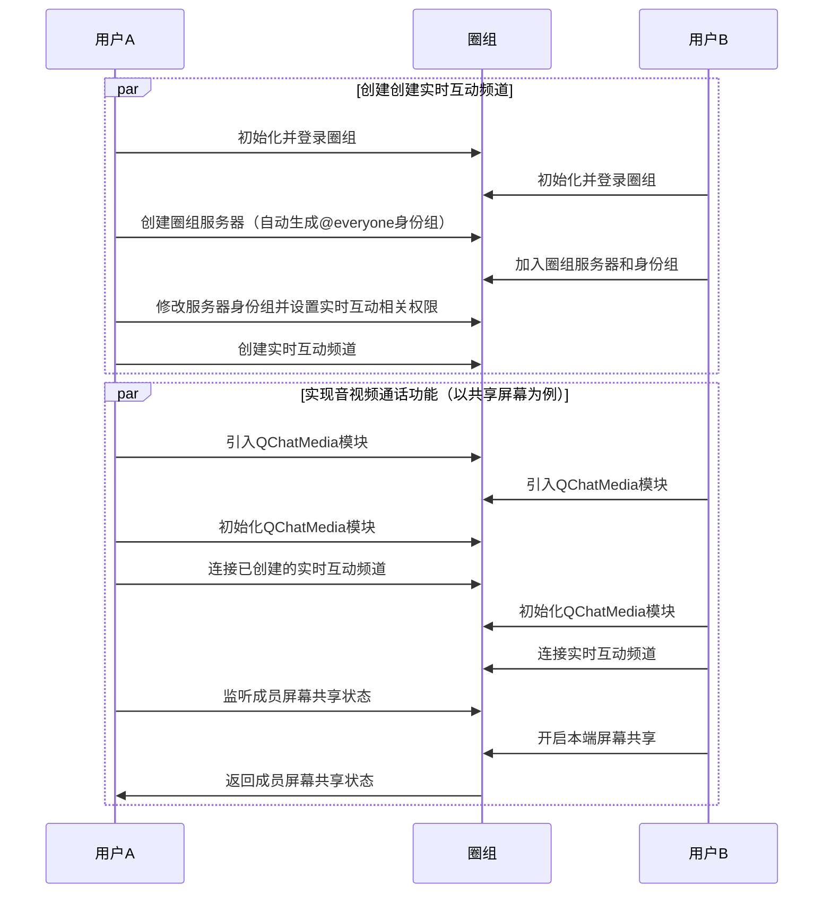

实时互动频道模块，是基于圈组，在文字基础上新增的，用于提供产品能力、丰富社区运营、提升用户活跃的，适用于百万用户量级、多场景、多能力的在线实时互动的多媒体插件。

网易云信 NIM SDK 通过插件的方式引入实时互动频道模块，通过接口的融合，帮助用户在圈组中实现在线实时互动，用户无需独立对接。

::: note notice
实时互动频道相关能力为增值服务，需单独开通，您可通过云信官网提供的联系方式咨询商务经理开通。
:::

实时互动频道模块（`QChatMedia`）中主要包含以下三类接口，分别实现不同的功能。

- [`QChatMediaKit`](https://doc.yunxin.163.com/docs/interface/messaging/android/doxygen/Latest/zh/interfacecom_1_1netease_1_1nimlib_1_1sdk_1_1qcmedia_1_1_q_chat_media_kit.html) 接口提供实时互动频道模块的初始化、登录、连接等能力。
- [`QChatRTCChannelController`](https://doc.yunxin.163.com/docs/interface/messaging/android/doxygen/Latest/zh/interfacecom_1_1netease_1_1nimlib_1_1sdk_1_1qcmedia_1_1_q_chat_r_t_c_channel_controller.html) 接口提供实时互动频道内多样的音视频通话能力。
- [`QChatRTCChannelListener`](https://doc.yunxin.163.com/docs/interface/messaging/android/doxygen/Latest/zh/interfacecom_1_1netease_1_1nimlib_1_1sdk_1_1qcmedia_1_1_q_chat_r_t_c_channel_listener.html) 接口提供实时互动频道相关事件的监听能力。


本文介绍如何在圈组中引入实时互动频道模块，并在实时互动频道中实现实时音视频通话功能。

## 技术原理


::: note note
图中的圈组服务器并非传统意义上的服务器，它是社群本身。所有的内容、兴趣、话题、关系都是以此为基础进行发展的。在圈组的场景下，任何行为的开始前都应该先创建一个圈组服务器。圈组详细信息，请参见[圈组介绍](https://doc.yunxin.163.com/docs/TM5MzM5Njk/jUyODc1NDM?platformId=60002)。
:::


### 实时互动频道与频道的关联逻辑

实时互动频道是频道的一种类型，通过参数 [`QChatChannelType`](https://doc.yunxin.163.com/docs/interface/messaging/android/doxygen/Latest/zh/enumcom_1_1netease_1_1nimlib_1_1sdk_1_1qchat_1_1enums_1_1_q_chat_channel_type.html) 来区分。

频道的管理需要在 [`QChatChannel`](https://doc.yunxin.163.com/docs/interface/messaging/android/doxygen/Latest/zh/interfacecom_1_1netease_1_1nimlib_1_1sdk_1_1qchat_1_1model_1_1_q_chat_channel.html) 中进行，包括创建、删除实时互动频道等，具体请参见[频道管理](https://doc.yunxin.163.com/docs/TM5MzM5Njk/jk5NTM1NTc?platformId=60002)。

实时互动频道内的音视频相关功能需要在实时互动频道模块（`QChatMedia`）中实现。

::: note note
使用实时互动频道模块相关接口，需要拥有实时互动相关权限（具体权限类型请参见 [`QChatRoleResource`](https://doc.yunxin.163.com/docs/interface/messaging/android/doxygen/Latest/zh/classcom_1_1netease_1_1nimlib_1_1sdk_1_1qchat_1_1enums_1_1_q_chat_role_resource.html)），可通过更新身份组来实现。
:::


### 实时互动频道可见机制

实时互动频道的可见机制与频道相同，分以下两种情况：

- 如果实时互动频道为公开频道，那么只要用户未被加入频道黑名单，实时互动频道就对其可见。
- 如果实时互动频道为私密频道，那么用户需被加入频道白名单，实时互动频道才对其可见。

::: note note
频道黑白名单相关操作，请参见[频道管理](https://doc.yunxin.163.com/docs/TM5MzM5Njk/jk5NTM1NTc?platformId=60002)。
:::

## 实现方法

本节以实时互动频道创建者与实时互动频道成员之间的交互为例，介绍在圈组中实现音视频通话功能的流程。

  
### 前提条件

- 已[开通实时互动频道功能](https://doc.yunxin.163.com/messaging/guide/TU3MjAzMjE?platform=android)。实时互动频道需要在开通圈组功能的基础上额外开通后才能使用。
- 已初始化登录圈组，并创建或加入圈组服务器和身份组，具体请参见[圈组服务器管理](https://doc.yunxin.163.com/messaging/guide/zA1OTMxNjY?platform=android)和[身份组管理](https://doc.yunxin.163.com/messaging/guide/DMwODc0Njg?platform=android)。


### 实现流程



这里主要介绍部分步骤，其余步骤请参考具体文档。


1.用户 A 通过调用 [`updateServerRole`](https://doc.yunxin.163.com/docs/interface/messaging/android/doxygen/Latest/zh/interfacecom_1_1netease_1_1nimlib_1_1sdk_1_1qchat_1_1_q_chat_role_service.html#ad5a7fc43e0f983997d47314933fdeb33) 方法修改服务器身份组并设置[实时互动相关权限](https://doc.yunxin.163.com/docs/interface/messaging/android/doxygen/Latest/zh/classcom_1_1netease_1_1nimlib_1_1sdk_1_1qchat_1_1enums_1_1_q_chat_role_resource.html)。示例代码如下：
```
QChatServerRole serverRole = getServerRole();
QChatUpdateServerRoleParam param = new QChatUpdateServerRoleParam(serverRole.getServerId(), serverRole.getRoleId());
param.setName("修改身份组名称");
param.setIcon("http://xxxxxx/xxx/");
param.setExt("修改自定义扩展");
Map<QChatRoleResource, QChatRoleOption> map = new HashMap<>();
map.put(QChatRoleResource.MANAGE_CHANNEL,QChatRoleOption.ALLOW);//管理频道的权限
map.put(QChatRoleResource.MANAGE_ROLE,QChatRoleOption.ALLOW);//管理身份组的权限
map.put(QChatRoleResource.RTC_CHANNEL_CONNECT,QChatRoleOption.ALLOW);// 实时互动频道：连接的权限
map.put(QChatRoleResource.RTC_CHANNEL_DISCONNECT_OTHER,QChatRoleOption.ALLOW);// 实时互动频道：断开他人连接的权限
map.put(QChatRoleResource.RTC_CHANNEL_OPEN_MICROPHONE,QChatRoleOption.ALLOW);// 实时互动频道：开启麦克风的权限
map.put(QChatRoleResource.RTC_CHANNEL_OPEN_CAMERA,QChatRoleOption.ALLOW);// 实时互动频道：开启摄像头的权限
map.put(QChatRoleResource.RTC_CHANNEL_OPEN_CLOSE_OTHER_MICROPHONE,QChatRoleOption.ALLOW);// 实时互动频道：开启/关闭他人麦克风的权限
map.put(QChatRoleResource.RTC_CHANNEL_OPEN_CLOSE_OTHER_CAMERA,QChatRoleOption.ALLOW);// 实时互动频道：开启/关闭他人摄像头的权限
map.put(QChatRoleResource.RTC_CHANNEL_OPEN_CLOSE_EVERYONE_MICROPHONE,QChatRoleOption.ALLOW);// 实时互动频道：开启/关闭全员麦克风的权限
map.put(QChatRoleResource.RTC_CHANNEL_OPEN_CLOSE_EVERYONE_CAMERA,QChatRoleOption.ALLOW);// 实时互动频道：开启/关闭全员摄像头的权限
map.put(QChatRoleResource.RTC_CHANNEL_OPEN_SCREEN_SHARE,QChatRoleOption.ALLOW);// 实时互动频道：打开自己屏幕共享的权限
map.put(QChatRoleResource.RTC_CHANNEL_CLOSE_OTHER_SCREEN_SHARE,QChatRoleOption.ALLOW);// 实时互动频道：关闭他人屏幕共享的权限
param.setResourceAuths(map);
QChatAntiSpamConfig antiSpamConfig = new QChatAntiSpamConfig("用户配置的对某些资料内容另外的反垃圾的业务ID");
antiSpamConfig.setAntiSpamBusinessId(antiSpamConfig);
NIMClient.getService(QChatRoleService.class).updateServerRole(param).setCallback(new RequestCallback<QChatUpdateServerRoleResult>() {
    @Override
    public void onSuccess(QChatUpdateServerRoleResult result) {
        //更新成功，返回更新后的Server身份组
        QChatServerRole role = result.getRole();
    }

    @Override
    public void onFailed(int code) {
        //更新失败，返回错误code
    }

    @Override
    public void onException(Throwable exception) {
        //更新异常
    }
});
```
2. 用户 A 通过调用 [`createChannel`](https://doc.yunxin.163.com/docs/interface/messaging/android/doxygen/Latest/zh/interfacecom_1_1netease_1_1nimlib_1_1sdk_1_1qchat_1_1_q_chat_channel_service.html#a323e3ff02ea02d482fe2b0487670cefe) 方法创建实时互动频道。示例代码如下：

```
QChatCreateChannelParam param = new QChatCreateChannelParam(943445L, "测试频道", QChatChannelType.RTCChannel);
param.setCustom("自定义扩展");
param.setTopic("主题");
//设置频道为公开频道
param.setViewMode(QChatChannelMode.PUBLIC);
QChatAntiSpamConfig antiSpamConfig = new QChatAntiSpamConfig("用户配置的对某些资料内容另外的反垃圾的业务ID");
param.setAntiSpamBusinessId(antiSpamConfig);
NIMClient.getService(QChatChannelService.class).createChannel(param).setCallback(
        new RequestCallback<QChatCreateChannelResult>() {
            @Override
            public void onSuccess(QChatCreateChannelResult result) {
                //创建Channel成功,返回创建成功的Channel信息
                QChatChannel channel = result.getChannel();
            }

            @Override
            public void onFailed(int code) {
                //创建Channel失败，返回错误code
            }

            @Override
            public void onException(Throwable exception) {
                //创建Channel异常
            }
        });
```

::: note notice
- 创建实时互动频道需要拥有管理身份组的权限（`MANAGE_ROLE`）。具体请参见[身份组管理](https://doc.yunxin.163.com/docs/TM5MzM5Njk/DMwODc0Njg?platformId=60002)。
- 创建的实时互动频道需要对用户 B 可见，后续用户 B 才能进行连接。具体请参见[实时互动频道可见机制](#实时互动频道可见机制)。
:::

3. 引入实时互动频道功能插件（`QChatMedia`）。示例代码如下：

```
implementation 'com.netease.nimlib:qchatmedia:x.x.x'
```
:::note notice
x.x.x 为接入的 NIM SDK 版本号。
:::


4. 调用 [`initialize`](https://doc.yunxin.163.com/docs/interface/messaging/android/doxygen/Latest/zh/interfacecom_1_1netease_1_1nimlib_1_1sdk_1_1qcmedia_1_1_q_chat_media_kit.html#aba504ade9abd628adbc7a224b36ac9db) 方法初始化 `QChatMedia` 模块。您也可以调用 [`isInitialized`](https://doc.yunxin.163.com/docs/interface/messaging/android/doxygen/Latest/zh/interfacecom_1_1netease_1_1nimlib_1_1sdk_1_1qcmedia_1_1_q_chat_media_kit.html#a9274fc90762342eb557c60cf866a5fd8) 方法查询初始化状态。示例代如下：
```
//如果没有初始化，则进行初始化操作
if(!QChatMediaKit.getInstance().isInitialized()){
    QChatMediaKit.getInstance().initialize(getContext(), new QCMCallback2<Void>() {
        @Override
        public void onSuccess(Void data) {
            super.onSuccess(data);
            //初始化成功
        }

        @Override
        public void onError(QChatMediaErrorType errorType, int code, String message) {
            super.onError(errorType, code, message);
            //初始化失败
        }
    });
}
```
5. 调用 [`connect`](https://doc.yunxin.163.com/docs/interface/messaging/android/doxygen/Latest/zh/interfacecom_1_1netease_1_1nimlib_1_1sdk_1_1qcmedia_1_1_q_chat_media_kit.html#a1a0832cc7555314ae98641a2659d215f) 方法连接已创建的实时互动频道。您也可以调用 [`isConnected`](https://doc.yunxin.163.com/docs/interface/messaging/android/doxygen/Latest/zh/interfacecom_1_1netease_1_1nimlib_1_1sdk_1_1qcmedia_1_1_q_chat_media_kit.html#a34b487ab6664f55f439b3b03a111b577) 方法查询当前连接状态。示例代码如下：
```
//如果没有连接实时互动频道，则进行连接操作
if(!QChatMediaKit.getInstance().isConnected()){
    QChatMediaKit.getInstance().connect(311254, 211234, QChatMediaType.RTC, new QCMCallback2<Void>() {
        @Override
        public void onSuccess(Void data) {
            super.onSuccess(data);
            //连接成功
        }

        @Override
        public void onError(QChatMediaErrorType errorType, int code, String message) {
            super.onError(errorType, code, message);
            //连接失败
        }
    });
}
```
6. 在实时互动频道中实现具体的音视频功能（以共享屏幕为例）。
    
    a. 用户 A 调用 [`addRTCChannelListener`](https://doc.yunxin.163.com/docs/interface/messaging/android/doxygen/Latest/zh/interfacecom_1_1netease_1_1nimlib_1_1sdk_1_1qcmedia_1_1_q_chat_r_t_c_channel_controller.html#a8c2d135cca4ab0194e0496c1dbbf1e26) 方法添加成员共享屏幕状态（[`onMemberScreenShareStateChanged`](https://doc.yunxin.163.com/docs/interface/messaging/android/doxygen/Latest/zh/interfacecom_1_1netease_1_1nimlib_1_1sdk_1_1qcmedia_1_1_q_chat_r_t_c_channel_listener.html#a4ffd33824bb46a7e92892c5bdd9a8050)）监听事件。
    
    b. 用户 B 调用 [`startScreenShare`](https://doc.yunxin.163.com/docs/interface/messaging/android/doxygen/Latest/zh/interfacecom_1_1netease_1_1nimlib_1_1sdk_1_1qcmedia_1_1_q_chat_r_t_c_channel_controller.html#ad8a8948aaf3df65aa515811854c70c9b) 方法开启屏幕共享。
    
    c. 触发回调，用户 A 收发服务器返回的成员共享屏幕状态。

```
//添加实时互动频道监听事件
QChatRTCChannelController rtcChannelRoomController = QChatMediaKit.getInstance().getRTCChannelRoomController();
if(rtcChannelRoomController != null){
    rtcChannelRoomController.addRTCChannelListener(new QChatRTCChannelListener() {
        /**
            * 成员屏幕共享状态回调
            *
            * @param memberAccid  成员accid
            * @param isSharing    是否正在进行屏幕共享。true 表示房间内有人正在屏幕共享，false 表示房间内没有有人正在屏幕共享
            * @param operateAccid 操作者
            */
        @Override
        public void onMemberScreenShareStateChanged(String memberAccid, boolean isSharing, String operateAccid) {

        }
    });
```

```
//绑定屏幕共享服务
private void bindScreenService() {
    Intent intent = new Intent();
    intent.setClass(this, ScreenShareService.class);
    mServiceConnection = new ScreenShareServiceConnection();
    bindService(intent, mServiceConnection, Context.BIND_AUTO_CREATE);
}

private class ScreenShareServiceConnection implements ServiceConnection {

    @Override
    public void onServiceConnected(ComponentName componentName, IBinder service) {
        if (service instanceof ScreenShareService.ScreenShareBinder) {
            mScreenService = ((ScreenShareService.ScreenShareBinder) service).getService();
            NimLog.i(TAG, "onServiceConnect");
        }
    }

    @Override
    public void onServiceDisconnected(ComponentName componentName) {
        mScreenService = null;
    }
}

private ActivityResultLauncher<Intent> launcher = registerForActivityResult(
        new ActivityResultContracts.StartActivityForResult(), new ActivityResultCallback<ActivityResult>() {

            @Override
            public void onActivityResult(ActivityResult result) {
                NimLog.d(TAG, "onActivityResult,result:" + result.getResultCode());
                if (result.getResultCode() == Activity.RESULT_OK) {
                    mScreenService.startScreenCapture(QChatMediaKit.getInstance().getRTCChannelRoomController(), result.getData(),
                                                        new MediaProjection.Callback() {

                                @Override
                                public void onStop() {
                                    super.onStop();
                                    showToast("屏幕共享结束");
                                }
                            }, new QCMCallback2<Void>() {

                                @Override
                                public void onSuccess(@Nullable Void unit) {
                                    super.onSuccess(unit);
                                    showToast("开始屏幕共享");
                                }

                                @Override
                                public void onError(QChatMediaErrorType errorType,int code, @Nullable String message) {
                                    super.onError(errorType,code, message);
                                    showToast("startScreenCapture error,code:" + code + ",message:" + message);
                                }
                            });
                }
            }
        });

private void initListener(){
    findViewById(R.id.startScreenShare).setOnClickListener(new View.OnClickListener() {

            @Override
            public void onClick(View view) {
                //开启屏幕共享
                MediaProjectionManager mediaProjectionManager = (MediaProjectionManager) getSystemService(
                        Context.MEDIA_PROJECTION_SERVICE);
                launcher.launch(mediaProjectionManager.createScreenCaptureIntent());
            }
        });
    findViewById(R.id.unmuteMyAudio).setOnClickListener(new OnClickListener() {

            @Override
            public void onClick(View view) {
               unMuteAudio(currentAccid);
            }
        });
}
```

7. 调用 [`disConnect`](https://doc.yunxin.163.com/docs/interface/messaging/android/doxygen/Latest/zh/interfacecom_1_1netease_1_1nimlib_1_1sdk_1_1qcmedia_1_1_q_chat_media_kit.html#ad6d7ee0a7f102294265babbbe5bd7807) 方法与实时互动频道断开连接。示例代码如下：

```
QChatMediaKit.getInstance().disConnect(new QCMCallback<Void>() {
                @Override
                public void onResult(QChatMediaErrorType errorType, int code, @Nullable String message, @Nullable Void data) {
                    finish();
                }
            });
```
##  实时互动频道功能列表
 <div style="width:80px">功能</div> | <div style="width:120px">描述</div>
:---- | :-------------- 
切换摄像头|[`switchCamera`](https://doc.yunxin.163.com/docs/interface/messaging/android/doxygen/Latest/zh/interfacecom_1_1netease_1_1nimlib_1_1sdk_1_1qcmedia_1_1_q_chat_r_t_c_channel_controller.html#a2801c3391547bf1fb861ae931154c85b)
打开音频|[`unMuteAllAudio`](https://doc.yunxin.163.com/docs/interface/messaging/android/doxygen/Latest/zh/interfacecom_1_1netease_1_1nimlib_1_1sdk_1_1qcmedia_1_1_q_chat_r_t_c_channel_controller.html#ab7d7635dcf83a6af35d40623850ad4ee)（所有成员）；[`unMuteAudio`](https://doc.yunxin.163.com/docs/interface/messaging/android/doxygen/Latest/zh/interfacecom_1_1netease_1_1nimlib_1_1sdk_1_1qcmedia_1_1_q_chat_r_t_c_channel_controller.html#af0f0fa131a1ea4d9cea120293a7618be)（指定成员）
打开视频|[`unMuteAllVideo`](https://doc.yunxin.163.com/docs/interface/messaging/android/doxygen/Latest/zh/interfacecom_1_1netease_1_1nimlib_1_1sdk_1_1qcmedia_1_1_q_chat_r_t_c_channel_controller.html#aecdd1d268ce2e620ac883ffde16b2d63)（所有成员）； [`unMuteVideo`](https://doc.yunxin.163.com/docs/interface/messaging/android/doxygen/Latest/zh/interfacecom_1_1netease_1_1nimlib_1_1sdk_1_1qcmedia_1_1_q_chat_r_t_c_channel_controller.html#a2514e1af04e377b42e8f0ce7380fffc3)（指定成员）
共享屏幕|[`startScreenShare`](https://doc.yunxin.163.com/docs/interface/messaging/android/doxygen/Latest/zh/interfacecom_1_1netease_1_1nimlib_1_1sdk_1_1qcmedia_1_1_q_chat_r_t_c_channel_controller.html#ad8a8948aaf3df65aa515811854c70c9b)
查询屏幕共享者|[`getScreenSharingUserUuid`](https://doc.yunxin.163.com/docs/interface/messaging/android/doxygen/Latest/zh/interfacecom_1_1netease_1_1nimlib_1_1sdk_1_1qcmedia_1_1_q_chat_r_t_c_channel_controller.html#abe72d460b7e20741aacd5f1a5d632878)
订阅远端视频流/辅流视频|[`subscribeRemoteVideoStream`](https://doc.yunxin.163.com/docs/interface/messaging/android/doxygen/Latest/zh/interfacecom_1_1netease_1_1nimlib_1_1sdk_1_1qcmedia_1_1_q_chat_r_t_c_channel_controller.html#aa487bf7c16186c2b271a5406d28786af);[`subscribeRemoteVideoSubStream`](https://doc.yunxin.163.com/docs/interface/messaging/android/doxygen/Latest/zh/interfacecom_1_1netease_1_1nimlib_1_1sdk_1_1qcmedia_1_1_q_chat_r_t_c_channel_controller.html#a9ba3c74d0f37532b05579f5d2d6cd7d9)
设置用户视图|[`setupVideoCanvas`](https://doc.yunxin.163.com/docs/interface/messaging/android/doxygen/Latest/zh/interfacecom_1_1netease_1_1nimlib_1_1sdk_1_1qcmedia_1_1_q_chat_r_t_c_channel_controller.html#abb8693fb425a2b08c2cd546ef9509f7a);
设置远端辅流视频画布|[`setupRemoteVideoSubStreamCanvas`](https://doc.yunxin.163.com/docs/interface/messaging/android/doxygen/Latest/zh/interfacecom_1_1netease_1_1nimlib_1_1sdk_1_1qcmedia_1_1_q_chat_r_t_c_channel_controller.html#a7cd95b93c672ee569bb8234f07c274d7)
调节信号音量|[`adjustUserPlaybackSignalVolume`](https://doc.yunxin.163.com/docs/interface/messaging/android/doxygen/Latest/zh/interfacecom_1_1netease_1_1nimlib_1_1sdk_1_1qcmedia_1_1_q_chat_r_t_c_channel_controller.html#a0248651b457f817a91a5e31f14764032)
打开/查询扬声器|[`setSpeakerphoneOn`](https://doc.yunxin.163.com/docs/interface/messaging/android/doxygen/Latest/zh/interfacecom_1_1netease_1_1nimlib_1_1sdk_1_1qcmedia_1_1_q_chat_r_t_c_channel_controller.html#a23d4216e63994464696cf6134f785baa)；[`isSpeakerphoneOn`](https://doc.yunxin.163.com/docs/interface/messaging/android/doxygen/Latest/zh/interfacecom_1_1netease_1_1nimlib_1_1sdk_1_1qcmedia_1_1_q_chat_r_t_c_channel_controller.html#a926a5dd64c3401d1426ed1e66cbebbba)
获取实时互动频道成员|[`getLocalQChatMediaMember`](https://doc.yunxin.163.com/docs/interface/messaging/android/doxygen/Latest/zh/interfacecom_1_1netease_1_1nimlib_1_1sdk_1_1qcmedia_1_1_q_chat_r_t_c_channel_controller.html#a0a29e69a646d5d0b38fb92bdab2574fe)（本端成员）；[`getQChatMediaMembers`](https://doc.yunxin.163.com/docs/interface/messaging/android/doxygen/Latest/zh/interfacecom_1_1netease_1_1nimlib_1_1sdk_1_1qcmedia_1_1_q_chat_r_t_c_channel_controller.html#a90b8202e86078a571aac49ba394accc0)（远端成员）
启动说话者音量提示|[`enableAudioVolumeIndication`](https://doc.yunxin.163.com/docs/interface/messaging/android/doxygen/Latest/zh/interfacecom_1_1netease_1_1nimlib_1_1sdk_1_1qcmedia_1_1_q_chat_r_t_c_channel_controller.html#ac1c5930dfabca6f4510c889fb6389fc0)
移除成员|[`kickMemberOut`](https://doc.yunxin.163.com/docs/interface/messaging/android/doxygen/Latest/zh/interfacecom_1_1netease_1_1nimlib_1_1sdk_1_1qcmedia_1_1_q_chat_r_t_c_channel_controller.html#a41ced6a5b8589d969069cd26a483279f)

## API 参考
以下为本文涉及的实时互动频道相关 API。
<div style="width:80px">API</div> | <div style="width:120px">说明</div>
:---- | :-------------- 
[`updateServerRole`](https://doc.yunxin.163.com/docs/interface/messaging/android/doxygen/Latest/zh/interfacecom_1_1netease_1_1nimlib_1_1sdk_1_1qchat_1_1_q_chat_role_service.html#ad5a7fc43e0f983997d47314933fdeb33) |修改服务器身份组
[`createChannel`](https://doc.yunxin.163.com/docs/interface/messaging/android/doxygen/Latest/zh/interfacecom_1_1netease_1_1nimlib_1_1sdk_1_1qchat_1_1_q_chat_channel_service.html#a323e3ff02ea02d482fe2b0487670cefe)|创建实时互动频道
[`initialize`](https://doc.yunxin.163.com/docs/interface/messaging/android/doxygen/Latest/zh/interfacecom_1_1netease_1_1nimlib_1_1sdk_1_1qcmedia_1_1_q_chat_media_kit.html#aba504ade9abd628adbc7a224b36ac9db)|  初始化实时互动频道模块
[`isInitialized`](https://doc.yunxin.163.com/docs/interface/messaging/android/doxygen/Latest/zh/interfacecom_1_1netease_1_1nimlib_1_1sdk_1_1qcmedia_1_1_q_chat_media_kit.html#a9274fc90762342eb557c60cf866a5fd8) | 查询初始化状态
[`connect`](https://doc.yunxin.163.com/docs/interface/messaging/android/doxygen/Latest/zh/interfacecom_1_1netease_1_1nimlib_1_1sdk_1_1qcmedia_1_1_q_chat_media_kit.html#a1a0832cc7555314ae98641a2659d215f) |连接实时互动频道
[`disConnect`](https://doc.yunxin.163.com/docs/interface/messaging/android/doxygen/Latest/zh/interfacecom_1_1netease_1_1nimlib_1_1sdk_1_1qcmedia_1_1_q_chat_media_kit.html#ad6d7ee0a7f102294265babbbe5bd7807)| 取消连接实时互动频道
[`isConnected`](https://doc.yunxin.163.com/docs/interface/messaging/android/doxygen/Latest/zh/interfacecom_1_1netease_1_1nimlib_1_1sdk_1_1qcmedia_1_1_q_chat_media_kit.html#a34b487ab6664f55f439b3b03a111b577)| 查询当前连接状态
[`addRTCChannelListener`](https://doc.yunxin.163.com/docs/interface/messaging/android/doxygen/Latest/zh/interfacecom_1_1netease_1_1nimlib_1_1sdk_1_1qcmedia_1_1_q_chat_r_t_c_channel_controller.html#a8c2d135cca4ab0194e0496c1dbbf1e26) |添加实时互动频道事件监听
[`removeRTCChannelListener`](https://doc.yunxin.163.com/docs/interface/messaging/android/doxygen/Latest/zh/interfacecom_1_1netease_1_1nimlib_1_1sdk_1_1qcmedia_1_1_q_chat_r_t_c_channel_controller.html#a79abf492c0301f477350ef4a41a82751)  |移除实时互动频道监听
[`startScreenShare`](https://doc.yunxin.163.com/docs/interface/messaging/android/doxygen/Latest/zh/interfacecom_1_1netease_1_1nimlib_1_1sdk_1_1qcmedia_1_1_q_chat_r_t_c_channel_controller.html#ad8a8948aaf3df65aa515811854c70c9b)|开启本端屏幕共享
[`stopScreenShare`](https://doc.yunxin.163.com/docs/interface/messaging/android/doxygen/Latest/zh/interfacecom_1_1netease_1_1nimlib_1_1sdk_1_1qcmedia_1_1_q_chat_r_t_c_channel_controller.html#a96aca464449ad0bafb7416fc82a9d80a)|关闭本端屏幕共享
[`onMemberScreenShareStateChanged`](https://doc.yunxin.163.com/docs/interface/messaging/android/doxygen/Latest/zh/interfacecom_1_1netease_1_1nimlib_1_1sdk_1_1qcmedia_1_1_q_chat_r_t_c_channel_listener.html#a4ffd33824bb46a7e92892c5bdd9a8050)|成员屏幕共享状态回调


更多实时互动频道相关接口如下：

- [`QChatMediaKit`](https://doc.yunxin.163.com/docs/interface/messaging/android/doxygen/Latest/zh/interfacecom_1_1netease_1_1nimlib_1_1sdk_1_1qcmedia_1_1_q_chat_media_kit.html) 接口提供实时互动频道模块的初始化、登录、连接等能力。
- [`QChatRTCChannelController`](https://doc.yunxin.163.com/docs/interface/messaging/android/doxygen/Latest/zh/interfacecom_1_1netease_1_1nimlib_1_1sdk_1_1qcmedia_1_1_q_chat_r_t_c_channel_controller.html) 接口提供实时互动频道内多样的音视频通话能力。
- [`QChatRTCChannelListener`](https://doc.yunxin.163.com/docs/interface/messaging/android/doxygen/Latest/zh/interfacecom_1_1netease_1_1nimlib_1_1sdk_1_1qcmedia_1_1_q_chat_r_t_c_channel_listener.html) 接口提供实时互动频道相关事件的监听能力。