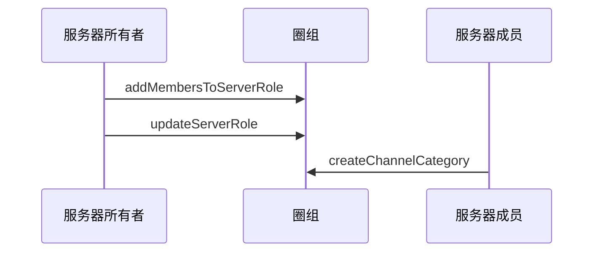

<!--keywords: 频道分组, 创建频道分组, 修改频道分组信息，查询频道分组 -->

网易云信即时通讯 NIM Android SDK 的[`QChatChannelCategory`](https://doc.yunxin.163.com/docs/interface/messaging/android/doxygen/Latest/zh/interfacecom_1_1netease_1_1nimlib_1_1sdk_1_1qchat_1_1model_1_1_q_chat_channel_category.html)结构体定义了频道分组。同时，SDK 的[`QChatChannelService`](https://doc.yunxin.163.com/docs/interface/messaging/android/doxygen/Latest/zh/interfacecom_1_1netease_1_1nimlib_1_1sdk_1_1qchat_1_1_q_chat_channel_service.html)接口提供管理频道分组的相关方法，助您快速实现对频道的分类管理。

## 功能介绍


频道管理相关方法，基本都需要满足如下两个前提条件才能调用。各方法的具体调用前提，请参见本文的 [API参考](https://doc.yunxin.163.com/docs/TM5MzM5Njk/jUxNTE5MTY?platformId=60002#API参考)。

- 频道分组对用户可见，具体机制见下文的**频道分组可见机制**。
- 拥有管理频道的权限（[`QChatRoleResource`](https://doc.yunxin.163.com/docs/interface/messaging/android/doxygen/Latest/zh/classcom_1_1netease_1_1nimlib_1_1sdk_1_1qchat_1_1enums_1_1_q_chat_role_resource.html)枚举中的`MANAGE_CHANNEL`）。


#### **频道分组可见机制**

- 频道分组对**服务器成员**的可见机制与频道的类似，分如下两种情况：

    - 如果频道分组为公开频道分组，那么只要用户未被加入频道分组黑名单，频道分组就对其可见。
    - 如果频道分组为私密频道分组，那么用户需被加入频道分组白名单，频道分组才对其可见。

    ::: note note :::
    频道分组黑白名单相关说明，请参见[频道分组黑白名单](https://doc.yunxin.163.com/docs/TM5MzM5Njk/jA3NjE4Mjc?platformId=60002)。
    :::

- 频道分组是否对**游客**可见，取决于频道分组内是否有频道对游客可见。如果频道分组内有频道对游客可见，则该频道分组对游客也可见。频道是否对游客可见由`visitorMode`决定，可在创建频道和修改频道时设置，具体见[频道管理](https://doc.yunxin.163.com/messaging/guide/TgwMjk5NDY?platform=android)。

    ::: note notice 
    如果频道的`visitorMode`为跟随模式，且同步模式（`syncMode`）为“与频道分组同步”，则当该频道所属的频道分组的查看模式（`viewMode`）变更后，该频道对游客的可见性也将变更。例如，在这种情况下，频道分组的查看模式由公开变为私密，则此时该频道对游客从“可见”变为“不可见”。
    :::
#### **与频道的关联逻辑**

频道管理相关方法（如[`createChannel`](https://doc.yunxin.163.com/docs/interface/messaging/android/doxygen/Latest/zh/interfacecom_1_1netease_1_1nimlib_1_1sdk_1_1qchat_1_1_q_chat_channel_service.html#a323e3ff02ea02d482fe2b0487670cefe)）的入参包含`categoryId`和`syncMode`。在调用`createChannel`时传入 `categoryId` 可将频道加入某个频道分组；通过设置`syncMode`，可实现频道数据与频道分组数据的同步。具体同步的数据包括查看模式（私密或公开）、黑白名单和身份组权限。


<div style="width:80px">参数</div> | <div style="width:80px">类型</div> |<div style="width:120px">说明 </div>
:---- | :-------------- |:--------------
`categoryId` | long | 频道需加入或所在的频道分组 ID。设置为 `0` 表示频道没有频道分组。设置为频道分组 ID 表示归属某个频道分组  
`syncMode` |   [`QChatChannelSyncMode`](https://doc.yunxin.163.com/docs/interface/messaging/android/doxygen/Latest/zh/enumcom_1_1netease_1_1nimlib_1_1sdk_1_1qchat_1_1enums_1_1_q_chat_channel_sync_mode.html)    |   频道同步模式。传`1`同步，传`0`不同步，不传默认不同步。如果频道查看模式、黑白名单、身份组权限等被修改，自动改为不同步              

::: note notice :::
归属于单个频道分组的频道数量上限为 50。
:::


#### **与服务器的关联逻辑**

[`QChatServer`](https://doc.yunxin.163.com/docs/interface/messaging/android/doxygen/Latest/zh/interfacecom_1_1netease_1_1nimlib_1_1sdk_1_1qchat_1_1model_1_1_q_chat_server.html)结构体包含`categoryNumber`参数，该参数表示服务器内频道分组的数量。`QChatServer` 结构体定义了服务器。

::: note notice :::
服务器内频道分组数量上限为 100。
:::


## 实现方法

本节以服务器所有者（即创建者）和服务器成员的交互为例，介绍服务器成员**创建频道分组**的实现流程。

::: note note :::
- 服务器所有者拥有全局权限，可以在创建服务器后直接调用[`createChannelCategory`](https://doc.yunxin.163.com/docs/interface/messaging/android/doxygen/Latest/zh/interfacecom_1_1netease_1_1nimlib_1_1sdk_1_1qchat_1_1_q_chat_channel_service.html#addf98871cbdb043a8acc76be6ed16377)方法创建频道分组。
- 用户创建频道分组后， 可对频道分组做更新、删除、修改和查询等操作，相关可调用的方法请参见本文的[API 参考](https://doc.yunxin.163.com/docs/TM5MzM5Njk/jUxNTE5MTY?platformId=60002#API参考)。
:::

### **前提条件**


- 已注册[`observeReceiveSystemNotification`](https://doc.yunxin.163.com/docs/interface/messaging/android/doxygen/Latest/zh/interfacecom_1_1netease_1_1nimlib_1_1sdk_1_1qchat_1_1_q_chat_service_observer.html#a243ce250bbef08d40a52f24f12d1007c)监听圈组的系统通知。示例代码参见[圈组系统通知收发](https://doc.yunxin.163.com/messaging/guide/Tc3MDM2MTQ?platform=android)。

  具体**与频道分组管理相关**的系统通知类型，见本文末尾的[相关系统通知](#相关系统通知)。
  

- 已<a href="https://doc.yunxin.163.com/messaging/guide/Dg2NjI4NzQ?platform=android#创建服务器" target="_blank">创建服务器</a>。

### **实现流程**

1. 服务器所有者调用[`addMembersToServerRole`](https://doc.yunxin.163.com/docs/interface/messaging/android/doxygen/Latest/zh/interfacecom_1_1netease_1_1nimlib_1_1sdk_1_1qchat_1_1_q_chat_role_service.html#acc76632038649a99e3154e67c512fe4e)方法将服务器成员加入身份组。
2. 服务器所有者调用[`updateServerRole`](https://doc.yunxin.163.com/docs/interface/messaging/android/doxygen/Latest/zh/interfacecom_1_1netease_1_1nimlib_1_1sdk_1_1qchat_1_1_q_chat_role_service.html#ad5a7fc43e0f983997d47314933fdeb33)方法授权该身份组管理频道的权限。
3. 服务器成员调用[`createChannelCategory`](https://doc.yunxin.163.com/docs/interface/messaging/android/doxygen/Latest/zh/interfacecom_1_1netease_1_1nimlib_1_1sdk_1_1qchat_1_1_q_chat_channel_service.html#addf98871cbdb043a8acc76be6ed16377)方法创建频道分组。

### **API 调用时序图**



### **示例代码**

```
//************************1.将服务器成员加入身份组************************/
//服务器Id
long serviceId = 2114708;
//服务器身份组Id
long roleId = 21343;
//需要加入服务器的成员账户
String accid = "test1";
List<String> accidList = new ArrayList<>();
accidList.add(accid);

QChatAddMembersToServerRoleParam addMembersToServerRoleParam = new QChatAddMembersToServerRoleParam(serviceId,roleId,accidList);
NIMClient.getService(QChatRoleService.class).addMembersToServerRole(addMembersToServerRoleParam).setCallback(
        new RequestCallback<QChatAddMembersToServerRoleResult>() {
            @Override
            public void onSuccess(QChatAddMembersToServerRoleResult result) {
                List<String> failedAccids = result.getFailedAccids();
                //如果失败列表中成员accid，表示成功了
                if(!failedAccids.contains(accid)){
                    //成功的UI操作
                }
            }

            @Override
            public void onFailed(int code) {

            }

            @Override
            public void onException(Throwable exception) {

            }
        });

//************************2.授予该身份组管理频道权限************************/
//如果该身份组没有管理频道权限，则授予该身份组管理频道权限
QChatUpdateServerRoleParam updateServerRoleParam = new QChatUpdateServerRoleParam(serviceId,roleId);
//开启管理频道权限
Map<QChatRoleResource, QChatRoleOption> resourceAuths = new HashMap<>();
resourceAuths.put(QChatRoleResource.MANAGE_CHANNEL,QChatRoleOption.ALLOW);
updateServerRoleParam.setResourceAuths(resourceAuths);

NIMClient.getService(QChatRoleService.class).updateServerRole(updateServerRoleParam).setCallback(
        new RequestCallback<QChatUpdateServerRoleResult>() {
            @Override
            public void onSuccess(QChatUpdateServerRoleResult result) {
                //  返回更新后的服务器身份组
                QChatServerRole role = result.getRole();
            }

            @Override
            public void onFailed(int code) {

            }

            @Override
            public void onException(Throwable exception) {

            }
        });

//************************3.创建频道分组************************/
QChatCreateChannelCategoryParam categoryParam = new QChatCreateChannelCategoryParam(serviceId);
categoryParam.setName("频道分组名称");
categoryParam.setCustom("频道分组自定义扩展字段");
//设置频道查看模式
categoryParam.setViewMode(QChatChannelMode.PUBLIC);
NIMClient.getService(QChatChannelService.class).createChannelCategory(categoryParam).setCallback(
        new RequestCallback<QChatCreateChannelCategoryResult>() {
            @Override
            public void onSuccess(QChatCreateChannelCategoryResult result) {
                //返回创建好的频道分组
                QChatChannelCategory category = result.getCategory();
            }

            @Override
            public void onFailed(int code) {

            }

            @Override
            public void onException(Throwable exception) {

            }
        });
```
## 相关参考


### **相关系统通知**

频道分组相关事件的系统通知为 SDK 内置系统通知，在[`QChatSystemNotificationType`](https://doc.yunxin.163.com/docs/interface/messaging/android/doxygen/Latest/zh/enumcom_1_1netease_1_1nimlib_1_1sdk_1_1qchat_1_1enums_1_1_q_chat_system_notification_type.html)枚举内定义。具体类型及相关的触发和接收条件见下表。

<div style="width:100px">系统通知类型</div> | <div style="width:120px">触发条件</div> | <div style="width:400px">接收条件</div> 
:---- | :-------------- | :--------- |:--------
`CHANNEL_CATEGORY_CREATE(21)` | 频道分组成功创建时  | <div><ul><li>服务器创建者和所有者：在线</li><li>其他成员：服务器成员数量低于 2,000 人阈值时只需要在线。如大于 2,000，需在线且订阅服务器</li></ul> </div>
`CHANNEL_CATEGORY_REMOVE(22)` |  频道分组被删除时   | <div><ul><li>删除者和服务器所有者：在线</li><li>其他成员：服务器成员数量低于 2,000 人阈值时只需要在线。如大于 2,000，需在线且订阅服务器</li></ul> </div>
`CHANNEL_CATEGORY_UPDATE(23)`| 频道分组信息被修改时 | <div><ul><li>修改者和服务器所有者：在线</li><li>其他成员：服务器成员数量低于 2,000 人阈值时只需要在线。如大于 2,000，需在线且订阅服务器</li></ul> </div>

::: note note :::
2,000 人阈值可联系商务经理调整。
::: 


  


### **相关推送配置**

- 与频道分组相关的推送配置方法：[`updateUserChannelCategoryPushConfig`](https://doc.yunxin.163.com/docs/interface/messaging/android/doxygen/Latest/zh/interfacecom_1_1netease_1_1nimlib_1_1sdk_1_1qchat_1_1_q_chat_channel_service.html#a89aab244ea7c301fefaf68ecf6767799)、 [`getUserChannelCategoryPushConfigs`](https://doc.yunxin.163.com/docs/interface/messaging/android/doxygen/Latest/zh/interfacecom_1_1netease_1_1nimlib_1_1sdk_1_1qchat_1_1_q_chat_channel_service.html#ac8270d7a5d0e76cfac781e9a6821bc80) 

- 圈组的详细推送功能说明请参见[推送管理](https://doc.yunxin.163.com/docs/TM5MzM5Njk/DQyMzk0MDQ?platformId=60002)

