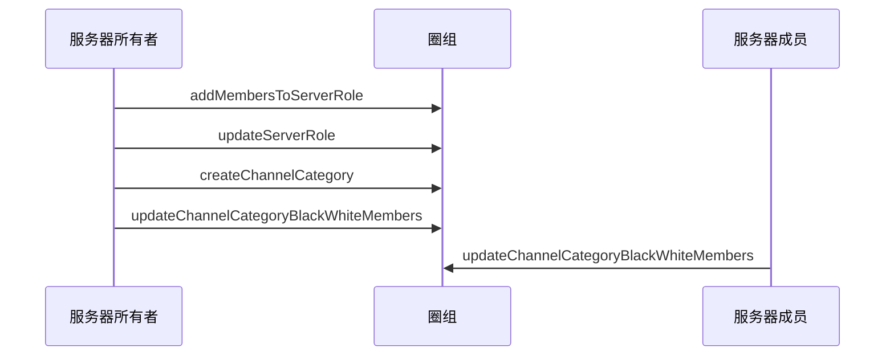

<!--keywords: 频道分组黑白名单, 黑白名单, 频道分组 -->

网易云信即时通讯 NIM Android SDK 的[`QChatChannelService`](https://doc.yunxin.163.com/docs/interface/messaging/android/doxygen/Latest/zh/interfacecom_1_1netease_1_1nimlib_1_1sdk_1_1qchat_1_1_q_chat_channel_service.html)提供管理频道分组黑白名单（包括名单成员和名单身份组）的方法。
## 功能介绍


#### **频道分组可见机制**

频道分组黑白名单与频道分组类型（公开/私密）共同判定频道分组是否对服务器成员可见。

- 公开频道分组：如果服务器成员被加入公开频道分组的黑名单或黑名单身份组，那么该频道分组对该成员不可见，反之可见。
- 私密频道分组：如果服务器成员被加入私密频道分组的白名单或白名单身份组，那么该频道分组对该成员可见，反之不可见。

#### **权限要求**

调用管理频道黑白名单的相关方法，需要管理黑白名单的权限（即[`QChatRoleResource`](https://doc.yunxin.163.com/docs/interface/messaging/android/doxygen/Latest/zh/classcom_1_1netease_1_1nimlib_1_1sdk_1_1qchat_1_1enums_1_1_q_chat_role_resource.html)中的`MANAGE_BLACK_WHITE_LIST`）

## 实现方法

本节以服务器所有者和服务器成员的交互为例，介绍服务器成员更新频道分组黑白名单的实现流程。

::: note note :::
- 更新频道分组黑白名单身份组的实现流程，与更新黑白名单的实现流程类似，本文不做详细介绍。
- 服务器所有者拥有全量权限，可直接调用[`updateChannelCategoryBlackWhiteRoles`](https://doc.yunxin.163.com/docs/interface/messaging/android/doxygen/Latest/zh/interfacecom_1_1netease_1_1nimlib_1_1sdk_1_1qchat_1_1_q_chat_channel_service.html#a4e3fb468b16ba610811ac5a3b9d17168)和 [`updateChannelCategoryBlackWhiteMembers`](https://doc.yunxin.163.com/docs/interface/messaging/android/doxygen/Latest/zh/interfacecom_1_1netease_1_1nimlib_1_1sdk_1_1qchat_1_1_q_chat_channel_service.html#ab73c2bdd415252392e0fd9e7a25aec03)方法分别更新频道分组黑白名单和黑白名单身份组。
- 用户更新频道分组黑白名单身份组/成员后，可查询黑白名单身份组/成员。相关方法请参见本文的[API参考](https://doc.yunxin.163.com/docs/TM5MzM5Njk/jA3NjE4Mjc?platformId=60002#API参考)。
:::

### **前提条件**

- 已注册[`observeReceiveSystemNotification`](https://doc.yunxin.163.com/docs/interface/messaging/android/doxygen/Latest/zh/interfacecom_1_1netease_1_1nimlib_1_1sdk_1_1qchat_1_1_q_chat_service_observer.html#a243ce250bbef08d40a52f24f12d1007c)监听圈组的系统通知。示例代码参见[圈组系统通知收发](https://doc.yunxin.163.com/messaging/guide/Tc3MDM2MTQ?platform=android)。

  具体**与频道分组黑白名单相关**的系统通知类型，见本文末尾的[相关系统通知](#相关系统通知)。
  

- 已创建频道分组。

### **实现流程**

1. 服务器所有者调用[`addMembersToServerRole`](https://doc.yunxin.163.com/docs/interface/messaging/android/doxygen/Latest/zh/interfacecom_1_1netease_1_1nimlib_1_1sdk_1_1qchat_1_1_q_chat_role_service.html#acc76632038649a99e3154e67c512fe4e)方法，将服务器成员加入身份组。
2. 服务器所有者调用[`updateServerRole`](https://doc.yunxin.163.com/docs/interface/messaging/android/doxygen/Latest/zh/interfacecom_1_1netease_1_1nimlib_1_1sdk_1_1qchat_1_1_q_chat_role_service.html#ad5a7fc43e0f983997d47314933fdeb33)方法，授予该身份组管理黑白名单的权限。

    **结果**：
    
    服务器成员将拥有管理黑白名单的权限。
3. 服务器所有者调用[`createChannelCategory`](https://doc.yunxin.163.com/docs/interface/messaging/android/doxygen/Latest/zh/interfacecom_1_1netease_1_1nimlib_1_1sdk_1_1qchat_1_1_q_chat_channel_service.html#addf98871cbdb043a8acc76be6ed16377)创建频道分组。
4. 如果创建的是私密频道分组，服务器所有者需调用[`updateChannelCategoryBlackWhiteMembers`](https://doc.yunxin.163.com/docs/interface/messaging/android/doxygen/Latest/zh/interfacecom_1_1netease_1_1nimlib_1_1sdk_1_1qchat_1_1_q_chat_channel_service.html#ab73c2bdd415252392e0fd9e7a25aec03)将成员加入频道分组白名单。
5. 服务器成员调用[`updateChannelCategoryBlackWhiteMembers`](https://doc.yunxin.163.com/docs/interface/messaging/android/doxygen/Latest/zh/interfacecom_1_1netease_1_1nimlib_1_1sdk_1_1qchat_1_1_q_chat_channel_service.html#ab73c2bdd415252392e0fd9e7a25aec03)更新频道分组的黑白名单成员。

### **API 调用时序图**



### **示例代码**

```
//************************1.将服务器成员加入身份组************************/
//服务器Id
long serviceId = 2114708;
//服务器身份组Id
long roleId = 21343;
//需要加入服务器的成员账户
String accid = "test1";
List<String> accidList = new ArrayList<>();
accidList.add(accid);

QChatAddMembersToServerRoleParam addMembersToServerRoleParam = new QChatAddMembersToServerRoleParam(serviceId,roleId,accidList);
NIMClient.getService(QChatRoleService.class).addMembersToServerRole(addMembersToServerRoleParam).setCallback(
        new RequestCallback<QChatAddMembersToServerRoleResult>() {
            @Override
            public void onSuccess(QChatAddMembersToServerRoleResult result) {
                List<String> failedAccids = result.getFailedAccids();
                //如果失败列表中成员accid，表示成功了
                if(!failedAccids.contains(accid)){
                    //成功的UI操作
                }
            }

            @Override
            public void onFailed(int code) {

            }

            @Override
            public void onException(Throwable exception) {

            }
        });

//************************2.授予该身份组管理黑白名单权限************************/
//如果该身份组没有管理黑白名单权限，则授予该身份组管理黑白名单权限
QChatUpdateServerRoleParam updateServerRoleParam = new QChatUpdateServerRoleParam(serviceId,roleId);
//开启管理黑白名单权限
Map<QChatRoleResource, QChatRoleOption> resourceAuths = new HashMap<>();
resourceAuths.put(QChatRoleResource.MANAGE_BLACK_WHITE_LIST,QChatRoleOption.ALLOW);
updateServerRoleParam.setResourceAuths(resourceAuths);

NIMClient.getService(QChatRoleService.class).updateServerRole(updateServerRoleParam).setCallback(
        new RequestCallback<QChatUpdateServerRoleResult>() {
            @Override
            public void onSuccess(QChatUpdateServerRoleResult result) {
                //  返回更新后的服务器身份组
                QChatServerRole role = result.getRole();
            }

            @Override
            public void onFailed(int code) {

            }

            @Override
            public void onException(Throwable exception) {

            }
        });

//************************3.创建频道分组************************/
QChatCreateChannelCategoryParam categoryParam = new QChatCreateChannelCategoryParam(serviceId);
categoryParam.setName("频道分组名称");
categoryParam.setCustom("频道分组自定义扩展字段");
//设置频道查看模式为私密模式
categoryParam.setViewMode(QChatChannelMode.PRIVATE);
NIMClient.getService(QChatChannelService.class).createChannelCategory(categoryParam).setCallback(
        new RequestCallback<QChatCreateChannelCategoryResult>() {
            @Override
            public void onSuccess(QChatCreateChannelCategoryResult result) {
                //返回创建好的频道分组
                QChatChannelCategory category = result.getCategory();
            }

            @Override
            public void onFailed(int code) {

            }

            @Override
            public void onException(Throwable exception) {

            }
        });

//************************4.将该成员加入频道分组白名单************************/
long categoryId = 17790;
QChatUpdateChannelCategoryBlackWhiteMembersParam updateChannelCategoryBlackWhiteMembersParam = new QChatUpdateChannelCategoryBlackWhiteMembersParam(serviceId,categoryId,
        QChatChannelBlackWhiteType.WHITE, QChatChannelBlackWhiteOperateType.ADD,accidList);
NIMClient.getService(QChatChannelService.class).updateChannelCategoryBlackWhiteMembers(updateChannelCategoryBlackWhiteMembersParam).setCallback(
        new RequestCallback<Void>() {
            @Override
            public void onSuccess(Void result) {
                //加入白名单成功
            }

            @Override
            public void onFailed(int code) {

            }

            @Override
            public void onException(Throwable exception) {

            }
        });
```


## 相关参考

### 相关系统通知

频道分组黑白名单相关事件的系统通知为 SDK 内置系统通知，在[`QChatSystemNotificationType`](https://doc.yunxin.163.com/docs/interface/messaging/android/doxygen/Latest/zh/enumcom_1_1netease_1_1nimlib_1_1sdk_1_1qchat_1_1enums_1_1_q_chat_system_notification_type.html)枚举内定义。具体类型及相关的触发和接收条件见下表。

<div style="width:100px">系统通知类型</div> | <div style="width:120px">触发条件</div> | <div style="width:400px">接收条件</div> 
:---- | :-------------- | :--------- |:--------
`CHANNEL_CATEGORY_UPDATE_WHITE_BLACK_ROLE(24)`|  频道分组黑白名单身份组被修改时  |   <div><ul><li>修改者、服务器所有者和身份组成员（身份组成员限制 100 人）：在线</li><li>其他成员：服务器成员数量低于 2,000 人阈值时只需要在线。如大于 2,000，需在线且订阅服务器</li></ul> </div>
`CHANNEL_CATEGORY_UPDATE_WHITE_BLACK_MEMBER(25)`| 频道分组黑白名单成员被修改时 |   <div><ul><li>修改者、服务器所有者和被加入/移出黑白名单的用户：在线</li><li>其他成员：服务器成员数量低于 2,000 人阈值时只需要在线。如大于 2,000，需在线且订阅服务器</li></ul> </div>

::: note note :::
2,000 人阈值可联系商务经理调整。
::: 


