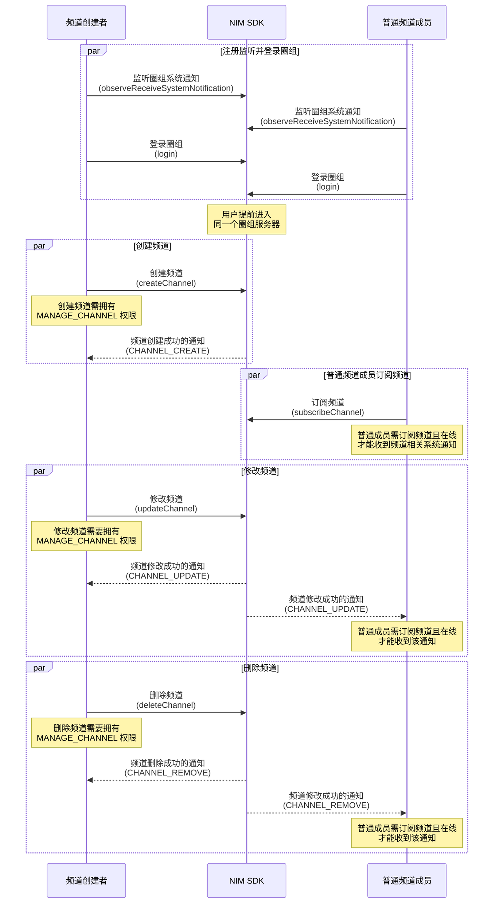

NIM SDK 的 <a href="https://doc.yunxin.163.com/docs/interface/messaging/android/doxygen/Latest/zh/interfacecom_1_1netease_1_1nimlib_1_1sdk_1_1qchat_1_1_q_chat_channel_service.html" target="_blank">`QChatChannelService`</a> 类提供管理频道的方法，支持创建、修改、查询和删除频道。

## 前提条件

根据本文操作前，请确保您已经完成以下操作：

- 注册 [`observeReceiveSystemNotification`](https://doc.yunxin.163.com/docs/interface/messaging/android/doxygen/Latest/zh/interfacecom_1_1netease_1_1nimlib_1_1sdk_1_1qchat_1_1_q_chat_service_observer.html#a243ce250bbef08d40a52f24f12d1007c) 监听圈组的系统通知。示例代码参考 [圈组系统通知收发](https://doc.yunxin.163.com/messaging/guide/Tc3MDM2MTQ?platform=android)。

    具体 **与频道管理相关** 的系统通知类型，见本文末尾的 [相关系统通知](#相关系统通知)。

- <a href="https://doc.yunxin.163.com/messaging/guide/Dg2NjI4NzQ?platform=android#创建服务器" target="_blank">创建服务器</a>。

- 拥有 **管理频道的权限**（`QChatRoleResource.MANAGE_CHANNEL`）才能创建、修改和删除频道。权限通过身份组进行配置和管理，具体请参考 <a href="https://doc.yunxin.163.com/messaging/guide/DU4NzI0NjU?platform=android" target="_blank">身份组概述</a> 及其他身份组相关文档。

## 使用限制

单个服务器的频道数量上限默认为 100 个。

若需要扩展上限，可在 [网易云信控制台](https://app.yunxin.163.com/global/home) 配置圈组子功能项（**单 server 可创建的 channel 数**），具体请参考 [开通和配置圈组功能](https://doc.yunxin.163.com/messaging/guide/TU3MjAzMjE?platform=android#聊天室子功能列表说明)。


## API 调用时序



上图中：

- **订阅** 相关说明，参考 [圈组订阅机制](https://doc.yunxin.163.com/messaging/guide/zgwMzQ5MDk?platform=android)。
- **权限** 相关说明，参考 [身份组相关](https://doc.yunxin.163.com/messaging/guide/DU4NzI0NjU?platform=android)。

## 创建频道

调用 <a href="https://doc.yunxin.163.com/docs/interface/messaging/android/doxygen/Latest/zh/interfacecom_1_1netease_1_1nimlib_1_1sdk_1_1qchat_1_1_q_chat_channel_service.html#a323e3ff02ea02d482fe2b0487670cefe" target="_blank">`createChannel`</a> 方法在某个服务器下创建频道。调用时需要传入服务器 ID （`serverId`）、频道名称（`name`）和频道类型（`type`）。

该方法的入参结构为 `QChatCreateChannelParam`，其重要内置方法说明如下：

<div style="width:90px">返回类型</div> | 方法 | 说明
---- | ---- | ----
void | `getType` | 获取频道类型（`QChatChannelType`）：<ul><li>`MessageChannel`：消息频道</li><li>`MessageChannel`：[实时互动频道](https://doc.yunxin.163.com/messaging/guide/zU0OTczMTQ?platform=android) </li><li>`CustomChannel`：自定义频道</li></ul>
void | `setViewMode` | 设置频道的查看模式（`QChatChannelMode`），包括：<ul><li>`PRIVIATE`：私密模式，该模式下，频道只对该频道白名单中的用户可见</li><li>`PUBLIC`：公开模式，该模式下，频道对未被加入该频道的黑名单的用户均可见</li><p>频道黑白名单相关说明，请参考 [频道黑白名单](https://doc.yunxin.163.com/messaging/guide/zI4MTQ4ODU?platform=android)</p></ul><note type=notice>如果设置为同步模式(`QChatChannelSyncMode.SYNC`)，那么无法单独设置频道的查看模式（该情况下设置了查看模式将会报 414 错误）。同步模式与频道分组相关，详情请参考 [频道分组与频道的关联逻辑](https://doc.yunxin.163.com/messaging/guide/jUxNTE5MTY?platform=android#频道分组与频道的关联逻辑)。</note>
void | `setCategoryId` | 通过传入频道分组的 ID 为频道指定其所属的分组，频道分组详情请参考 [频道分组](https://doc.yunxin.163.com/messaging/guide/jUxNTE5MTY?platform=android)
void | `setSycnMode` | 设置频道的同步模式（`QChatChannelSyncMode`）:<ul><li>`NONE`：不同步频道分组的配置</li><li>`SYNC`：同步频道分组的配置，具体同步的数据包括查看模式（私密或公开）、黑白名单和身份组权限</li></ul><note type=notice>只有将同步模式设置为不同步，才能单独设置频道的查看模式 `QChatChannelMode`。</note>
void | `setAntiSpamConfig` | 设置频道资料内容的内容审核（反垃圾）配置（`QChatAntiSpamConfig`），更多相关说明请参考 [圈组内容审核](https://doc.yunxin.163.com/messaging/guide/DY0ODI1OTQ?platform=android#%E9%80%9A%E7%94%A8%E5%8F%8D%E5%9E%83%E5%9C%BE)
void | `setVisitorMode` | 设置频道是否对 [游客](https://doc.yunxin.163.com/messaging/guide/TA4MjY2NzA?platform=android) 可见：<ul><li>`VISIBLE`：可见</li><li>`INVISIBLE`：不可见</li><li>`FOLLOW`：跟随模式（默认），即如果该频道的查看模式（`viewMode`）被设置为 **公开** 则该频道对游客可见，如果被设置为 **私密** 则对游客不可见</li></ul><note type=notice>如果频道的 `visitorMode` 为跟随模式，且同步模式（syncMode）为 **与频道分组同步**，则当该频道所属的频道分组的查看模式（`viewMode`）变更后，该频道对游客的可见性也将变更。例如，在这种情况下，频道分组的查看模式由公开变为私密，则此时该频道对游客从 **可见** 变为 **不可见**。</note>

示例代码如下：

```Java
//建立一个消息类型的频道
QChatCreateChannelParam param = new QChatCreateChannelParam(943445L, "测试频道", QChatChannelType.MessageChannel);
param.setCustom("自定义扩展");
param.setTopic("主题");
//设置频道为公开频道
param.setViewMode(QChatChannelMode.PUBLIC);
QChatAntiSpamConfig antiSpamConfig = new QChatAntiSpamConfig("用户配置的对某些资料内容另外的反垃圾的业务 ID");
param.setAntiSpamBusinessId(antiSpamConfig);
NIMClient.getService(QChatChannelService.class).createChannel(param).setCallback(
        new RequestCallback<QChatCreateChannelResult>() {
            @Override
            public void onSuccess(QChatCreateChannelResult result) {
                //创建 Channel 成功,返回创建成功的 Channel 信息
                QChatChannel channel = result.getChannel();
            }

            @Override
            public void onFailed(int code) {
                //创建 Channel 失败，返回错误 code
            }

            @Override
            public void onException(Throwable exception) {
                //创建 Channel 异常
            }
        });
```

## 修改频道

调用 <a href="https://doc.yunxin.163.com/docs/interface/messaging/android/doxygen/Latest/zh/interfacecom_1_1netease_1_1nimlib_1_1sdk_1_1qchat_1_1_q_chat_channel_service.html#a8af7ab98f73ce504c4eb45b5c31126c5" target="_blank">`updateChannel`</a> 方法修改某个频道的信息，如频道名称、频道主题、对游客是否可见、自定义扩展字段等。调用时需要传入待修改的频道的 ID（`channelId`）。

调用该方法时，您可设置频道资料的内容审核（反垃圾）配置（`QChatAntiSpamConfig`），内容审核详情请参考 [圈组内容审核](https://doc.yunxin.163.com/messaging/guide/DY0ODI1OTQ?platform=android)。

示例代码如下：

```Java
QChatUpdateChannelParam param = new QChatUpdateChannelParam(885305L);
param.setName("测试修改名称");
param.setCustom("修改自定义扩展");
param.setTopic("修改主题");
//修改查看模式为私密的
param.setViewMode(QChatChannelMode.PRIVATE);
QChatAntiSpamConfig antiSpamConfig = new QChatAntiSpamConfig("用户配置的对某些资料内容另外的反垃圾的业务 ID");
param.setAntiSpamBusinessId(antiSpamConfig);
NIMClient.getService(QChatChannelService.class).updateChannel(param).setCallback(
        new RequestCallback<QChatUpdateChannelResult>() {
            @Override
            public void onSuccess(QChatUpdateChannelResult result) {
                //修改 Channel 成功,返回修改成功的 Channel 信息
                QChatChannel channel = result.getChannel();
            }

            @Override
            public void onFailed(int code) {
                //修改 Channel 失败，返回错误 code
            }

            @Override
            public void onException(Throwable exception) {
                //修改 Channel 异常
            }
        });
```

## 删除频道

调用 <a href="https://doc.yunxin.163.com/docs/interface/messaging/android/doxygen/Latest/zh/interfacecom_1_1netease_1_1nimlib_1_1sdk_1_1qchat_1_1_q_chat_channel_service.html#a32e9b22990a1577f74233174656e52c6" target="_blank">`deleteChannel`</a> 方法可将某个频道删除。调用时需传入待删除频道的 ID（`channelId`）。

示例代码如下：

```Java
NIMClient.getService(QChatChannelService.class).deleteChannel("new QChatDeleteChannelParam(885305L)).setCallback(
        new RequestCallback<Void>() {
            @Override
            public void onSuccess(Void param) {
                //删除 Channel 成功
            }

            @Override
            public void onFailed(int code) {
                //删除 Channel 失败，返回错误 code
            }

            @Override
            public void onException(Throwable exception) {
                //删除 Channel 异常
            }
        });
```

## 查询频道

### **分页查询频道列表**

用户进入服务器后，如果想要获取当前服务器已有（且对该用户可见）的频道，可调用 <a href="https://doc.yunxin.163.com/docs/interface/messaging/android/doxygen/Latest/zh/interfacecom_1_1netease_1_1nimlib_1_1sdk_1_1qchat_1_1_q_chat_channel_service.html#a8511f38558a18719715e675f37f71ce1" target="_blank">`getChannelsByPage`</a> 方法分页查询频道列表。

示例代码如下：

```Java
NIMClient.getService(QChatChannelService.class).getChannelsByPage(new QChatGetChannelsByPageParam(943445L,System.currentTimeMillis(),100)).setCallback(
        new RequestCallback<QChatGetChannelsByPageResult>() {
            @Override
            public void onSuccess(QChatGetChannelsByPageResult result) {
                //查询 Channel 列表成功
                List<QChatChannel> channels = result.getChannels();
            }

            @Override
            public void onFailed(int code) {
                //查询 Channel 列表失败，返回错误 code
            }

            @Override
            public void onException(Throwable exception) {
                //查询 Channel 列表异常
            }
        });
```

### **根据频道 ID 查询频道列表**

用户进入服务器后，如果想要检索当前服务器的频道，可调用 <a href="https://doc.yunxin.163.com/docs/interface/messaging/android/doxygen/Latest/zh/interfacecom_1_1netease_1_1nimlib_1_1sdk_1_1qchat_1_1_q_chat_channel_service.html#a7419505381fdf8c2627f2abdfae0ed59" target="_blank">`getChannels`</a> 方法根据频道的 ID 进行检索。

示例代码如下：

```Java
List<Long> channelIds = new ArrayList<>();
channelIds.add(885305L);
NIMClient.getService(QChatChannelService.class).getChannels(new QChatGetChannelsParam(channelIds)).setCallback(
        new RequestCallback<QChatGetChannelsResult>() {
            @Override
            public void onSuccess(QChatGetChannelsResult result) {
                //查询 Channel 列表成功
                List<QChatChannel> channels = result.getChannels();
            }

            @Override
            public void onFailed(int code) {
                //查询 Channel 列表失败，返回错误 code
            }

            @Override
            public void onException(Throwable exception) {
                //查询 Channel 列表异常
            }
        });
```

### **分页查询未在频道分组下的频道**

用户进入服务器后，如果想要检索当前服务器中不在频道分组下的频道，可调用 `getUncategorizedChannelsByPage` 方法进行查询。

可以指定根据自定义权重顺序返回，也可以全量返回。（该接口支持分页查询。）

示例代码如下：

```Java
//服务器 ID
long serverId = 12345678L;
//分页标记，第一页不传，翻下一页传接口返回的 cursor
String cursor = null;
//查询数量
int limit = 100;
QChatGetUncategorizedChannelsByPageParam param = new QChatGetUncategorizedChannelsByPageParam(serverId,cursor,limit);
NIMClient.getService(QChatChannelService.class).getUncategorizedChannelsByPage(param).setCallback(new RequestCallback<QChatGetUncategorizedChannelsByPageResult>() {
    @Override
    public void onSuccess(QChatGetUncategorizedChannelsByPageResult result) {
        //查询成功
        //查询到的频道列表
        List<QChatChannel> channels = result.getChannels();
        //下一页查询标记
        String nextCursor = result.getCursor();

    }

    @Override
    public void onFailed(int code) {
        //查询失败
    }

    @Override
    public void onException(Throwable exception) {
        //查询异常
    }
});
```

### **分页查询频道成员列表**

用户进入频道后，如果想要检索当前频道的成员有哪些（换而言之，当前频道对哪些用户可见），可调用 <a href="https://doc.yunxin.163.com/docs/interface/messaging/android/doxygen/Latest/zh/interfacecom_1_1netease_1_1nimlib_1_1sdk_1_1qchat_1_1_q_chat_channel_service.html#a04942e8026dba956e627c4324fe9f006" target="_blank">`getChannelMembersByPage`</a> 方法可分页查询频道成员列表。

::: note notice
如果需要查询当前时间，`timeTag` 请务必传 0。
:::

示例代码如下：

```Java
QChatGetChannelMembersByPageParam queryParam = new QChatGetChannelMembersByPageParam(getLong(this,SP_SERVERID),getLong(this,SP_CHANNELID),System.currentTimeMillis());
queryParam.setLimit(100);
NIMClient.getService(QChatChannelService.class).getChannelMembersByPage(queryParam).setCallback(new RequestCallback<QChatGetChannelMembersByPageResult>() {
```

### **查询频道未读信息**

用户进入服务器后，如果想获取频道的未读信息（包括未读数和未读状态），可调用 <a href="https://doc.yunxin.163.com/docs/interface/messaging/android/doxygen/Latest/zh/interfacecom_1_1netease_1_1nimlib_1_1sdk_1_1qchat_1_1_q_chat_channel_service.html#a72a958e40c2423372373e000db90d3da" target="_blank">`getChannelUnreadInfos`</a> 方法进行查询。

更多频道未读数相关说明，参考 [频道未读数管理](https://doc.yunxin.163.com/messaging/guide/jExMzgyNDE?platform=android)。

::: note note
该方法单次最多查询频道数量为 100。
:::

<a id="相关系统通知"></a>

## 系统通知

圈组系统通知的类型在 [`QChatSystemNotificationType`](https://doc.yunxin.163.com/docs/interface/messaging/android/doxygen/Latest/zh/enumcom_1_1netease_1_1nimlib_1_1sdk_1_1qchat_1_1enums_1_1_q_chat_system_notification_type.html) 枚举中定义，与频道管理相关的内置系统通知类型如下：

枚举值 | 说明
---- | ----
`CHANNEL_CREATE` | 创建频道
`CHANNEL_REMOVE` | 删除频道
`CHANNEL_UPDATE` | 修改频道信息

::: note note
更多圈组系统通知相关说明，请参考 [圈组系统通知相关](https://doc.yunxin.163.com/messaging/guide/jM4NjQwNzU?platform=android)。
:::

## 内容审核

创建或修改频道时，如果通过 `setAntiSpamBusinessId` 方法配置了安全通的业务 ID，那么网易云信将会对频道资料（如频道名称和图标）进行 **安全通** 内容审核。`antiSpamBusinessId` 代表安全通默认内容审核业务以外的自定义内容审核的业务 ID。如需新增自定义内容审核，请联系商务经理进行相关配置，然后前往网易云信控制台的安全通配置界面获取该业务 ID。

更多圈组内容审核相关说明，参考 [圈组内容审核](https://doc.yunxin.163.com/messaging/guide/DY0ODI1OTQ?platform=android)。