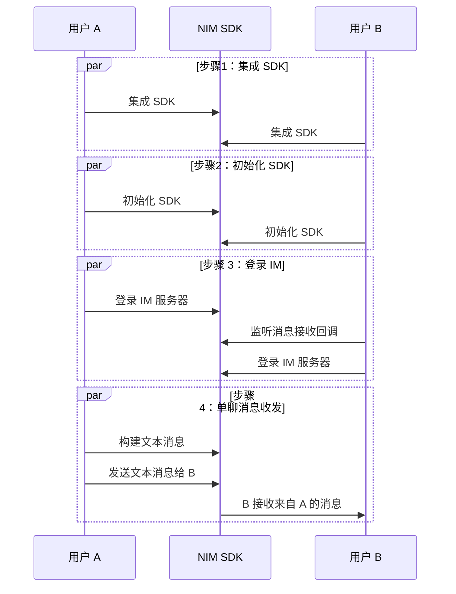

<!-- keywords: 即时通讯,IM,基本功能,消息收发,实现 -->

网易云信即时通讯（NetEase IM，简称 NIM）服务提供一整套即时通讯基础能力和开放方案，助您快速实现多样化的即时通讯场景。

本文主要介绍通过集成 NIM SDK 并调用 API，快速实现单聊消息收发功能。

::: note note
- 群聊消息收发需要先进入群组，后续流程与单聊消息收发相同。
- 超大群、聊天室和圈组的消息收发，需单独配置。具体实现流程请分别参考 [超大群消息收发](https://doc.yunxin.163.com/messaging/guide/jM5MTgzNzA?platform=android#%E6%B6%88%E6%81%AF%E6%94%B6%E5%8F%91)、[聊天室消息收发](https://doc.yunxin.163.com/messaging/guide/TI1MDE5MzA?platform=android) 和 [圈组消息收发](https://doc.yunxin.163.com/messaging/guide/TE1MjI2MDI?platform=android)。
:::

## 准备工作

根据本文操作前，请确保您已经：

- 在 [网易云信控制台](https://app.yunxin.163.com/global/home) 上 [创建应用](https://doc.yunxin.163.com/console/docs/TIzMDE4NTA?platform=console)，获取 App Key。
- [注册网易云信 IM 账号](https://doc.yunxin.163.com/messaging/guide/TY1OTU4NDQ?platform=android#4-注册-im-账号)，获取 accid 和 token。

- 开发环境满足如下条件：

    - Android 5.0 及以上版本。
    - IM SDK v6.9.0 版本起，改用 AndroidX 支持库，Target API 改为 28，不再支持 support 库。

## **流程概览**

实现单聊消息收发的流程，可分为下图所示的 4 大步骤。



## **步骤 1：集成 SDK**

本文主要介绍在 Gradle 中添加远程依赖项的集成方式。手动集成方式请参考 <a href="https://doc.yunxin.163.com/messaging/guide/DAyOTkwMDQ?platform=android#%E6%89%8B%E5%8A%A8%E9%9B%86%E6%88%90" target="_blank">SDK 集成</a>。

### Gradle 集成

1. 若您需要创建新项目，在 Android Studio 里，在顶部菜单依次选择 **File** > **New** > **New Project** 新建工程，再依次选择 **Phone and Tablet** > **Empty Activity**，单击 **Next**。
<br>
    
    ::: note note
    <a href="https://developer.android.com/studio/projects/create-project" target="_blank">创建 Android 项目</a> 成功后，Android Studio 会自动开始同步 gradle, 您需要等同步成功后再进行下一步操作。
    :::

2. 在项目根目录下的 **build.gradle** 文件中，配置 `repositories`（使用 maven）。示例代码如下：

    ```Groovy
    allprojects {
        repositories {
            mavenCentral()
        }
    }
    ```

3. 在 **app** 目录下的 **build.gradle** 文件中，配置支持的 SO 库架构。示例代码如下：

    ```Groovy
    android {
    defaultConfig {
        ndk {
            //设置支持的 SO 库架构
            abiFilters "armeabi-v7a", "x86","arm64-v8a","x86_64"
            }
    }
    }
    ```

4. 根据开发者项目的需求，添加对应的依赖。

    ::: note notice :::
    可在 [更新日志](https://doc.yunxin.163.com/messaging/guide/DM1MjI5MTE?platform=android) 中查看最新的版本。
    :::

    <br>

    ```Groovy
    dependencies {
        implementation fileTree(dir: 'libs', include: '*.jar')
        // 添加依赖

        // 基础功能 (必需)
        implementation "com.netease.nimlib:basesdk:${LATEST_VERSION}"
    }
    ```

### 添加权限

根据实际应用需求，在 `AndroidManifest.xml` 设置权限（**请将 com.netease.nim.demo 替换为自己的包名**）。

```XML
<?xml version="1.0" encoding="utf-8"?>
<manifest xmlns:android="http://schemas.android.com/apk/res/android"
        package="com.netease.nim.demo">

    <!-- 权限声明 -->
    <!-- 访问网络状态-->
    <uses-permission android:name="android.permission.INTERNET" />
    <uses-permission android:name="android.permission.ACCESS_NETWORK_STATE" />
    <uses-permission android:name="android.permission.ACCESS_WIFI_STATE" />
    <application
        ...>
    <!-- App Key, 可以在这里设置，也可以在 SDKOptions 中提供。
            如果 SDKOptions 中提供了，则取 SDKOptions 中的值。-->
        <meta-data
            android:name="com.netease.nim.appKey"
            android:value="key_of_your_app" />
    </application>
</manifest>
```

更多权限设置，请参考 [添加权限](https://doc.yunxin.163.com/messaging/guide/DAyOTkwMDQ?platform=android#%E6%B7%BB%E5%8A%A0%E6%9D%83%E9%99%90)。

### 防止代码混淆

代码混淆是指使用简短无意义的名称重命名已存在的类、方法、属性等，增加逆向工程的难度，保障 Android 程序源码的安全性。

为了避免因上述的重命名而导致调用 NIM SDK 异常，请在 proguard-rules.pro 文件中加入以下代码，将 NIM SDK 相关类加入不混淆名单。

```Groovy
-dontwarn com.netease.nim.**
-keep class com.netease.nim.** {*;}
-dontwarn com.netease.nimlib.**
-keep class com.netease.nimlib.** {*;}
-dontwarn com.netease.share.**
-keep class com.netease.share.** {*;}
-dontwarn com.netease.mobsec.**
-keep class com.netease.mobsec.** {*;}
#如果您使用全文检索插件，需要加入
-dontwarn org.apache.lucene.**
-keep class org.apache.lucene.** {*;}
#如果您开启数据库功能，需要加入
-keep class net.sqlcipher.** {*;}
```

## **步骤 2：初始化 SDK**

将 SDK 集成到客户端后，需要先完成 SDK 的初始化才能使用其他功能。

::: note notice
v6.9.0 起，改用 AndroidX 支持库，Target API 改为 28，不再支持 support 库。
:::

在 `Application` 的 `onCreate` 中，调用 [`init`](https://doc.yunxin.163.com/messaging/references/android/doxygen/Latest/zh/classcom_1_1netease_1_1nimlib_1_1sdk_1_1_n_i_m_client.html#a48056b399acd7f84ebcf5176b1cfde16) 方法进行初始化。

示例代码如下：

```Java
public class NimApplication extends Application {
    public void onCreate() {
        NIMClient.init(this, loginInfo(), options());
    // 如果提供用户信息，将同时进行自动登录。如果当前还没有登录用户，请传入 null。
    private LoginInfo loginInfo() {
        return null;
    }
    // 设置初始化配置参数，如果返回值为 null，则全部使用默认参数。
    private SDKOptions options() {
        SDKOptions options = new SDKOptions();
        return options;
      }// 可在 SDKOptions 中配置 App Key
    }
}
```

以上提供了一个简化的初始化示例，更多初始化信息请参考 <a href="https://doc.yunxin.163.com/messaging/guide/TI5ODE2MTM?platform=android" target="_blank">初始化 SDK</a>。

## **步骤 3：登录 IM 服务端**

客户端用户在使用网易云信即时通讯功能前需要先登录网易云信 IM 服务器。

若仅需要调试，可使用在 [网易云信控制台](https://app.yunxin.163.com/global/home) 注册的 <a href="https://doc.yunxin.163.com/messaging/guide/jMwMTQxODk?platform=android" target="_blank">网易云信账号</a> 进行登录。若处于正式生产环境，请使用通过 <a href="https://doc.yunxin.163.com/messaging/guide/DQ3Nzk1MTY?platform=server" target="_blank">IM 服务端 API</a> 生成的正式 IM 账号（`accid`）和 `token`。

::: note note
建议参考 [IM 登录最佳实践](https://doc.yunxin.163.com/messaging/guide/DE1NjMxNjU?platform=android) 实现 IM 登录以及相应的上层应用逻辑。
:::

调用 [`login`](https://doc.yunxin.163.com/messaging/references/android/doxygen/Latest/zh/interfacecom_1_1netease_1_1nimlib_1_1sdk_1_1auth_1_1_auth_service.html#ae9f6be76fc29def4b382bfc813ef0214) 方法进行登录。示例代码如下：
  ```
  public class LoginActivity extends Activity {
    public void doLogin() {
        LoginInfo info = new LoginInfo(); //传入 accid 和 token
        RequestCallback<LoginInfo> callback =
            new RequestCallback<LoginInfo>() {
                    @Override
                    public void onSuccess(LoginInfo param) {
                        LogUtil.i(TAG, "login success");
                        // your code
                    }
                    @Override
                    public void onFailed(int code) {
                        if (code == 302) {
                            LogUtil.i(TAG, "账号密码错误");
                            // your code
                        } else {
                            // your code
                        }
                    }
                    @Override
                    public void onException(Throwable exception) {
                        // your code
                    }
        };
        NIMClient.getService(AuthService.class).login(info).setCallback(callback);
    }
}
  ```

## **步骤 4：单聊消息收发**

本节以用户 A 和用户 B 的消息交互为例，介绍快速实现单聊消息收发的流程。更多消息类型的收发，请参考 [消息收发](https://doc.yunxin.163.com/messaging/guide/jk0NDM1NjA?platform=android)。

1. 用户 B 调用 [`observeReceiveMessage`](https://doc.yunxin.163.com/messaging/references/android/doxygen/Latest/zh/interfacecom_1_1netease_1_1nimlib_1_1sdk_1_1msg_1_1_msg_service_observe.html#a9001f2ba497fd73b076328fc52a40532) 方法监听消息接收。示例代码如下：

    ```Java
    Observer<List<IMMessage>> incomingMessageObserver =
            new Observer<List<IMMessage>>() {
                @Override
                public void onEvent(List<IMMessage> messages) {
                    // 处理新收到的消息，为了上传处理方便，SDK 保证参数 messages 全部来自同一个聊天对象。
                }
            };
        NIMClient.getService(MsgServiceObserve.class)
                .observeReceiveMessage(incomingMessageObserver, true);
    ```

2. 用户 A 调用 [`createTextMessage`](https://doc.yunxin.163.com/messaging/references/android/doxygen/Latest/zh/classcom_1_1netease_1_1nimlib_1_1sdk_1_1msg_1_1_message_builder.html#a29772394b4a5d39cc5e9c0cf2180d775) 方法构建文本消息，然后调用 [`sendMessage`](https://doc.yunxin.163.com/messaging/references/android/doxygen/Latest/zh/interfacecom_1_1netease_1_1nimlib_1_1sdk_1_1msg_1_1_msg_service.html#a74db65f6720c4e2ba7a5d2a9e72ebda8)方法向用户 B 发送文本消息。示例代码如下：

    ```Java
    //这里主要以发送文本消息为例
        String account = "testAccount";
        SessionTypeEnum sessionType = SessionTypeEnum.P2P; // 以单聊类型为例
        String text = "this is an example";// 创建一个文本消息
        IMMessage textMessage = MessageBuilder.createTextMessage(account, sessionType, text);
        // 发送给对方
        NIMClient.getService(MsgService.class).sendMessage(textMessage, false).setCallback(new RequestCallback<Void>() {
                        @Override
                        public void onSuccess(Void param) {
                        }
                        @Override
                        public void onFailed(int code) {
                        }
                        @Override
                        public void onException(Throwable exception) {
                        }
                    });
    ```

    目前 NIM SDK 支持多种消息类型，包括文本消息、图片消息、语音消息、视频消息、文件消息、地理位置消息、提示消息、通知消息以及自定义消息。具体请参考 [消息收发](https://doc.yunxin.163.com/messaging/guide/jk0NDM1NjA?platform=android)。

3. `observeReceiveMessage` 方法的 `Observer` 接口根据实际情况触发回调函数，用户 B 收到文本消息。

## 下一步

为保障通信安全，如果您在调试环境中的使用的是网易云信控制台生成的测试用 IM 账号 和 `token`，请确保在后续的正式生产环境中，将其替换为通过 <a href="https://doc.yunxin.163.com/messaging/guide/DQ3Nzk1MTY?platform=server" target="_blank">IM 服务端 API</a> 生成的正式 IM 账号（`accid`）和 `token`。