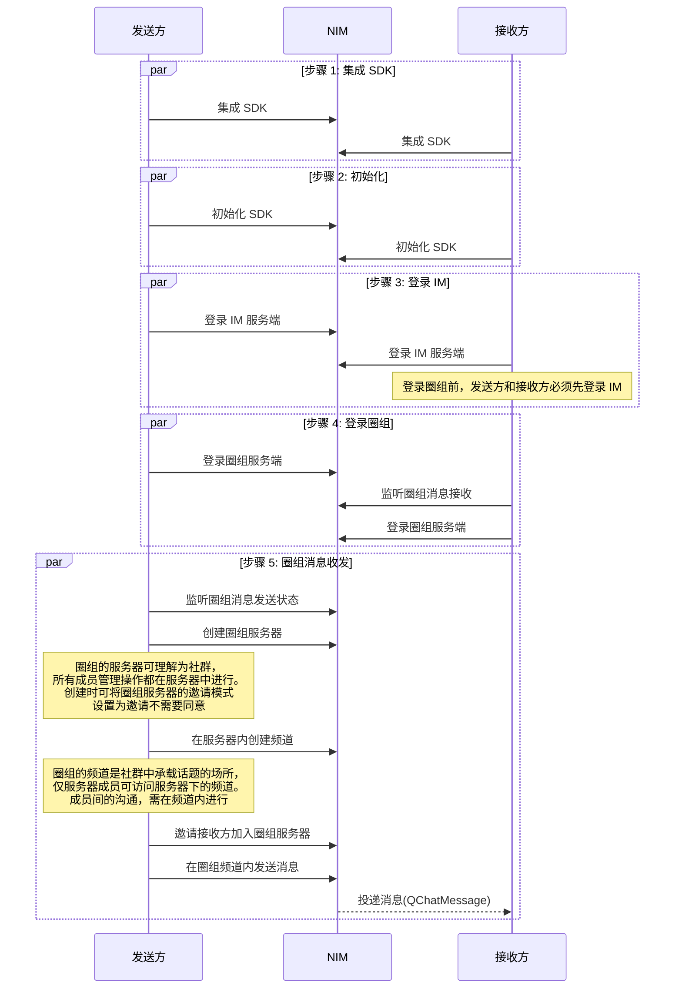

<!--keywords: 圈组,快速开始,消息收发,SDK 集成,初始化,登录 -->

圈组是网易云信 IM 即时通讯服务的全新能力，可用来帮助您快速构建 **类 Discord 即时通讯社群**。本文介绍如何通过较少的代码集成 NetEase IM SDK （以下简称 NIM SDK）并调用 API，在您的应用中实现圈组消息收发。

## 前提条件

- 已在 [网易云信控制台](https://app.yunxin.163.com/global/home) 上 [创建应用](https://doc.yunxin.163.com/console/docs/TIzMDE4NTA?platform=console)，获取 App Key。
- 已 [注册网易云信 IM 账号](https://doc.yunxin.163.com/messaging/guide/TY1OTU4NDQ?platform=android#4-注册-im-账号)，获取 accid 和 token。

- 已 [开通和配置圈组功能](https://doc.yunxin.163.com/messaging/guide/TU3MjAzMjE?platform=android)。

- 开发环境满足如下条件：

    - Android 5.0 及以上版本。
    - v6.9.0 起，改用 AndroidX 支持库，Target API 改为 28，不再支持 support 库。

## **流程概览**

::: note notice
**圈组服务端** 与 **圈组服务器** 是两个不同概念，前者指网易云信服务端提供圈组功能的部分，后者为圈组的特殊概念，对应 Discord 的 Server，为社群本身，具体参考 <a href="https://doc.yunxin.163.com/messaging/guide/jUyODc1NDM?platform=android#圈组主要概念" target="_blank">圈组主要概念</a>。
:::

实现圈组消息收发的流程，可分为下图所示的 5 大步骤。



## **步骤 1：集成 NIM SDK**

本节仅介绍更为快速的 Gradle 自动集成方式。如需查看手动集成的具体说明，请参考 <a href="https://doc.yunxin.163.com/messaging/guide/DgyMTYzMDM?platform=android#手动集成">手动集成</a>。

### Gradle 集成

1. 若您需要创建新项目，在 Android Studio 里，在顶部菜单依次选择 **File** > **New** > **New Project** 新建工程，再依次选择 **Phone and Tablet** > **Empty Activity**，单击 **Next**。
<br>
    
    ::: note note
    <a href="https://developer.android.com/studio/projects/create-project" target="_blank">创建 Android 项目</a> 成功后，Android Studio 会自动开始同步 gradle, 您需要等同步成功后再进行下一步操作。
    :::

2. 在项目根目录下的 `build.gradle` 文件中，配置 `repositories`（使用 maven）。示例代码如下：
    ```
    allprojects {
        repositories {
            mavenCentral()
        }
    }
    ```
3. 在主工程的 build.gradle 文件中，设置支持的 SO 库架构。
    ```
    android {
    defaultConfig {
        ndk {
            //设置支持的 SO 库架构
            abiFilters "armeabi-v7a", "x86","arm64-v8a","x86_64"
            }
    }
    }
    ```
4. 在主工程的 build.gradle 文件中，添加必需的依赖：

    ```
    dependencies {
        implementation fileTree(dir: 'libs', include: '*.jar')
        // 添加依赖。注意，版本号必须一致。

        // IM 基础功能 (必需)
        implementation "com.netease.nimlib:basesdk:${LATEST_VERSION}"
        // 通过网易云信来集成小米等厂商推送需要(可选)
        implementation "com.netease.nimlib:push:${LATEST_VERSION}"
    // 圈组功能（集成圈组必需）
    implementation "com.netease.nimlib:qchat:${LATEST_VERSION}"
    }
    ```
    ::: note notice :::
    SDK 的组件版本号必须一致，如圈组组件的版本号必须与其他组件的一致。可在 <a href="https://yunxin.163.com/im-sdk-demo?from=bdjj210513A13291&clueFrom=nim">SDK 下载页面</a> 查看当前最新版本。
    :::

### 添加权限

根据实际应用需求，在 `AndroidManifest.xml` 中添加以下配置（**请将 com.netease.nim.demo 替换为自己的包名**），设置所需的权限。更多可添加的权限项，请参考 <a href="https://doc.yunxin.163.com/messaging/guide/DAyOTkwMDQ?platform=android#添加权限" target="_blank">添加权限</a>。

```XML
<?xml version="1.0" encoding="utf-8"?>
<manifest xmlns:android="http://schemas.android.com/apk/res/android"
        package="com.netease.nim.demo">

    <!-- 权限声明 -->
    <!-- 访问网络状态-->
    <uses-permission android:name="android.permission.INTERNET" />
    <uses-permission android:name="android.permission.ACCESS_NETWORK_STATE" />
    <uses-permission android:name="android.permission.ACCESS_WIFI_STATE" />

    <uses-permission android:name="android.permission.CHANGE_WIFI_STATE"/>

    <!-- 8.0+系统需要-->
    <uses-permission android:name="android.permission.FOREGROUND_SERVICE" />

</manifest>
```

### 防止代码混淆

代码混淆是指使用简短无意义的名称重命名已存在的类、方法、属性等，增加逆向工程的难度，保障 Android 程序源码的安全性。

为了避免因上述的重命名而导致调用 NIM SDK 异常，请在 proguard-rules.pro 文件中加入以下代码，将 NIM SDK 相关类加入不混淆名单。

```Groovy
-dontwarn com.netease.nim.**
-keep class com.netease.nim.** {*;}

-dontwarn com.netease.nimlib.**
-keep class com.netease.nimlib.** {*;}

-dontwarn com.netease.share.**
-keep class com.netease.share.** {*;}

-dontwarn com.netease.mobsec.**
-keep class com.netease.mobsec.** {*;}

#如果您使用全文检索插件，需要加入
-dontwarn org.apache.lucene.**
-keep class org.apache.lucene.** {*;}

#如果您开启数据库功能，需要加入
-keep class net.sqlcipher.** {*;}
```

## **步骤 2：初始化 NIM SDK**

将 SDK 集成到客户端后，需要先完成 SDK 的初始化才能使用其他功能。

<br>

在 `Application` 的 `onCreate` 中，调用 <a href="https://doc.yunxin.163.com/messaging/references/android/doxygen/Latest/zh/classcom_1_1netease_1_1nimlib_1_1sdk_1_1_n_i_m_client.html#a48056b399acd7f84ebcf5176b1cfde16" target="_blank">`init`</a> 方法进行初始化。

示例代码如下：

```Java
public class NimApplication extends Application {
    public void onCreate() {
        NIMClient.init(this, loginInfo(), options());
    // 如果提供用户信息，将同时进行自动登录。如果当前还没有登录用户，请传入 null。
    private LoginInfo loginInfo() {
        return null;
    }
    // 设置初始化配置参数，如果返回值为 null，则全部使用默认参数。
    private SDKOptions options() {
        SDKOptions options = new SDKOptions();
        return options;
      }// 可在 SDKOptions 中配置 App Key
    }
}
```

以上提供了一个简化的初始化示例，更多初始化信息请参考 <a href="https://doc.yunxin.163.com/messaging/guide/TI5ODE2MTM?platform=android">初始化 SDK</a>。

## **步骤 3：登录网易云信 IM 服务端**

登录圈组服务端前，必须先登录 IM 服务端。

1. 调用 <a href="https://doc.yunxin.163.com/messaging/references/android/doxygen/Latest/zh/interfacecom_1_1netease_1_1nimlib_1_1sdk_1_1auth_1_1_auth_service_observer.html#adf734324bdc99f79b88aaba8899e76ab" target="_blank">`observeOnlineStatus`</a> 方法监听 IM 登录状态。

    示例代码如下：

    ```Java
    NIMClient.getService(AuthServiceObserver.class).observeOnlineStatus(
        new Observer<StatusCode> () {
            public void onEvent(StatusCode status) {
        //获取状态的描述
        String desc = status.getDesc();
                if (status.wontAutoLogin()) {
                    // 被踢出、账号被禁用、密码错误等情况，自动登录失败，需要返回到登录界面进行重新登录操作
                }
            }
    }, true);

    ```

2. （可选）调用 <a href="https://doc.yunxin.163.com/messaging/references/android/doxygen/Latest/zh/interfacecom_1_1netease_1_1nimlib_1_1sdk_1_1auth_1_1_auth_service_observer.html#a6944be8f502e360e58e4ef00515988ac" target="_blank">`observeLoginSyncDataStatus`</a> 方法监听登录后数据同步过程。

    ::: note note
    如您仅需集成圈组功能，不需要 IM 其他组件的功能，可跳过这一步。
    :::

    示例代码如下：

    ```Java
    NIMClient.getService(AuthServiceObserver.class).observeLoginSyncDataStatus(new Observer<LoginSyncStatus>() {
        @Override
        public void onEvent(LoginSyncStatus status) {
            if (status == LoginSyncStatus.BEGIN_SYNC) {
                LogUtil.i(TAG, "login sync data begin");
            } else if (status == LoginSyncStatus.SYNC_COMPLETED) {
                LogUtil.i(TAG, "login sync data completed");
            }
        }
    }, true);
    ```

3. 调用 <a href="https://doc.yunxin.163.com/messaging/references/android/doxygen/Latest/zh/interfacecom_1_1netease_1_1nimlib_1_1sdk_1_1auth_1_1_auth_service.html#ae9f6be76fc29def4b382bfc813ef0214" target="_blank">`AuthService#login`</a> 方法开始手动登录。

    示例代码如下：

    ```Java
    public class LoginActivity extends Activity {
        public void doLogin() {
            LoginInfo info = new LoginInfo(); //传入 accid 和 token
            RequestCallback<LoginInfo> callback =
                new RequestCallback<LoginInfo>() {
                        @Override
                        public void onSuccess(LoginInfo param) {
                            LogUtil.i(TAG, "login success");
                            // your code
                        }

                        @Override
                        public void onFailed(int code) {
                            if (code == 302) {
                                LogUtil.i(TAG, "账号密码错误");
                                // your code
                            } else {
                                // your code
                            }
                        }

                        @Override
                        public void onException(Throwable exception) {
                            // your code
                        }
            };

            //执行手动登录
            NIMClient.getService(AuthService.class).login(info).setCallback(callback);
        }
    }
    ```

4. 登录开始后，`observeOnlineStatus` 方法的 `Observer` 接口根据实际登录情况触发回调函数，返回具体的登录状态。如最终返回 `LOGINED`，则代表登录成功。

    ::: note note
    - 具体登录状态及其变化流程，请参考 [登录状态转换](https://doc.yunxin.163.com/messaging/guide/TI1MTU1NDc?platform=android#登录状态转换)。
    - 建议参考 [IM 登录最佳实践](https://doc.yunxin.163.com/messaging/guide/DE1NjMxNjU?platform=android) 实现 IM 登录以及相应的上层应用逻辑。
    :::

## **步骤 4：登录云信圈组服务端**

1. 发送方和接收方调用 <a href="https://doc.yunxin.163.com/messaging/references/android/doxygen/Latest/zh/interfacecom_1_1netease_1_1nimlib_1_1sdk_1_1qchat_1_1_q_chat_service_observer.html#a9e04377f6c9a2332e5de1b140f6e6662" target="_blank">`observeStatusChange`</a> 方法监听圈组登录状态。

    示例代码如下：

    ```Java
    NIMClient.getService(QChatServiceObserver.class).observeStatusChange(new Observer<QChatStatusChangeEvent>() {
    @Override
    public void onEvent(QChatStatusChangeEvent qChatStatusChangeEvent) {
        //当前状态
        StatusCode status = qChatStatusChangeEvent.getStatus();
    }
    },true);
    ```
2. 接收方调用 <a href="https://doc.yunxin.163.com/messaging/references/android/doxygen/Latest/zh/interfacecom_1_1netease_1_1nimlib_1_1sdk_1_1qchat_1_1_q_chat_service_observer.html#a249e0bcbc418d6e959bc5ef2931e6479" target="_blank">`QChatServiceObserver#observeReceiveMessage`</a> 方法监听圈组消息接收。

    示例代码如下：

    ```Java
    NIMClient.getService(QChatServiceObserver.class).observeReceiveMessage(new Observer<List<QChatMessage>>() {
        @Override
        public void onEvent(List<QChatMessage> qChatMessages) {
            //收到消息 qChatMessages
            for (QChatMessage qChatMessage : qChatMessages) {
                //处理消息
            }
        }
    }, true);
    ```
3. 发送方和接收方调用 <a href="https://doc.yunxin.163.com/messaging/references/android/doxygen/Latest/zh/interfacecom_1_1netease_1_1nimlib_1_1sdk_1_1qchat_1_1_q_chat_service.html#a7d0c4322687f873203fd528ca900c21d" target="_blank">`QChatService#login`</a> 方法开始登录圈组服务端。

    ::: note note
    目前移动端仅支持 **非独立模式** 登录圈组服务端，即必须先登录 IM 服务端。
    :::

    示例代码如下：

    ```Java
    QChatLoginParam loginParam = new QChatLoginParam();
    NIMClient.getService(QChatService.class).login(loginParam).setCallback(new RequestCallback<QChatLoginResult>() {
    @Override
    public void onSuccess(QChatLoginResult result) {
        LogUtil.i(TAG, "login success");
        // your code
    }

    @Override
    public void onFailed(int code) {
        LogUtil.i(TAG, "login failed");
        // your code
    }

    @Override
    public void onException(Throwable exception) {
        // your code
    }
    });
    ```
3. 登录后，`observeStatusChange` 方法的 `Observer` 接口触发回调函数，根据实际登录情况返回登录状态。如最终返回 `LOGINED`，则代表登录成功。

    ::: note note
    圈组登录状态及其变化流程与 IM 的相同，具体请参考本文文末的 [登录状态变化流程](https://doc.yunxin.163.com/messaging/guide/TcyMjc3MTM?platform=android#登录状态变化流程)。
    :::

## **步骤 5：圈组消息收发**

本节以发送方与接收方的消息交互为例，介绍在不考虑用户权限管理的情况下，使用 SDK API 快速实现圈组 **文本消息** 收发的流程。

::: note note
- 圈组其他类型消息收发相关详情，请参考 <a href="https://doc.yunxin.163.com/messaging/guide/TE1MjI2MDI?platform=android" target="_blank">圈组消息收发</a>。
- 可通过 <a href="https://doc.yunxin.163.com/messaging/guide/DU4NzI0NjU?platform=android" target="_blank">身份组</a> 对用户进行权限管理。
:::

1. 发送方调用 <a href="https://doc.yunxin.163.com/messaging/references/android/doxygen/Latest/zh/interfacecom_1_1netease_1_1nimlib_1_1sdk_1_1qchat_1_1_q_chat_service_observer.html#aecf5180ba5f36899935bfdcc01bf4de1" target="_blank">`QChatServiceObserver#observeMessageStatusChange`</a>)方法监听圈组消息发送状态。

    示例代码如下：

    ```Java
    NIMClient.getService(QChatServiceObserver.class).observeMessageStatusChange(new Observer<QChatMessage>() {
        @Override
        public void onEvent(QChatMessage qChatMessage) {
            //收到状态变化的消息 qChatMessage

        }
    }, true);
    ```

2. 发送方调用 <a href="https://doc.yunxin.163.com/messaging/references/android/doxygen/Latest/zh/interfacecom_1_1netease_1_1nimlib_1_1sdk_1_1qchat_1_1_q_chat_server_service.html#a9b1ccd1a245cd25045080200e56a3b77" target="_blank">`createServer`</a> 方法创建圈组服务器。为更加快速实现消息收发，创建时可将 <a href="https://doc.yunxin.163.com/messaging/references/android/doxygen/Latest/zh/enumcom_1_1netease_1_1nimlib_1_1sdk_1_1qchat_1_1enums_1_1_q_chat_invite_mode.html" target="">`QChatInviteMode`</a> 设置为 `AGREE_NEED_NOT(1)`（发送邀请后，不需要被邀请方同意，被邀请方立即加入服务器）。

    ::: note notice
    创建成功后，需记录服务器的 ID（`serverId`），后续步骤将需要传入 `serverId`。
    :::

    示例代码如下：

    ```Java
    QChatCreateServerParam param = new QChatCreateServerParam("测试");
    param.setInviteMode(QChatInviteMode.AGREE_NEED_NOT);
    QChatAntiSpamConfig antiSpamConfig = new QChatAntiSpamConfig("用户配置的对某些资料内容另外的反垃圾的业务 ID"); //非必须，请按需配置
    param.setAntiSpamBusinessId(antiSpamConfig);//非必须，请按需配置
    NIMClient.getService(QChatServerService.class).createServer(param).setCallback(
            new RequestCallback<QChatCreateServerResult>() {
                @Override
                public void onSuccess(QChatCreateServerResult result) {
                    // 创建成功
                    QChatServer server = result.getServer();
                }

                @Override
                public void onFailed(int code) {
                    // 创建失败，返回错误 code
                }

                @Override
                public void onException(Throwable exception) {
                    // 创建异常
                        }
            });
    ```
3. 发送方调用 <a href="https://doc.yunxin.163.com/messaging/references/android/doxygen/Latest/zh/interfacecom_1_1netease_1_1nimlib_1_1sdk_1_1qchat_1_1_q_chat_channel_service.html#a0bd54c91aadefe261414e2150c4f7b8a" target="_blank">`createChannel`</a> 方法，调用时传入上一步中创建的圈组服务器的 `serverId`，且将 `QChatChannelMode` 和 `QChatChannelType` 分别设置为 `PUBLIC` 和 `MessageChannel`，从而在圈组服务器中创建一个消息类型的公开频道。

    ::: note notice
    创建成功后，需记录频道的 ID（`channelId`），后续步骤将需要传入 `channelId`。
    :::

    示例代码如下：

    ```Java
    //建立一个消息类型的频道
    QChatCreateChannelParam param = new QChatCreateChannelParam(943445L, "测试频道" , QChatChannelType.MessageChannel);
    param.setCustom( "自定义扩展" );
    param.setTopic( "主题" );
    //设置频道为公开频道
    param.setViewMode(QChatChannelMode.PUBLIC);
    QChatAntiSpamConfig antiSpamConfig = new QChatAntiSpamConfig("用户配置的对某些资料内容另外的反垃圾的业务 ID")。
    param.setAntiSpamBusinessId(antiSpamConfig);
    NIMClient.getService(QChatChannelService.class).createChannel(param).setCallback(
            new RequestCallback<QChatCreateChannelResult>() {
                @Override
                public void onSuccess(QChatCreateChannelResult result) {
                    //创建 Channel 成功,返回创建成功的 Channel 信息
                    QChatChannel channel = result.getChannel();
                }

                @Override
                public void onFailed(int code) {
                    //创建 Channel 失败，返回错误 code
                }

                @Override
                public void onException(Throwable exception) {
                    //创建 Channel 异常
                }
            });
    ```

4. 发送方调用 <a href="https://doc.yunxin.163.com/messaging/references/android/doxygen/Latest/zh/interfacecom_1_1netease_1_1nimlib_1_1sdk_1_1qchat_1_1_q_chat_server_service.html#a97a67233fcdc74c2589aa403b0e51a09" target="_blank">`inviteServerMembers`</a> 方法，邀请接收方 加入圈组服务器。

    示例代码如下：

    ```Java
    List<String> accids = new ArrayList<>();
    accids.add("test");
    QChatInviteServerMembersParam param = new QChatInviteServerMembersParam(943445L,accids);
    param.setPostscript( "邀请您加入测试服务器" );
    NIMClient.getService(QChatServerService.class).inviteServerMembers(param).setCallback(
            new RequestCallback<QChatInviteServerMembersResult>() {
                @Override
                public void onSuccess(QChatInviteServerMembersResult result) {
                    //邀请成功,会返回因为用户服务器数量超限导致失败的 accid 列表
                    List<String> failedAccids = result.getFailedAccids();
                }

                @Override
                public void onFailed(int code) {
                    //邀请失败，返回错误 code
                }

                @Override
                public void onException(Throwable exception) {
                    //邀请异常
                }
            });
    ```

5. 发送方调用 <a href="https://doc.yunxin.163.com/messaging/references/android/doxygen/Latest/zh/interfacecom_1_1netease_1_1nimlib_1_1sdk_1_1qchat_1_1_q_chat_message_service.html#a67960d82fd042180082f36940198bf81" target="_blank">`QChatMessageService#sendMessage`</a> 方法，调用时传入圈组服务器与公开频道的 ID，从而在公开频道中发送一条消息。

    示例代码如下：

    ```Java
    QChatSendMessageParam param = new QChatSendMessageParam(943445L,885305L, MsgTypeEnum.text);
    param.setBody( "测试消息" );
    //通过 QChatSendMessageParam 构造一个 QChatMessage
    QChatMessage currentMessage = param.toQChatMessage();

    NIMClient.getService(QChatMessageService.class).sendMessage(param).setCallback(new RequestCallback<QChatSendMessageResult>() {
        @Override
        public void onSuccess(QChatSendMessageResult result) {
            //发送消息成功,返回发送成功的消息具体信息
            QChatMessage message = result.getSentMessage();
        }

        @Override
        public void onFailed(int code) {
            //发送消息失败，返回错误 code
        }

        @Override
        public void onException(Throwable exception) {
            //发送消息异常
        }
    });
    ```

6. `QChatServiceObserver#observeReceiveMessage` 方法的 `Observer` 接口触发回调函数，接收方通过该回调收到消息。

## 下一步

为保障通信安全，如果您在调试环境中的使用的是网易云信控制台生成的测试用 IM 账号 和 `token`，请确保在后续的正式生产环境中，将其替换为通过 <a href="https://doc.yunxin.163.com/messaging/guide/DQ3Nzk1MTY?platform=server" target="_blank">IM 服务端 API</a> 生成的正式 IM 账号（`accid`）和 `token`。

## 集成开发

请参考以下文档进行圈组功能开发：

- [圈组登录管理](https://doc.yunxin.163.com/messaging/guide/TcyMjc3MTM?platform=android)
- [服务器相关](https://doc.yunxin.163.com/messaging/guide/Tg1NzUyNDQ?platform=android)
- [频道相关](https://doc.yunxin.163.com/messaging/guide/TgyNzY1Mzc?platform=android)
- [身份组相关](https://doc.yunxin.163.com/messaging/guide/DU4NzI0NjU?platform=android)
- [圈组订阅机制](https://doc.yunxin.163.com/messaging/guide/zgwMzQ5MDk?platform=android)
- [圈组消息流转](https://doc.yunxin.163.com/messaging/guide/zI1NTY0MzQ?platform=android)
- [圈组消息相关](https://doc.yunxin.163.com/messaging/guide/TE1MjI2MDI?platform=android)
- [搜索服务器和频道](https://doc.yunxin.163.com/messaging/guide/TUzMTY5OTQ?platform=android)
- [圈组系统通知](https://doc.yunxin.163.com/messaging/guide/jM4NjQwNzU?platform=android)
- [圈组离线推送](https://doc.yunxin.163.com/messaging/guide/DQyMzk0MDQ?platform=android)
- [圈组内容审核](https://doc.yunxin.163.com/messaging/guide/DY0ODI1OTQ?platform=android)
- [圈组相关抄送](https://doc.yunxin.163.com/messaging/guide/Tg5MTU2NTk?platform=android)
- [圈组第三方回调](https://doc.yunxin.163.com/messaging/guide/DA4ODI4MzM?platform=android)