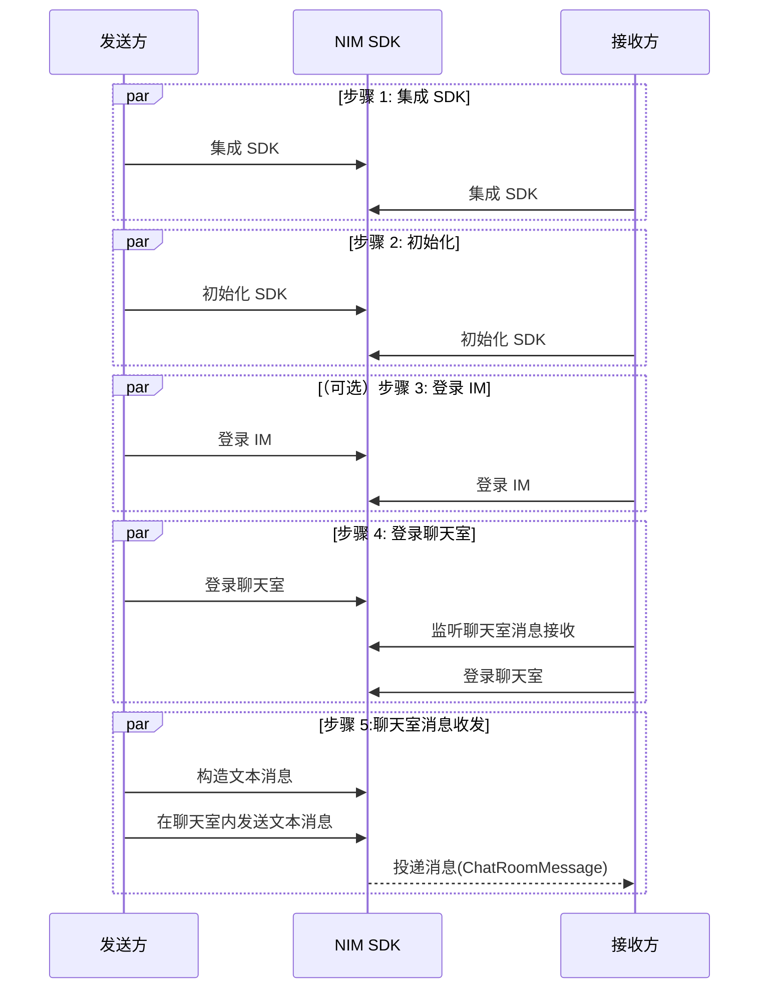

<!--keywords: 聊天室,快速开始,消息收发,SDK 集成,初始化,登录 -->

聊天室是网易云信即时通讯（NetEase IM，简称 NIM）服务中一种比群组更加开放、更加自由的组织形态，可帮助您实现真正意义上的大型聊天室，参与人数无上限，又可满足消息到达的实时性要求，主要应用于娱乐直播、教育直播等场景。

本文介绍如何通过较少的代码集成 NIM SDK 并调用相关 API，在您的应用中实现聊天室消息收发。

## 准备工作

根据本文操作前，请确保您已经：

- 在 [网易云信控制台](https://app.yunxin.163.com/global/home) 上 [创建应用](https://doc.yunxin.163.com/console/docs/TIzMDE4NTA?platform=console)，获取 App Key。
- [注册网易云信 IM 账号](https://doc.yunxin.163.com/messaging/guide/TY1OTU4NDQ?platform=android#4-注册-im-账号)，获取 accid 和 token。

- [开通和配置聊天室功能](https://doc.yunxin.163.com/console/concept/zYyMjAzNDY?platform=console)。

- 已调用服务端接口 [创建聊天室](https://doc.yunxin.163.com/messaging/server-apis/jA0MzQxOTI?platform=server)。

- 开发环境需满足如下条件：

    - Android 5.0 及以上版本。
    - v6.9.0 起，改用 AndroidX 支持库，Target API 改为 28，不再支持 support 库。

## 流程概览

实现聊天室消息收发的流程，可分为下图所示的 5 步：

::: note note
聊天室登录方式分为 **独立模式** 和 **非独立模式**。

- 独立模式：无需先登录 IM，可直接登录聊天室，适用于只需要聊天室功能的业务场景。

- 非独立模式：先登录 IM，再登录聊天室，适用于同时需要 IM 和聊天室功能的业务场景。
:::



## 步骤 1: 集成 NIM SDK

本节仅介绍更为快速的 Gradle 自动集成方式。如需查看手动集成的具体说明，请参考 <a href="https://doc.yunxin.163.com/messaging/guide/DAyOTkwMDQ?platform=android#手动集成">手动集成</a>。

### **Gradle 自动集成**

1. 创建 Android 项目。若已有 Android 项目，则跳过该步骤。

    打开 Android Studio，在顶部菜单依次选择 <strong>File > New > New Project</strong> 新建工程，再依次选择 <strong>Phone and Tablet > Empty Activity</strong>，单击 <strong>Next</strong>。</br>创建 Android 项目成功后，Android Studio 会自动开始同步 gradle, 您需要等同步成功后再进行下一步操作。

2. 在项目根目录下的 `build.gradle` 文件中，在 `repositories` 后配置 mavenCentral，示例代码如下：
    ```Java
    allprojects {
        repositories {
            mavenCentral()
        }
    }
    ```

3. 在主工程的 `build.gradle` 文件中，设置支持的 SO 库架构。
    ```Java
    android {
        defaultConfig {
            ndk {
                //设置支持的 SO 库架构
                abiFilters "armeabi-v7a", "x86","arm64-v8a","x86_64"
            }
        }
    }
    ```

4. 在主工程的 `build.gradle` 文件中，根据需要添加对应的依赖库：

    ```Java
    dependencies {
        implementation fileTree(dir: 'libs', include: '*.jar')
        // 添加 IM 基础功能依赖 (必需)，LATEST_VERSION 为 SDK 最新版本号
        implementation "com.netease.nimlib:basesdk:${LATEST_VERSION}"
        // 添加第三方离线推送相关依赖（可选），LATEST_VERSION 为 SDK 最新版本号
        implementation "com.netease.nimlib:push:${LATEST_VERSION}"
        // 添加聊天室相关依赖（聊天室功能必需），LATEST_VERSION 为 SDK 最新版本号
        implementation "com.netease.nimlib:chatroom:${LATEST_VERSION}"
    }
    ```
    ::: note notice :::
    添加的各依赖库版本号必须一致。可在 <a href="https://doc.yunxin.163.com/all/sdk-download">SDK 下载页面</a> 查看当前最新版本号。
    :::

### **添加权限**

根据实际应用需求，在 `AndroidManifest.xml` 中添加所需权限。请将 `com.netease.nim.demo` 替换为自己的包名。

```XML
<?xml version="1.0" encoding="utf-8"?>
<manifest xmlns:android="http://schemas.android.com/apk/res/android"
          package="com.netease.nim.demo">
    <!-- 权限声明 -->
    <!-- 访问网络状态-->
    <uses-permission android:name="android.permission.INTERNET" />
    <uses-permission android:name="android.permission.ACCESS_NETWORK_STATE" />
    <uses-permission android:name="android.permission.ACCESS_WIFI_STATE" />

    <uses-permission android:name="android.permission.CHANGE_WIFI_STATE"/>

    <!-- 外置存储存取权限 -->
    <uses-permission android:name="android.permission.READ_EXTERNAL_STORAGE"/>
    <uses-permission android:name="android.permission.WRITE_EXTERNAL_STORAGE"/>

    <!-- 多媒体相关 -->
    <uses-permission android:name="android.permission.CAMERA"/>
    <uses-permission android:name="android.permission.RECORD_AUDIO"/>
    <!-- Android11：V8.6.1 及之后的版本不需要。其他：V4.4.0 及之后的版本不需要。 -->
    <uses-permission android:name="android.permission.READ_PHONE_STATE"/>

    <!-- 控制呼吸灯，振动器等，用于新消息提醒 -->
    <uses-permission android:name="android.permission.FLASHLIGHT" />
    <uses-permission android:name="android.permission.VIBRATE" />

    <!-- 8.0+系统需要-->
    <uses-permission android:name="android.permission.FOREGROUND_SERVICE" />

    <!-- 下面的 uses-permission 一起加入到您的 AndroidManifest 文件中。-->
    <permission
        android:name="com.netease.nim.demo.permission.RECEIVE_MSG"
        android:protectionLevel="signature"/>

     <uses-permission android:name="com.netease.nim.demo.permission.RECEIVE_MSG"/>

    <application
        ...>
        <!-- App key, 可以在这里设置，也可以在 SDKOptions 中提供。
            如果 SDKOptions 中提供了，则取 SDKOptions 中的值。-->
        <meta-data
            android:name="com.netease.nim.appKey"
            android:value="key_of_your_app" />

        <!-- 应用程序后台服务，请使用独立进程。-->
        <service
            android:name="com.netease.nimlib.service.NimService"
            android:process=":core"/>

       <!-- 应用程序后台辅助服务 -->
        <service
            android:name="com.netease.nimlib.service.NimService$Aux"
            android:process=":core"/>

        <!-- 应用程序后台辅助服务 -->
        <service
            android:name="com.netease.nimlib.job.NIMJobService"
            android:exported="false"
            android:permission="android.permission.BIND_JOB_SERVICE"
            android:process=":core"/>

        <!-- 网易云信监视系统启动和网络变化的广播接收器，保持和 NimService 同一进程 -->
        <receiver android:name="com.netease.nimlib.service.NimReceiver"
            android:process=":core"
            android:exported="false">
            <intent-filter>
                <action android:name="android.net.conn.CONNECTIVITY_CHANGE"/>
            </intent-filter>
        </receiver>

        <!-- 网易云信进程间通信 Receiver -->
        <receiver android:name="com.netease.nimlib.service.ResponseReceiver"/>

        <!-- 网易云信进程间通信 service -->
        <service android:name="com.netease.nimlib.service.ResponseService"/>

        <!-- 网易云信进程间通信 provider -->
        <provider
            android:name="com.netease.nimlib.ipc.NIMContentProvider"
            android:authorities="com.netease.nim.demo.ipc.provider"
            android:exported="false"
            android:process=":core" />

          <!-- 网易云信内部使用的进程间通信 provider -->
          <!-- SDK 启动时会强制检测该组件的声明是否配置正确，如果检测到该声明不正确，SDK 会主动抛出异常引发崩溃 -->
        <provider
            android:name="com.netease.nimlib.ipc.cp.provider.PreferenceContentProvider"
            android:authorities="com.netease.nim.demo.ipc.provider.preference"
            android:exported="false" />
    </application>
</manifest>
```

### **防止代码混淆**

为了避免代码混淆而导致调用接口异常，请在 `proguard-rules.pro` 文件中添加以下代码，将 NIM SDK 相关类加入不混淆名单。

```Groovy
-dontwarn com.netease.nim.**
-keep class com.netease.nim.** {*;}

-dontwarn com.netease.nimlib.**
-keep class com.netease.nimlib.** {*;}

-dontwarn com.netease.share.**
-keep class com.netease.share.** {*;}

-dontwarn com.netease.mobsec.**
-keep class com.netease.mobsec.** {*;}

#如果您使用全文检索插件，需要加入
-dontwarn org.apache.lucene.**
-keep class org.apache.lucene.** {*;}

#如果您开启数据库功能，需要加入
-keep class net.sqlcipher.** {*;}
```

## 步骤 2: 初始化 SDK

集成 SDK 后，需要先完成 SDK 的初始化后才能使用其他功能。

在 `Application` 的 `onCreate` 中，调用 <a href="https://doc.yunxin.163.com/docs/interface/messaging/android/doxygen/Latest/zh/classcom_1_1netease_1_1nimlib_1_1sdk_1_1_n_i_m_client.html#a48056b399acd7f84ebcf5176b1cfde16" target="_blank">`init`</a> 方法进行初始化。

示例代码如下：

```Java
public class NimApplication extends Application {
    public void onCreate() {
        NIMClient.init(this, loginInfo(), options());
    // 如果提供用户信息，将同时进行自动登录。如果当前还没有登录用户，请传入 null。
    private LoginInfo loginInfo() {
        return null;
    }
    // 设置初始化配置参数，如果返回值为 null，则全部使用默认参数。
    private SDKOptions options() {
        SDKOptions options = new SDKOptions();
        return options;
      }// 可在 SDKOptions 中配置 App Key
    }
}
```

以上提供了一个简化的初始化示例，更多初始化信息请参考 <a href="https://doc.yunxin.163.com/messaging/guide/TI5ODE2MTM?platform=android#步骤2初始化-sdk">初始化 SDK</a>。

## 步骤 3: （可选）登录网易云信 IM

若您采用 **非独立模式** 登录聊天室，那么在登录聊天室之前需要先登录 IM。若您采用独立模式登录聊天室，则跳过该步骤。

1. 调用 <a href="https://doc.yunxin.163.com/docs/interface/messaging/android/doxygen/Latest/zh/interfacecom_1_1netease_1_1nimlib_1_1sdk_1_1auth_1_1_auth_service_observer.html#adf734324bdc99f79b88aaba8899e76ab" target="_blank">`AuthServiceObserver.observeOnlineStatus`</a> 方法监听 IM 登录状态。

    ```Java
    NIMClient.getService(AuthServiceObserver.class).observeOnlineStatus(
        new Observer<StatusCode> () {
            public void onEvent(StatusCode status) {
        //获取状态的描述
        String desc = status.getDesc();
                if (status.wontAutoLogin()) {
                    // 被踢出、账号被禁用、密码错误等情况，自动登录失败，需要返回到登录界面进行重新登录操作
                }
            }
    }, true);
    ```

2. （可选）调用 <a href="https://doc.yunxin.163.com/docs/interface/messaging/android/doxygen/Latest/zh/interfacecom_1_1netease_1_1nimlib_1_1sdk_1_1auth_1_1_auth_service_observer.html#a6944be8f502e360e58e4ef00515988ac" target="_blank">`observeLoginSyncDataStatus`</a> 方法监听登录后数据同步过程。

    示例代码如下：

    ```Java
    NIMClient.getService(AuthServiceObserver.class).observeLoginSyncDataStatus(new Observer<LoginSyncStatus>() {
        @Override
        public void onEvent(LoginSyncStatus status) {
            if (status == LoginSyncStatus.BEGIN_SYNC) {
                LogUtil.i(TAG, "login sync data begin");
            } else if (status == LoginSyncStatus.SYNC_COMPLETED) {
                LogUtil.i(TAG, "login sync data completed");
            }
        }
    }, true);
    ```

3. 调用 <a href="https://doc.yunxin.163.com/messaging/references/android/doxygen/Latest/zh/interfacecom_1_1netease_1_1nimlib_1_1sdk_1_1auth_1_1_auth_service.html#ae9f6be76fc29def4b382bfc813ef0214" target="_blank">`AuthService#login`</a> 方法开始手动登录。

    示例代码如下：

    ```Java
    public class LoginActivity extends Activity {
        public void doLogin() {
            LoginInfo info = new LoginInfo(); //传入 accid 和 token
            RequestCallback<LoginInfo> callback =
                new RequestCallback<LoginInfo>() {
                        @Override
                        public void onSuccess(LoginInfo param) {
                            LogUtil.i(TAG, "login success");
                            // your code
                        }

                        @Override
                        public void onFailed(int code) {
                            if (code == 302) {
                                LogUtil.i(TAG, "账号密码错误");
                                // your code
                            } else {
                                // your code
                            }
                        }

                        @Override
                        public void onException(Throwable exception) {
                            // your code
                        }
            };

            //执行手动登录
            NIMClient.getService(AuthService.class).login(info).setCallback(callback);
        }
    }
    ```

4. 登录开始后，`AuthServiceObserver.observeOnlineStatus` 方法的 `Observer` 接口根据实际登录情况触发回调函数，返回具体的登录状态。如最终返回 `LOGINED`，则代表登录成功。

    ::: note note
    - 具体登录状态及其变化流程，请参考 [登录状态转换](https://doc.yunxin.163.com/messaging/guide/TI1MTU1NDc?platform=android#登录状态转换)。
    - 建议参考 [IM 登录最佳实践](https://doc.yunxin.163.com/messaging/guide/DE1NjMxNjU?platform=android) 实现 IM 登录以及相应的上层应用逻辑。
    :::

## 步骤 4: 登录聊天室

1. 发送方和接收方调用 <a href="https://doc.yunxin.163.com/docs/interface/messaging/android/doxygen/Latest/zh/interfacecom_1_1netease_1_1nimlib_1_1sdk_1_1chatroom_1_1_chat_room_service_observer.html#a9d085a4c0c5114c4c61794dc39423d4f" target="_blank">`ChatRoomServiceObserver.observeOnlineStatus`</a> 方法监听聊天室连接状态。

    示例代码如下：

    ```Java
    Observer<ChatRoomStatusChangeData> onlineStatus = new Observer<ChatRoomStatusChangeData>() {
        @Override
        public void onEvent(ChatRoomStatusChangeData chatRoomStatusChangeData) {
            if (!chatRoomStatusChangeData.roomId.equals(roomId)) {
                return;
            }
            if (chatRoomStatusChangeData.status == StatusCode.CONNECTING) {
                // 连接中...
            } else if (chatRoomStatusChangeData.status == StatusCode.LOGINING) {
                // "登录中..."
            } else if (chatRoomStatusChangeData.status == StatusCode.LOGINED) {
                // "已登录"
            } else if (chatRoomStatusChangeData.status == StatusCode.UNLOGIN) {
                // 登出的状态
            } else if (chatRoomStatusChangeData.status == StatusCode.NET_BROKEN) {
                // "当前网络不可用"
            }
        }
    };

    // 注册监听
    NIMClient.getService(ChatRoomServiceObserver.class).observeOnlineStatus(onlineStatus, true);
    // 注销监听
    NIMClient.getService(ChatRoomServiceObserver.class).observeOnlineStatus(onlineStatus, false);
    ```
2. 接收方调用 <a href="https://doc.yunxin.163.com/docs/interface/messaging/android/doxygen/Latest/zh/interfacecom_1_1netease_1_1nimlib_1_1sdk_1_1chatroom_1_1_chat_room_service_observer.html#a37400d4bea24febca24e29efcd4060cd" target="_blank">`ChatRoomServiceObserver.observeReceiveMessage`</a> 方法监听聊天室消息接收。

    示例代码如下：

    ```
    Observer<List<ChatRoomMessage>> receiveMsgObserver = new Observer<List<ChatRoomMessage>>() {
        @Override
        public void onEvent(List<ChatRoomMessage> chatRoomMessages) {
            if (chatRoomMessages == null || chatRoomMessages.isEmpty()) {
                return;
            }
        // 收到消息
            for (ChatRoomMessage message : chatRoomMessages) {
                LogUtil.i(TAG, String.format("ChatRoomMessage notifyTargetTags: %s", message.getNotifyTargetTags()));
            }
        }
    };
    // 注册监听聊天室消息接收
    NIMClient.getService(ChatRoomServiceObserver.class).observeReceiveMessage(receiveMsgObserver, true);
    // 注销
    NIMClient.getService(ChatRoomServiceObserver.class).observeReceiveMessage(receiveMsgObserver, false);
    ```
3. （可选）若您选择 **独立模式** 登录聊天室。独立模式由于不依赖 IM 连接，SDK 无法自动获取聊天室服务器的地址，需要客户端向开发者应用服务器请求该地址，而应用服务器需要向网易云信服务器请求，然后将请求结果原路返回给客户端。因此 SDK 需要提前注册获取聊天室地址的回调方法 [`ChatRoomIndependentCallback`](https://doc.yunxin.163.com/docs/interface/messaging/android/doxygen/Latest/zh/interfacecom_1_1netease_1_1nimlib_1_1sdk_1_1chatroom_1_1model_1_1_chat_room_independent_callback.html)。

    ```Java
    // roomId 为聊天室id
    EnterChatRoomData data = new EnterChatRoomData(roomId);

    // 独立模式的匿名模式登录聊天室
    data.setNick("testNick"); // 此模式，昵称必填。以testNick为例
    data.setAvatar("avatar"); // 此模式，头像必填。以avatar为例
    data.setIndependentMode(new ChatRoomIndependentCallback() {
        @Override
        public List<String> getChatRoomLinkAddresses(String roomId, String account) {
            return ChatRoomHttpClient.getInstance().fetchChatRoomAddress(roomId, account);
        }
    }, null, null);

    NIMClient.getService(ChatRoomService.class).enterChatRoomEx(data, 1).setCallback(new RequestCallback<EnterChatRoomResultData>() {
        @Override
        public void onSuccess(EnterChatRoomResultData result) {
        }

        @Override
        public void onFailed(int code) {
        }

        @Override
        public void onException(Throwable exception) {
        }
    });
    ```

4. 发送方和接收方调用 <a href="https://doc.yunxin.163.com/docs/interface/messaging/android/doxygen/Latest/zh/interfacecom_1_1netease_1_1nimlib_1_1sdk_1_1chatroom_1_1_chat_room_service.html#afdc479a8a6ad4fc603f19ae2fec95b37" target="_blank">`enterChatRoom`</a> 或 <a href="https://doc.yunxin.163.com/docs/interface/messaging/android/doxygen/Latest/zh/interfacecom_1_1netease_1_1nimlib_1_1sdk_1_1chatroom_1_1_chat_room_service.html#ad432eb7f7a70bb4e451f3572f9e95e9e" target="_blank">`enterChatRoomEx`</a> 方法登录聊天室。

    ```
    EnterChatRoomData data = new EnterChatRoomData(roomId);
    data.setLoginAuthType(0);    // 静态 Token，传入 0; 可使用 loginInfo.getAuthType();
    data.setLoginExt("设置登录自定义字段"); // 可使用 loginInfo.getLoginExt();

    // enterChatRoom
    AbortableFuture<EnterChatRoomResultData> enterRequest = NIMClient.getService(ChatRoomService.class).enterChatRoom(data);
    // enterChatRoomEx
    AbortableFuture<EnterChatRoomResultData> enterRequestEx = NIMClient.getService(ChatRoomService.class).enterChatRoomEx(data, 1);
    ```

4. 成功登录聊天室后，`ChatRoomServiceObserver.observeOnlineStatus` 方法的 `Observer` 接口触发回调函数，根据实际连接情况返回连接状态。

## 步骤 5: 聊天室消息收发

NIM SDK 支持多种消息类型，包括文本消息、图片消息、语音消息、视频消息、文件消息、地理位置消息、提示消息、通知消息以及自定义消息。

本节以发送方与接收方的消息交互为例，介绍通过 NIM SDK 快速实现聊天室 **文本消息** 收发的流程。

::: note note
其他类型消息收发相关详情，请参考 <a href="" target="_blank">聊天室消息收发</a>。
:::

1. 发送方调用 <a href="https://doc.yunxin.163.com/docs/interface/messaging/android/doxygen/Latest/zh/interfacecom_1_1netease_1_1nimlib_1_1sdk_1_1chatroom_1_1_chat_room_service_observer.html#ae53ebb2ca95baa4d40c15431af71a02f" target="_blank">`ChatRoomServiceObserver.observeMsgStatus`</a> 方法监听聊天室消息发送状态。

    示例代码如下：

    ```Java
    Observer<ChatRoomMessage> msgStatusObserver = new Observer<ChatRoomMessage>() {
        @Override
        public void onEvent(ChatRoomMessage chatRoomMessage) {
            // 处理 chatRoomMessage
        }
    };

    // 注册监听聊天室消息发送状态
    NIMClient.getService(ChatRoomServiceObserver.class).observeMsgStatus(msgStatusObserver, true);
    // 注销
    NIMClient.getService(ChatRoomServiceObserver.class).observeMsgStatus(msgStatusObserver, false);
    ```

2. 发送方调用 <a href="https://doc.yunxin.163.com/docs/interface/messaging/android/doxygen/Latest/zh/classcom_1_1netease_1_1nimlib_1_1sdk_1_1chatroom_1_1_chat_room_message_builder.html#aed38890a08fa2d05b12886f5cbc01430" target="_blank">`createChatRoomTextMessage`</a> 方法构建聊天室文本消息，然后调用 <a href="https://doc.yunxin.163.com/docs/interface/messaging/android/doxygen/Latest/zh/interfacecom_1_1netease_1_1nimlib_1_1sdk_1_1chatroom_1_1_chat_room_service.html#afc05e7c8abdf49533d3c926fdcd765fc" target="_blank">`ChatRoomService.sendMessage`</a> 方法在聊天室中发送一条文本消息。

    示例代码如下：

    ```Java
    // 构建聊天室文本消息
    ChatRoomMessage text = ChatRoomMessageBuilder.createChatRoomTextMessage(roomId, "android test");
    // 在聊天室中发送一条文本消息
    NIMClient.getService(ChatRoomService.class).sendMessage(text, false);
    ```

3. `ChatRoomServiceObserver.observeReceiveMessage` 方法的 `Observer` 接口触发回调函数，接收方通过该回调收到聊天室消息。

## 下一步

为保障通信安全，如果您在调试环境中的使用的是网易云信控制台生成的测试用 IM 账号 和 Token，请确保在后续的正式生产环境中，将其替换为通过 <a href="https://doc.yunxin.163.com/messaging/guide/DQ3Nzk1MTY?platform=server" target="_blank">IM 服务端 API</a> 生成的正式 IM 账号（`accid`）和 `token`。

## 相关文档

[聊天室管理](https://doc.yunxin.163.com/messaging/guide/jk3OTc5NjE?platform=android)