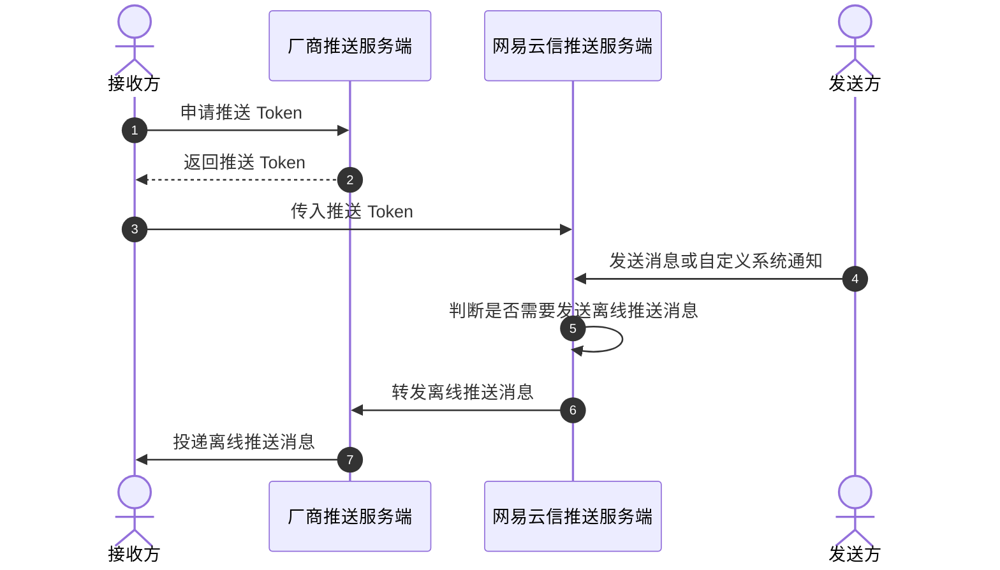

为了提高消息送达率，网易云信引入手机系统厂商推送。手机系统级别的厂商推送（如小米、华为、vivo、OPPO、魅族等）的优势在于其拥有稳定的系统级长连接，可以做到随时接收推送。

## 适用场景

您可以通过集成各移动端设备厂商的原生推送 SDK，与 NIM SDK 搭配使用，实现离线推送功能。

实现离线推送消息功能后，当出现以下用户行为时，会触发离线推送，使用手机厂商系统级推送告知用户有消息需要接收：

- 当应用被切换到后台，并且 App 资源被系统回收时。
- 用户登录账号后，主动关闭 App 时。
- 网络不稳定等，导致 NIM SDK 无法与网易云信服务器保持正常连接时。

## 技术原理

网易云信 IM 实现离线推送的技术原理如下：



## 前提条件

在实现离线推送功能之前，请确保：

- **开发环境满足如下要求**：
    - Android 5.0 及以上版本。
    - 自 6.9.0 起，改用 AndroidX 支持库，Target API 改为 28，不再支持 support 库。

- 已 [集成 NIM Android SDK](https://doc.yunxin.163.com/messaging/guide/DAyOTkwMDQ?platform=android)。
- 在 [网易云信控制台](https://app.yunxin.163.com/global/home) 上，[创建应用](https://doc.yunxin.163.com/console/guide/TIzMDE4NTA?platform=console)，获取应用密钥（App Key）。
- 已 [注册 IM 账号](https://doc.yunxin.163.com/messaging/guide/TY1OTU4NDQ?platform=android#4-注册-im-账号)，获取账号 ID（`accid`）和凭证（Token）。

## 第一步：集成离线推送服务

请参考具体第三方厂商的推送集成文档，集成需要使用到的第三方厂商离线推送 SDK，接入各厂商的离线推送服务。

目前支持以下第三方推送厂商：

| 第三方推送厂商 | 当前兼容版本 | 集成指南 |
| :---- | :---- | :---- |
| 华为 | 6.12.0.300 | [集成华为推送](https://doc.yunxin.163.com/messaging/guide/jg2ODQxMjU?platform=android)
| 小米 | 6.0.1 | [集成小米推送](https://doc.yunxin.163.com/messaging/guide/zg2NDE4ODM?platform=android) |
| OPPO | 3.5.1 | [集成 OPPO 推送](https://doc.yunxin.163.com/messaging/guide/zI4ODc0MTE?platform=android)
| vivo | 4.0.0.0_500 | [集成 vivo 推送](https://doc.yunxin.163.com/messaging/guide/zY0MjM0OTc?platform=android)
| 魅族 | 4.3.0 | [集成魅族推送](https://doc.yunxin.163.com/messaging/guide/DcwMjI1MTI?platform=android)
| 荣耀 | 7.0.61.303 | [集成荣耀推送](https://doc.yunxin.163.com/messaging/guide/DMwMjc5MDM?platform=android)
| 谷歌 FCM | `firebase-bom:32.3.1`<br>`firebase-messaging：23.0.0`<br>`firebase-analytics: 22.0.0` | [集成谷歌推送](https://doc.yunxin.163.com/messaging/guide/zY2Nzc4MjY?platform=android)

## 第二步：集成 NIM SDK

在 [集成 NIM SDK](https://doc.yunxin.163.com/messaging/guide/DAyOTkwMDQ?platform=android) 时，需要添加第三方厂商推送辅助包。

- 若自动集成，则需要在 dependencies 中添加相关依赖。
    ```Groovy
    dependencies {
        compile fileTree(dir: 'libs', include: '*.jar')
        // 添加依赖。注意，版本号必须一致。

        // 基础功能 (必需)
        implementation "com.netease.nimlib:basesdk:${LATEST_VERSION}"
        // 通过网易云信来集成第三方厂商推送需要
        implementation "com.netease.nimlib:push:${LATEST_VERSION}"
    }
    ```

- 若手动集成需要将 [下载](https://doc.yunxin.163.com/messaging/resource?platform=all) 的 `nim-push-x.x.x.jar` 文件拷贝到您的项目路径的 `app/libs` 目录下。然后在该 `.jar` 文件上右键添加为依赖。

## 第三步：初始化 NIM SDK

[初始化 NIM SDK](https://doc.yunxin.163.com/messaging/guide/TI5ODE2MTM?platform=android) 时，完成厂商的推送证书配置，并选择推送渠道。

1. 需要将推送证书的信息配置到初始化参数 `SDKOptions.mixPushConfig` 中。

    :::::: div linked-codes
    ::: code 小米
    ```Java
    MixPushConfig config = new MixPushConfig();
    // 传入从小米推送平台获取到的 AppId 与 AppKey
    config.xmAppId = "xxxx";
    config.xmAppKey = "xxxx";
    // 传入网易云信控制台上小米推送对应的证书名
    config.xmCertificateName = "xxxx";
    ...
    options.mixPushConfig = config;
    ```
    :::
    ::: code 华为
    ```Java
    MixPushConfig config = new MixPushConfig();
    // 传入华为推送的 App ID
    config.hwAppId = "xxxx";
    // 传入网易云信控制台上华为推送证书名
    config.hwCertificateName = "xxxx";
    ...
    options.mixPushConfig = config;
    ```
    :::
    ::: code 荣耀
    ```Java
    MixPushConfig config = new MixPushConfig();
    // 传入荣耀推送证书名，荣耀推送的 appId 请在 AndroidManifest.xml 文件中配置
    config.honorCertificateName = "xxxx";
    ...
    options.mixPushConfig = config;
    ```
    :::
    ::: code vivo
    ```Java
    MixPushConfig config = new MixPushConfig();
    // 传入网易云信控制台上配置的 vivo 推送证书名,vivo 推送的 appId appKey 请在 AndroidManifest.xml 文件中配置
    config.vivoCertificateName = "xxxx";
    ...
    options.mixPushConfig = config;
    ```
    :::
    ::: code OPPO
    ```
    MixPushConfig config = new MixPushConfig();

    config.oppoAppId = "xxxx";
    config.oppoAppKey = "xxxxxx";
    // 注意区分 AppSercet 与 MasterSecret
    config.oppoAppSercet = "xxxxxxx";
    // 传入网易云信控制台上配置的 oppo 推送证书名
    config.oppoCertificateName = "xxxx";
    ...
    options.mixPushConfig = config;
    ```
    :::
    ::: code 魅族
    ```Java
    MixPushConfig config = new MixPushConfig();

    config.mzAppId = "xxx";
    config.mzAppKey = "xxxx";
    config.mzCertificateName = "xxxx";
    ...
    options.mixPushConfig = config;
    ```
    :::
    ::: code 谷歌
    ```Java
    //传入网易云信控制台上配置的谷歌推送证书名,谷歌推送的 AppSecret 请在 AndroidManifest.xml 文件中配置
    MixPushConfig config = new MixPushConfig();

    config.fcmCertificateName = "xxxx";
    ...
    options.mixPushConfig = config;
    ```
    :::
    ::::::

    :::note note
    推送证书名长度不超过 32 个字符，否则登录时会报错 500。
    :::

2. 选择推送渠道。

    - 如果 [`SDKOptions.mixPushConfig.autoSelectPushType`](https://doc.yunxin.163.com/messaging/references/android/doxygen/Latest/zh/classcom_1_1netease_1_1nimlib_1_1sdk_1_1mixpush_1_1_mix_push_config.html#a1bc6b2fec84b3b732b501dd6c44bc507) 为 false（默认），则 SDK 直接选择服务端推荐的推送渠道。

    - 如果配置 `SDKOptions.mixPushConfig.autoSelectPushType` 为 true，则 SDK 根据实际的 token 的获取情况确定推送渠道，此时服务端推荐的推送渠道为最高优先级。需要确定推送渠道时，先进行本地支持性判断，然后将向所有可能支持的推送厂商申请 token，并在成功拿到的 token 中选择优先级更高的渠道。

    :::note note
    SDK 默认 Google FCM 推送的优先级最低，即如果同时接入了 FCM 和其他厂商推送，则会优先走其他厂商推送通道。但是如果您的应用用户主要分布在海外，在 [网易云信控制台](https://app.yunxin.163.com/global/home) 已设置 **FCM 推送优先**（**控制台：应用详情 > 更多 > 证书管理**），那么同时接入 FCM 和其他厂商推送 SDK 的场景下，优先走 FCM 推送通道。
    :::

3. 在 `Application#onCreate` 中启用荣耀、OPPO 厂商的推送服务，即对荣耀、OPPO 推送服务进行初始化。其他厂商推送服务无需额外初始化，可忽略该步骤。

    :::::: div linked-codes
    <!--不需要
    ::: code 华为
    ```Java
    public class NimApplication extends Application {
        ...
        @Override
        public void onCreate() {
            ...
            if (NIMUtil.isMainProcess(this)) {
                ...
                // 在此处添加以下代码
                com.huawei.hms.support.common.ActivityMgr.INST.init(this);
                ...
            }
        }
    }
    ```
    :::
    -->
    ::: code 荣耀
    ```Java
    public class NimApplication extends Application {
        ...
        @Override
        public void onCreate() {
            ...
            if (NIMUtil.isMainProcess(this)) {
                ...
                // 在此处添加以下代码
                HonorPushClient.getInstance().init(getApplicationContext(), true);
                ...
            }
        }
    }
    ```
    :::
    ::: code OPPO
    ```Java
    public class NimApplication extends Application {
        ...
        @Override
        public void onCreate() {
            ...
            if (NIMUtil.isMainProcess(this)) {
                ...
                // 在此处添加以下代码
                com.heytap.msp.push.HeytapPushManager.init(this, true);
                ...
            }
        }
    }
    ```
    :::
    ::::::

    若您正确集成第三方推送（已传相关推送 token 至网易云信服务器），SDK 日志会打印以下相应记录。其中 `pushType` 和 `type` 表示推送类型（5 小米、6 华为、7 魅族、8 谷歌 FCM、9 vivo、10 OPPO、11 荣耀、0 不支持），`tokenName` 表示推送证书名称，`token` 表示推送 token。

    ```Java
    [ui]mix_push: after login, mix push state=MixPushState{pushType=5, hasPushed=0, lastDeviceId=''}
    [ui]mix_push: commit mix push token:type 5 tokenName PUSH_CER_NAME token y7ssE..................sLxnU
    ```

4. （可选）初始化之后，无论是否登录，您都可以调用 `MixPushService` 的 `registerPush` 方法获取推送 Token。（Token 会通过 `MixPushServiceObserve` 的 `observeMixPushToken` 回调得到。）

    :::note note
    如果您的应用用户主要分布在海外，需要优先走 FCM 推送通道，需要提前在 [网易云信控制台](https://app.yunxin.163.com/global/home) 已设置 **FCM 推送优先**（**控制台：应用详情 > 更多 > 证书管理**），那么调用该接口时，会优先获取 FCM 推送的 Token。
    :::

## 第四步：测试离线推送

### **消息发送方**

发送消息或自定义系统通知给接收方（离线），具体的收发流程可参考 [消息收发](https://doc.yunxin.163.com/messaging/guide/jk0NDM1NjA?platform=android) 和 [自定义系统通知收发](https://doc.yunxin.163.com/messaging/guide/zI2ODg0MjA?platform=android)。

这里以发送文本消息为例，通过调用 `sendMessage` 实现。发送的消息默认需要推送，如需设置推送文案，推送角标，推送文案前缀等，请参考 [配置消息的推送属性](https://doc.yunxin.163.com/messaging/guide/TY4MzU5MDc?platform=android)。

```Java
// 该账号为示例
String account = "testAccount";
// 以单聊类型为例
SessionTypeEnum sessionType = SessionTypeEnum.P2P;
String text = "this is an example";
// 创建一个文本消息
IMMessage textMessage = MessageBuilder.createTextMessage(account, sessionType, text);
// 发送给对方
NIMClient.getService(MsgService.class).sendMessage(textMessage, false).setCallback(new RequestCallback<Void>() {
                @Override
                public void onSuccess(Void param) {

                }

                @Override
                public void onFailed(int code) {

                }

                @Override
                public void onException(Throwable exception) {

                }
            });
```

### **消息接收方**

接收方将会在登录后接收到离线推送。

:::note note
- 离线推送支持配置免打扰时间，具体请参考 [设置推送全局免打扰](https://doc.yunxin.163.com/messaging/guide/DM5ODc1ODg?platform=android)。
- 离线推送支持配置多端推送策略，即支持推送至同一账号的多个客户端，具体请参考 [设置多端推送策略](https://doc.yunxin.163.com/messaging/guide/jQ3MTc1MjI?platform=android)。
:::

## 第五步：关闭/开启离线推送服务（可选）

NIM SDK 的第三方推送服务功能默认开启，无需单独调用开启服务接口。若后续不想使用第三方推送服务，可调用 [`enable`](https://doc.yunxin.163.com/messaging/references/android/doxygen/Latest/zh/interfacecom_1_1netease_1_1nimlib_1_1sdk_1_1mixpush_1_1_mix_push_service.html#aec0da212bcdc70f399a610a4f5a84ec9) 方法进行关闭。

```Java
NIMClient.getService(MixPushService.class).enable(false).setCallback(...)
```

## 推送相关文档

- [推送 payload 配置](https://doc.yunxin.163.com/messaging/guide/DQyNjc5NjE?platform=server)

- [推送问题排查](https://doc.yunxin.163.com/messaging/guide/DY4NzY5ODU?platform=android)

- 第三方厂商推送通道存在流控，具体请参考 [厂商推送通道限制说明](https://doc.yunxin.163.com/messaging/guide/DY1MzgzOTk?platform=android)

- 若您想直接使用 SDK 中注册的 Channel 来作为第三方厂商（小米、OPPO）的申请 Channel，可参考 [SDK 中的 Channel 信息](https://doc.yunxin.163.com/messaging/guide/DY4NzY5ODU?platform=android#SDK%E9%80%9A%E9%81%93Channel)

- [第三方推送厂商通道错误码参考](https://doc.yunxin.163.com/messaging/guide/DY4NzY5ODU?platform=android#%E5%8E%82%E5%95%86%E9%80%9A%E9%81%93%E9%94%99%E8%AF%AF%E7%A0%81%E6%96%87%E6%A1%A3)

## 常见问题

### 触发离线推送的条件是什么？

Android 切换到后台并且等 App 被系统回收时，或者用户主动关闭 App，才能触发推送条件。因此，若要测试 Android 推送问题，请登录后关闭 App，确保满足推送条件。

### 哪些场景下不会触发推送？

IM 账号未登录/已登出/被踢出，不会触发推送。App 在前台，也不会触发推送。用户登录 IM 账号，并且未主动登出或者没有被踢出，可能触发推送。