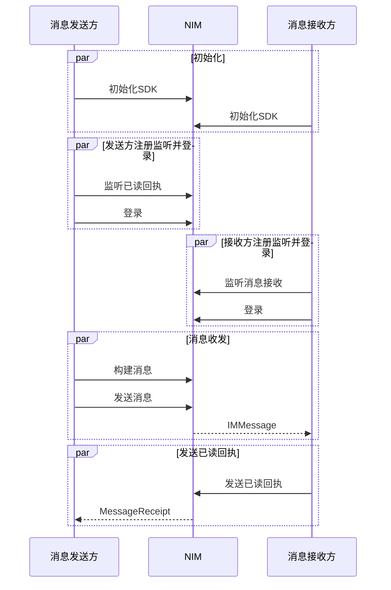
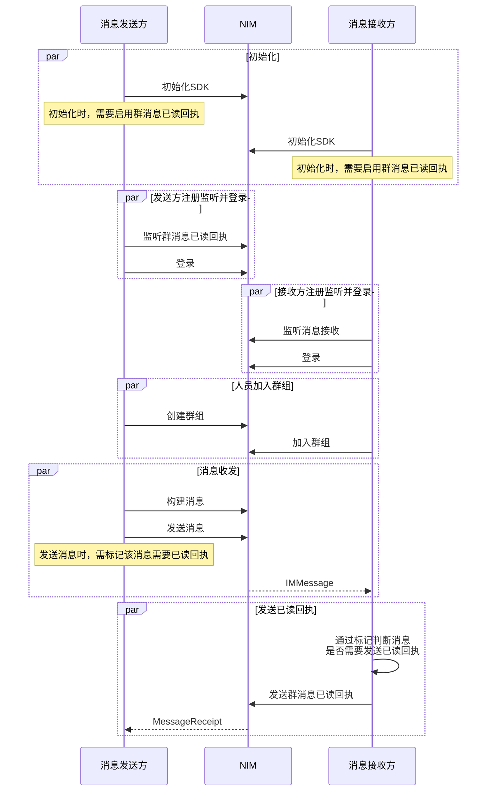

<!--keywords: 已读、已读回执、消息已读回执 -->

当发送方需要知道接收方是否已经阅读了自己发送的消息时，需要使用已读回执的功能。


网易云信 NIM Android SDK 的[`MsgServiceObserve`](https://doc.yunxin.163.com/docs/interface/messaging/android/doxygen/Latest/zh/interfacecom_1_1netease_1_1nimlib_1_1sdk_1_1msg_1_1_msg_service_observe.html)类和[`MsgService`](https://doc.yunxin.163.com/docs/interface/messaging/android/doxygen/Latest/zh/interfacecom_1_1netease_1_1nimlib_1_1sdk_1_1msg_1_1_msg_service.html)接口，分别提供监听单聊/群聊消息已读回执和发送单聊消息已读回执的方法；发送群聊消息已读回执的方法所在的类为[`TeamService`](https://doc.yunxin.163.com/docs/interface/messaging/android/doxygen/Latest/zh/interfacecom_1_1netease_1_1nimlib_1_1sdk_1_1team_1_1_team_service.html)。调用发送已读回执的方法时，传入的消息即为需要显示为已读的消息。

::: note note
本文的时序图可能因为网络问题显示异常。如显示异常，一般刷新当前页面即可正常显示。
:::

## <span id="单聊消息已读回执">单聊消息已读回执</span>


  


### **前提条件**

- 已完成 [SDK 初始化](https://doc.yunxin.163.com/messaging/guide/TI5ODE2MTM?platform=android)。

- 消息接收方已调用[`observeReceiveMessage`](https://doc.yunxin.163.com/docs/interface/messaging/android/doxygen/Latest/zh/interfacecom_1_1netease_1_1nimlib_1_1sdk_1_1msg_1_1_msg_service_observe.html#a48a20a5ba2c5cd039daeba60b2c7adf7)方法注册消息发送观察者，监听消息发送。


### **实现流程**

1. 消息发送方调用[`observeMessageReceipt`](https://doc.yunxin.163.com/docs/interface/messaging/android/doxygen/Latest/zh/interfacecom_1_1netease_1_1nimlib_1_1sdk_1_1msg_1_1_msg_service_observe.html#abde75f337acbcb5224e92a7cf7a7fe8f)方法注册已读回执观察者，监听已读回执。

    `Observer`回调函数的`MessageReceipt`接口的参数说明如下：

    返回值 | MessageReceipt 接口 | 说明                                                         
    :----- | :----------------- | :----------------------------------------------------------- 
    String | `getSessionId()`     | 聊天对象的 ID
    long   | `getTime()`          | 该会话最后一条已读消息的时间，比该时间早的消息都视为已读     

    示例代码：

    ```
    // 注册/注销观察者
    NIMClient.getService(MsgServiceObserve.class).observeMessageReceipt(messageReceiptObserver, register);
    private Observer<List<MessageReceipt>> messageReceiptObserver = new Observer<List<MessageReceipt>>() {
            @Override
            public void onEvent(List<MessageReceipt> messageReceipts) {
                receiveReceipt();
            }
    };
    ```
2. (可选) 消息发送方在发送消息后，可调用[`isRemoteRead`](https://doc.yunxin.163.com/docs/interface/messaging/android/doxygen/Latest/zh/interfacecom_1_1netease_1_1nimlib_1_1sdk_1_1msg_1_1model_1_1_n_i_m_message.html#a635189f6327a6dc07ea080c2bafecd52)方法判断接收方是否已读。

3. 消息接收方在收到消息并阅读后，调用[`sendMessageReceipt`](https://doc.yunxin.163.com/docs/interface/messaging/android/doxygen/Latest/zh/interfacecom_1_1netease_1_1nimlib_1_1sdk_1_1msg_1_1_msg_service.html#a910614b68dd8d4aca6cefc189619048a)方法发送已读回执，调用时传入接收到的消息。

    ::: note note 
    - 如在会话界面中调用该方法并传入当前会话的最后一条消息，即表示这之前的消息本方都已读。
    - 在单聊场景中，不判断消息是否需要已读回执，即默认都需要已读回执。但是当该消息转发至群聊，群聊场景下需要判断是否需要已读回执，会读取单聊消息对象的 `needMsgAck` 字段，true 才发送群聊已读回执。因此在单聊场景下也建议用户按需设置该参数。
    :::

    示例代码如下：

    ```java
    // 该帐号为示例，请先注册
    String account = "testAccount";
    // message为会话中已读的最后一条消息
    NIMClient.getService(MsgService.class).sendMessageReceipt(account, message);
    ```

4. SDK 触发`Obeserver`回调函数，将已读回执（`MessageReceipt`）发送给消息发送方。


## <span id="群聊消息已读回执">群聊消息已读回执</span>

本节以发送方与接收方的消息交互为例，介绍群聊消息已读回执的实现流程。



### **前提条件**

- 已完成 [SDK 初始化](https://doc.yunxin.163.com/messaging/guide/TI5ODE2MTM?platform=android)。

- 已创建相应数量的[云信 IM 账号](https://doc.yunxin.163.com/messaging/server-apis/DQ3Nzk1MTY?platform=server)。

- 已在控制台开通群聊消息已读回执功能，具体请参见[配置群组功能](https://doc.yunxin.163.com/messaging/guide/DAzMDM5NDc?platform=android#配置群组功能)。

- 消息接收方已调用[`observeReceiveMessage`](https://doc.yunxin.163.com/docs/interface/messaging/android/doxygen/Latest/zh/interfacecom_1_1netease_1_1nimlib_1_1sdk_1_1msg_1_1_msg_service_observe.html#a48a20a5ba2c5cd039daeba60b2c7adf7)方法注册消息发送观察者，监听消息发送。

- 已创建群组且消息接收方已加入群组。 

### **使用限制**

::: note important
使用群消息已读回执功能，需将群成员控制在 200 人以内。
:::

### **实现流程** 

1. 发送方和接收方在初始化 SDK 时，将[`SDKOptions#enableTeamMsgAck`](https://doc.yunxin.163.com/docs/interface/messaging/android/doxygen/Latest/zh/classcom_1_1netease_1_1nimlib_1_1sdk_1_1_s_d_k_options.html#a766d328429f76c4b144670f866fac970)设置为`true`，启用群消息已读回执功能。

2. 发送方在登录 IM 前，调用[`observeTeamMessageReceipt`](https://doc.yunxin.163.com/docs/interface/messaging/android/doxygen/Latest/zh/interfacecom_1_1netease_1_1nimlib_1_1sdk_1_1msg_1_1_msg_service_observe.html#a36e47ba2f68d83321afdef406a7af984) 注册群消息已读回执观察者，监听群消息的已读回执。 

    `Observer`回调函数的`TeamMessageReceipt`接口参数说明如下：

    返回值|TeamMessageReceipt 接口|说明|
    :--|:---|:---|
    String|`getMsgId()`|获取消息 ID|
    int|`getAckCount()`|获取已读人数|
    int|`getUnAckCount()`|获取未读人数|

    示例代码：

    ```java
    // 注册监听器
    NIMClient.getService(MsgServiceObserve.class).observeTeamMessageReceipt(teamMessageReceiptObserver, register);
    // 监听器的实现
    private Observer<List<TeamMessageReceipt>> teamMessageReceiptObserver = new Observer<List<TeamMessageReceipt>>() {
        @Override
        public void onEvent(List<TeamMessageReceipt> teamMessageReceipts) {
          ...
        }
    };
    ```

3. 发送方调用[`sendMessage`](https://doc.yunxin.163.com/docs/interface/messaging/android/doxygen/Latest/zh/interfacecom_1_1netease_1_1nimlib_1_1sdk_1_1msg_1_1_msg_service.html#a74db65f6720c4e2ba7a5d2a9e72ebda8)方法发送群消息时，需通过[`NIMMessage#setMsgAck`](https://doc.yunxin.163.com/docs/interface/messaging/android/doxygen/Latest/zh/interfacecom_1_1netease_1_1nimlib_1_1sdk_1_1msg_1_1model_1_1_n_i_m_message.html#acbe7ce110b7ee907d677e88bc6ba7338)方法标记该消息需要已读回执。

    示例代码如下：

    ```java
    // 创建待发送消息
    IMMessage message = MessageBuilder.createTextMessage(sessionId, SessionTypeEnum.Team, "content");
    // 标记该消息需要已读回执反馈
    message.setMsgAck();
    // 发送消息
    NIMClient.getService(MsgService.class).sendMessage(message, false);
    ```
4. 接收方接收到消息后，通过该消息的[`NIMMessage#needMsgAck`](https://doc.yunxin.163.com/docs/interface/messaging/android/doxygen/Latest/zh/interfacecom_1_1netease_1_1nimlib_1_1sdk_1_1msg_1_1model_1_1_n_i_m_message.html#a2cd12e351ef4b2a72149aa40888a9b3b)属性判断该消息是否需要发送已读回执。

5. 如需要发送已读回执，接收方可调用[`NIMMessage#hasSendAck`](https://doc.yunxin.163.com/docs/interface/messaging/android/doxygen/Latest/zh/interfacecom_1_1netease_1_1nimlib_1_1sdk_1_1msg_1_1model_1_1_n_i_m_message.html#a05b6b8dba3a55c36b06e1d56f1fe2317)方法判断是否对该消息已发送过已读回执。

6. 接收方调用 [`sendTeamMessageReceipt`](https://doc.yunxin.163.com/docs/interface/messaging/android/doxygen/Latest/zh/interfacecom_1_1netease_1_1nimlib_1_1sdk_1_1team_1_1_team_service.html#aa1e80df6be8096921a77ecf913b1e658)方法发送已读回执。

    
    示例代码：

    ```java
    NIMSDK.getTeamService().sendTeamMessageReceipt(message)
    ```

7. SDK 触发`Observer`回调函数，将已读回执发送至消息发送方。


## 群聊已读回执后续操作


消息发送方获取到群聊消息已读回执后，可调用如下方法刷新消息的未读数、查询已读/未读账号列表或查询单条消息的已读/未读数。


### **批量刷新已读/未读数**

调用[`refreshTeamMessageReceipt`](https://doc.yunxin.163.com/docs/interface/messaging/android/doxygen/Latest/zh/interfacecom_1_1netease_1_1nimlib_1_1sdk_1_1team_1_1_team_service.html#a8eda503c73377d540573cc80775b5338)可批量刷新群聊消息已读/未读数。一般在加载消息时进行批量刷新。只有已读、未读数量有变更，才会通过观察者接口进行通知。该 API 为异步无回调接口。

::: note notice
单次调用，最多可传入 50 条消息体。换而言之，单次最多可刷新 50 条消息的已读/未读数。
:::

**示例代码**

```java
// messages为接收到的批量消息
NIMSDK.getTeamService().refreshTeamMessageReceipt(messages);
```

### **查询单条群组消息的已读/未读账号列表**

调用[`fetchTeamMessageReceiptDetail`](https://doc.yunxin.163.com/docs/interface/messaging/android/doxygen/Latest/zh/interfacecom_1_1netease_1_1nimlib_1_1sdk_1_1team_1_1_team_service.html#a68a675e120405cbe82f39fc2b0d5896f)方法可查询单条群组消息的已读/未读账号列表。


**示例代码**

```java
//  message为待查询的消息，accountSet为账号组成的集合
NIMSDK.getTeamService().fetchTeamMessageReceiptDetail(message, accountSet).setCallback(new RequestCallback<TeamMsgAckInfo>() {
    @Override
    public void onSuccess(TeamMsgAckInfo param) {
        // 获取成功
    }

    @Override
    public void onFailed(int code) {
		// 获取失败
    }

    @Override
    public void onException(Throwable exception) {
		// 异常
    }
});
```


### **从数据库查询单条群组消息已读/未读账号列表**

调用[`queryTeamMessageReceiptDetailBlock`](https://doc.yunxin.163.com/docs/interface/messaging/android/doxygen/Latest/zh/interfacecom_1_1netease_1_1nimlib_1_1sdk_1_1team_1_1_team_service.html#a2612fb33fd54a11cb42aa34035c18786)方法可从本地数据库查询单条群组消息已读/未读账号列表。

::: note notice 
调用`queryTeamMessageReceiptDetailBlock`方法将直接从本地数据库获取单条群组消息已读/未读账号列表，很可能是过时数据。如需获取准确数据，请调用`fetchTeamMessageReceiptDetail`方法。
:::


**示例代码**

```java
//  message为待查询的消息，accountSet为账号组成的集合
NIMSDK.getTeamService().queryTeamMessageReceiptDetailBlock(message, accountSet);
```

### **查询单条群组消息已读/未读账号数**

通过 `NIMMessage` 接口的[`getTeamMsgAckCount`](https://doc.yunxin.163.com/docs/interface/messaging/android/doxygen/Latest/zh/interfacecom_1_1netease_1_1nimlib_1_1sdk_1_1msg_1_1model_1_1_n_i_m_message.html#ae092d92321017f88ac4238cf4d641ca3)方法来获取群消息已读账号数量，通过[`getTeamMsgUnAckCount`](https://doc.yunxin.163.com/docs/interface/messaging/android/doxygen/Latest/zh/interfacecom_1_1netease_1_1nimlib_1_1sdk_1_1msg_1_1model_1_1_n_i_m_message.html#a04a9558fa1fbd51d2d3b6ff85f29e97e)方法来获取群消息未读账号数量。


## API参考

| <div style="width:80px">API</div> | <div style="width:120px">说明 </div>|
|:---- | :-------------- |
|[`observeMessageReceipt`](https://doc.yunxin.163.com/docs/interface/messaging/android/doxygen/Latest/zh/interfacecom_1_1netease_1_1nimlib_1_1sdk_1_1msg_1_1_msg_service_observe.html#a394023e2d039d714252cf52fa98b5afc) | 注册/注销单聊已读回执观察者，若注册则监听单聊消息已读回执
| [`sendMessageReceipt`](https://doc.yunxin.163.com/docs/interface/messaging/android/doxygen/Latest/zh/interfacecom_1_1netease_1_1nimlib_1_1sdk_1_1msg_1_1_msg_service.html#a9a66029ffd3e317c9c77bf4dcb86c2de)|  发送单聊消息已读回执   |
| [`observeTeamMessageReceipt`](https://doc.yunxin.163.com/docs/interface/messaging/android/doxygen/Latest/zh/interfacecom_1_1netease_1_1nimlib_1_1sdk_1_1msg_1_1_msg_service_observe.html#a36e47ba2f68d83321afdef406a7af984) | 注册/注销群聊已读回执观察者，若注册则监听群聊消息已读回执 |
| [`sendTeamMessageReceipt`](https://doc.yunxin.163.com/docs/interface/messaging/android/doxygen/Latest/zh/interfacecom_1_1netease_1_1nimlib_1_1sdk_1_1team_1_1_team_service.html#aa1e80df6be8096921a77ecf913b1e658)  |  发送群聊消息已读回执        |
|[`refreshTeamMessageReceipt`](https://doc.yunxin.163.com/docs/interface/messaging/android/doxygen/Latest/zh/interfacecom_1_1netease_1_1nimlib_1_1sdk_1_1team_1_1_team_service.html#a8eda503c73377d540573cc80775b5338)| 批量刷新群聊消息已读/未读数|
|[`fetchTeamMessageReceiptDetail`](https://doc.yunxin.163.com/docs/interface/messaging/android/doxygen/Latest/zh/interfacecom_1_1netease_1_1nimlib_1_1sdk_1_1team_1_1_team_service.html#aedc5fb8a1a6322ea7a033e61260744a0) |查询单条群组消息的已读/未读账号列表 |
|[`queryTeamMessageReceiptDetailBlock`](https://doc.yunxin.163.com/docs/interface/messaging/android/doxygen/Latest/zh/interfacecom_1_1netease_1_1nimlib_1_1sdk_1_1team_1_1_team_service.html#af771e718f185e6a6835fabb8a05f4fab)     |       从本地数据库查询单条群组消息在指定用户中的已读、未读账号列表（同步接口）  |