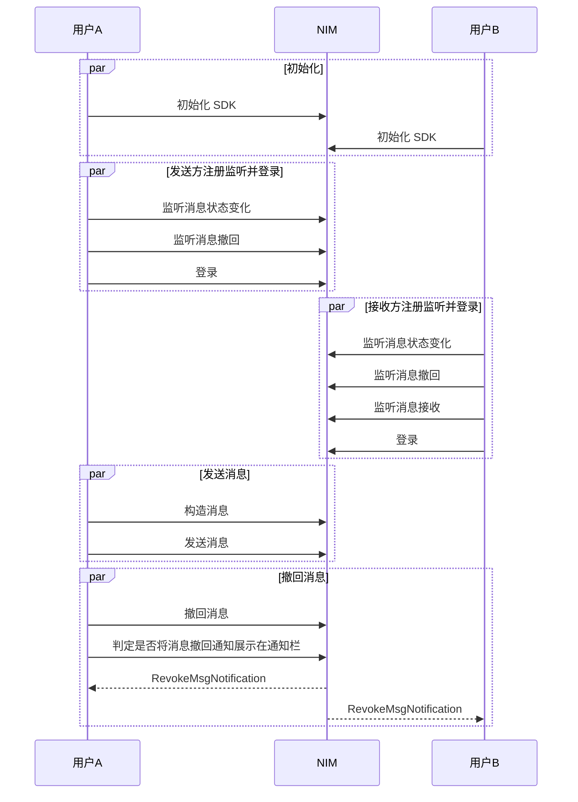

<!--keywords: 消息撤回、撤回、撤回通知、消息撤回通知 -->

网易云信 NIM Android SDK 发送消息接口不支持取消发送，若需要取消，可以在消息发送成功后，调用撤回消息接口进行取消。

网易云信 NIM Android SDK 的 [`MsgServiceObserve`](https://doc.yunxin.163.com/docs/interface/messaging/android/doxygen/Latest/zh/interfacecom_1_1netease_1_1nimlib_1_1sdk_1_1msg_1_1_msg_service_observe.html) 类和 [`MsgService`](https://doc.yunxin.163.com/docs/interface/messaging/android/doxygen/Latest/zh/interfacecom_1_1netease_1_1nimlib_1_1sdk_1_1msg_1_1_msg_service.html) 类，分别提供监听消息撤回的方法和撤回消息的方法。

SDK 支持多种撤回类型，如单聊单向撤回和群聊双向撤回，可通过 [`RevokeMsgNotification#getRevokeType()`](https://doc.yunxin.163.com/docs/interface/messaging/android/doxygen/Latest/zh/classcom_1_1netease_1_1nimlib_1_1sdk_1_1msg_1_1model_1_1_revoke_msg_notification.html#ad098dc00666ea3ee76e15bb2feff88f5) 设置。
::: note note
- NIM Android SDK v 8.5.0 开始，支持撤回自己发送给自己的消息。
- 本文的时序图可能因网络问题而显示异常。如显示异常，一般刷新当前页面即可正常显示。
:::

## 功能介绍


撤回类型 | 说明
---- | --------------
双向撤回 | 可双向撤回一定时间内（默认 2 分钟，可在云信控制台配置，最多 604800，即 7 天）的单聊消息与群聊消息。撤回之后，消息接收者和发送者都将收到一条消息撤回通知，并删除对应的离线消息、漫游消息和历史消息。
单向撤回 | 可以在一定时间内（默认 2 分钟，可在云信控制台配置）单向撤回单聊消息和群消息。撤回之后，消息接收者会收到一条单向撤回的通知，并删除对应的离线消息、漫游消息和历史消息；撤回之后，消息发送者无感知，可以正常使用漫游消息和历史消息。


::: note notice 
- <a href="https://doc.yunxin.163.com/messaging/guide/DAyOTkwMDQ?platform=android#初始化配置参数" target="_blank">初始化SDK</a> 时，配置`SDKOptions`的参数`shouldConsiderRevokedMessageUnreadCount`为 true 可实现消息撤回后重新计算未读数。
- 单聊和群聊消息的撤回功能存在些许区别：
    - 单聊：用户只能撤回自己发送的消息。
    - 群聊：普通群成员只能撤回自己发送的消息。客户端 SDK 支持管理员撤回其他群成员的消息（服务端 API 不支持）。
:::


## 前提条件

已完成 [SDK 初始化](https://doc.yunxin.163.com/messaging/guide/TI5ODE2MTM?platform=android)。


## 实现方法

不同类型消息撤回的流程相似，本节以用户A（消息发送方）与 用户B（消息接收方）的单聊消息交互为例，介绍消息撤回的实现流程。

### **API调用时序**

以下时序图仅以单聊双向撤回的场景为例。



### **实现流程**

1. 用户A 和 用户B 在登录 IM 前调用[`observeRevokeMessage`](https://doc.yunxin.163.com/docs/interface/messaging/android/doxygen/Latest/zh/interfacecom_1_1netease_1_1nimlib_1_1sdk_1_1msg_1_1_msg_service_observe.html#a9485578f56fd79c68d7caf68b65f20e8)方法注册消息撤回的观察者，监听消息撤回。

    ::: note note 
    如果用户B 启用了[撤回通知消息提醒](/docs/TM5MzM5Njk/zc1OTI2MTM?#撤回通知消息提醒)功能，则收到撤回通知时，会触发产生提醒通知栏。若不需要，可以通过
    [`toggleRevokeMessageNotification`](https://doc.yunxin.163.com/docs/interface/messaging/android/doxygen/Latest/zh/classcom_1_1netease_1_1nimlib_1_1sdk_1_1_n_i_m_client.html#a82660e6658f805450cf09fb327f316dd)方法来关闭。
    :::

    **示例代码如下**：

    ```java
    Observer<RevokeMsgNotification> revokeMessageObserver = new Observer<RevokeMsgNotification>() {
        @Override
        public void onEvent(RevokeMsgNotification notification) {
        // 监听到消息撤回的通知，可以在界面做相应的操作
        // 获取撤回消息
        notification.getMessage();
        // 获取撤回者
        notification.getRevokeAccount();
        }
    };

    NIMClient.getService(MsgServiceObserve.class).observeRevokeMessage(revokeMessageObserver, true);
    ```

2. 用户A 在发送消息后，调用[`revokeMessage`](https://doc.yunxin.163.com/docs/interface/messaging/android/doxygen/Latest/zh/interfacecom_1_1netease_1_1nimlib_1_1sdk_1_1superteam_1_1_super_team_service.html#a0a461b02e54f122d9ed41a466131413b)方法撤回消息。调用成功后，SDK 会先触发回调通知应用上层消息撤回成功，再自动将本地的这条消息删除。如果需要在撤回后显示一条本方已撤回的提示，可自行构造一条提示消息并调用[保存本地消息的方法](https://doc.yunxin.163.com/docs/TM5MzM5Njk/DMyNjAxNDM?platformId=60002)。

    ::: note notice
    以下情况消息撤回会失败：
    - 消息为空
    - 消息被反垃圾（内容审核）命中或消息没有发送成功
    - 消息超过撤回时限
    - 账号已经退群或者被踢后撤回群消息（可以通过服务端 API 单向撤回消息或者让群主和管理员撤回）
    :::

    **示例代码如下**：
    
    ```
    NIMClient.getService(MsgService.class).revokeMessage(message, null, null, true, postscript, attachJson).setCallback(new RequestCallbackWrapper<Void>() {
        @Override
        public void onResult(int code, Void result, Throwable exception) {

        }
    });
    ```
    **相关特殊需求说明**：

    针对撤回场景的通知栏内容覆盖需求（具体为：用户A 发消息给用户B，触发 APNs 推送，文案内容为“你好“。然后用户A 撤回该消息，此时通知栏中的“你好”变为预设的“对方撤回了一条消息”），建议的实现方式如下：

    - 在发送消息时，需要通过[`NIMMessage#setPushPayload()`](https://doc.yunxin.163.com/docs/interface/messaging/android/doxygen/Latest/zh/classcom_1_1netease_1_1nimlib_1_1sdk_1_1msg_1_1model_1_1_custom_notification.html#afb85ae3e364ec1771095fdccfa44c50a)方法插入`key`为`apns-collapse-id`的键值对，`value`的内容建议使用`uuid`等字符串，用以唯一标识该消息。
    - 当要撤回这条消息时，在`revokeMessage`方法中传参`customApnsText`中设置覆盖文案，在`pushPayload`中插入与被撤回消息相同的`apns-collapse-id`键值对。

3. 用户A 调用[`registerShouldShowNotificationWhenRevokeFilter`](https://doc.yunxin.163.com/docs/interface/messaging/android/doxygen/Latest/zh/interfacecom_1_1netease_1_1nimlib_1_1sdk_1_1msg_1_1_msg_service.html#a4d556effbf9cc700eff01397bae25ae2)方法注册过滤器来判定是否将撤回通知展示在通知栏。该过滤器可以用于减少展示在通知栏的撤回消息通知的数量。

    ::: note note 
    该过滤器的**判定规则**为：如果其他逻辑判断（如[`toggleRevokeMessageNotification`](https://doc.yunxin.163.com/docs/interface/messaging/android/doxygen/Latest/zh/classcom_1_1netease_1_1nimlib_1_1sdk_1_1_n_i_m_client.html#a82660e6658f805450cf09fb327f316dd)的设置）为消息撤回应该上通知栏，则由此过滤器的配置来最终判定消息撤回是否上通知栏；如果其他逻辑判断为不应该上通知栏，则无论过滤器如何配置，消息撤回都不会上通知栏。
    :::

    **示例代码如下**：

    ```java
    NIMClient.getService(MsgService.class).registerShouldShowNotificationWhenRevokeFilter(notification -> {
        return notification == null || TextUtils.isEmpty(notification.getAttach());
    });
    ```
    
## API参考

| <div style="width:80px">API</div> | <div style="width:120px">说明 </div>|
|:---- | :-------------- |
|   [`observeRevokeMessage`](https://doc.yunxin.163.com/docs/interface/messaging/android/doxygen/Latest/zh/interfacecom_1_1netease_1_1nimlib_1_1sdk_1_1msg_1_1_msg_service_observe.html#observeRevokeMessage-com.netease.nimlib.sdk.Observer-boolean-)     | 注册/注销消息撤回的观察者，若注册则监听消息撤回|
|   [`toggleRevokeMessageNotification`](https://doc.yunxin.163.com/docs/interface/messaging/android/doxygen/Latest/zh/classcom_1_1netease_1_1nimlib_1_1sdk_1_1_n_i_m_client.html#a82660e6658f805450cf09fb327f316dd) |    设置撤回消息是否需要提醒     |
|       [`revokeMessage`](https://doc.yunxin.163.com/docs/interface/messaging/android/doxygen/Latest/zh/interfacecom_1_1netease_1_1nimlib_1_1sdk_1_1msg_1_1_msg_service.html#revokeMessage-com.netease.nimlib.sdk.msg.model.IMMessage-java.lang.String-java.util.Map-boolean-java.lang.String-java.lang.String-)         |      撤回消息         |
| [`registerShouldShowNotificationWhenRevokeFilter`](https://doc.yunxin.163.com/docs/interface/messaging/android/doxygen/Latest/zh/interfacecom_1_1netease_1_1nimlib_1_1sdk_1_1msg_1_1_msg_service.html#registerShouldShowNotificationWhenRevokeFilter-com.netease.nimlib.sdk.msg.model.ShowNotificationWhenRevokeFilter-)   |    注册过滤器来判定是否将撤回通知展示在通知栏      |


