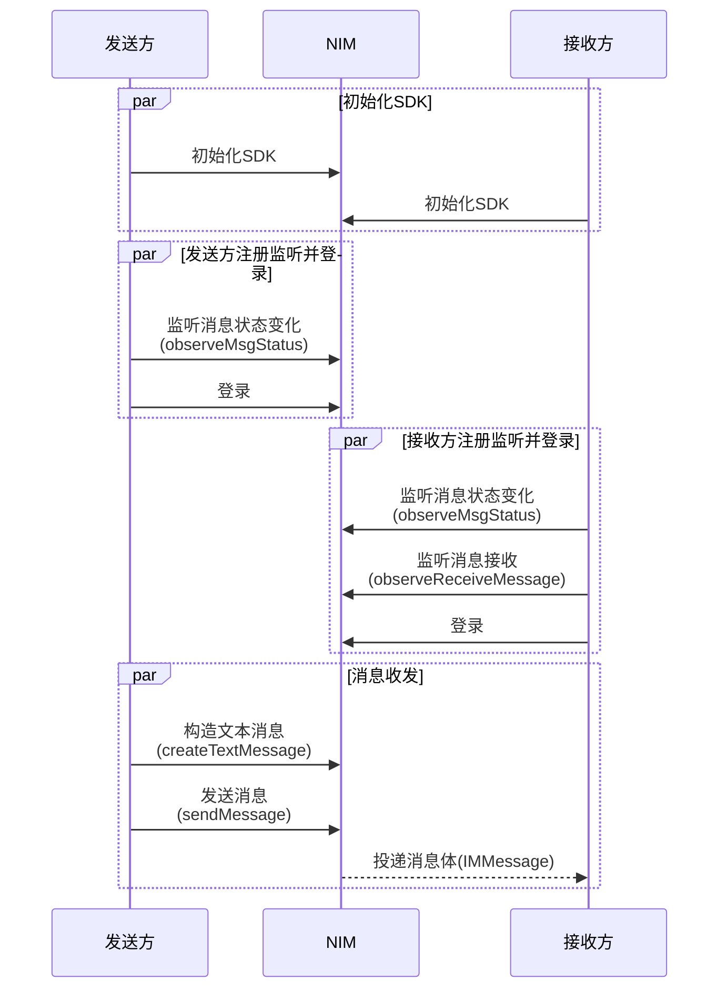
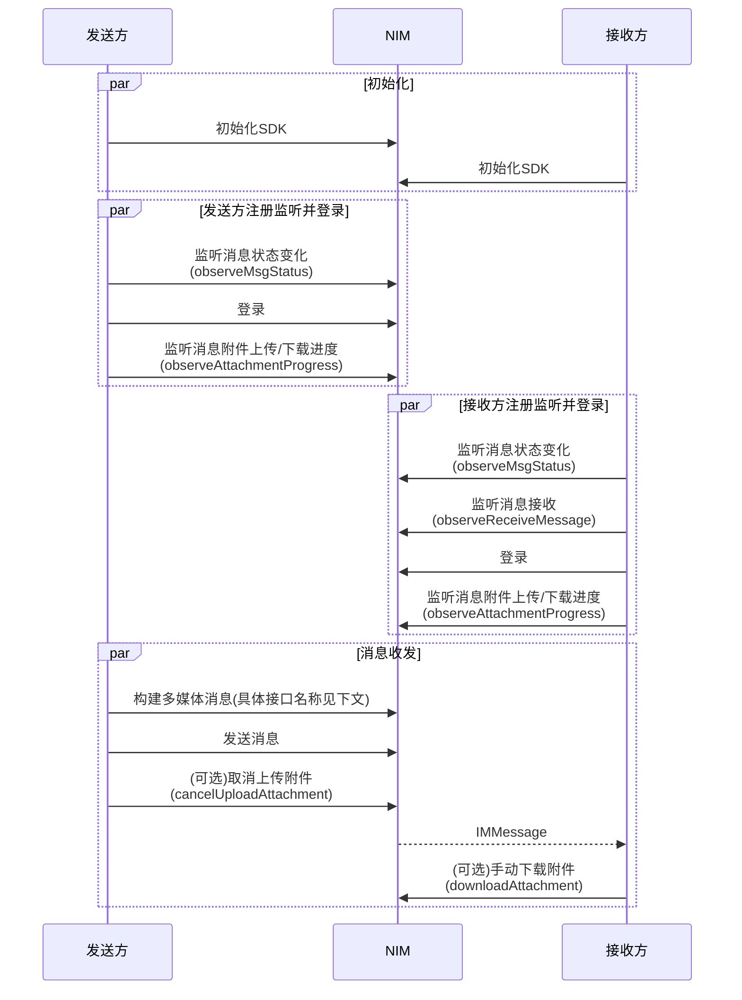
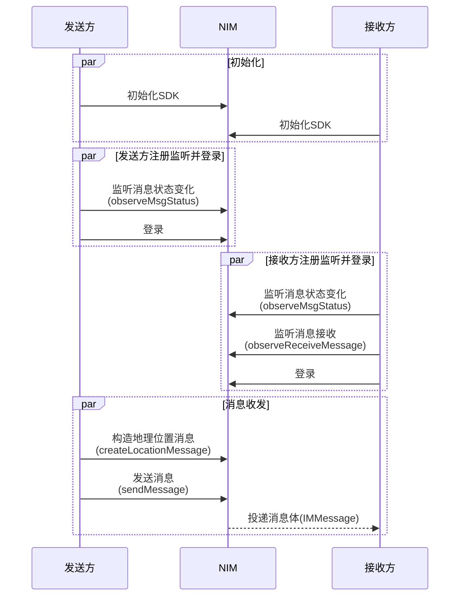
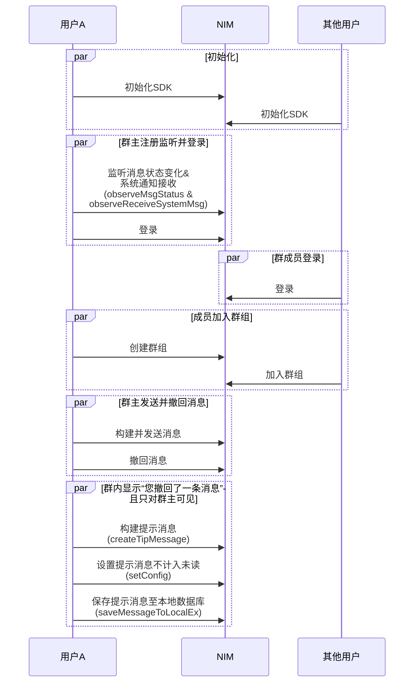

<!--keywords: 消息收发, 消息, 发送消息, 接收消息, 文本消息，图片消息，音频消息，视频消息，多媒体消息，广播消息，提示消息，自定义消息 -->

NetEase IM Android SDK（以下简称“NIM SDK”）支持收发多种消息类型，助您快速实现多样化的消息业务场景。NIM SDK 提供[`MessageBuilder`](https://doc.yunxin.163.com/docs/interface/messaging/android/doxygen/Latest/zh/classcom_1_1netease_1_1nimlib_1_1sdk_1_1msg_1_1_message_builder.html)类、[`MsgServiceObserve`](https://doc.yunxin.163.com/docs/interface/messaging/android/doxygen/Latest/zh/interfacecom_1_1netease_1_1nimlib_1_1sdk_1_1msg_1_1_msg_service_observe.html)接口和[`MsgService`](https://doc.yunxin.163.com/docs/interface/messaging/android/doxygen/Latest/zh/interfacecom_1_1netease_1_1nimlib_1_1sdk_1_1msg_1_1_msg_service.html)接口，支持构建、监听和收发多种类型的消息。SDK 中定义消息的结构为[`IMMessage`](https://doc.yunxin.163.com/docs/interface/messaging/android/doxygen/Latest/zh/interfacecom_1_1netease_1_1nimlib_1_1sdk_1_1msg_1_1model_1_1_i_m_message.html)（不支持继承扩展），不同消息类型以[`MsgTypeEnum`](https://doc.yunxin.163.com/docs/interface/messaging/android/doxygen/Latest/zh/enumcom_1_1netease_1_1nimlib_1_1sdk_1_1msg_1_1constant_1_1_msg_type_enum.html)作区分。发送不同类型消息的方法均为`sendMessage`。单聊消息和群聊消息都通过该方法发送，通过参数`sessionType`设置发送的为单聊消息还是群聊消息。

本文介绍通过网易云信 NIM SDK 实现消息收发的技术原理、前提条件以及具体的实现流程。

::: note note 
- 超大群、聊天室和圈组的消息收发，需分别使用[`SuperTeamService`](https://doc.yunxin.163.com/docs/interface/messaging/android/doxygen/Latest/zh/interfacecom_1_1netease_1_1nimlib_1_1sdk_1_1superteam_1_1_super_team_service.html)、[`ChatRoomService`](https://doc.yunxin.163.com/docs/interface/messaging/android/doxygen/Latest/zh/interfacecom_1_1netease_1_1nimlib_1_1sdk_1_1chatroom_1_1_chat_room_service.html)和[`QChatMessageService`](https://doc.yunxin.163.com/docs/interface/messaging/android/doxygen/Latest/zh/interfacecom_1_1netease_1_1nimlib_1_1sdk_1_1qchat_1_1_q_chat_message_service.html)的消息发送接口，与单聊和群聊的消息发送接口不同。具体实现流程请分别参见[超大群消息收发](https://doc.yunxin.163.com/messaging/guide/jM5MTgzNzA?platform=android#消息收发)、[聊天室消息收发](https://doc.yunxin.163.com/messaging/guide/TI1MDE5MzA?platform=android#聊天室消息收发)和[圈组消息收发](https://doc.yunxin.163.com/messaging/guide/TE1MjI2MDI?platform=android)。
- 本文的时序图可能因为网络问题而显示异常。如显示异常，一般刷新当前页面即可正常显示。
:::


## 技术原理

应用集成 NIM SDK 并完成 SDK 初始化后，消息收发流程如下图所示（**本地提示消息**和**通知消息**除外）。


上图中的流程可归纳为如下三步：

1. [账号集成与登录](https://doc.yunxin.163.com/messaging/concept/jE0NjA3NTU?platform=android)。
    1. 开发者将应用的用户账号传入云信 IM 服务器（又称 accid）。
    2. 云信 IM 服务器返回 Token 给应用服务器。
    3. 应用客户端登录应用服务器。
    4. 应用服务器将 Token 返回给应用客户端。
    5. 用户带 Token 登录云信 IM 服务器。
2. 用户A 发送一条消息到云信 IM 服务器。 
3. 云信 IM 服务器投递消息至其他用户，分为如下两种情况：
    - 如为单聊消息，IM 服务器将其投递至用户B。
    - 如为群聊消息，IM 服务器将其投递至群内其他每一位用户。


::: note notice 
上图仅以静态 Token 登录为例展示消息收发流程。网易云信 IM 还支持动态 Token 登录鉴权和第三方回调登录鉴权，相关详情请参见[登录鉴权](https://doc.yunxin.163.com/messaging/server-apis/zE2NzA3Mjc?platform=server)。
:::


## 前提条件

在实现消息收发之前，请确保：

- 已[初始化 SDK](https://doc.yunxin.163.com/messaging/guide/TI5ODE2MTM?platform=android)。
- （如需发送群聊消息）已[创建群组](https://doc.yunxin.163.com/messaging/guide/DE0OTM5MzY?platform=android#%E5%88%9B%E5%BB%BA%E7%BE%A4%E7%BB%84)。
- 已了解各消息类型的[使用限制](https://doc.yunxin.163.com/messaging/guide/zU5ODg2NDU?platform=android)。

## API 使用限制

::: note important :::
发送消息（`sendMessage`）的方法调用存在频控，一分钟内默认最多可调用 300 次。
:::

## 实现消息收发

### 收发文本消息 


  
**实现流程** 

1.  **发送方**和**接收方**调用[`observeMsgStatus`](https://doc.yunxin.163.com/docs/interface/messaging/android/doxygen/Latest/zh/interfacecom_1_1netease_1_1nimlib_1_1sdk_1_1msg_1_1_msg_service_observe.html#a18702631b4650ca3b0d71a7dad52be6a)方法注册消息状态变化观察者，监听消息状态[`MsgStatusEnum`](https://doc.yunxin.163.com/docs/interface/messaging/android/doxygen/Latest/zh/enumcom_1_1netease_1_1nimlib_1_1sdk_1_1msg_1_1constant_1_1_msg_status_enum.html)的变化。

    
    ```
    // 监听消息状态变化
    NIMClient.getService(MsgServiceObserve.class).observeMsgStatus(statusObserver, register);

    private Observer<IMMessage> statusObserver = new Observer<IMMessage>() {
            @Override
            public void onEvent(IMMessage msg) {
                // 1、根据sessionId判断是否是自己的消息
                // 2、更改内存中消息的状态
                // 3、刷新界面
            }
        };
    ```
2. **接收方**调用[`observeReceiveMessage`](https://doc.yunxin.163.com/docs/interface/messaging/android/doxygen/Latest/zh/interfacecom_1_1netease_1_1nimlib_1_1sdk_1_1msg_1_1_msg_service_observe.html#a9001f2ba497fd73b076328fc52a40532)方法，注册消息接收观察者，监听消息到达事件。

    

    ```
    Observer<List<IMMessage>> incomingMessageObserver =
        new Observer<List<IMMessage>>() {
            @Override
            public void onEvent(List<IMMessage> messages) {
                // 处理新收到的消息，为了上传处理方便，SDK 保证参数 messages 全部来自同一个聊天对象。
            }
        }
    NIMClient.getService(MsgServiceObserve.class)
            .observeReceiveMessage(incomingMessageObserver, true);
    ```
3. **发送方**调用[`createTextMessage`](https://doc.yunxin.163.com/docs/interface/messaging/android/doxygen/Latest/zh/classcom_1_1netease_1_1nimlib_1_1sdk_1_1msg_1_1_message_builder.html#a29772394b4a5d39cc5e9c0cf2180d775)方法，构建一条文本消息。

    ::: note notice :::
    通过`sessionType`参数，可设置发送的文本消息为**单聊**消息或**群聊**消息。如设置为群聊消息，请确保已创建相应的群组。
    :::

     参数        | 说明                                                         
     :---------- | :----------------------------------------------------------- 
     `sessionId`   | 聊天对象的 ID，根据会话类型`sessionType`判断<br><div><ul><li>如果是单聊，则`sessionId`为用户的云信IM帐号（即`accid`）</li><li>如果是群聊，则`sessionId`为群组 ID</li> </ul></div>
     `sessionType` | 会话类型，`SessionTypeEnum.P2P` 为单聊类型，`SessionTypeEnum.Team` 为群聊类型 
     `text`        | 文本消息内容    

    
4. **发送方**调用[`sendMessage`](https://doc.yunxin.163.com/docs/interface/messaging/android/doxygen/Latest/zh/interfacecom_1_1netease_1_1nimlib_1_1sdk_1_1msg_1_1_msg_service.html#a74db65f6720c4e2ba7a5d2a9e72ebda8)方法，发送已构建的文本消息。


    ::: note note :::
    可通过消息配置选项`CustomMessageConfig`设置该消息是否存入云端、写入漫游、计入未读数等。具体配置示例请参见[消息配置选项](https://doc.yunxin.163.com/messaging/guide/jI4OTI4NTU?platform=android)。
    :::

    

    ```
    // 该帐号为示例
    String account = "testAccount";
    // 以单聊类型为例
    SessionTypeEnum sessionType = SessionTypeEnum.P2P;
    String text = "this is an example";
    // 创建一个文本消息
    IMMessage textMessage = MessageBuilder.createTextMessage(account, sessionType, text);
    // 发送给对方
    NIMClient.getService(MsgService.class).sendMessage(textMessage, false).setCallback(new RequestCallback<Void>() {
                    @Override
                    public void onSuccess(Void param) {

                    }

                    @Override
                    public void onFailed(int code) {
                        
                    }

                    @Override
                    public void onException(Throwable exception) {

                    }
                });
    ```
5. **接收方**通过`observeReceiveMessage`触发的回调函数收到文本消息。


  


### 收发多媒体消息

多媒体消息包括图片消息、语音消息、视频消息和文件消息。


::: note note 
NIM SDK 提供了高清语音的录制与播放的功能，用于处理语音消息。相关详情请参见[语音消息处理](https://doc.yunxin.163.com/messaging/guide/zI0MDA2ODI?platform=android)。
:::


**API调用时序**



**实现流程**

1. **发送方**和**接收方**调用[`observeMsgStatus`](https://doc.yunxin.163.com/docs/interface/messaging/android/doxygen/Latest/zh/interfacecom_1_1netease_1_1nimlib_1_1sdk_1_1msg_1_1_msg_service_observe.html#a18702631b4650ca3b0d71a7dad52be6a)方法注册消息状态变化观察者，监听消息状态[`MsgStatusEnum`](https://doc.yunxin.163.com/docs/interface/messaging/android/doxygen/Latest/zh/enumcom_1_1netease_1_1nimlib_1_1sdk_1_1msg_1_1constant_1_1_msg_status_enum.html)和消息附件接收或发送状态[`AttachStatusEnum`](https://doc.yunxin.163.com/docs/interface/messaging/android/doxygen/Latest/zh/enumcom_1_1netease_1_1nimlib_1_1sdk_1_1msg_1_1constant_1_1_attach_status_enum.html)的变化。

    

    ```
    // 监听消息状态变化
    NIMClient.getService(MsgServiceObserve.class).observeMsgStatus(statusObserver, register);

    private Observer<IMMessage> statusObserver = new Observer<IMMessage>() {
            @Override
            public void onEvent(IMMessage msg) {
                // 1、根据sessionId判断是否是自己的消息
                // 2、更改内存中消息的状态
                // 3、刷新界面
            }
        };
    ```

2. **发送方**和**接收方**调用[`observeAttachmentProgress`](https://doc.yunxin.163.com/docs/interface/messaging/android/doxygen/Latest/zh/interfacecom_1_1netease_1_1nimlib_1_1sdk_1_1msg_1_1_msg_service_observe.html#ae96470f7797d34d18239b65773cd9325)注册消息附件上传/下载观察者，监听消息附件的上传/下载进度。

3. **接收方**调用[`observeReceiveMessage`](https://doc.yunxin.163.com/docs/interface/messaging/android/doxygen/Latest/zh/interfacecom_1_1netease_1_1nimlib_1_1sdk_1_1msg_1_1_msg_service_observe.html#a9001f2ba497fd73b076328fc52a40532)方法，注册消息接收观察者，监听消息接收。

    ```
    Observer<List<IMMessage>> incomingMessageObserver =
        new Observer<List<IMMessage>>() {
            @Override
            public void onEvent(List<IMMessage> messages) {
                // 处理新收到的消息，为了上传处理方便，SDK 保证参数 messages 全部来自同一个聊天对象。
            }
        }
    NIMClient.getService(MsgServiceObserve.class)
            .observeReceiveMessage(incomingMessageObserver, true);

    ```

4. **发送方**构建多媒体消息。


    <div style="width:100px">消息类型</div> | 创建方法
    ---- | -------------- 
    图片消息| 调用[`createImageMessage`](https://doc.yunxin.163.com/docs/interface/messaging/android/doxygen/Latest/zh/classcom_1_1netease_1_1nimlib_1_1sdk_1_1msg_1_1_message_builder.html#aad100a224c20cea58c076f2a287445fc)方法，构建一条图片消息。也可调用其[重载方法](https://doc.yunxin.163.com/docs/interface/messaging/android/doxygen/Latest/zh/classcom_1_1netease_1_1nimlib_1_1sdk_1_1msg_1_1_message_builder.html#a534b024f606858feac3b3e2725e3fd69)，指定图片上传时使用的[多媒体资源存储场景](https://doc.yunxin.163.com/messaging/guide/TQyNjI5MzA?platform=android)。
    语音消息 | 调用[`createAudioMessage`](https://doc.yunxin.163.com/docs/interface/messaging/android/doxygen/Latest/zh/classcom_1_1netease_1_1nimlib_1_1sdk_1_1msg_1_1_message_builder.html#a534b024f606858feac3b3e2725e3fd69)方法，构建一条语音消息。也可调用其[重载方法](https://doc.yunxin.163.com/docs/interface/messaging/android/doxygen/Latest/zh/classcom_1_1netease_1_1nimlib_1_1sdk_1_1msg_1_1_message_builder.html#a534b024f606858feac3b3e2725e3fd69)，指定音频上传时使用的[多媒体资源存储场景](https://doc.yunxin.163.com/messaging/guide/TQyNjI5MzA?platform=android)。
    视频消息 | 调用[`createVideoMessage`](https://doc.yunxin.163.com/docs/interface/messaging/android/doxygen/Latest/zh/classcom_1_1netease_1_1nimlib_1_1sdk_1_1msg_1_1_message_builder.html#a83e39f006182531f954bfc74ad8725f3)方法，构建一条视频消息。也可调用其[重载方法](https://doc.yunxin.163.com/docs/interface/messaging/android/doxygen/Latest/zh/classcom_1_1netease_1_1nimlib_1_1sdk_1_1msg_1_1_message_builder.html#a83e39f006182531f954bfc74ad8725f3)，指定视频上传时使用的[多媒体资源存储场景](https://doc.yunxin.163.com/messaging/guide/TQyNjI5MzA?platform=android)。
    文件消息 | 调用[`createFileMessage`](https://doc.yunxin.163.com/docs/interface/messaging/android/doxygen/Latest/zh/classcom_1_1netease_1_1nimlib_1_1sdk_1_1msg_1_1_message_builder.html#a026a596650d5e9c6d38acd25657f8228)方法，构建一条文件消息。也可调用其[重载方法](https://doc.yunxin.163.com/docs/interface/messaging/android/doxygen/Latest/zh/classcom_1_1netease_1_1nimlib_1_1sdk_1_1msg_1_1_message_builder.html#a026a596650d5e9c6d38acd25657f8228)，指定文件上传时使用的[多媒体资源存储场景](https://doc.yunxin.163.com/messaging/guide/TQyNjI5MzA?platform=android)。

    上述方法的部分参数说明如下：

     参数        | 说明                                                         
     :---------- | :----------------------------------------------------------- 
     `sessionId`   | 聊天对象的 ID，根据会话类型`sessionType`判断<br><div><ul><li>如果是单聊，则`sessionId`为用户的云信IM帐号（即`accid`）</li><li>如果是群聊，则`sessionId`为群组 ID</li> </ul></div>
     `sessionType` | 会话类型，`SessionTypeEnum.P2P` 为单聊类型，`SessionTypeEnum.Team` 为群聊类型 


5. **发送方**调用[`sendMessage`](https://doc.yunxin.163.com/docs/interface/messaging/android/doxygen/Latest/zh/interfacecom_1_1netease_1_1nimlib_1_1sdk_1_1msg_1_1_msg_service.html#a74db65f6720c4e2ba7a5d2a9e72ebda8)方法，发送已构建的多媒体消息。

    ::: note note :::
    - 可通过消息配置选项`CustomMessageConfig`设置该消息是否存入云端、写入漫游、计入未读数等。具体配置示例请参见[消息配置选项](https://doc.yunxin.163.com/messaging/guide/jI4OTI4NTU?platform=android)。
    - 如发送的为图片消息、视频消息或文件消息，发送后可调用[`cancelUploadAttachment`](https://doc.yunxin.163.com/docs/interface/messaging/android/doxygen/Latest/zh/interfacecom_1_1netease_1_1nimlib_1_1sdk_1_1msg_1_1_msg_service.html#aef8c95994a7faecc14e72a60db442b87)方法取消附件（图片、视频或文件）的上传。如果附件已经上传成功，操作将会失败 。如果成功取消了附件的上传，那么相应的消息会发送失败，对应的消息状态是`MsgStatusEnum.fail`，附件状态是`AttachStatusEnum.cancel`。
    - 如果同一个图片/文件消息需要多次发送时，建议控制时序依次发送，避免出现发送失败的问题。
    :::

    <br>

    构建并发送多媒体消息的示例代码如下：

    :::::: div custom-tabs
    ::: tab 发送图片消息

    ```
    // 该帐号为示例，请先注册
    String account = "testAccount";
    // 以单聊类型为例
    SessionTypeEnum sessionType = SessionTypeEnum.P2P;
    // 示例图片，需要开发者在相应目录下有图片
    File file = new File("/sdcard/test.jpg");
    // 创建一个图片消息
    IMMessage message = MessageBuilder.createImageMessage(account, sessionType, file, file.getName());
    // 或者：创建一个图片消息并指定图片上传时使用的文件资源场景，"nos_scene_key"请替换成开发者已经配置的
    IMMessage message = MessageBuilder.createImageMessage(account, sessionType, file, file.getName(),"nos_scene_key");
    // 发送给对方
    NIMClient.getService(MsgService.class).sendMessage(message, false).setCallback(new RequestCallback<Void>() {
                    @Override
                    public void onSuccess(Void param) {

                    }

                    @Override
                    public void onFailed(int code) {
                        
                    }

                    @Override
                    public void onException(Throwable exception) {

                    }
                });
    ```
    :::

    ::: tab 发送语音消息
    ```
    // 该帐号为示例，请先注册
    String account = "testAccount";
    // 以单聊类型为例
    SessionTypeEnum sessionType = SessionTypeEnum.P2P;
    // 示例音频，需要开发者在相应目录下有文件
    File audioFile = new File("/sdcard/testAudio.mp3");
    // 音频时长，时间为示例
    long audiolength = 2000;
    // 创建音频消息
    IMMessage audioMessage = MessageBuilder.createAudioMessage(account, sessionType, audioFile, audioLength);
    // 或者：创建一个音频消息并指定音频上传时使用的文件资源场景，"nos_scene_key"请替换成开发者已经配置的
    IMMessage audioMessage = MessageBuilder.createAudioMessage(account, sessionType, audioFile, "nos_scene_key");
    // 发送给对方
    NIMClient.getService(MsgService.class).sendMessage(audioMessage, false).setCallback(new RequestCallback<Void>() {
                    @Override
                    public void onSuccess(Void param) {

                    }

                    @Override
                    public void onFailed(int code) {
                        
                    }

                    @Override
                    public void onException(Throwable exception) {

                    }
                });
    ```
    :::

    ::: tab 发送视频消息

    ```
    // 该帐号为示例，请先注册
    String account = "testAccount";
    // 以单聊类型为例
    SessionTypeEnum sessionType = SessionTypeEnum.P2P;
    // 示例视频，需要开发者在相应目录下有文件
    File file = new File("/sdcard/testVideo.mp4");
    // 获取视频mediaPlayer
    MediaPlayer mediaPlayer;
    try {
        mediaPlayer = MediaPlayer.create(context, Uri.fromFile(file));
    } catch (Exception e) {
        e.printStackTrace();
    }
    // 视频文件持续时间
    long duration = mediaPlayer == null ? 0 : mediaPlayer.getDuration();
    // 视频高度
    int height = mediaPlayer == null ? 0 : mediaPlayer.getVideoHeight();
    // 视频宽度
    int width = mediaPlayer == null ? 0 : mediaPlayer.getVideoWidth();
    // 创建视频消息
    IMMessage message = MessageBuilder.createVideoMessage(account, sessionType, file, duration, width, height, null);
    // 或者：创建一个视频消息并指定视频上传时使用的文件资源场景，"nos_scene_key"请替换成开发者已经配置的
    IMMessage message = MessageBuilder.createVideoMessage(account, sessionType, file, duration, width, height, null,"nos_scene_key");
    // 发送给对方
    NIMClient.getService(MsgService.class).sendMessage(message, false).setCallback(new RequestCallback<Void>() {
                    @Override
                    public void onSuccess(Void param) {

                    }

                    @Override
                    public void onFailed(int code) {
                        
                    }

                    @Override
                    public void onException(Throwable exception) {

                    }
                });
    ```
    :::

    ::: tab 发送文件消息

    ```
    // 该帐号为示例，请先注册
    String account = "testAccount";
    // 以单聊类型为例
    SessionTypeEnum sessionType = SessionTypeEnum.P2P;
    // 示例文件，需要开发者在相应目录下有文件
    File file = new File("/sdcard/test.txt");
    // 创建文件消息
    IMMessage message = MessageBuilder.createFileMessage(account, sessionType, file, file.getName());
    // 或者：创建一个文件消息并指定文件上传时使用的文件资源场景，"nos_scene_key"请替换成开发者已经配置的
    IMMessage message = MessageBuilder.createFileMessage(account, sessionType, file, file.getName(),"nos_scene_key");
    // 发送给对方
    NIMClient.getService(MsgService.class).sendMessage(message, false).setCallback(new RequestCallback<Void>() {
                    @Override
                    public void onSuccess(Void param) {

                    }

                    @Override
                    public void onFailed(int code) {
                        
                    }

                    @Override
                    public void onException(Throwable exception) {

                    }
                });
    ```
    :::
    ::::::
5. **接收方**通过`observeReceiveMessage`的回调函数接收多媒体消息。

    多媒体资源一般默认自动下载，具体的默认下载策略请参见下表：

    消息类型 | 默认资源下载策略
    ---- | -------------- 
    图片/视频消息 | SDK 在收到消息时，自动下载缩略图和封面图片
    语音消息 | SDK 在收到消息时，自动下载原音频
    文件消息 | SDK 默认不下载原文件

    ::: note notice :::
    - 如果需要下载文件消息的文件资源，可调用[`downloadAttachment`](https://doc.yunxin.163.com/docs/interface/messaging/android/doxygen/Latest/zh/interfacecom_1_1netease_1_1nimlib_1_1sdk_1_1msg_1_1_msg_service.html#a1802fd95eabc99c5bbf9d00beb2d0b35)方法手动下载。其他类型多媒体消息的资源如自动下载失败，也可调用该方法手动重新下载。
    - 如需自主选择下载时机，需将初始化配置参数`SDKOptions - preloadAttach`设置为`false`，关闭默认资源下载策略，再在合适的时机调用 `downloadAttachment` 方法。
    :::

    手动下载多媒体资源示例如下：

    ```
    // 下载之前判断一下是否已经下载。若重复下载，会报错误码414。（以SnapChatAttachment为例）
    private boolean isOriginImageHasDownloaded(final IMMessage message) {
        if (message.getAttachStatus() == AttachStatusEnum.transferred &&
            !TextUtils.isEmpty(((SnapChatAttachment) message.getAttachment()).getPath())) {
            return true;
        }
        return false;
    }
    // 因为下载的文件可能会很大，这个接口返回类型为 AbortableFuture ，允许用户中途取消下载。
    AbortableFuture future = NIMClient.getService(MsgService.class).downloadAttachment(message, false);
    ```
6. 多媒体资源下载完后，**接收方**可通过对应的[`MsgAttachment`](https://doc.yunxin.163.com/docs/interface/messaging/android/doxygen/Latest/zh/interfacecom_1_1netease_1_1nimlib_1_1sdk_1_1msg_1_1attachment_1_1_msg_attachment.html)获取到具体的附件内容。多媒体附件的基类是[`FileAttachment`](https://doc.yunxin.163.com/docs/interface/messaging/android/doxygen/Latest/zh/classcom_1_1netease_1_1nimlib_1_1sdk_1_1msg_1_1attachment_1_1_file_attachment.html)，继承自`MsgAttachment`。


### 收发地理位置消息

地理位置消息收发流程与文本消息收发流程基本一致，区别在于构建消息的调用方法不同（需调用[`createLocationMessage`](https://doc.yunxin.163.com/docs/interface/messaging/android/doxygen/Latest/zh/classcom_1_1netease_1_1nimlib_1_1sdk_1_1msg_1_1_message_builder.html#a289dd7b8dc1fa81a3a6e7b88d7b4f9d8)）。本节仅简要展示相关调用示例，具体实现流程请参考[收发文本消息](https://doc.yunxin.163.com/messaging/guide/jk0NDM1NjA?platform=android#收发文本消息)。

::: note note :::
可通过消息配置选项`CustomMessageConfig`设置该消息是否存入云端、写入漫游、计入未读数等。具体配置示例请参见[消息配置选项](https://doc.yunxin.163.com/messaging/guide/jI4OTI4NTU?platform=android)。
:::



**API调用示例**

调用[`createLocationMessage`](https://doc.yunxin.163.com/docs/interface/messaging/android/doxygen/Latest/zh/classcom_1_1netease_1_1nimlib_1_1sdk_1_1msg_1_1_message_builder.html#a289dd7b8dc1fa81a3a6e7b88d7b4f9d8)构建地理位置消息后，调用`sendMessage`方法将其发送至接收方的示例代码如下：

```
// 该帐号为示例，请先注册
String account = "testAccount";
// 以单聊类型为例
SessionTypeEnum sessionType = SessionTypeEnum.P2P;
// 纬度
double lat = 30.3;
// 经度
double lng = 120.2;
// 地理位置描述信息
String addr = "杭州";
// 创建地理位置信息
IMMessage message = MessageBuilder.createLocationMessage(account, sessionType, lat, lng, addr);

// 发送给对方
NIMClient.getService(MsgService.class).sendMessage(message, false).setCallback(new RequestCallback<Void>() {
                @Override
                public void onSuccess(Void param) {

                }

                @Override
                public void onFailed(int code) {
                    
                }

                @Override
                public void onException(Throwable exception) {

                }
            });

```

### 收发提示消息

提示消息（又叫做 Tip 消息）主要用于会话内的通知提醒，可以看做是自定义消息的简化，有独立的消息类型`MsgTypeEnum.tip`。 区别于自定义消息，Tip 消息暂不支持 `setAttachment`设置附件，如需使用附件请使用自定义消息。 Tip 消息的典型使用场景包括**进入会话时出现的欢迎消息**和**会话过程中命中敏感词后的提示**等。当然这些应用场景也可以用自定义消息实现，但会相对复杂。

本节以 “**您撤回了一条消息**提示出现在群组中（仅对发送者可见且不发送到服务端）” 这个应用场景为例，介绍实现提示消息收发的流程。

**API调用时序**



**实现流程**

本节仅对上述标为部分的流程作补充说明。撤回消息相关详情，请参见[消息撤回](https://doc.yunxin.163.com/messaging/guide/DI1MjU5ODU?platform=android)。

1. 用户A 在登录 IM 前，调用[`observeMsgStatus`](https://doc.yunxin.163.com/docs/interface/messaging/android/doxygen/Latest/zh/interfacecom_1_1netease_1_1nimlib_1_1sdk_1_1msg_1_1_msg_service_observe.html#a18702631b4650ca3b0d71a7dad52be6a)方法注册消息状态变化观察者，监听消息状态[`MsgStatusEnum`](https://doc.yunxin.163.com/docs/interface/messaging/android/doxygen/Latest/zh/enumcom_1_1netease_1_1nimlib_1_1sdk_1_1msg_1_1constant_1_1_msg_status_enum.html)的变化。

    

    ```
    // 监听消息状态变化
    NIMClient.getService(MsgServiceObserve.class).observeMsgStatus(statusObserver, register);

    private Observer<IMMessage> statusObserver = new Observer<IMMessage>() {
            @Override
            public void onEvent(IMMessage msg) {
                // 1、根据sessionId判断是否是自己的消息
                // 2、更改内存中消息的状态
                // 3、刷新界面
            }
        };
    ```
2. 用户A 调用[`observeReceiveSystemMsg`](https://doc.yunxin.163.com/docs/interface/messaging/android/doxygen/Latest/zh/interfacecom_1_1netease_1_1nimlib_1_1sdk_1_1msg_1_1_system_message_observer.html#a5646f06b01f775f9329a7d1fa8965aab)方法，注册系统消息接收事件观察者，监听系统通知（本场景下为监听消息撤回系统通知）。


    ```
    NIMClient.getService(SystemMessageObserver.class)
        .observeReceiveSystemMsg(new Observer<SystemMessage>() {
                @Override
                public void onEvent(SystemMessage message) {
                    // 收到系统通知，可以做相应操作
                }
            }, register);
    ```


3. 用户A 调用[`createTeam`](https://doc.yunxin.163.com/docs/interface/messaging/android/doxygen/Latest/zh/interfacecom_1_1netease_1_1nimlib_1_1sdk_1_1team_1_1_team_service.html#adab75f9e16a0c3063b320f094287ded5)方法创建高级群，相关示例代码请参见[创建群组](https://doc.yunxin.163.com/messaging/guide/DE0OTM5MzY?platform=android#创建群组)。

4. 其他用户加入用户A 创建的高级群，具体加入方法请参见[加入群组](https://doc.yunxin.163.com/messaging/guide/DE0OTM5MzY?platform=android#加入群组)。

5. 用户A 调用[`createTipMessage`](https://doc.yunxin.163.com/docs/interface/messaging/android/doxygen/Latest/zh/classcom_1_1netease_1_1nimlib_1_1sdk_1_1msg_1_1_message_builder.html#a323e53e9239ccaf90c269aed5185c600)方法构建提示消息。

    该方法的部分参数说明如下：
    
     参数        | 说明                                                         
     :---------- | :----------------------------------------------------------- 
     `sessionId`   | 聊天对象的 ID，根据会话类型`sessionType`判断<br><div><ul><li>如果是单聊，则`sessionId`为用户的云信IM帐号（即`accid`）</li><li>如果是群聊，则`sessionId`为群组 ID</li> </ul></div>
     `sessionType` | 会话类型，`SessionTypeEnum.P2P` 为单聊类型，`SessionTypeEnum.Team` 为群聊类型 


6. 用户A 调用[`setConfig`](https://doc.yunxin.163.com/docs/interface/messaging/android/doxygen/Latest/zh/interfacecom_1_1netease_1_1nimlib_1_1sdk_1_1msg_1_1model_1_1_n_i_m_message.html#a176fc473bd32f7b6acae80ff32fc9aa7)方法，调用时将[`enableUnreadCount`](https://doc.yunxin.163.com/docs/interface/messaging/android/doxygen/Latest/zh/classcom_1_1netease_1_1nimlib_1_1sdk_1_1msg_1_1model_1_1_custom_message_config.html#a13b587f7dc83c7d3e3ad2fd919bdc247)设置为`false`，使该提示消息不计入未读计数。


7. 用户A 调用[`saveMessageToLocalEx`](https://doc.yunxin.163.com/docs/interface/messaging/android/doxygen/Latest/zh/interfacecom_1_1netease_1_1nimlib_1_1sdk_1_1msg_1_1_msg_service.html#a709785dc3503238b2f37de38ca439929)方法，保存该提示消息到本地数据库，但不发送到服务器。

    第 5 至 7 步的示例代码如下：
    ```java
    IMMessage message = MessageBuilder.createTipMessage(sessionId, sessionType);
    message.setContent("您撤回了一条消息");
    message.setStatus(MsgStatusEnum.success);
    CustomMessageConfig config = new CustomMessageConfig();
    config.enableUnreadCount = false;
    message.setConfig(config);
    NIMClient.getService(MsgService.class).saveMessageToLocalEx(message, true, time);
    ```


### 接收通知消息

针对一些特定场景的事件，云信服务器预置了一些通知消息，在事件发生时下发到 SDK。通知消息也是一种特定消息，开发者需解析消息中附带的信息，来获取通知内容。如最常见的通知消息——群通知事件，如有新成员进群，则群内已有成员将收到此通知消息。

- 通知消息属于会话内的一种消息，其对应的数据结构为 `IMMessage`，消息类型为 `MsgTypeEnum#notification`。通知消息目前用于在群和聊天室的事件通知。

- 通知消息需要进行解析，具体请参见[群组通知消息](https://doc.yunxin.163.com/messaging/guide/DQ5NzIwMjg?platform=android#群组通知消息)。

- 可对通知消息进行过滤，具体请参见[通知消息过滤](https://doc.yunxin.163.com/messaging/guide/zEwNTE4ODM?platform=android)。

### 收发自定义消息 

除了上述内置消息类型以外，NIM Android SDK 还支持收发自定义消息类型。具体实现流程介绍，请参见[自定义消息收发](https://doc.yunxin.163.com/messaging/guide/DY3Mjg5NjE?platform=android)。

### 收发流式消息

1. 调用 [`observeReceiveMessage`](https://doc.yunxin.163.com/docs/interface/messaging/android/doxygen/Latest/zh/interfacecom_1_1netease_1_1nimlib_1_1sdk_1_1msg_1_1_msg_service_observe.html#a9001f2ba497fd73b076328fc52a40532) 和 [`observeReceiveMessagesModified`](https://doc.yunxin.163.com/docs/interface/messaging/android/doxygen/Latest/zh/interfacecom_1_1netease_1_1nimlib_1_1sdk_1_1msg_1_1_msg_service_observe.html#a6675a8cd27b3b76a8db6b0a4c0432bd8) 监听消息接收和消息更新回调。

2. **发送方** 调用服务端 API [发送流式消息](https://doc.yunxin.163.com/messaging2/server-apis/TgyMTY2NzE?platform=server)。

    ::: note note
    根据调用返回的状态，处理输出的流式消息。
    :::

3. **接收方** 处理流式消息。

    - 通过 `observeReceiveMessage` 回调收到占位消息。
    - 通过 `observeReceiveMessagesModified` 回调持续收到分片消息，直到消息接收完毕。

## 常见问题

### 发送消息后如何获取消息内容

通过 [`observeMsgStatus`](https://doc.yunxin.163.com/docs/interface/messaging/android/doxygen/Latest/zh/interfacecom_1_1netease_1_1nimlib_1_1sdk_1_1msg_1_1_msg_service_observe.html#a18702631b4650ca3b0d71a7dad52be6a) 注册消息状态变化观察者，该方法可以监听消息发送状态变化中回调`IMMessage`对象。

可以通过[`IMMessage`](https://doc.yunxin.163.com/docs/interface/messaging/android/doxygen/Latest/zh/interfacecom_1_1netease_1_1nimlib_1_1sdk_1_1msg_1_1model_1_1_i_m_message.html)对象的如下方法获取消息内容：
- `getDirect`方法获取消息方向
- `getSessionId`方法获取聊天对象的accid/群组id
- `getContent`方法获取文本消息具体内容
- `getAttachment`方法获取文件消息附件对象
- `getStatus`方法获取消息收发状态
- `getTime`方法获取消息时间（单位为毫秒）

### 如何判断消息已发送成功

调用消息发送接口时，设置回调函数：`NIMClient.getService(MsgService.class).sendMessage(IMMessage msg, boolean resend).setCallback(callback)`，判断是否进入`onSuccess`回调。

### 如何设置消息的扩展字段

单聊或群聊消息具有服务端扩展字段和客户端扩展字段。聊天室消息没有客户端扩展字段。

服务端扩展字段只能在消息发送前设置，会同步到其他端；客户端扩展字段在消息发送前后设置均可，不会同步到其他端。

::: note notice
扩展字段，请使用 JSON 格式封装，并传入非格式化的 JSON 字符串，最大长度 1024 字节。
:::

<br>

具体方法如下：

:::::: div custom-tabs 
::: tab 更新客户端扩展字段

1. 对于单聊或群聊消息，构造`IMMessage`对象时，通过<a href="https://doc.yunxin.163.com/docs/interface/messaging/android/doxygen/Latest/zh/interfacecom_1_1netease_1_1nimlib_1_1sdk_1_1msg_1_1model_1_1_n_i_m_message.html#ae0234ec4879652cc06794a16413bc5ff" target="_blank">`setLocalExtension`</a>方法设置客户端扩展字段。

2. 调用<a href="https://doc.yunxin.163.com/docs/interface/messaging/android/doxygen/Latest/zh/interfacecom_1_1netease_1_1nimlib_1_1sdk_1_1msg_1_1_msg_service.html#a7f0104ba3b45ae7743755c20643f9c45" target="_blank">`updateIMMessage`</a>方法更新消息的本地扩展字段。

    ::: note notice 
    设置消息的客户端扩展字段后，必须调用`updateIMMessage`方法，否则无法生效。
    :::

:::

::: tab 更新服务端扩展字段

对于单聊或群聊消息，构造`IMMessage`对象时，通过[`setRemoteExtension`](https://doc.yunxin.163.com/docs/interface/messaging/android/doxygen/Latest/zh/interfacecom_1_1netease_1_1nimlib_1_1sdk_1_1msg_1_1model_1_1_n_i_m_message.html#ae6106c3efc70b4ba67ed1874db70b500)方法设置消息的服务端扩展字段。

:::
::::::
