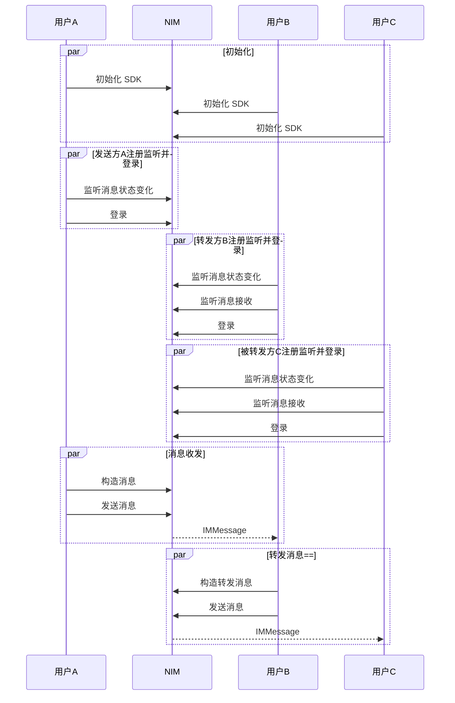

<!--keywords: 消息重发,重发消息,重发,转发,转发消息,转发合并消息,转发多条消息,合并转发, -->

网易云信 NIM Android SDK 的 [`MsgServiceObserve`](https://doc.yunxin.163.com/docs/interface/messaging/android/doxygen/Latest/zh/interfacecom_1_1netease_1_1nimlib_1_1sdk_1_1msg_1_1_msg_service_observe.html) 类和 [`MsgService`](https://doc.yunxin.163.com/docs/interface/messaging/android/doxygen/Latest/zh/interfacecom_1_1netease_1_1nimlib_1_1sdk_1_1msg_1_1_msg_service.html) 类，分别提供监听消息转发/重发的方法和转发/重发消息的方法。发送转发消息与发送不同类型（如文本、音频、视频等）的消息的方法一致，需要先构建待转发的消息再调用`sendMessage`方法将其发送至目标用户。


::: note notice
除了**通知消息**外，其他类型消息均支持转发给其他会话。
:::


## 前提条件

已完成 [SDK 初始化](https://doc.yunxin.163.com/messaging/guide/TI5ODE2MTM?platform=android)。


## API使用限制 

::: note important :::
发送消息（`sendMessage`）的方法调用存在频控，一分钟内默认最多可调用 300 次。
:::

## <span id="消息重发">重发消息</span>


消息发送失败之后，可以重发消息。消息重发和消息发送共用 [`sendMessage`](https://doc.yunxin.163.com/docs/interface/messaging/android/doxygen/Latest/zh/interfacecom_1_1netease_1_1nimlib_1_1sdk_1_1msg_1_1_msg_service.html#a0a9e85afc1a7e39b73de4a5130a07c43) 方法，如果 `resend` 参数设置为 `true`，则重发消息。

V9.10.0 新增重发拉黑状态消息相关开关，默认不开启。开启后使用优化的发送逻辑。如有需要，请联系商务经理或技术支持进行开启。优化后的重发拉黑消息逻辑如下：

- 若重发拉黑状态消息时，用户还处于黑名单中，此时会产生一条新消息，发送端会收到 7101 错误码，接收端则无法接收到该消息。
    :::note notice
    处于拉黑状态时，无论重发多少次消息，产生的新消息都是同一条，即同一个 msgid。
    :::
- 若重发拉黑状态消息时，用户已不在黑名单中，此时产生一条新消息，发送端会收到 200 状态码，接收端正常接收到该消息。

## <span id="消息转发">转发一条消息</span>

网易云信 NIM Android SDK 支持转发通知和音视频通话事件消息以外所有其他消息类型。


### **API调用时序**

::: note note 
转发不同类型消息的实现方法类似，本节仅以转发一条文本消息为例进行介绍。
:::



### **实现流程**

本节以上述 API 时序图中用户A、B、C 的消息交互场景为例，介绍转发一条消息的实现流程。

1. 用户C 调用 [`observeReceiveMessage`](https://doc.yunxin.163.com/docs/interface/messaging/android/doxygen/Latest/zh/interfacecom_1_1netease_1_1nimlib_1_1sdk_1_1msg_1_1_msg_service_observe.html#a48a20a5ba2c5cd039daeba60b2c7adf7) 方法，注册消息接收观察者，监听消息接收。

2. 用户B 接收到用户A 发送的消息，调用 [`createForwardMessage`](https://doc.yunxin.163.com/docs/interface/messaging/android/doxygen/Latest/zh/classcom_1_1netease_1_1nimlib_1_1sdk_1_1msg_1_1_message_builder.html#a06be6f1d6be57a8810e4e1fe4b4c4f52) 构建一条转发消息，调用时将`message`参数设置为接收到的消息，将`sessionId`设置为用户C 的云信 IM 账号 ID。

3. 用户B 调用 [`sendMessage`](https://doc.yunxin.163.com/docs/interface/messaging/android/doxygen/Latest/zh/interfacecom_1_1netease_1_1nimlib_1_1sdk_1_1msg_1_1_msg_service.html#a0a9e85afc1a7e39b73de4a5130a07c43)方法，发送该消息。

    示例代码如下：

    ```java
    // 该帐号为示例，请先注册
    String account = "testAccount";
    // 以单聊类型为例
    SessionTypeEnum sessionType = SessionTypeEnum.P2P;
    // forwardMessage为待转发的消息, 一般由上下文获得
    IMMessage message = MessageBuilder.createForwardMessage(forwardMessage, account, sessionType);
    // 发送给对方
    NIMClient.getService(MsgService.class).sendMessage(message, false).setCallback(new RequestCallback<Void>() {
                    @Override
                    public void onSuccess(Void param) {

                    }

                    @Override
                    public void onFailed(int code) {
                        
                    }

                    @Override
                    public void onException(Throwable exception) {

                    }
                });
    ```

4. SDK 触发`Observer`回调函数，将该消息发送至用户C。


## 合并转发多条消息

合并转发多条消息的实现流程，与转发单条消息的实现流程类似，区别在于构建方法为[`createForwardMessageListFileDetail`](https://doc.yunxin.163.com/docs/interface/messaging/android/doxygen/Latest/zh/classcom_1_1netease_1_1nimlib_1_1sdk_1_1msg_1_1_message_builder.html#a676c3503255b3a5eace865e76a8545c0)。

- 该方法的入参`messages`即为待转发的消息集合，一般由上下文获得。
- 该方法将返回待转发的多条消息字符串（String），可以通过 `MessageConvert.convertJsonToMessage` 方法将其转为 `IMMessage` 对象。


## API参考

| <div style="width:80px">API</div> | <div style="width:120px">说明 </div>|
|:---- | :-------------- |
|[`observeReceiveMessage`](https://doc.yunxin.163.com/docs/interface/messaging/android/doxygen/Latest/zh/interfacecom_1_1netease_1_1nimlib_1_1sdk_1_1msg_1_1_msg_service_observe.html#a48a20a5ba2c5cd039daeba60b2c7adf7) | 注册/注销消息接收观察者，若注册则监听消息接收|
|[`createForwardMessage`](https://doc.yunxin.163.com/docs/interface/messaging/android/doxygen/Latest/zh/classcom_1_1netease_1_1nimlib_1_1sdk_1_1msg_1_1_message_builder.html#a06be6f1d6be57a8810e4e1fe4b4c4f52)| 构建一条转发消息 |
| [`createForwardMessageListFileDetail`](https://doc.yunxin.163.com/docs/interface/messaging/android/doxygen/Latest/zh/classcom_1_1netease_1_1nimlib_1_1sdk_1_1msg_1_1_message_builder.html#a676c3503255b3a5eace865e76a8545c0)| 构建待合并转发的多条消息 |
| [`sendMessage`](https://doc.yunxin.163.com/docs/interface/messaging/android/doxygen/Latest/zh/interfacecom_1_1netease_1_1nimlib_1_1sdk_1_1msg_1_1_msg_service.html#a0a9e85afc1a7e39b73de4a5130a07c43) | 发送/重发消息 |


