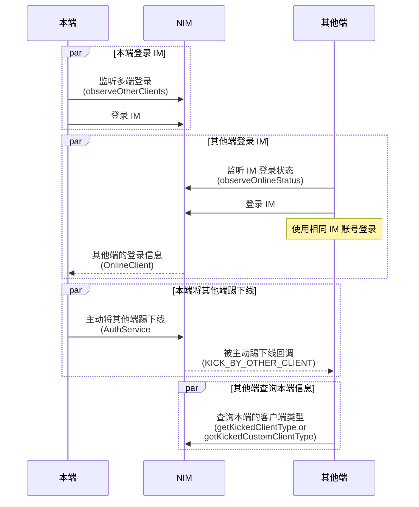

<!-- keywords: 即时通讯,IM,登录, 多端登录, 互踢, 多个设备端同时在线 -->


您可通过两种方式实现 IM 的多端登录与互踢。 


## 方式1：通过云信控制台配置

当前 NIM SDK 支持通过云信控制台配置四种不同的 IM 多端登录策略：

- 只允许一端登录，Windows、Web、Android、iOS 彼此互踢。
- 桌面端 PC 与 Web 互踢，移动端 Android 和 iOS 互踢，且桌面端与移动端可同时登录
- 各端均可以同时登录在线（最多10个设备同时在线）
- 自定义多端登录配置

通过该方式的配置，可实现自动管控 IM 的多端登录。具体如何配置，请参见[多端登录与互踢策略](https://doc.yunxin.163.com/messaging/guide/zcwNjEyNjg?platform=android)。


## 方式2：主动将其他端踢下线

### API 调用时序



### 踢方操作

#### <span id="多端登录监听">步骤1：注册多端登录监听</span>

调用[`observeOtherClients`](https://doc.yunxin.163.com/docs/interface/messaging/android/doxygen/Latest/zh/interfacecom_1_1netease_1_1nimlib_1_1sdk_1_1auth_1_1_auth_service_observer.html#a551e086b4f2c25d3cc9fdc9f50fcd46a)方法注册多端登录状态观察者，监听其他端的登录信息（`OnlineClient`）。本端未登录时，如有其他端使用相同的 IM 账号登录或注销，本端会收到通知；登录成功后，当有其他端登录或者注销时，本端也会收到通知。


| 参数 | 说明 |
| :-------- | :------ |
| `observer`   |  观察者，参数为同时登录的其他端信息。<br>如果有其他端注销，参数为剩余的在线端。<br>如果没有剩余在线端了，参数为 null。  |
| `register`   |  是否注册观察者，注册为 true， 注销为 false  |


`OnlineClient` 接口说明：

| 返回值 | 方法 | 说明 |
| :-------- | :--------| :------ |
| String | `getOs()` | 客户端的操作系统信息 |
| int | `getClientType()` | 客户端类型 |
| long | `getLoginTime()` | 登录时间 |
| String | `getClientIp()` | 客户端 IP |
| String | `getCustomTag()`  | 登录自定义属性 |

示例代码如下：

```java
Observer<List<OnlineClient>> clientsObserver = new Observer<List<OnlineClient>>() {
        @Override
        public void onEvent(List<OnlineClient> onlineClients) {
            if (onlineClients == null || onlineClients.size() == 0) {
                return;
            }
            OnlineClient client = onlineClients.get(0);
            switch (client.getClientType()) {
                case ClientType.Windows:
                // PC端
                    break；
                case ClientType.MAC:
                // MAC端
                    break;
                case ClientType.Web:
                // Web端
                    break;
                case ClientType.iOS:
                // IOS端
                    break；
                case ClientType.Android:
                // Android端
                    break;
                default:
                    break;
            }
        }
    };

NIMClient.getService(AuthServiceObserver.class).observeOtherClients(clientsObserver, true);
```

#### <span id="互踢">步骤2：将其他端踢下线</span>

本端调用[`kickOtherClient`](https://doc.yunxin.163.com/docs/interface/messaging/android/doxygen/Latest/zh/interfacecom_1_1netease_1_1nimlib_1_1sdk_1_1auth_1_1_auth_service.html#a27bbb08421c17476cf6faeee95cde8eb)方法主动将使用相同 IM 账号登录的其他设备端踢下线。


示例代码如下：

```java
NIMClient.getService(AuthService.class).kickOtherClient(client).setCallback(new RequestCallback<Void>() {
    @Override
    public void onSuccess(Void param) {
        // 踢出其他端成功
    }

    @Override
    public void onFailed(int code) {
		// 踢出其他端失败，返回失败code
    }

    @Override
    public void onException(Throwable exception) {
		// 踢出其他端错误
    }
});
```
### 被踢方操作

被踢的设备端可在登录 IM 前，调用[`observeOnlineStatus`](https://doc.yunxin.163.com/docs/interface/messaging/android/doxygen/Latest/zh/interfacecom_1_1netease_1_1nimlib_1_1sdk_1_1auth_1_1_auth_service_observer.html#adf734324bdc99f79b88aaba8899e76ab)监听自己的登录状态变化（示例代码见[监听登录状态](https://doc.yunxin.163.com/messaging/guide/TI1MTU1NDc?platform=android#步骤2监听登录状态)）。收到被踢回调（`KICK_BY_OTHER_CLIENT`）后，**建议[注销登录](https://doc.yunxin.163.com/messaging/guide/TAyOTEyMTk?platform=android)并切换到登录界面**。

此外，在被踢下线后，被踢端还可以调用如下两个方法获取将其踢下线的设备端的客户端类型。

- 调用[`AuthService#getKickedClientType`](https://doc.yunxin.163.com/docs/interface/messaging/android/doxygen/Latest/zh/interfacecom_1_1netease_1_1nimlib_1_1sdk_1_1auth_1_1_auth_service.html#a6d92e992dc83f48d16388074c71c8239)方法获取客户端类型。
- 调用[`AuthService#getKickedCustomClientType`](https://doc.yunxin.163.com/docs/interface/messaging/android/doxygen/Latest/zh/interfacecom_1_1netease_1_1nimlib_1_1sdk_1_1auth_1_1_auth_service.html#a75b65fdae5ac0d587889b664b5724b5e)方法获取发起踢掉登录的自定义客户端类型。


    ::: note notice
    如果当前状态不是被其他端主动踢下线，例如[被服务端禁用并踢出](https://doc.yunxin.163.com/messaging/guide/TUzOTA4NTY?platform=server#封禁账号) 和自动登录监听到 417，则这两个方法的返回值无效。
    :::