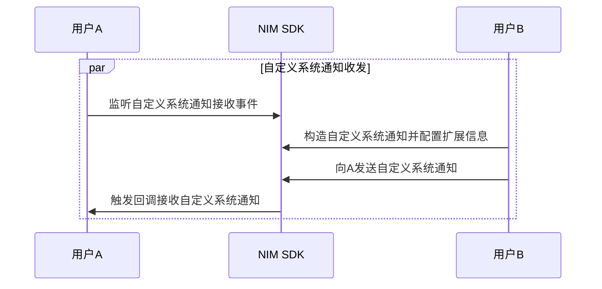

<!--keywords: 自定义系统通知,构造,发送,接收,推送-->


NIM SDK 支持自定义系统通知的收发，帮助您快速实现多样化的业务场景。

本文介绍通过网易云信 NIM SDK 实现自定义系统通知的技术原理、具体的实现流程以及典型的应用场景。

## 技术原理

NIM SDK 提供自定义系统通知，其对应的数据结构为 [`CustomNotification`](https://doc.yunxin.163.com/docs/interface/messaging/android/doxygen/Latest/zh/classcom_1_1netease_1_1nimlib_1_1sdk_1_1msg_1_1model_1_1_custom_notification.html)（支持自定义配置项）。自定义系统通知既可以由客户端发起，也可以由开发者服务器发起。SDK 仅透传自定义系统通知，不负责解析和存储。通知内容由第三方 APP 自由扩展。
:::note note
发送自定义系统通知没有重试机制，即如果 2 分钟内没有收到服务器的 ACK，SDK 直接上报发送失败。需要开发者自行实现重试。
:::
开发者可以根据其业务逻辑自定义一些事件状态的通知，来实现各种业务场景。例如实现单聊场景中的对方“正在输入”的功能。

NIM SDK 通过 `MsgServiceObserve`接口中的[`observeCustomNotification`](https://doc.yunxin.163.com/docs/interface/messaging/android/doxygen/Latest/zh/interfacecom_1_1netease_1_1nimlib_1_1sdk_1_1msg_1_1_msg_service_observe.html#a6497d741f15f26c05f553a7e3c963e2d) 方法监听自定义系统通知回调； `MsgService` 接口中的 [`sendCustomNotification`](https://doc.yunxin.163.com/docs/interface/messaging/android/doxygen/Latest/zh/interfacecom_1_1netease_1_1nimlib_1_1sdk_1_1ysf_1_1_ysf_service.html#ae5d87d7ef011ae5576af00cb5317792a) 方法发送自定义系统通知。

## <span id="实现流程">实现流程</span>



1. 通过调用[`observeCustomNotification`](https://doc.yunxin.163.com/docs/interface/messaging/android/doxygen/Latest/zh/interfacecom_1_1netease_1_1nimlib_1_1sdk_1_1msg_1_1_msg_service_observe.html#a6497d741f15f26c05f553a7e3c963e2d) 方法监听自定义系统通知接收回调。

:::note note
若自定义的系统通知需要作用于全局，不依赖某个特定的 Activity，那么需要提前在 Application 的 `onCreate` 中调用该监听接口。
:::

示例代码如下：
```
NIMClient.getService(MsgServiceObserve.class).observeCustomNotification(new Observer<CustomNotification>() {
    @Override
    public void onEvent(CustomNotification message) {
        // 处理自定义系统通知。
    }
}, register);
```

2. 根据自定义系统通知的数据结构 [`CustomNotification`](https://doc.yunxin.163.com/docs/interface/messaging/android/doxygen/Latest/zh/classcom_1_1netease_1_1nimlib_1_1sdk_1_1msg_1_1model_1_1_custom_notification.html) 构造自定义系统通知并配置扩展信息。

**`CustomNotification` 重要接口说明：**
|返回值类型|方法|说明|
|:---|:---|:---|
|void	|setSessionId(String sessionId)|设置通知对象ID|
|void	|setSessionType(SessionTypeEnum sessionType)|设置会话类型|
|void	|setContent(String content)|设置通知内容|
|void	|setSendToOnlineUserOnly(boolean sendToOnlineUserOnly)|设置该通知是否只发送给当前在线的用户/群组|
|void	|setConfig([`CustomNotificationConfig`](https://doc.yunxin.163.com/docs/interface/messaging/android/doxygen/Latest/zh/classcom_1_1netease_1_1nimlib_1_1sdk_1_1msg_1_1model_1_1_custom_notification_config.html) config) |设置自定义通知的配置选项，主要设置是否推送、是否计入未读数|
|void	|setApnsText(String apnsText)|设置推送文案|
|void	|setPushPayload(Map pushPayload)|设置第三方自定义的推送属性|


**`CustomNotificationConfig` 配置项说明：**
|属性|说明|
|:---|:---|
|enablePush | 是否进行推送，业务方可以根据此配置进行推送。<br/>默认为 true|
|enablePushNick | 是否需要推送昵称，业务方进行推送时决定是否显示推送昵称。<br/>默认为 false|
|enableUnreadCount |是否要计入未读数，<br>如果为true，那么对方收到通知后，可以通过读取此配置项决定自己业务的未读计数变更。<br/>默认为 true|

**示例代码：**

```
// 构造自定义通知，指定接收者
CustomNotification notification = new CustomNotification();
notification.setSessionId(receiverId);
notification.setSessionType(sessionType);

// 构建通知的具体内容。为了可扩展性，这里采用 json 格式，以 "id" 作为类型区分。
JSONObject json = new JSONObject();
json.put("id", "2");
JSONObject data = new JSONObject();
data.put("body", "the_content_for_display");
data.put("url", "url_of_the_game_or_anything_else");
json.put("data", data);
notification.setContent(json.toString());

// 若接收者不在线，则当其再次上线时，将收到该自定义系统通知。若设置为 true，则再次上线时，将收不到该通知。
notification.setSendToOnlineUserOnly(false);

// 配置 CustomNotificationConfig
CustomNotificationConfig config = new CustomNotificationConfig();
// 需要推送
config.enablePush = true; 
config.enableUnreadCount = true;
notification.setConfig(config);

// 设置的推送文案
notification.setApnsText("the_content_for_apns");

// 自定义推送属性
Map<String,Object> pushPayload = new HashMap<>();
pushPayload.put("key1", "payload 1");
pushPayload.put("key2", 2015);
notification.setPushPayload(pushPayload);
```

3. 通过调用[`sendCustomNotification`](https://doc.yunxin.163.com/docs/interface/messaging/android/doxygen/Latest/zh/interfacecom_1_1netease_1_1nimlib_1_1sdk_1_1ysf_1_1_ysf_service.html#ae5d87d7ef011ae5576af00cb5317792a) 方法发送自定义系统通知。示例代码如下：

```
NIMClient.getService(MsgService.class).sendCustomNotification(notification);
```
::: note notice
一秒内默认最多调用该接口 100 次。如需上调上限，请在官网首页通过微信、在线消息或电话等方式咨询商务人员。
:::


4. 触发回调，收到自定义系统通知。

<!--

## 典型应用场景

这里以实现单聊场景中的对方“正在输入”的功能为例，示例代码如下：

```

```
-->

## API 参考

| <div style="width:300px">API</div> | <div style="width:300px">说明 </div>|
|:---- | :-------------- |
| [`observeCustomNotification`](https://doc.yunxin.163.com/docs/interface/messaging/android/doxygen/Latest/zh/interfacecom_1_1netease_1_1nimlib_1_1sdk_1_1msg_1_1_msg_service_observe.html#a6497d741f15f26c05f553a7e3c963e2d) |监听自定义系统通知接收事件|
|[`sendCustomNotification`](https://doc.yunxin.163.com/docs/interface/messaging/android/doxygen/Latest/zh/interfacecom_1_1netease_1_1nimlib_1_1sdk_1_1ysf_1_1_ysf_service.html#ae5d87d7ef011ae5576af00cb5317792a) | 发送自定义系统通知 |
