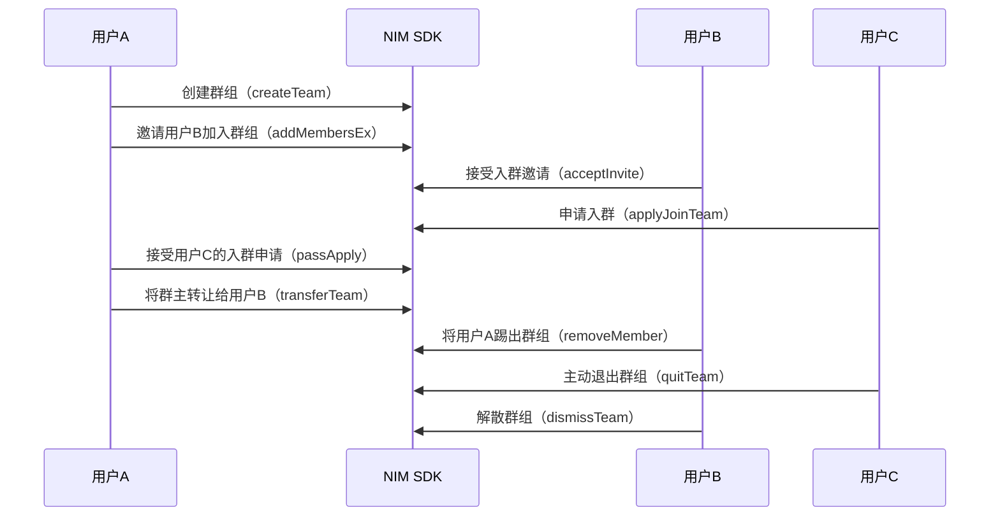

<!-- keywords: IM群组,高级群,群组管理,创建,解散,转让,更新,退出 -->


网易云信 NIM SDK 提供了高级群形式的群组功能，支持用户创建、加入、退出、转让、修改、查询、解散群组，拥有完善的管理功能。


## 技术原理

网易云信 NIM SDK 的 [`TeamService`](https://doc.yunxin.163.com/docs/interface/messaging/android/doxygen/Latest/zh/interfacecom_1_1netease_1_1nimlib_1_1sdk_1_1team_1_1_team_service.html) 提供群组操作相关接口， [`TeamServiceObserver`](https://doc.yunxin.163.com/docs/interface/messaging/android/doxygen/Latest/zh/interfacecom_1_1netease_1_1nimlib_1_1sdk_1_1team_1_1_team_service_observer.html) 提供群组相关观察者通知接口，帮助您快速实现和使用群组的管理功能。 

群组相关 API 都挂载在 `team` 模块中，使用 [`com.netease.nimlib.sdk.team`](https://doc.yunxin.163.com/messaging/references/android/doxygen/Latest/zh/interfacecom_1_1netease_1_1nimlib_1_1sdk_1_1team_1_1model_1_1_team.html) 程序包。


## 群组相关事件监听

在进行群组操作前，您可以提前注册监听群相关事件。监听后，在进行群组管理相关操作时，会收到对应的通知。

可以根据用户需求，调用以下方法进行监听。

- [`observeMemberRemove`](https://doc.yunxin.163.com/docs/interface/messaging/android/doxygen/Latest/zh/interfacecom_1_1netease_1_1nimlib_1_1sdk_1_1team_1_1_team_service_observer.html#a5d074dac9e0e9f957b41b776c8039483)：移除群成员的观察者通知
- [`observeMemberUpdate`](https://doc.yunxin.163.com/docs/interface/messaging/android/doxygen/Latest/zh/interfacecom_1_1netease_1_1nimlib_1_1sdk_1_1team_1_1_team_service_observer.html#a71e789ca2499ee89d70f6e5224abfd26)：群成员信息变化观察者通知
- [`observeTeamRemove`](https://doc.yunxin.163.com/docs/interface/messaging/android/doxygen/Latest/zh/interfacecom_1_1netease_1_1nimlib_1_1sdk_1_1team_1_1_team_service_observer.html#a736b1f480745dbc00d60c9576c2f2c1a)：移除群的观察者通知
- [`observeTeamUpdate`](https://doc.yunxin.163.com/docs/interface/messaging/android/doxygen/Latest/zh/interfacecom_1_1netease_1_1nimlib_1_1sdk_1_1team_1_1_team_service_observer.html#a5d074dac9e0e9f957b41b776c8039483)：群信息变动观察者通知

示例代码如下：
```
// 移除群成员的观察者通知。
private Observer<TeamMember> memberRemoveObserver = new Observer<TeamMember>() {
	@Override
	public void onEvent(TeamMember member) {
	}
};
// 注册/注销观察者
NIMClient.getService(TeamServiceObserver.class).observeMemberRemove(memberRemoveObserver, register);

// 群成员信息变化观察者通知。群组添加新成员，成员信息变化会收到该通知。
// 返回的参数为有更新的群成员信息列表。
Observer<List<TeamMember>> memberUpdateObserver = new Observer<List<TeamMember>>() {
	@Override
	public void onEvent(List<TeamMember> members) {
	}
};
// 注册/注销观察者
NIMClient.getService(TeamServiceObserver.class).observeMemberUpdate(memberUpdateObserver, register);

// 创建群组被移除的观察者。在退群，被踢，群被解散时会收到该通知。
Observer<Team> teamRemoveObserver = new Observer<Team>() {
    @Override
    public void onEvent(Team team) {
    // 由于界面上可能仍需要显示群组名等信息，因此参数中会返回 Team 对象。
    // 该对象的 isMyTeam 接口返回为 false。
    }
};
// 注册/注销观察者
NIMClient.getService(TeamServiceObserver.class).observeTeamRemove(teamRemoveObserver, register);

// 创建群组信息变动观察者
Observer<List<Team>> teamUpdateObserver = new Observer<List<Team>>() {
    @Override
    public void onEvent(List<Team> teams) {
    }
};
// 注册/注销观察者
NIMClient.getService(TeamServiceObserver.class).observeTeamUpdate(teamUpdateObserver, register);
```

:::note note
由于获取群组信息和群成员信息需要跨进程异步调用，开发者最好能在第三方 APP 中做好群组和群成员信息缓存，查询群组和群成员信息时都从本地缓存中访问。在群组或者群成员信息有变化时，SDK 会告诉注册的观察者，此时，第三方 APP 可更新缓存，并刷新界面。
:::

## 实现流程

本章节通过群主、管理员、普通成员之间的交互为例，介绍群组管理的实现流程。




## 创建群组

通过调用 [`createTeam`](https://doc.yunxin.163.com/docs/interface/messaging/android/doxygen/Latest/zh/interfacecom_1_1netease_1_1nimlib_1_1sdk_1_1team_1_1_team_service.html#a4da1200b16f72742f52bcb24650a51c5) 方法创建群组，创建者即为该群群主。


**参数说明：**

| 参数  | 说明     |
|  ----   | --------- |
|fields | 群组预设信息，key 为数据字段，value 为对应的值，该值类型必须和 field 中定义的 fieldType 一致 |
|type| 群组类型<note type=important>请选择 `Advanced` 创建高级群，高级群拥有完善的成员权限体系及管理功能。为避免产生问题，不建议使用其他取值。</note> |
|postscript| 邀请入群的附言。如果是创建临时群，该参数无效|
|members | 邀请加入的成员帐号列表|
|antiSpamConfig|内容审核相关配置参数|

:::note note
创建群、修改群信息时的域定义，具体请参见[`TeamFieldEnum`](https://doc.yunxin.163.com/docs/interface/messaging/android/doxygen/Latest/zh/enumcom_1_1netease_1_1nimlib_1_1sdk_1_1team_1_1constant_1_1_team_field_enum.html)枚举常量。
:::
**示例代码：**

```
// 群组类型
TeamTypeEnum type = TeamTypeEnum.Advanced;
// 创建时可以预设群组的一些相关属性。
// fields 中，key 为数据字段，value 对对应的值，该值类型必须和 field 中定义的 fieldType 一致
HashMap<TeamFieldEnum, Serializable> fields = new HashMap<TeamFieldEnum, Serializable>();
fields.put(TeamFieldEnum.Name, teamName);
fields.put(TeamFieldEnum.Introduce, teamIntroduce);
fields.put(TeamFieldEnum.VerifyType, verifyType);
NIMClient.getService(TeamService.class).createTeam(fields, type, "", accounts)
     .setCallback(new RequestCallback<Team> { ... });
```


## 加入群组

加入群组可以通过以下两种方式：
- 用户接受邀请入群。
- 用户主动申请入群。

### 邀请入群

::: note note
邀请入群的权限可以通过 `InviteMode` 来定义，设为 `Manager`，那么仅限群主和管理员可以邀请人进群；设为 `All` ，那么群组内的所有人都可以邀请人进群。
:::

通过调用 [`addMembersEx`](https://doc.yunxin.163.com/docs/interface/messaging/android/doxygen/Latest/zh/interfacecom_1_1netease_1_1nimlib_1_1sdk_1_1team_1_1_team_service.html#a840e3d757472ad4f94587e23f3234271) 方法邀请其他用户进入群组。
  - 若群组的被邀请模式 `BeInviteMode` 为 `NoAuth`，那么无需验证，其他用户可直接加入群组。
  - 若群组的被邀请模式 `BeInviteMode` 为 `NeedAuth`，那么需要被邀请用户同意才能加入群组。
  
如果在被邀请成员中存在成员拥有的群组数量已达上限，则会返回失败成员的账号列表。

**参数说明：**

| 参数   | 说明     |
|  ----    | --------- |
|teamId  | 群ID |
|accounts| 邀请入群的用户账号列表|
|customInfo|自定义扩展字段，不需要的话设置为空 ，最长512字符|
|msg|邀请附言，不需要的话设置为空|


  
- 发起邀请后，被邀请用户会收到 [`SystemMessage`](https://doc.yunxin.163.com/docs/interface/messaging/android/doxygen/Latest/zh/classcom_1_1netease_1_1nimlib_1_1sdk_1_1msg_1_1model_1_1_system_message.html) 系统通知，其通知类型为`TeamInvite`。
- 被邀请用户可以调用 [`acceptInvite`](https://doc.yunxin.163.com/docs/interface/messaging/android/doxygen/Latest/zh/interfacecom_1_1netease_1_1nimlib_1_1sdk_1_1superteam_1_1_super_team_service.html#a89150957786f5d329ff5fe6fe5b479b1) 方法接受入群邀请，接受即入群。所有群成员会收到群组通知消息（消息类型为 `MsgTypeEnum.notification`），触发事件为`AcceptInvite`。
- 也可以调用 [`declineInvite`](https://doc.yunxin.163.com/docs/interface/messaging/android/doxygen/Latest/zh/interfacecom_1_1netease_1_1nimlib_1_1sdk_1_1superteam_1_1_super_team_service.html#a0681485bf932a3a5130a15d179b8050e) 方法拒绝入群邀请。拒绝后，邀请者会收到 [`SystemMessage`](https://doc.yunxin.163.com/docs/interface/messaging/android/doxygen/Latest/zh/classcom_1_1netease_1_1nimlib_1_1sdk_1_1msg_1_1model_1_1_system_message.html) 系统通知，其通知类型为 `DeclineTeamInvite`。


**示例代码：**

```
NIMClient.getService(TeamService.class).addMembersEx(teamId, accounts, "邀请您加入群组")
    .setCallback(new RequestCallback<Void>() {
            @Override
            public void onSuccess(Void param) {
				// 返回onSuccess，表示拉人不需要对方同意，且对方已经入群成功了
            }

            @Override
            public void onFailed(int code) {
	            // 返回onFailed，并且返回码为810，表示发出邀请成功了，但是还需要对方同意
            }

            @Override
            public void onException(Throwable exception) {
				...
            }
        });


//接受邀请
NIMClient.getService(TeamService.class).acceptInvite(teamId, inviter).setCallback(...);

//拒绝邀请
NIMClient.getService(TeamService.class).declineInvite(teamId, inviter, "").setCallback(callback);
```  

### 申请入群

通过调用 [`applyJoinTeam`](https://doc.yunxin.163.com/docs/interface/messaging/android/doxygen/Latest/zh/interfacecom_1_1netease_1_1nimlib_1_1sdk_1_1team_1_1_team_service.html#ad93ff1aa0a081de969de06f0058d105a) 方法申请加入群组。
  - 若群组的加入模式 `VerifyType` 为 `Free`，那么无需验证，其他用户可直接加入群组。
  - 若群组的加入模式 `VerifyType` 为 `Apply`，那么需要群主或者群管理员同意才能加入群组。
  - 若群组的加入模式 `VerifyType` 为 `Private`，那么该群组不接受入群申请，仅能通过邀请方式入群。

:::note note
直接加入群或者进入等待验证状态时，返回群组信息。
:::

**参数说明：**

| 参数 | 说明     |
|  ----  | --------- |
|tid | 群ID |
|postscript|申请附言|


- 当用户发起入群申请后，该群群主和管理员会收到 [`SystemMessage`](https://doc.yunxin.163.com/docs/interface/messaging/android/doxygen/Latest/zh/classcom_1_1netease_1_1nimlib_1_1sdk_1_1msg_1_1model_1_1_system_message.html) 系统通知，其通知类型为`ApplyJoinTeam`。
- 群主和群管理员可以调用 [`passApply`](https://doc.yunxin.163.com/docs/interface/messaging/android/doxygen/Latest/zh/interfacecom_1_1netease_1_1nimlib_1_1sdk_1_1superteam_1_1_super_team_service.html#a69d09f59f09c40e28a257a2d156f0cc8) 方法接受入群申请，接受即入群。所有群成员会收到群组通知消息（消息类型为 `MsgTypeEnum.notification`），触发事件为`PassTeamApply`。
- 群主和群管理员也可以调用 [`rejectApply`](https://doc.yunxin.163.com/docs/interface/messaging/android/doxygen/Latest/zh/interfacecom_1_1netease_1_1nimlib_1_1sdk_1_1team_1_1_team_service.html#a651730bf72c5e594743aae3c81866a12) 方法拒绝入群申请。拒绝后，申请者会收到 [`SystemMessage`](https://doc.yunxin.163.com/docs/interface/messaging/android/doxygen/Latest/zh/classcom_1_1netease_1_1nimlib_1_1sdk_1_1msg_1_1model_1_1_system_message.html) 系统通知，其通知类型为 `RejectTeamApply`。

**示例代码：**

```
NIMClient.getService(TeamService.class).applyJoinTeam(team.getId(), null).setCallback(new RequestCallback<Team>() {
    @Override
    public void onSuccess(Team team) {
        // 申请入群无需验证，直接申请成功
    }
    @Override
    public void onFailed(int code) {
       
        //仅仅是申请成功,code 808
        if (code == ResponseCode.RES_TEAM_APPLY_SUCCESS) {
            applyJoinButton.setEnabled(false);
            ToastHelper.showToast(AdvancedTeamJoinActivity.this, R.string.team_apply_to_join_send_success);
            }          
        // 已经在群里，code 809
        else if (code == ResponseCode.RES_TEAM_ALREADY_IN) {
            applyJoinButton.setEnabled(false);
            ToastHelper.showToast(AdvancedTeamJoinActivity.this, R.string.has_exist_in_team);       
        // 群人数已达上限
        } else if (code == ResponseCode.RES_TEAM_LIMIT) {
            applyJoinButton.setEnabled(false);
            ToastHelper.showToast(AdvancedTeamJoinActivity.this, R.string.team_num_limit);
        } else {
            ToastHelper.showToast(AdvancedTeamJoinActivity.this, "failed, error code =" + code);
        }
    }
    @Override
    public void onException(Throwable exception) {
		// error
    }
});

//同意入群申请
NIMClient.getService(TeamService.class).passApply(teamId, account).setCallback(...);

//拒绝入群申请
NIMClient.getService(TeamService.class).rejectApply(teamId, account, "您已被拒绝").setCallback(...);
```

## 转让群组

::: note note
只有群主才有转让群组的权限。
:::

通过调用 [`transferTeam`](https://doc.yunxin.163.com/docs/interface/messaging/android/doxygen/Latest/zh/interfacecom_1_1netease_1_1nimlib_1_1sdk_1_1team_1_1_team_service.html#a05399eee95c9782f0cca8592bb149a6a) 方法将群组转让给其他成员。

- 转让群后, 群主身份转移，所有群成员会收到群组通知消息（消息类型为 `MsgTypeEnum.notification`），触发事件为`TransferOwner`。
- 如果转让群的同时离开群, 那么相当于同时调用[`quitTeam`](https://doc.yunxin.163.com/docs/interface/messaging/android/doxygen/Latest/zh/interfacecom_1_1netease_1_1nimlib_1_1sdk_1_1team_1_1_team_service.html#a5d8f3c6d980e1f932d9e0e40737261a1)主动退群。所有群成员会收到群组通知消息（消息类型为 `MsgTypeEnum.notification`），触发事件为`LeaveTeam`。


**参数说明：**

| 参数  | 说明     |
|  ----   | --------- |
|tid | 群ID |
|account|转让后的群主账号|
|quit|转让群的同时是否退出该群<br/>true：退出<br/>false：不退出，身份变为普通群成员|

**示例代码：**

```
// false表示群主转让后不退群
NIMClient.getService(TeamService.class).transferTeam(teamId, account, false)
.setCallback(new RequestCallback<List<TeamMember>>() {
    @Override
    public void onSuccess(List<TeamMember> members) {
        // 群转移成功
    }

    @Override
    public void onFailed(int code) {
        // 群转移失败
    }

    @Override
    public void onException(Throwable exception) {
		// 错误
    }
});
```

## 退出群组

退出群组可以通过以下两种方式：
- 群主或群组管理员将用户踢出群组。
- 用户主动退群。

### 踢人出群
::: note note
- 只有群主和管理员才能将成员踢出群组。
- 管理员不能踢群主和其他管理员。
:::

通过调用 [`removeMember`](https://doc.yunxin.163.com/docs/interface/messaging/android/doxygen/Latest/zh/interfacecom_1_1netease_1_1nimlib_1_1sdk_1_1superteam_1_1_super_team_service.html#a598939d372a5466d75784093b58ac8f1) 方法将成员踢出群组。也可以调用[`removeMembers`](https://doc.yunxin.163.com/docs/interface/messaging/android/doxygen/Latest/zh/interfacecom_1_1netease_1_1nimlib_1_1sdk_1_1superteam_1_1_super_team_service.html#a54a3522a7adb348bf759911e584abb9d) 方法批量移除群成员。

移除成员后，所有群成员会收到群组通知消息（消息类型为 `MsgTypeEnum.notification`），触发事件为`KickMember`。


**参数说明：**

| 参数 | 说明     |
|  ----  | --------- |
|teamId  | 群ID |
|members|被踢出的群成员账号列表|


**示例代码：**

```
NIMClient.getService(TeamService.class).removeMembers(teamId, accountList).setCallback(new RequestCallback<Void>() {
    @Override
    public void onSuccess(Void param) {
       // 成功
    }
    @Override
    public void onFailed(int code) {
        // 失败
    }
    @Override
    public void onException(Throwable exception) {
        // 错误
    }
});
```

### 主动退群


通过调用 [`quitTeam`](https://doc.yunxin.163.com/docs/interface/messaging/android/doxygen/Latest/zh/interfacecom_1_1netease_1_1nimlib_1_1sdk_1_1team_1_1_team_service.html#a5d8f3c6d980e1f932d9e0e40737261a1) 方法主动退出群组。

除群主（需先转让群主）外，其他用户均可以直接主动退群。主动退群后, 所有群成员会收到群组通知消息（消息类型为 `MsgTypeEnum.notification`），触发事件为`LeaveTeam`。


**示例代码：**

```
NIMClient.getService(TeamService.class).quitTeam(teamId).setCallback(new RequestCallback<Void>() {
    @Override
    public void onSuccess(Void param) {
       // 退群成功
    }
    @Override
    public void onFailed(int code) {
        // 退群失败
    }
    @Override
    public void onException(Throwable exception) {
        // 错误
    }
});
```


## 解散群组

::: note note
只有群主才能解散群组。
:::

通过调用 [`dismissTeam`](https://doc.yunxin.163.com/docs/interface/messaging/android/doxygen/Latest/zh/enumcom_1_1netease_1_1nimlib_1_1sdk_1_1msg_1_1constant_1_1_notification_type.html#a7cb6b6081d30fd651cc3e618e129c73b) 方法解散群组。

解散群后, 所有群成员会收到群组通知消息（消息类型为 `MsgTypeEnum.notification`），触发事件为`DismissTeam`。


**示例代码：**

```
NIMClient.getService(TeamService.class).dismissTeam(teamId).setCallback(new RequestCallback<Void>() {
    @Override
    public void onSuccess(Void param) {
        // 解散群成功
    }
    @Override
    public void onFailed(int code) {
        // 解散群失败
    }
    @Override
    public void onException(Throwable exception) {
        // 错误
    }
});
```


## 修改群组信息

::: note note
修改群信息需要权限。若该群组的群信息修改权限（[`TeamUpdateModeEnum`](https://doc.yunxin.163.com/docs/interface/messaging/android/doxygen/Latest/zh/enumcom_1_1netease_1_1nimlib_1_1sdk_1_1team_1_1constant_1_1_team_update_mode_enum.html)）为 `Manager`，那么只有群主和管理员才能修改群组信息；若为 `All`，则群组内的所有人都可以修改群组信息。
:::

可更新的群组属性请参见[`TeamFieldEnum`](https://doc.yunxin.163.com/docs/interface/messaging/android/doxygen/Latest/zh/enumcom_1_1netease_1_1nimlib_1_1sdk_1_1team_1_1constant_1_1_team_field_enum.html)。

| 参数  |类型| 说明     |
|---|----|---|
|AllMute|[`TeamAllMuteModeEnum`](https://doc.yunxin.163.com/docs/interface/messaging/android/doxygen/Latest/zh/enumcom_1_1netease_1_1nimlib_1_1sdk_1_1team_1_1constant_1_1_team_all_mute_mode_enum.html)	|群禁言（群全员禁言），该字段只读，使用“群资料更新”接口更新该字段无效
|Announcement|String|	群公告	
|BeInviteMode|[`TeamBeInviteModeEnum`](https://doc.yunxin.163.com/docs/interface/messaging/android/doxygen/Latest/zh/enumcom_1_1netease_1_1nimlib_1_1sdk_1_1team_1_1constant_1_1_team_be_invite_mode_enum.html)|	群被邀请模式：被邀请人的同意方式	
|Ext_Server_Only|String|	群扩展字段（仅服务端能够修改）	
|Extension|String|	群扩展字段（客户端自定义信息）	
|ICON|String|	群头像，群组头像若要上传到云信服务器上，则需要使用[头像资源处理](https://doc.yunxin.163.com/messaging/guide/zg1NDIzNzI?platform=android#%E5%A4%B4%E5%83%8F%E8%B5%84%E6%BA%90%E5%A4%84%E7%90%86)
|Introduce|	String|群简介	
|InviteMode|[`TeamInviteModeEnum`](https://doc.yunxin.163.com/docs/interface/messaging/android/doxygen/Latest/zh/enumcom_1_1netease_1_1nimlib_1_1sdk_1_1team_1_1constant_1_1_team_invite_mode_enum.html)|	群邀请模式：谁可以邀请他人入群	
|Name|String|	群名	
|TeamExtensionUpdateMode|[`TeamExtensionUpdateModeEnum`](https://doc.yunxin.163.com/docs/interface/messaging/android/doxygen/Latest/zh/enumcom_1_1netease_1_1nimlib_1_1sdk_1_1team_1_1constant_1_1_team_extension_update_mode_enum.html)	|群资料扩展字段修改模式：谁可以修改群自定义属性(扩展字段)	
|TeamUpdateMode|[`TeamUpdateModeEnum`](https://doc.yunxin.163.com/docs/interface/messaging/android/doxygen/Latest/zh/enumcom_1_1netease_1_1nimlib_1_1sdk_1_1team_1_1constant_1_1_team_update_mode_enum.html)	|群资料修改模式：谁可以修改群资料	
|VerifyType| [`VerifyTypeEnum`](https://doc.yunxin.163.com/docs/interface/messaging/android/doxygen/Latest/zh/enumcom_1_1netease_1_1nimlib_1_1sdk_1_1team_1_1constant_1_1_verify_type_enum.html)|申请加入群组的验证模式	
|MaxMemberCount|int|	指定创建群组的最大群成员数量	
|undefined|String|	未定义的域

### 修改群组的单个属性信息


通过调用 [`updateTeam`](https://doc.yunxin.163.com/docs/interface/messaging/android/doxygen/Latest/zh/interfacecom_1_1netease_1_1nimlib_1_1sdk_1_1team_1_1_team_service.html#aba75cbbb49d0bc3f89595a7d90112162) 方法修改群组的单个属性信息。

当用户更新群组信息后，所有群成员会收到群组通知消息（消息类型为 `MsgTypeEnum.notification`），触发事件为`UpdateTeam`。


**参数说明：**
| 参数    | 说明     |
|  ----    | --------- |
|teamId|群ID|
|field|待更新的域|
|value|待更新的域的新值 该值类型必须和field中定义的fieldType一致|

**示例代码：**

```
//以修改群公告为例
String announcement = "这是更新的群公告";
NIMClient.getService(TeamService.class).updateTeam(teamId, TeamFieldEnum.Announcement, announcement).setCallback(new RequestCallback<Void>() {
    @Override
    public void onSuccess(Void param) {
        // 成功
    }

    @Override
    public void onFailed(int code) {
        // 失败
    }

    @Override
    public void onException(Throwable exception) {
        // 错误
    }
});
```

### 修改群组的多个属性信息


通过调用 [`updateTeamFields`](https://doc.yunxin.163.com/docs/interface/messaging/android/doxygen/Latest/zh/interfacecom_1_1netease_1_1nimlib_1_1sdk_1_1team_1_1_team_service.html#aec36192f2ce0a6ac5b783987d8bb0574) 方法批量修改群组的多个属性信息。

当用户更新群组信息后，所有群成员会收到群组通知消息（消息类型为 `MsgTypeEnum.notification`），触发事件为`UpdateTeam`。


**参数说明：**
| 参数    | 说明     |
|  ----    | --------- |
|teamId|群ID|
|fields|待更新的所有字段的新的资料，其中值类型必须和field中定义的fieldType一致|
|antiSpamConfig|内容审核相关配置参数|

**示例代码：**

```
// 以修改群组名字，介绍，公告为例
Map<TeamFieldEnum, Serializable> fieldsMap = new HashMap<>();
fieldsMap.put(TeamFieldEnum.Name, "新的名称");
fieldsMap.put(TeamFieldEnum.Introduce, "新的介绍");
fieldsMap.put(TeamFieldEnum.Announcement, "新的公告");

NIMClient.getService(TeamService.class).updateTeamFields(teamId,
        fieldsMap).setCallback(new RequestCallback<Void>() {
    @Override
    public void onSuccess(Void aVoid) {
        // 成功
    }

    @Override
    public void onFailed(int i) {
        // 失败
    }

    @Override
    public void onException(Throwable throwable) {
		// 错误
    }
});
```


## 查询群组信息

### 本地查询自己加入的所有群组

通过异步调用[`queryTeamList`](https://doc.yunxin.163.com/docs/interface/messaging/android/doxygen/Latest/zh/interfacecom_1_1netease_1_1nimlib_1_1sdk_1_1team_1_1_team_service.html#af00e041e10ac64e8d5342234deeff7bb)方法或者同步调用[`queryTeamListBlock`](https://doc.yunxin.163.com/docs/interface/messaging/android/doxygen/Latest/zh/interfacecom_1_1netease_1_1nimlib_1_1sdk_1_1team_1_1_team_service.html#a501483409921f0006c50bf7933f5466e) 从本地查询自己加入的所有群组。示例代码如下：
```
//异步调用
NIMClient.getService(TeamService.class).queryTeamList().setCallback(new RequestCallback<List<Team>>() {
    @Override
    public void onSuccess(List<Team> teams) {
        // 获取成功，teams为加入的所有群组
    }

    @Override
    public void onFailed(int i) {
	     // 获取失败
    }

    @Override
    public void onException(Throwable throwable) {
        // 获取异常
    }
});

//同步调用
List<Team> teams = NIMClient.getService(TeamService.class).queryTeamListBlock();
```

### 查询自己加入的群组数量
通过调用[`queryTeamCountBlock`](https://doc.yunxin.163.com/docs/interface/messaging/android/doxygen/Latest/zh/interfacecom_1_1netease_1_1nimlib_1_1sdk_1_1team_1_1_team_service.html#a7c27e1d486585802129f4f699c3f52de)方法查询自己加入的群组数量。示例代码如下：
```
int queryTeamCountBlock();
```

### 查询指定群组

通过异步调用[`queryTeam`](https://doc.yunxin.163.com/docs/interface/messaging/android/doxygen/Latest/zh/interfacecom_1_1netease_1_1nimlib_1_1sdk_1_1team_1_1_team_service.html#a45a7e7002dcfd3b256261cc38195c33a)查询指定群组信息。

:::note notice

- 异步调用 `queryTeam`时，如果本地没有该群组信息，则自动去服务器查询。
- 同步调用 `queryTeamBlock` 时，仅查询本地，不会去服务器请求。如果自己不在该群组中，接口返回的可能是过期信息，如需最新的，请调用 [`searchTeam`](https://doc.yunxin.163.com/docs/interface/messaging/android/doxygen/Latest/zh/interfacecom_1_1netease_1_1nimlib_1_1sdk_1_1team_1_1_team_service.html#a80ca4e224a3841fac9b4e169e3aa22cd) 方法去服务器查询。
:::

示例代码如下：
```
//异步调用
NIMClient.getService(TeamService.class).queryTeam(teamId).setCallback(new RequestCallbackWrapper<Team>() {
    @Override
    public void onResult(int code, Team t, Throwable exception) {
        if (code == ResponseCode.RES_SUCCESS) {
            // 成功
        } else {
            // 失败，错误码见code
        }

        if (exception != null) {
            // error
        }
    }
});

//同步调用
Team team = NIMClient.getService(TeamService.class).queryTeamBlock(teamId);
```
**群组信息 SDK 本地存储说明：**

- 解散群、退出群或者被移出群时，本地数据库会继续保留该群组信息，只是设置了无效标记，此时依然可以通过 `queryTeam` 接口查询该群组信息，只是 `isMyTeam` 返回 false 。 如果用户手动清空全部本地数据，下次登录同步时，服务器将不同步无效的群组，用户将无法取得已退出群的群组信息。

- 群解散后，通过 `searchTeam` 接口从服务器查询结果将返回 `null` 。


### 批量查询指定群组

通过异步调用[`queryTeamListById`](https://doc.yunxin.163.com/docs/interface/messaging/android/doxygen/Latest/zh/interfacecom_1_1netease_1_1nimlib_1_1sdk_1_1team_1_1_team_service.html#a1f044b0ddb9efc4003998ccb5a90b9af)方法或者同步调用[`queryTeamListByIdBlock`](https://doc.yunxin.163.com/docs/interface/messaging/android/doxygen/Latest/zh/interfacecom_1_1netease_1_1nimlib_1_1sdk_1_1team_1_1_team_service.html#a1f044b0ddb9efc4003998ccb5a90b9af)批量查询指定群组信息。

示例代码如下：
```
List<String> tids = getTids();
//异步查询群列表
NIMClient.getService(TeamService.class).queryTeamListById(tids).setCallback(new RequestCallback<List<Team>>() {
    @Override
    public void onSuccess(List<Team> result) {
        //查询成功
    }

    @Override
    public void onFailed(int code) {
        //查询失败
    }

    @Override
    public void onException(Throwable exception) {
        //查询异常
    }
});

//同步查询群列表
List<Team> teams = NIMClient.getService(TeamService.class).queryTeamListByIdBlock(tids);

```


### 从云端查询指定群组

- 通过调用[`searchTeam`](https://doc.yunxin.163.com/docs/interface/messaging/android/doxygen/Latest/zh/interfacecom_1_1netease_1_1nimlib_1_1sdk_1_1team_1_1_team_service.html#a80ca4e224a3841fac9b4e169e3aa22cd)方法从云端获取指定的单个群组。示例代码如下：
```
// teamId为想要查询的群组ID
NIMClient.getService(TeamService.class).searchTeam(teamId).setCallback(new RequestCallback<Team>() {
    @Override
    public void onSuccess(Team team) {
        // 查询成功，获得群组信息
    }
    @Override
    public void onFailed(int code) {
       // 失败
    }
    @Override
    public void onException(Throwable exception) {
       // 错误
    }
});
```

- 通过调用[`searchTeam`](https://doc.yunxin.163.com/docs/interface/messaging/android/doxygen/Latest/zh/interfacecom_1_1netease_1_1nimlib_1_1sdk_1_1team_1_1_team_service.html#a9781ceb2cc6d02918f65edc17ee20d92)方法从云端批量获取指定的多个群组。示例代码如下：
```
NIMClient.getService(TeamService.class).searchTeam(idList).setCallback(new RequestCallback<TeamInfoResult>() {
    @Override
    public void onSuccess(TeamInfoResult teaminforesult) {
        onSearchTeamsInfoSuccess(teaminforesult);
    }
    @Override
    public void onFailed(int code) {
    }
    @Override
    public void onException(Throwable exception) {

    }
});
```


## 群组检索

- 通过调用[`searchTeamIdByName`](https://doc.yunxin.163.com/docs/interface/messaging/android/doxygen/Latest/zh/interfacecom_1_1netease_1_1nimlib_1_1sdk_1_1team_1_1_team_service.html#a41abf504345c21c7327191e7cd69fe80)方法根据群名称搜索群组 ID。示例代码如下：
```
NIMClient.getService(TeamService.class).searchTeamIdByName("安卓").setCallback(new RequestCallbackWrapper<List<String>>() {
    @Override
    public void onResult(int code, List<String> result, Throwable exception) {
        if (code == ResponseCode.RES_SUCCESS) {
            // 成功
        } else {
            // 失败，错误码见code
        }

        if (exception != null) {
            // error
        }
    }
});
```

- 通过调用[`searchTeamsByKeyword`](https://doc.yunxin.163.com/docs/interface/messaging/android/doxygen/Latest/zh/interfacecom_1_1netease_1_1nimlib_1_1sdk_1_1team_1_1_team_service.html#a33963d176a8b4852f9a442fa753dfb69)方法搜索与关键字匹配的所有群。

示例代码如下：
```
NIMClient.getService(TeamService.class).searchTeamsByKeyword("群名称搜索关键字").setCallback(new RequestCallback<List<Team>>() {
    @Override
    public void onSuccess(List<Team> result) {
        //查询成功
    }

    @Override
    public void onFailed(int code) {
        //查询失败
    }

    @Override
    public void onException(Throwable exception) {
        //查询异常
    }
});
```


## API 参考

| <div style="width:300px">API</div> | <div style="width:300px">说明 </div>|
|:---- | :-------------- |
| [`createTeam`](https://doc.yunxin.163.com/docs/interface/messaging/android/doxygen/Latest/zh/interfacecom_1_1netease_1_1nimlib_1_1sdk_1_1team_1_1_team_service.html#a4da1200b16f72742f52bcb24650a51c5)| 创建群组 |
|[`addMembersEx`](https://doc.yunxin.163.com/docs/interface/messaging/android/doxygen/Latest/zh/interfacecom_1_1netease_1_1nimlib_1_1sdk_1_1team_1_1_team_service.html#a840e3d757472ad4f94587e23f3234271) | 邀请入群 |
| [`acceptInvite`](https://doc.yunxin.163.com/docs/interface/messaging/android/doxygen/Latest/zh/interfacecom_1_1netease_1_1nimlib_1_1sdk_1_1superteam_1_1_super_team_service.html#a89150957786f5d329ff5fe6fe5b479b1)| 接受入群邀请 |
|[`declineInvite`](https://doc.yunxin.163.com/docs/interface/messaging/android/doxygen/Latest/zh/interfacecom_1_1netease_1_1nimlib_1_1sdk_1_1superteam_1_1_super_team_service.html#a0681485bf932a3a5130a15d179b8050e) | 拒绝入群邀请 |
| [`applyJoinTeam`](https://doc.yunxin.163.com/docs/interface/messaging/android/doxygen/Latest/zh/enumcom_1_1netease_1_1nimlib_1_1sdk_1_1msg_1_1constant_1_1_system_message_type.html#a84d92e31c1b7c8c2a3222837a7bf10e0)| 申请入群 |
|[`passApply`](https://doc.yunxin.163.com/docs/interface/messaging/android/doxygen/Latest/zh/interfacecom_1_1netease_1_1nimlib_1_1sdk_1_1team_1_1_team_service.html#afdbf6fa19cd62aa43ab6974cd3bac4da)| 接受入群申请 |
| [`rejectApply`](https://doc.yunxin.163.com/docs/interface/messaging/android/doxygen/Latest/zh/interfacecom_1_1netease_1_1nimlib_1_1sdk_1_1team_1_1_team_service.html#a651730bf72c5e594743aae3c81866a12)   |    拒绝入群申请       |
|[`removeMember`](https://doc.yunxin.163.com/docs/interface/messaging/android/doxygen/Latest/zh/interfacecom_1_1netease_1_1nimlib_1_1sdk_1_1superteam_1_1_super_team_service.html#a598939d372a5466d75784093b58ac8f1) |踢人出群|
|  [`removeMembers`](https://doc.yunxin.163.com/docs/interface/messaging/android/doxygen/Latest/zh/interfacecom_1_1netease_1_1nimlib_1_1sdk_1_1superteam_1_1_super_team_service.html#a54a3522a7adb348bf759911e584abb9d)  | 批量踢人出群 |
|[`quitTeam`](https://doc.yunxin.163.com/docs/interface/messaging/android/doxygen/Latest/zh/interfacecom_1_1netease_1_1nimlib_1_1sdk_1_1team_1_1_team_service.html#a5d8f3c6d980e1f932d9e0e40737261a1)  | 主动退群 |
| [`transferTeam`](https://doc.yunxin.163.com/docs/interface/messaging/android/doxygen/Latest/zh/interfacecom_1_1netease_1_1nimlib_1_1sdk_1_1team_1_1_team_service.html#a05399eee95c9782f0cca8592bb149a6a)| 转让群组 |
| [`dismissTeam`](https://doc.yunxin.163.com/docs/interface/messaging/android/doxygen/Latest/zh/interfacecom_1_1netease_1_1nimlib_1_1sdk_1_1team_1_1_team_service.html#a8ba89457f4721b4aa3e62c8d7cc07955)   |    解散群组       |
|[`updateTeam`](https://doc.yunxin.163.com/docs/interface/messaging/android/doxygen/Latest/zh/interfacecom_1_1netease_1_1nimlib_1_1sdk_1_1team_1_1_team_service.html#aba75cbbb49d0bc3f89595a7d90112162) |修改群组的单个属性信息|
|[`updateTeamFields`](https://doc.yunxin.163.com/docs/interface/messaging/android/doxygen/Latest/zh/interfacecom_1_1netease_1_1nimlib_1_1sdk_1_1team_1_1_team_service.html#aac92fab9bfc434da98d9a725126c354e) |批量修改群组的多个属性信息|
|[`queryTeamList`](https://doc.yunxin.163.com/docs/interface/messaging/android/doxygen/Latest/zh/interfacecom_1_1netease_1_1nimlib_1_1sdk_1_1team_1_1_team_service.html#af00e041e10ac64e8d5342234deeff7bb)|从本地查询自己加入的所有群组（异步接口）|
|[`queryTeamListBlock`](https://doc.yunxin.163.com/docs/interface/messaging/android/doxygen/Latest/zh/interfacecom_1_1netease_1_1nimlib_1_1sdk_1_1team_1_1_team_service.html#a501483409921f0006c50bf7933f5466e) |从本地查询自己加入的所有群组（同步接口）|
|[`queryTeamCountBlock`](https://doc.yunxin.163.com/docs/interface/messaging/android/doxygen/Latest/zh/interfacecom_1_1netease_1_1nimlib_1_1sdk_1_1team_1_1_team_service.html#a7c27e1d486585802129f4f699c3f52de)|查询自己加入的群组数量|
|[`queryTeam`](https://doc.yunxin.163.com/docs/interface/messaging/android/doxygen/Latest/zh/interfacecom_1_1netease_1_1nimlib_1_1sdk_1_1team_1_1_team_service.html#a45a7e7002dcfd3b256261cc38195c33a)|查询指定群组信息（异步接口）|
|[`queryTeamBlock`](https://doc.yunxin.163.com/docs/interface/messaging/android/doxygen/Latest/zh/interfacecom_1_1netease_1_1nimlib_1_1sdk_1_1team_1_1_team_service.html#aa71688ce7651a272f92791de5af2011f)|查询指定群组信息（同步接口）|
|[`queryTeamListById`](https://doc.yunxin.163.com/docs/interface/messaging/android/doxygen/Latest/zh/interfacecom_1_1netease_1_1nimlib_1_1sdk_1_1team_1_1_team_service.html#a1f044b0ddb9efc4003998ccb5a90b9af)|批量查询指定群组信息（异步接口）|
|[`queryTeamListByIdBlock`](https://doc.yunxin.163.com/docs/interface/messaging/android/doxygen/Latest/zh/interfacecom_1_1netease_1_1nimlib_1_1sdk_1_1team_1_1_team_service.html#a1f044b0ddb9efc4003998ccb5a90b9af)|批量查询指定群组信息（同步接口）|
|[`searchTeam`](https://doc.yunxin.163.com/docs/interface/messaging/android/doxygen/Latest/zh/interfacecom_1_1netease_1_1nimlib_1_1sdk_1_1team_1_1_team_service.html#a80ca4e224a3841fac9b4e169e3aa22cd)|从云端获取指定的单个群组|
|[`searchTeam`](https://doc.yunxin.163.com/docs/interface/messaging/android/doxygen/Latest/zh/interfacecom_1_1netease_1_1nimlib_1_1sdk_1_1team_1_1_team_service.html#a80ca4e224a3841fac9b4e169e3aa22cd)|从云端批量获取指定的多个群组|
|[`searchTeamIdByName`](https://doc.yunxin.163.com/docs/interface/messaging/android/doxygen/Latest/zh/interfacecom_1_1netease_1_1nimlib_1_1sdk_1_1team_1_1_team_service.html#a41abf504345c21c7327191e7cd69fe80)|根据群名称查询群组 ID|
|[`searchTeamsByKeyword`](https://doc.yunxin.163.com/docs/interface/messaging/android/doxygen/Latest/zh/interfacecom_1_1netease_1_1nimlib_1_1sdk_1_1team_1_1_team_service.html#a33963d176a8b4852f9a442fa753dfb69)|搜索与关键字匹配的所有群|