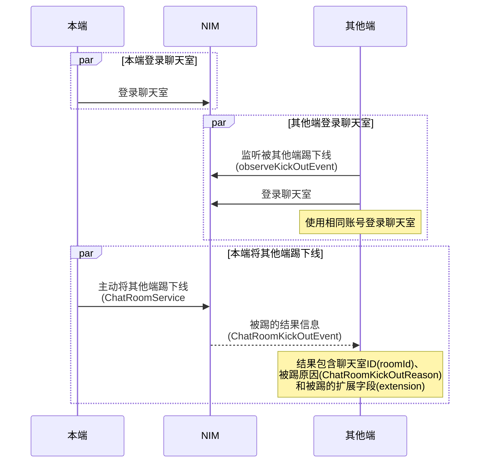

您可通过两种方式实现聊天室的多端登录与互踢。

## 方式一：通过云信控制台配置

当前 NIM SDK 支持通过云信控制台配置两种不同的聊天室多端登录策略：

- 只允许一端登录，Windows、Web、Android、iOS 彼此互踢。同一账号仅允许在一台设备上登录。当该账号在另一台设备上成功登录时，新设备会将旧设备踢下线。
- 各端均可以同时登录在线。最多可支持 10 个设备同时在线，在设备数上限内，所有的新设备再次登录，均不会将在线的旧设备踢下线。

通过该方式的配置，可实现自动管控聊天室的多端登录。具体如何配置，请参见[配置聊天室多端登录模式](https://doc.yunxin.163.com/messaging/guide/TQwNzE3NTk?platform=android#配置聊天室多端登录模式)。

::: note note
- 控制台修改多端互踢的逻辑之后，下次新的设备登录时才会基于新的多端互踢策略进行校验，已经建立连接的设备不会因为策略的修改被强制踢出。
- 如果某台设备重复登录同一个聊天室，后登录的会将前面的长连接断开，此时会再触发一次进入聊天室的抄送，但是不会触发退出聊天室的抄送。关于进出聊天室（eventType=9）的抄送请参见[聊天室成员进出聊天室事件抄送](https://doc.yunxin.163.com/messaging/guide/TcxNzU4NzU?platform=server#聊天室成员进出聊天室事件抄送)。
:::

## 方式2：主动将其他端踢下线

### API 调用时序




### 踢方操作

1. [登录聊天室](https://doc.yunxin.163.com/messaging/guide/jQ1Mzk0OTA?platform=android)。

2. 调用 [`ChatRoomService#kickMember`](https://doc.yunxin.163.com/docs/interface/messaging/android/doxygen/Latest/zh/interfacecom_1_1netease_1_1nimlib_1_1sdk_1_1chatroom_1_1_chat_room_service.html#a0cece0fd2163ee80a504bce4f73c534a) 方法将其他同时登录的设备端踢下线。 

    ```
    // 踢出 roomId 下的 account 用户，并利用 notifyExtMap 传递 k-v 格式的扩展字段
    NIMClient.getService(ChatRoomService.class).kickMember(roomId, account, notifyExtMap)
            .setCallback(new RequestCallback<Void>() {
                @Override
                public void onSuccess(Void aVoid) {
                    logText.setText("踢人成功");
                }

                @Override
                public void onFailed(int i) {
                    logText.setText("踢人失败,code:" + i);
                }

                @Override
                public void onException(Throwable throwable) {

                }
            });
    ```


### 被踢方操作

被踢的设备端，可在登录聊天室前，注册[`observeKickOutEvent`](https://doc.yunxin.163.com/docs/interface/messaging/android/doxygen/Latest/zh/interfacecom_1_1netease_1_1nimlib_1_1sdk_1_1chatroom_1_1_chat_room_service_observer.html#a501637ee199d39b5333a730a604c9145)回调，监听被踢事件。被踢事件信息包含聊天室 ID（`roomId`）、被踢原因（[`ChatRoomKickOutReason`](https://doc.yunxin.163.com/docs/interface/messaging/android/doxygen/Latest/zh/enumcom_1_1netease_1_1nimlib_1_1sdk_1_1chatroom_1_1model_1_1_chat_room_kick_out_event_1_1_chat_room_kick_out_reason.html)）和被踢的扩展字段（`extension`）。


收到被踢回调后，建议进行注销并切换到登录界面。


1. 注册[`observeKickOutEvent`](https://doc.yunxin.163.com/docs/interface/messaging/android/doxygen/Latest/zh/interfacecom_1_1netease_1_1nimlib_1_1sdk_1_1chatroom_1_1_chat_room_service_observer.html#a501637ee199d39b5333a730a604c9145)回调，监听被踢事件。

    ```
    Observer<ChatRoomKickOutEvent> kickOutObserver = (Observer<ChatRoomKickOutEvent>) chatRoomKickOutEvent -> {
        // ToastHelper.showToast(ChatRoomActivity.this, "被踢出聊天室，原因:" + chatRoomKickOutEvent.getReason());
        // onExitedChatRoom(); 离开聊天室的后处理
    };

    // 注册聊天室被踢监听
    NIMClient.getService(ChatRoomServiceObserver.class).observeKickOutEvent(kickOutObserver, true);
    // 注销
    NIMClient.getService(ChatRoomServiceObserver.class).observeKickOutEvent(kickOutObserver, false);
    ```

2. 用相同账号[登录聊天室](https://doc.yunxin.163.com/messaging/guide/jQ1Mzk0OTA?platform=android)。

3. 被其他端踢下线后，收到被踢回调信息（`ChatRoomKickOutEvent`）。


## 参考信息

`ChatRoomKickOutReason` 枚举列表

|<div style="width:120px">参数</div>  |说明   |
|---   |---| ---|
|`CHAT_ROOM_INVALID`   |  聊天室已经解散  |
|`KICK_OUT_BY_MANAGER`    | 被聊天室管理员踢出 |
|`KICK_OUT_BY_CONFLICT_LOGIN`    |  被同一账号的其他端踢出  |
|`ILLEGAL_STAT` | 当前聊天室连接状态异常|
|`BE_BLACKLISTED`   | 被拉黑 |
