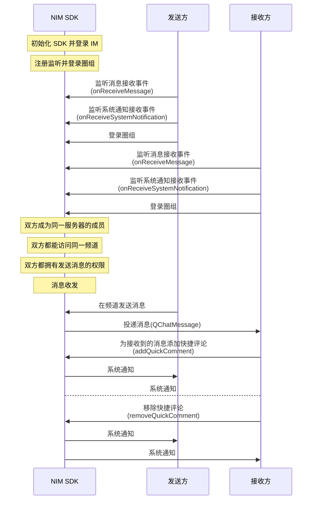

快捷评论是一个操作功能，并非一种消息类型。评论内容并非一条消息，而是一个 int 类型，由开发者指定评论内容与界面展示之间的联系。

快捷评论的 UI 示例见下图。


## 前提条件

开始圈组快捷评论相关集成前，请确保：

- 已[开通圈组的快捷评论功能](https://doc.yunxin.163.com/messaging/docs/DE2MDA5NzA?platform=flutter)。圈组的快捷评论功能需要在开通圈组功能的基础上额外开通后才能使用。
- 已完成圈组初始化。


## 实现方法

### 添加/移除快捷评论

#### **API 调用时序**





#### **具体流程**

::: note note
本节仅对上图中标为部分的流程进行说明，其他流程请参考相关文档。例如：
- 服务器成员相关说明，可参见<a href="https://doc.yunxin.163.com/messaging/docs/jc4ODY5MDA?platform=flutter" target="_blank">圈组服务器成员管理</a>。
- 用户是否能访问某频道的相关说明，可参见<a href="https://doc.yunxin.163.com/messaging/docs/TQxOTYzOTY?platform=flutter" target="_blank">频道管理</a>中对于频道黑白名单的说明。
- 权限相关配置说明，可参见身份组相关文档。
:::

1. 发送方和接收方注册回调函数并登录。

    - 注册<a href="https://doc.yunxin.163.com/messaging/references/flutter/dartdoc/Latest/zh/nim_core/QChatObserver/onReceiveMessage.html" target="_blank">`onReceiveMessage`</a>消息接收事件流，监听消息接收。
    - 注册<a href="https://doc.yunxin.163.com/messaging/references/flutter/dartdoc/Latest/zh/nim_core/QChatObserver/onReceiveSystemNotification.html" target="_blank">`onReceiveSystemNotification`</a>系统通知接收事件流，监听快捷评论添加和移除。

    示例代码如下：
    :::::: div custom-tabs
    ::: tab 注册消息接收事件流
    ```dart
    NimCore.instance.qChatObserver.onReceiveMessage.listen((event) {
      // 收到消息qChatMessages
      for (var qChatMessage in event) {
        // 处理消息
      }
    });
    ```


    :::
    ::: tab 注册系统通知接收事件流
    ```dart
    NimCore.instance.qChatObserver.onReceiveSystemNotification.listen((event) {
      // 收到系统通知
      for (var qChatSystemNotification in event) {
        // 处理系统通知
      }
    });
    ```
    :::
    ::::::

2. 接收方在收到消息后，调用<a href="https://doc.yunxin.163.com/messaging/references/flutter/dartdoc/Latest/zh/nim_core/QChatMessageService/addQuickComment.html" target="_blank">`addQuickComment`</a>方法为接收到的消息添加快捷评论。调用成功后，系统通知接收事件流的回调触发，发送方和接收方收到系统通知（`QChatSystemNotificationType.update_quick_comment`）。

    该方法的入参结构`QChatRemoveQuickCommentParam`需要传入待评论的消息`QChatMessage`和评论类型。


    ::: note note 
    用户也可在搜索/查询消息后为消息添加快捷评论，本文仅以接收消息后添加快捷评论作为示例进行说明。
    :::


    <br>
    
    示例代码如下：

    ```dart
    final message = getMessage();
    final type = 1;
    final param = QChatAddQuickCommentParam(message, type);
    NimCore.instance.qChatMessageService.addQuickComment(param).then((value) {
      if (value.isSuccess) {
        // 添加成功
      } else {
        // 添加失败
      }
    });
    ```

3. （可选）接收方调用<a href="https://doc.yunxin.163.com/messaging/references/flutter/dartdoc/Latest/zh/nim_core/QChatMessageService/removeQuickComment.html" target="_blank">`removeQuickComment`</a> 方法移除快捷评论。调用成功后，系统通知接收事件流的回调函数触发，发送方和接收方收到系统通知（`QChatSystemNotificationType.UPDATE_QUICK_COMMENT`）。

    该方法的入参结构`QChatRemoveQuickCommentParam`需要传入待评论的消息`QChatMessage`和评论类型（int类型）。

    示例代码如下：
    ​    
    ```dart
    final message = getMessage();
    final type = 1;
    final param = QChatRemoveQuickCommentParam(message, type);
    NimCore.instance.qChatMessageService.removeQuickComment(param).then((value) {
      if (value.isSuccess) {
        // 删除成功
      } else {
        // 删除失败
      }
    });
    ```

### 查询快捷评论列表

调用<a href="https://doc.yunxin.163.com/messaging/references/flutter/dartdoc/Latest/zh/nim_core/QChatMessageService/getQuickComments.html" target="_blank">`getQuickComments`</a>可查询指定消息所包含的快捷评论列表。

- 该方法的入参结构`QChatGetQuickCommentsParam`中需要传入需要查询的`serverId`、`channelId`和消息列表。回参结构`QChatGetQuickCommentsResult`返回快捷评论详情 Map，key 为消息的`msgIdServer`，value 为`QChatMessageQuickCommentDetail`。

    其中`QChatMessageQuickCommentDetail`的参数说明如下：

    类型 |参数 | 说明     
    ----  | ----  | --------- 
    int|`serverId`|服务器 ID
    int |`channelId`|频道 ID
    int |`msgIdServer`| 消息的服务端 ID 
    int|`totalCount`| 总评论数
    int |`lastUpdateTime`| 消息评论最后一次操作的时间
    `List<QChatQuickCommentDetail>`|`details`| 评论详情列表

    其中`QChatQuickCommentDetail`的参数说明如下：
    
    类型  | 参数  | 说明     
    ---- | ----  | --------- 
    int|`type`|评论类型
    int|`getCount`|评论数量
    bool|`hasSelf`|自己是否添加了该类型评论
    `List<String>`|`severalAccids`| 若干个添加了此类型评论的用户 ID （`accid`）列表，随机获取结果

- 示例代码

  ```dart
  final msgList = getMsgList();
  final param = QChatGetQuickCommentsParam(serverId: serverId, channelId: channelId, msgList: msgList);
  NimCore.instance.qChatMessageService.getQuickComments(param).then((value) {
    if (value.isSuccess) {
      // 查询成功，消息快捷评论详情Map，key为MsgIdServer，value为QChatMessageQuickCommentDetail
      var messageQuickCommentDetailMap = value.data?.messageQuickCommentDetailMap;
    } else {
      // 查询失败
    }
  });
  ```


