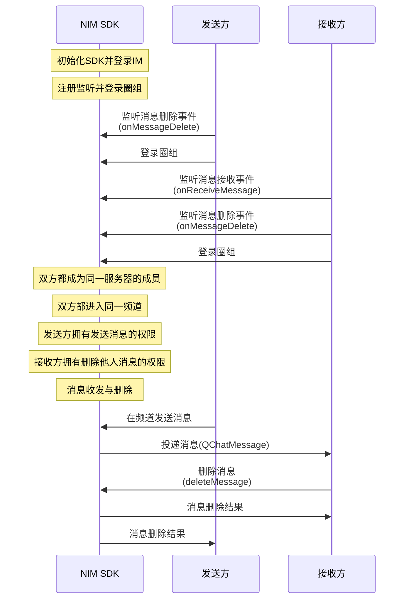

NIM SDK 的<a href="https://doc.yunxin.163.com/messaging/references/flutter/dartdoc/Latest/zh/nim_core/QChatMessageService-class.html" target="_blank">`QChatMessageService`</a>类提供消息删除方法，支持在发送消息后删除消息。

::: note notice
消息发送方和拥有删除他人消息权限（`deleteMsg`）的频道成员都可删除消息。
:::


## 前提条件

- 已[开通圈组功能](https://doc.yunxin.163.com/messaging/docs/DE2MDA5NzA?platform=flutter)。
- 已完成圈组初始化。

## 实现流程

### API 调用时序





### 具体流程

::: note note
本节仅对上图中标为部分的流程进行说明，其他流程请参考相关文档。例如：
- 服务器成员相关说明，可参见<a href="https://doc.yunxin.163.com/messaging/docs/jc4ODY5MDA?platform=flutter" target="_blank">圈组服务器成员管理</a>
- 权限相关说明，可参见身份组相关文档。
:::

1. 注册回调函数并登录。
    - 发送方在登录圈组前，注册<a href="https://doc.yunxin.163.com/messaging/references/flutter/dartdoc/Latest/zh/nim_core/QChatObserver/onMessageDelete.html" target="_blank">`onMessageDelete`</a>消息删除事件回调，监听消息删除。
    - 接收方在登录圈组前，注册<a href="https://doc.yunxin.163.com/messaging/references/flutter/dartdoc/Latest/zh/nim_core/QChatObserver/onReceiveMessage.html" target="_blank">`onReceiveMessage`</a>消息接收回调和`onMessageDelete`消息删除事件回调，分别监听消息接收和消息删除。

    示例代码如下：


    

    :::::: div custom-tabs
    ::: tab 注册消息接收回调
    ```
       NimCore.instance.qChatObserver.onReceiveMessage.listen((event) {
      //message received
    });
    ```
 
    :::
    ::: tab 注册消息删除事件回调
    ```
    NimCore.instance.qChatObserver.onMessageDelete.listen((event) {
      // message deleted
    });
    ```
    :::
    ::::::
    
2. 接收方在收到消息后，调用<a href="https://doc.yunxin.163.com/messaging/references/flutter/dartdoc/Latest/zh/nim_core/QChatMessageService/deleteMessage.html" target="_blank">`deleteMessage`</a>方法删除消息。

    该方法入参结构`QChatDeleteMessageParam` 必须传入更新操作通用参数、消息所属的服务器的 ID、消息所属的频道的 ID、消息发送时间以及消息服务端 ID。

    ::: note notice
    删除未读消息将影响未读数。
    :::

    <br>
    
    示例代码如下：

   ```
    var paramDeleteMsg = QChatDeleteMessageParam(channelId: channelId,
        serverId: serverId,
        msgIdServer: msgIdServer,
        time: time,
        updateParam: updateParam);
    
    NimCore.instance.qChatMessageService.deleteMessage(paramDeleteMsg).then((value){
      if (value.isSuccess) {
        //delete message success
      }
    });
   ```


3. `onMessageDelete`回调触发，接收方和发送方通过该回调接收消息删除结果。


