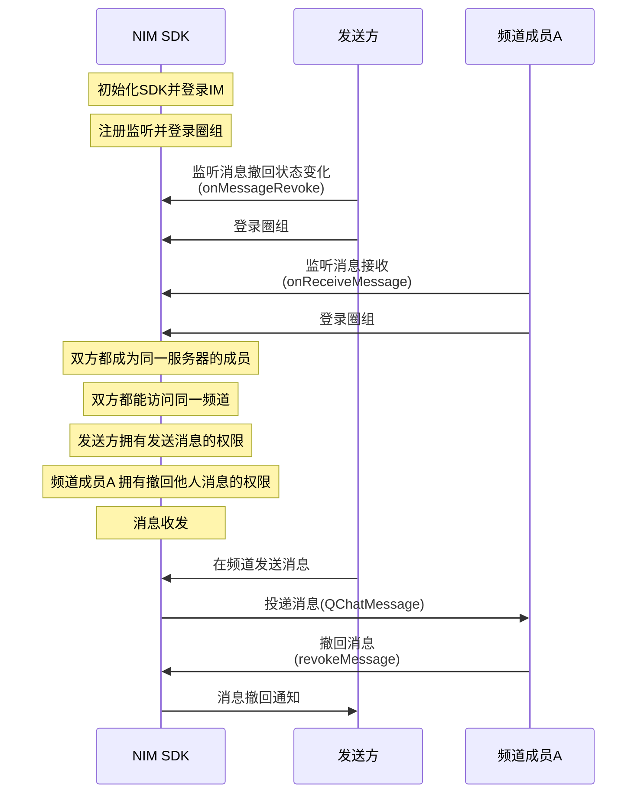

NIM SDK 的<a href="https://doc.yunxin.163.com/messaging/references/flutter/dartdoc/Latest/zh/nim_core/QChatMessageService-class.html" target="_blank">`QChatMessageService`</a>类提供圈组消息撤回的方法，支持在消息发送后将消息撤回。圈组的消息撤回功能属于双向撤回。撤回之后，消息接收者和发送者都将收到一条消息撤回通知。


::: note notice
消息发送方和拥有撤回他人消息权限（`recallMsg`）的频道成员都可撤回消息。
:::


## 前提条件

- 已[开通圈组功能](https://doc.yunxin.163.com/messaging/docs/DE2MDA5NzA?platform=flutter)。
- 已完成圈组初始化。

## 实现流程
::: note note 
本文以 **发送方的消息被频道成员A 撤回** 为例进行介绍，即发送方在下文中为消息被撤回的一方。
:::

### API 调用时序



### 具体流程


::: note note
本节仅对上图中标为部分的流程进行说明，其他流程请参考相关文档。例如：
- 服务器成员相关说明，可参见<a href="https://doc.yunxin.163.com/messaging/docs/jc4ODY5MDA?platform=flutter" target="_blank">圈组服务器成员管理</a>
- 权限相关说明，可参见身份组相关文档。
:::

1. 注册回调函数并登录。
    - 发送方在登录圈组前，注册<a href="https://doc.yunxin.163.com/messaging/references/flutter/dartdoc/Latest/zh/nim_core/QChatObserver/onMessageRevoke.html" target="_blank">`onMessageRevoke`</a>消息撤回状态变化回调，监听消息撤回状态变化。
    - 频道成员A 在登录圈组前，注册<a href="https://doc.yunxin.163.com/messaging/references/flutter/dartdoc/Latest/zh/nim_core/QChatObserver/onReceiveMessage.html" target="_blank">`onReceiveMessage`</a>消息接收回调，监听圈组消息接收。

    示例代码如下：


    :::::: div custom-tabs
    ::: tab 注册消息接收观察者
    ```
    NimCore.instance.qChatObserver.onMessageRevoke.listen((event) {
      //message revoke listener
    });
    ```
    :::
    ::: tab 注册消息撤回状态变化观察者
    ```
    NimCore.instance.qChatObserver.onReceiveMessage.listen((event) { 
      //message received
    });
    ```
    :::
    ::::::

2. 接收到消息后，频道成员A 调用<a href="https://doc.yunxin.163.com/messaging/references/flutter/dartdoc/Latest/zh/nim_core/QChatMessageService/revokeMessage.html" target="_blank">`revokeMessage`</a>方法撤回该消息。

    该方法入参结构`QChatRevokeMessageParam`必须传入更新操作通用参数、消息所属的服务器的ID（`serverId`）、消息所属的频道的 ID（`channelId`）、消息发送时间以及消息服务端ID。


    **调用限制**：

    <ul><li>默认只能在消息发送后 2 分钟内撤回消息。<details><summary>可在云信控制台配置“可撤回时长”</summary>在云信控制台选择应用，进入<strong>IM 即时通讯 > 功能配置 > 圈组 > 子功能配置 > 消息可撤回时长</strong>即可配置。<br> </details></li><li>非消息发送方需要拥有撤回他人消息的权限，才能撤回消息。</li></ul>


    示例代码如下：

    ```
    var paramRevokeMessage = QChatRevokeMessageParam(channelId: channelId,
        serverId: serverId,
        msgIdServer: msgIdServer,
        time: time,
        updateParam: updateParam);
    NimCore.instance.qChatMessageService.revokeMessage(paramRevokeMessage).then((value){
     if(value.isSuccess){
       //revoke message success
     }
    });
    ```


3. `onMessageRevoke`回调函数触发，发送方（即本文例子中的消息被撤回方）通过该回调收到消息撤回通知。


