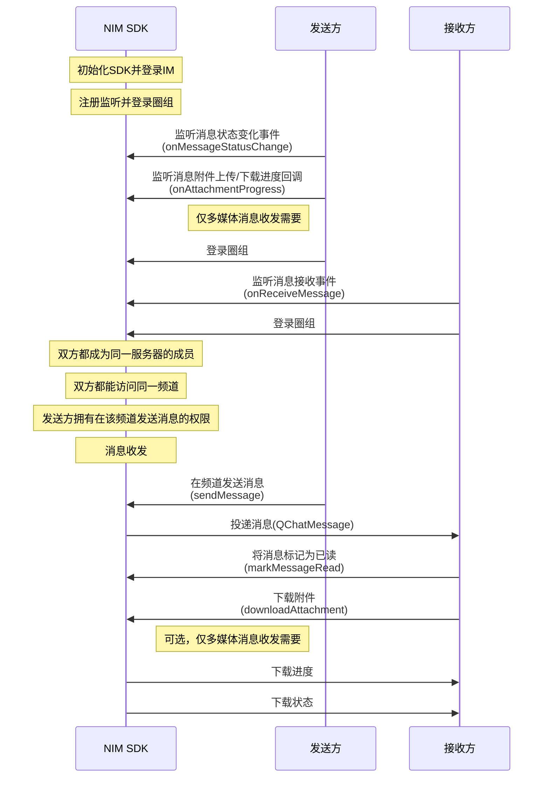

NIM SDK 的<a href="https://doc.yunxin.163.com/messaging/references/flutter/dartdoc/Latest/zh/nim_core/QChatMessageService-class.html" target="_blank">`QChatMessageService`</a>接口提供圈组消息收发的方法，支持支持文本、图片、语音、视频、文件、地理位置和自定义等消息类型。定义圈组消息的结构体为<a href="https://doc.yunxin.163.com/messaging/references/flutter/dartdoc/Latest/zh/nim_core/QChatMessage-class.html" target="_blank">`QchatMessage`</a>。

## 消息类型

| <div style="width:100px">消息类型</div> | <div style="width:100px">API关键字</div>  | 说明    |             
| :---------- | :----------|:----------------------------- |:----------------------------- |
| 文本消息        | `text` | 消息内容为普通文本 |  
| 图片消息        | `image`  | 消息内容为图片 URL 地址、尺寸、图片大小等信息               |  
| 语音消息        | `audio` | 消息内容为语音文件的 URL 地址、时长、大小、格式等信息 | 
| 视频消息        | `video` | 消息内容为视频文件的 URL 地址、时长、大小、格式等信息 | 
| 文件消息        |  `file` | 消息内容为文件的 URL 地址、大小、格式等信息         | 
| 位置消息      | `location`  | 消息内容为地理位置标题、经度、纬度信息         | 
| 提示消息        | `tip` | 又叫做 Tip 消息，没有推送和通知栏提醒，主要用于会话内的通知提醒，例如进入会话时出现的欢迎消息，或是会话过程中命中敏感词后的提示消息等场景 |
|  通知消息  |  `notification`  | 主要用于圈组的事件通知 | 
| 自定义消息       | `custom` | 开发者自定义的消息类型，例如红包消息、石头剪子布等形式的消息           | 

## 技术原理

下图展示了集成并初始化 NIM SDK 后，实现圈组消息收发的基本工作流。图中的 QChat 即为 NIM SDK 的圈组组件，云信服务端包含 IM 服务端和圈组服务端。


::: note notice 
- 上图仅以静态 Token 登录为例展示消息收发流程。网易云信 IM 还支持动态 Token 登录鉴权和第三方回调登录鉴权，相关详情请参见<a href="https://doc.yunxin.163.com/docs/TM5MzM5Njk/zE2NzA3Mjc?platformId=60353" target="_blank">登录鉴权</a>。
- **圈组服务端**与**圈组服务器**是两个不同概念，前者指云信服务器内提供圈组功能的服务端，后者为圈组的特殊概念，对应 Discord 的 Server, 为社群本身。
:::

<br>

上图中的流程可归纳为如下 5 步：

1. 账号集成与登录。
    1. 开发者将应用的用户账号传入云信 IM 服务端，注册云信 IM 账号。
    2. 云信 IM 服务端返回 Token 给应用服务端。
    3. 应用客户端登录应用服务端。
    4. 应用服务端将 Token 返回给应用客户端。
    5. 用户A 和用户B 带 Token 登录云信 IM 服务端。
    6. 用户A 和用户B 登录云信圈组服务端，此时无需再传入 Token 等参数。
7. 用户A 创建圈组服务器，并在服务器内创建频道。
8. 用户B 加入圈组服务器。
8. 用户A 在频道发送一条消息到云信圈组服务端。 
7. 云信圈组服务端投递消息至频道，用户B 接收消息。


## 前提条件

- 已[开通圈组功能](https://doc.yunxin.163.com/messaging/docs/DE2MDA5NzA?platform=flutter)。
- 已完成圈组初始化。

::: note important
如果用户所在服务器的成员人数超过 2000 人阈值，该用户还需先订阅相应的服务器或频道，才能收到对应服务器或频道的消息。如未超过该阈值，则无需订阅。订阅相关说明，请参见<a href="https://doc.yunxin.163.com/messaging/docs/DM5NTc4NTU?platform=flutter" target="_blank">圈组订阅机制</a>。
:::


## 实现流程

### 实现消息收发


#### API 调用时序




#### 流程说明

::: note note
本节仅对上图中标为部分的流程进行说明，其他流程请参考相关文档。例如：
- 服务器成员相关说明，可参见<a href="https://doc.yunxin.163.com/messaging/docs/jc4ODY5MDA?platform=flutter" target="_blank">圈组服务器成员管理</a>
- 权限相关说明，可参见身份组相关文档。
:::

1. 发送方在登录圈组前，注册<a href="https://doc.yunxin.163.com/messaging/references/flutter/dartdoc/Latest/zh/nim_core/QChatObserver/onMessageStatusChange.html" target="_blank">`onMessageStatusChange`</a>消息状态变化事件回调，监听圈组消息状态和消息附件传输状态的变化。

    如果发送的是**多媒体消息**（包括图片、语音、视频和文件消息），还需注册<a href="https://doc.yunxin.163.com/messaging/references/flutter/dartdoc/Latest/zh/nim_core/QChatObserver/onAttachmentProgress.html" target="_blank">`onAttachmentProgress`</a>消息附件上传/下载进度回调。

    <br>

    示例代码如下：
    :::::: div custom-tabs
    ::: tab 注册消息状态变化回调

    ```
      NimCore.instance.qChatObserver.onMessageStatusChange.listen((event) {
        //todo message status change
      });
    ```


    :::
    ::: tab 注册消息附件上传/下载进度回调


    ```
      NimCore.instance.qChatObserver.onAttachmentProgress.listen((event) {
        //todo message attach process
      });
    ```


    :::
    ::::::
2. 接收方在登录圈组前，注册<a href="https://doc.yunxin.163.com/messaging/references/flutter/dartdoc/Latest/zh/nim_core/QChatObserver/onReceiveMessage.html" target="_blank">`onReceiveMessage`</a>消息接收事件回调。


    示例代码如下：

    ```
    NimCore.instance.qChatObserver.onReceiveMessage.listen((event) {
          //todo show message
        });
    ```

2. 发送方调用<a href="https://doc.yunxin.163.com/messaging/references/flutter/dartdoc/Latest/zh/nim_core/QChatMessageService/sendMessage.html" target="_blank">`sendMessage`</a>方法发送消息，调用时通过消息类型参数<a href="https://doc.yunxin.163.com/messaging/references/flutter/dartdoc/Latest/zh/nim_core/QChatSendMessageParam/type.html" target="_blank">`type`</a>设置消息的类型。调用时必须传入必须传入`serverId`、`channelId`和`type`。


    ::: note notice
    消息发送方需要拥有发送消息的权限（sendMsg）。
    :::


    <br>

    <a href="https://doc.yunxin.163.com/messaging/references/flutter/dartdoc/Latest/zh/nim_core/QChatSendMessageParam-class.html" target="_blank">`QChatSendMessageParam`</a>类为该方法的入参结构，包含设置内容审核、消息抄送、第三方回调、推送等的参数，其中部分重要参数说明如下：
    
    <div style="width:100px">参数</div>  | 类型 | 说明     
    ----  | ----  | --------- 
    `antiSpamOption` | <a href="https://doc.yunxin.163.com/messaging/references/flutter/dartdoc/Latest/zh/nim_core/QChatMessageAntiSpamOption-class.html" target="_blank">`QChatMessageAntiSpamOption`</a> | 安全通（易盾反垃圾）相关的各项参数。如果您配置了这些参数，在发送消息时，会对发送的文本和附件进行内容审核（反垃圾检测）。根据您在控制台预设的拦截/过滤规则，如果检测到违规内容，消息可能发送失败或者敏感信息被过滤。 <note type=notice>圈组的安全通功能属于增值功能，需要在开通圈组功能后再额外开通。如尚未开通，请通过云信官网首页提供的联系方式咨询商务经理开通。更多相关说明请参见<a href="https://doc.yunxin.163.com/messaging/docs/TI3ODIzMDM?platform=flutter" target="_blank">圈组内容审核</a>。</note>
    `mentionedAccidList`|`List<String>`| @某个人，如果将该消息设置为@所有人或者@身份组，则本参数无效）<note type=notice>用户需要拥有@某个人权限（`remindOther`）才能@某个人。</note>
    `mentionedAll`|bool|是否@所有人 <note type=notice>用户需要拥有@所有人的权限（`remindEveryone`）才能@某个人。</note>
    `mentionedRoleIdList` |  `List<int>` | @身份组
    `historyEnable`|bool| 消息是否存储云端历史
    `needBadge`|bool |是否需要消息计数

    <div>
    
    发送各类型消息的示例代码如下：


    <br>

    :::::: div custom-tabs

    ::: tab 文本

    ```
    //channelId 为之前创建好的Channel 的Id
    //serverId 为之前创建好的Server 的Id
    var paramText = QChatSendMessageParam(
        channelId: channelId, serverId: serverId, type: NIMMessageType.text);
    paramText.body = '文本消息';
    NimCore.instance.qChatMessageService
        .sendMessage(paramText)
        .then((value) {
      if (value.isSuccess) {
        //todo  success
      } else {}
    });
    ```
    
    :::

    ::: tab 图片

    ```
    //channelId 为之前创建好的Channel 的Id
    //serverId 为之前创建好的Server 的Id
    var paramImage = QChatSendMessageParam(
        channelId: channelId, serverId: serverId, type: NIMMessageType.image);
    paramImage.setAttachment(NIMImageAttachment(size: size, path: 'filePath'));
    NimCore.instance.qChatMessageService
        .sendMessage(paramImage)
        .then((value) {
      if (value.isSuccess) {
        //todo  success
      } else {}
    });
    ```
    
    :::

    ::: tab 语音

    ```
    //channelId 为之前创建好的Channel 的Id
    //serverId 为之前创建好的Server 的Id
    var paramAudio = QChatSendMessageParam(
        channelId: channelId, serverId: serverId, type: NIMMessageType.audio);
    paramAudio.setAttachment(NIMAudioAttachment(size: size, path: 'filePath'));
    NimCore.instance.qChatMessageService
        .sendMessage(paramAudio)
        .then((value) {
      if (value.isSuccess) {
        //todo  success
      } else {}
    });
    ```
    
    :::

    ::: tab 视频
    ```
    //channelId 为之前创建好的Channel 的Id
    //serverId 为之前创建好的Server 的Id
    var paramVideo = QChatSendMessageParam(
        channelId: channelId, serverId: serverId, type: NIMMessageType.video);
    paramVideo.setAttachment(NIMVideoAttachment(size: size, path: 'filePath'));
    NimCore.instance.qChatMessageService
        .sendMessage(paramVideo)
        .then((value) {
      if (value.isSuccess) {
        //todo  success
      } else {}
    });
    ```
 
    :::

    ::: tab 文件

    ```
     //channelId 为之前创建好的Channel 的Id
    //serverId 为之前创建好的Server 的Id
    var paramFile = QChatSendMessageParam(
        channelId: channelId, serverId: serverId, type: NIMMessageType.file);
    paramFile.setAttachment(NIMFileAttachment(size: size, path: 'filePath'));
    NimCore.instance.qChatMessageService
        .sendMessage(paramFile)
        .then((value) {
      if (value.isSuccess) {
        //todo  success
      } else {}
    });
    ```

    :::

    ::: tab 提示
    ```
     //channelId 为之前创建好的Channel 的Id
    //serverId 为之前创建好的Server 的Id
    var paramTip= QChatSendMessageParam(
        channelId: channelId, serverId: serverId, type: NIMMessageType.tip);
    paramTip.body = "提示消息";
    NimCore.instance.qChatMessageService
        .sendMessage(paramTip)
        .then((value) {
      if (value.isSuccess) {
        //todo  success
      } else {}
    });
    ```

    :::

    ::: tab 自定义
    ```
    //channelId 为之前创建好的Channel 的Id
    //serverId 为之前创建好的Server 的Id
    var paramCustom= QChatSendMessageParam(
        channelId: channelId, serverId: serverId, type: NIMMessageType.custom);
    NimCore.instance.qChatMessageService
        .sendMessage(paramCustom)
        .then((value) {
      if (value.isSuccess) {
        //todo  success
      } else {}
    });
    ```

    :::

3. 消息接收回调触发，接收方通过该回调收到消息。

4. 接收方调用<a href="https://doc.yunxin.163.com/messaging/references/flutter/dartdoc/Latest/zh/nim_core/QChatMessageService/markMessageRead.html" target="_blank">`markMessageRead`</a>方法将接收到的消息标记为已读。

    ::: note notice
    - 将消息标记为已读后，该消息之前接收到的消息全部变为已读状态。
    - 如果传入的时间戳参数为 0，则频道内所有消息将被标记为未读。
    - 该方法调用存在频控，300ms 内最多可调用一次。
    :::

    <br>

    示例代码如下：


    ```
    var paramRead = QChatMarkMessageReadParam(
        serverId: serverId, channelId: channelId, ackTimestamp: ackTimestamp);
    NimCore.instance.qChatMessageService
        .markMessageRead(paramRead)
        .then((value) {
      if (value.isSuccess) {
        //todo  success
      } else {}
    });
    ```


5. 如果接收方接收到的是多媒体消息，可调用<a href="https://doc.yunxin.163.com/messaging/references/flutter/dartdoc/Latest/zh/nim_core/QChatMessageService/downloadAttachment.html" target="_blank">`downloadAttachment`</a>方法下载附件。

    下载附件会触发`QChatobserver`的`onAttachmentProgress`回调通知下载进度，同时触发`observeMessageStatusChange`通知下载状态。


    ::: note note 
    默认情况下（即 SDK 初始化时将`NIMSDKOPtions#enablePreloadAttachment`设置为`true`，开启预加载多媒体消息附件），当 SDK 收到多媒体消息后，如果附件是图片或视频，会自动下载图片或视频的缩略图；如果附件是音频，SDK 会自动下载音频文件。如果需要下载原图或者原视频等，可调用该方法下载附件。
    :::

    <br>


    示例代码如下：


    ```
    var paramDownAttach = QChatDownloadAttachmentParam(message: message, thumb: true)
    NimCore.instance.qChatMessageService.downloadAttachment(paramDownAttach).then((value){
      if (value.isSuccess) {
        //todo  success
      } else {}
    });
    ```

    

### 实现消息重发


如果因为网络等原因消息发送失败，可以调用<a href="https://doc.yunxin.163.com/messaging/references/flutter/dartdoc/Latest/zh/nim_core/QChatMessageService/resendMessage.html" target="_blank">`resendMessage`</a>方法重发消息。该方法的入参`QChatResendMessageParam`需传入待重发的消息体（`QChatMessage`）。

示例代码如下：

 ```
 var paramResendMessage = QChatResendMessageParam(message);
    NimCore.instance.qChatMessageService.resendMessage(paramResendMessage).then((value){
      if (value.isSuccess) {
        //todo  success
      } else {}
    });
 ```


## 相关参考


### 相关控制台配置


- 每个频道上的 **消息未读数** （包括@消息的未读数）默认最多显示为 99+ 。
    <details><summary>最大未读数可在云信控制台配置</summary>在云信控制台选择应用，进入<strong>IM 即时通讯 > 功能配置 > 圈组 > 子功能配置 > 所有未读消息（包括@）的消息计数</strong>即可配置。<br> </details>
- @消息的未读数的有效期，默认为 7 天。

    <details><summary>可在云信控制台配置该有效期</summary>在云信控制台选择应用，进入<strong>IM 即时通讯 > 功能配置 > 圈组 > 子功能配置 > 未读的@消息数-周期</strong>即可配置。<br> </details>


