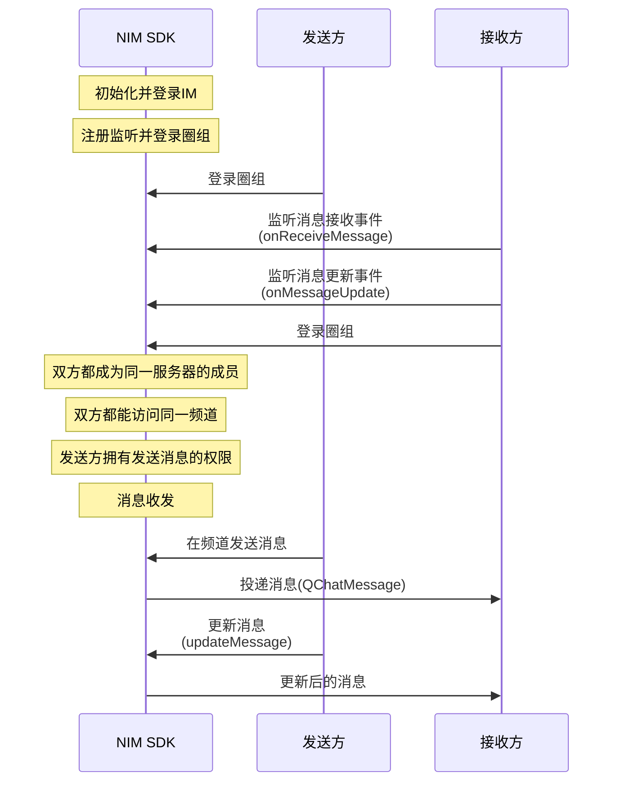

NIM SDK 的<a href="https://doc.yunxin.163.com/messaging/references/flutter/dartdoc/Latest/zh/nim_core/QChatMessageService-class.html" target="_blank">`QChatMessageService`</a>类提供圈组消息更新的方法，支持在发送消息后更新消息。

## 前提条件

- 已[开通圈组功能](https://doc.yunxin.163.com/messaging/docs/DE2MDA5NzA?platform=flutter)。
- 已完成圈组初始化。

## 实现流程

### API 调用时序




### 具体流程

::: note note
本节仅对上图中标为部分的流程进行说明，其他流程请参考相关文档。例如：
- 服务器成员相关说明，可参见<a href="https://doc.yunxin.163.com/messaging/docs/jc4ODY5MDA?platform=flutter" target="_blank">圈组服务器成员管理</a>
- 权限相关说明，可参见身份组相关文档。
:::

1. 接收方在登录圈组前，注册<a href="https://doc.yunxin.163.com/messaging/references/flutter/dartdoc/Latest/zh/nim_core/QChatObserver/onReceiveMessage.html" target="_blank">`onReceiveMessage`</a>消息接收回调和<a href="https://doc.yunxin.163.com/messaging/references/flutter/dartdoc/Latest/zh/nim_core/QChatObserver/onMessageUpdate.html" target="_blank">`onMessageUpdate`</a>消息更新回调，分别监听圈组消息接收和消息更新。

    示例代码如下：


    :::::: div custom-tabs
    ::: tab 注册消息接收观察者
    ```
    NimCore.instance.qChatObserver.onReceiveMessage.listen((event) {
      //message received
    });
    ```

    :::
    ::: tab 注册消息更新观察者
    ```
     NimCore.instance.qChatObserver.onMessageUpdate.listen((event) {
      //message updated
    });

    ```
    :::
    ::::::

    
2. 发送方在发送消息后，调用<a href="https://doc.yunxin.163.com/messaging/references/flutter/dartdoc/Latest/zh/nim_core/QChatMessageService/updateMessage.html" target="_blank">`updateMessage`</a>方法更新消息。

    该方法入参结构`QChatUpdateMessageParam`中必须传入更新操作通用参数、消息所属的服务器的ID（`serverId`）、消息所属的频道的 ID（`channelId`）、消息发送时间以及消息服务端 ID。

    ::: note notice
    可以修改消息中的内容、自定义扩展和消息服务端状态，其中消息服务端状态值必须**大于或等于** 1000，否则会返回 414 错误码。
    :::


    <br>
    
    示例代码如下：

    ```
    var paramUpdateMsg = QChatUpdateMessageParam(channelId: channelId,
        updateParam: updateParam,
        serverId: serverId,
        time: time,
        msgIdServer: msgIdServer);
    NimCore.instance.qChatMessageService.updateMessage(paramUpdateMsg).then((
        value) {
      if (value.isSuccess) {
        //update message success
      }
    });
    ```


3. `onMessageUpdate`回调触发，将更新后的消息投递至接收方。


