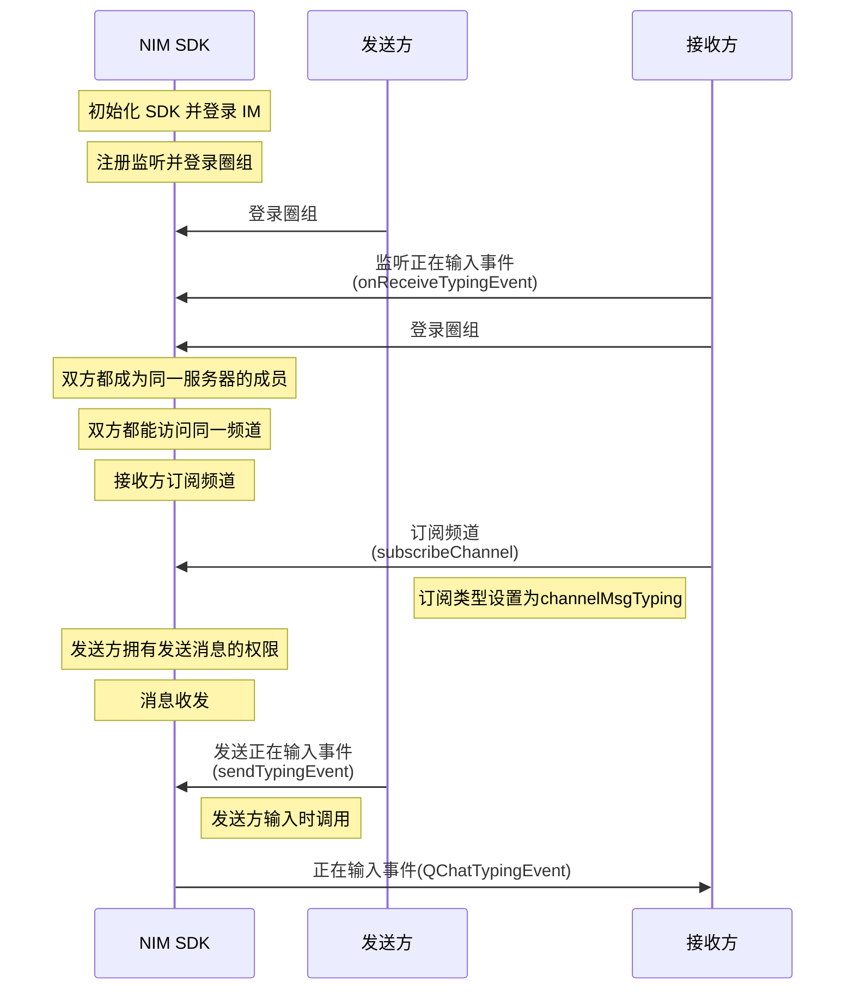

<!--keywords: 正在输入, 消息正在输入, 频道消息 -->

网易云信即时通讯 NIM SDK 中的[`QChatMessageService`](https://doc.yunxin.163.com/messaging/references/flutter/dartdoc/Latest/zh/nim_core/QChatMessageService-class.html)接口，提供[`sendTypingEvent`](https://doc.yunxin.163.com/messaging/references/flutter/dartdoc/Latest/zh/nim_core/QChatMessageService/sendTypingEvent.html)方法发送“正在输入事件”。接收方只有在监听该事件且订阅消息所在频道后，才能在消息输入方发送该事件后，接收到该事件。 


## **前提条件**


发送方和接收方都在频道内，即频道对两者都可见, 且发送方拥有发送频道消息权限（即[`QChatRoleResource`](https://doc.yunxin.163.com/messaging/references/flutter/dartdoc/Latest/zh/nim_core/QChatRoleResource.html)中的 `sendMsg`）。

- 要实现频道对发送方和接收方都可见，需确保两者都在私密频道的白名单内，或者都没有被加入公开频道的黑名单，具体参见[频道黑白名单](https://doc.yunxin.163.com/messaging/docs/zQ3MTY4OTg?platform=flutter)。
- 用户的操作权限通过身份组进行管控，具体参见[身份组相关](https://doc.yunxin.163.com/messaging/docs/TM0ODY3Mjk?platform=flutter)。

## 实现流程


### 流程概览





### 流程说明

::: note note 
本节仅对上图中标为部分的流程进行说明，其他流程请参考相关文档。例如：
- 服务器成员相关说明，可参见<a href="https://doc.yunxin.163.com/messaging/docs/jc4ODY5MDA?platform=flutter" target="_blank">圈组服务器成员管理</a>。
- 用户是否能访问某频道的相关说明，可参见<a href="https://doc.yunxin.163.com/messaging/docs/zQ3MTY4OTg?platform=flutter" target="_blank">频道黑白名单</a>。
- 权限相关配置说明，可参见[身份组相关](https://doc.yunxin.163.com/messaging/docs/TM0ODY3Mjk?platform=flutter)。
:::
<br>

1. 接收方调用[`onReceiveTypingEvent`](https://doc.yunxin.163.com/messaging/references/flutter/dartdoc/Latest/zh/nim_core/QChatObserver/onReceiveTypingEvent.html)方法监听正在输入事件（`QChatTypingEvent`）。 
2. 接收方调用[`subscribeChannel`](https://doc.yunxin.163.com/messaging/references/flutter/dartdoc/Latest/zh/nim_core/QChatChannelService/subscribeChannel.html)方法，调用时将入参`QChatSubscribeType`设为`channelMsgTyping`，实现对正在输入事件的订阅。

    ::: note notice :::
    如果断线重连，SDK 会自动再次订阅正在输入事件。但如果用户调用 `logout` 方法切断与圈组服务端的连接或销毁 SDK 实例后重建实例，那么用户需要再度调`subscribeChannel`方法重新订阅该事件。
    :::

3. 发送方调用[`sendTypingEvent`](https://doc.yunxin.163.com/messaging/references/flutter/dartdoc/Latest/zh/nim_core/QChatMessageService/sendTypingEvent.html)方法发送正在输入事件。

    发送该事件后，SDK 会触发用户A 在`onReceiveTypingEvent`方法中设置的回调，将`QChatTypingEvent`投递至用户A。
    
    ::: note notice :::
    该方法有调用频率上限，目前默认 3000 ms 一次。
    :::


### **示例代码**

```
//************************接收方设置正在输入事件监听回调************************/
NimCore.instance.qChatObserver.onReceiveTypingEvent.listen((event) { 
      //todo 
    })


//************************接收方订阅某正在输入事件************************/

var param = QChatSubscribeChannelParam(type: QChatSubscribeType.channelMsgTyping,
        operateType: QChatSubscribeOperateType.sub,channelIdInfos: [channel])
    NimCore.instance.qChatChannelService.subscribeChannel(param).then((value){

    });

//************************发送方发送正在输入事件************************/
var param = QChatSendTypingEventParam(serverId: serverId,channelId: channelId);
    NimCore.instance.qChatMessageService.sendTypingEvent(param).then((value){
      //todo 
    });

```

## API 参考


| <div style="width:60px">API</div> | <div style="width:200px">说明 </div>| 
| ---- | -------------- | 
| [`onReceiveTypingEvent`](https://doc.yunxin.163.com/messaging/references/flutter/dartdoc/Latest/zh/nim_core/QChatObserver/onReceiveTypingEvent.html) | 监听正在输入事件 |  
|[`subscribeChannel`](https://doc.yunxin.163.com/messaging/references/flutter/dartdoc/Latest/zh/nim_core/QChatChannelService/subscribeChannel.html)| 订阅频道|                    
| [`sendTypingEvent`](https://doc.yunxin.163.com/messaging/references/flutter/dartdoc/Latest/zh/nim_core/QChatMessageService/sendTypingEvent.html) |    发送正在输入事件    |

