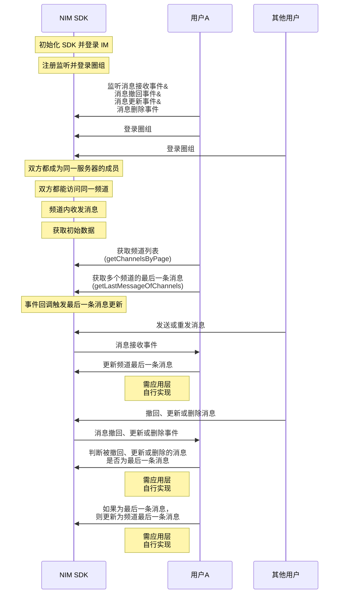
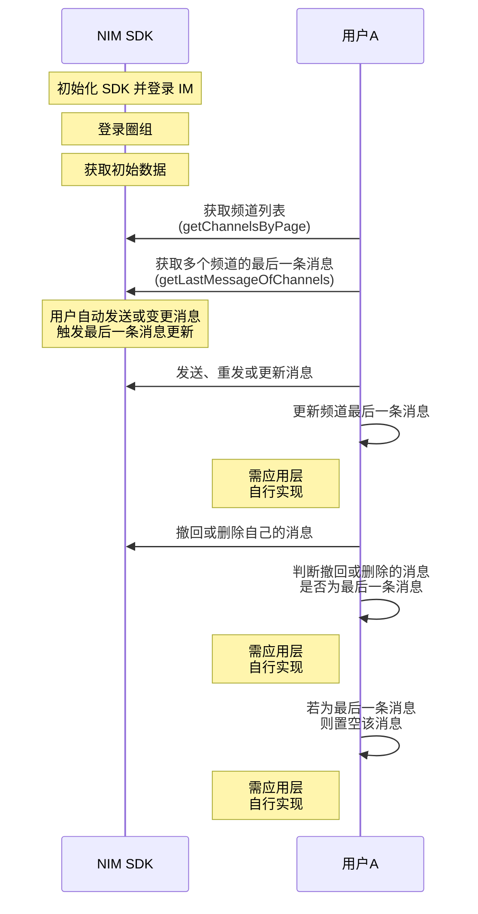

<!--keywords: 最后一条消息, 频道最后一条消息, 最后一条 -->


网易云信 NIM SDK 的[`QChatMessageService`](https://doc.yunxin.163.com/messaging/references/flutter/dartdoc/Latest/zh/nim_core/QChatMessageService-class.html)类提供[`getLastMessageOfChannels`](https://doc.yunxin.163.com/messaging/references/flutter/dartdoc/Latest/zh/nim_core/QChatMessageService/getLastMessageOfChannels.html)方法，用于获取多个频道的最后一条消息，该方法的响应[`QChatGetLastMessageOfChannelsResult`](https://doc.yunxin.163.com/messaging/references/flutter/dartdoc/Latest/zh/nim_core/QChatGetLastMessageOfChannelsResult-class.html)返回的结果为 map, key 值对应每一个`channelId`，value 值是消息体`QChatMessage`。基于该方法的调用，您可通过在应用上层自行开发相关业务逻辑，实现频道列表动态更新各频道的最后一条消息。


## UI 示例
频道列表显示最后一条消息的简易 UI 示例如下：


## 前提条件

已登录圈组，并已创建圈组服务器和频道。


## 实现流程

### API 调用时序

频道最后一条消息动态更新的业务场景可分为如下两种。


场景1：事件回调触发更新 



场景2：自己发送或变更消息触发更新



### 流程说明

::: note note 
本节仅对上图中标为部分的流程补充说明。
:::

1. 登录圈组前，注册如下事件流：
    - 调用[`onReceiveMessage`](https://doc.yunxin.163.com/messaging/references/flutter/dartdoc/Latest/zh/nim_core/QChatObserver/onReceiveMessage.html)方法注册消息接收事件流，监听消息接收事件。
    - 调用[`onMessageRevoke`](https://doc.yunxin.163.com/messaging/references/flutter/dartdoc/Latest/zh/nim_core/QChatObserver/onMessageRevoke.html)方法注册消息撤回状态变化事件流，监听消息撤回事件。
    - 调用[`onMessageUpdate`](https://doc.yunxin.163.com/messaging/references/flutter/dartdoc/Latest/zh/nim_core/QChatObserver/onMessageUpdate.html)方法注册消息更新事件流，监听消息更新事件。
    - 调用[`onMessageDelete`](https://doc.yunxin.163.com/messaging/references/flutter/dartdoc/Latest/zh/nim_core/QChatObserver/onMessageDelete.html)方法注册消息删除事件流，监听消息删除事件。

    示例代码如下：

    :::::: div custom-tabs 
    ::: tab 监听消息接收
    ```dart
    NimCore.instance.qChatObserver.onReceiveMessage.listen((event) {
      // 收到消息QChatMessages
      for (var qChatMessage in event) {
        // 处理消息
      }
    });
    ```

    :::

    ::: tab 监听消息撤回
    ```dart
    NimCore.instance.qChatObserver.onMessageRevoke.listen((event) {
      // 收到撤回后的消息QChatMessage
      var message = event.message;
    });
    ```


    :::


    ::: tab 监听消息更新
    ```dart
    NimCore.instance.qChatObserver.onMessageUpdate.listen((event) {
      // 收到更新后的消息QChatMessage
      var message = event.message;
    });
    ```
    
    :::


    ::: tab 监听消息删除
    ```dart
    NimCore.instance.qChatObserver.onMessageDelete.listen((event) {
      // 收到删除后的消息QChatMessage
      var message = event.message;
    });
    ```
    
    :::
    
    ::::::

2. 获取频道最后一条消息的初始数据。
    1. 调用[`getChannelsByPage`](https://doc.yunxin.163.com/messaging/references/flutter/dartdoc/Latest/zh/nim_core/QChatChannelService/getChannelsByPage.html)拉取频道列表。
    2. 调用[`getLastMessageOfChannels`](https://doc.yunxin.163.com/messaging/references/flutter/dartdoc/Latest/zh/nim_core/QChatMessageService/getLastMessageOfChannels.html)方法获取若干个频道的最后一条消息。

        ::: note notice :::
        - 最多只能传入 20 个频道 ID 获取它们的最后一条消息。
        - 您需自行维护调用该方法返回的结果。
        - 被撤回的消息仍能通过调用该方法查到，但被删除的消息无法查到。如果最后一条消息是撤回消息，推荐把对应的最后一条消息置空，并给出提示表明“撤回消息”。
        :::

    3. 在您的应用内存中维护相关频道的最后一条消息。

    示例代码如下：

    ```dart
    final param = QChatGetChannelsByPageParam(
      serverId: serverId, 
      timeTag: DateTime.now().millisecond, 
      limit: 100);
    NimCore.instance.qChatChannelService.getChannelsByPage(param).then((value) {
      if (value.isSuccess) {
        //查询Channel列表成功
        var channels = value.data?.channels;
        if (channels != null && channels.isNotEmpty) {
          var channelIds = <int>[];
          for (var channel in channels) {
            channelIds.add(channel.channelId);
          }
          //获取频道最后一条消息
          NimCore.instance.qChatMessageService
            .getLastMessageOfChannels(QChatGetLastMessageOfChannelsParam(
              serverId: serverId, channelIds: channelIds))
            .then((messageValue) {
              if (messageValue.isSuccess) {
                // 查询成功,返回频道最后一条消息map，key为channelId
                var channelMsgMap = messageValue.data?.channelMsgMap;
              } else {
                // 查询失败
              }
            });
        }
      } else {
        // 查询Channel列表失败
      }
    });
    ```
    
    
    
3. 参照下表，在应用层**自行开发**，实现后续频道最后一条消息在不同场景下的动态更新。


    <div style="width:100px">场景</div> | 场景说明     |  推荐处理方法
    ---- | -------------- | ---------
    事件回调触发更新 | 频道内，其他用户发送消息或重发消息，触发消息接收回调| 更新频道最后一条消息<div></div>
    ^^ |   频道内，其他用户撤回、更新或删除消息，触发消息更新回调   |  判断撤回、更新、删除的消息是否为频道最后一条消息，若非最后一条消息，则忽略；若为最后一条消息，且：<div><ul><li>为撤回或删除消息，则把最后一条消息置空</li><li>为更新消息，则更新频道最后一条消息 </li></ul> </div>
    自己发送或变更消息触发更新        |     自己在频道内发送、重发或更新消息      | 更新频道内最后一条消息
   ^^  | 自己在频道内撤回或删除消息| 判断撤回或删除的消息是否为频道最后一条消息，若非最后一条消息，则忽略；若为最后一条消息，则把最后一条消息置空


  