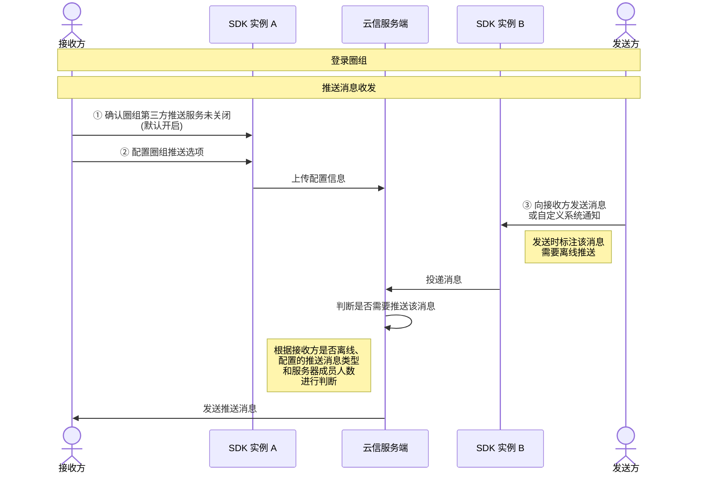

<!--keywords: 推送,圈组推送,消息推送,圈组消息推送 -->


圈组支持接收方在**个人使用的多个维度**（设备、圈组服务器和频道）配置需要接收的**推送消息类型**，也支持**发送方**在发消息或自定义系统通知时决定该消息或系统通知是否需要推送并配置推送文案。

NIM SDK 的[`QChatPushService`](https://doc.yunxin.163.com/messaging/references/flutter/dartdoc/Latest/zh/nim_core/QChatPushService-class.html)类提供了设备维度的圈组推送服务接口，[`QChatServerService`](https://doc.yunxin.163.com/messaging/references/flutter/dartdoc/Latest/zh/nim_core/QChatServerService-class.html)类提供圈组服务器维度的推送配置方法，[`QChatChannelService`](https://doc.yunxin.163.com/messaging/references/flutter/dartdoc/Latest/zh/nim_core/QChatChannelService-class.html)类提供频道维度的推送配置方法。


## 功能介绍


圈组根据消息优先级和推送范围的大小确定消息是否离线推送，具体推送机制见下图。


上图中，推送消息被分为高中低优先级三种类型：
- 高优先级消息：@指定人（有具体目标、有@意愿）。对于被@的用户而言，该消息为高优消息。
- 中优先级消息：@所有人、@指定身份组（没有具体目标、有@意愿）。
- 低优先级消息：普通消息（没有具体目标、没有@意愿）。

::: note notice
消息优先级基于**消息接收者**判断。如某消息@A用户，那么对于A用户来说该消息为高优消息，而对于除A外的其他圈组服务器成员而言，该消息为低优消息（普通消息）。
:::

<br>

NIM SDK 支持通过[`QChatPushMsgType`](https://doc.yunxin.163.com/messaging/references/flutter/dartdoc/Latest/zh/nim_core/QChatPushMsgType.html)枚举配置需要接收的**推送消息类型**，具体枚举值如下：


<div style="width:150px">枚举值</div> | 说明
---- | --------------
`all`| 接收全部类型的推送消息
`highLevel`| 只接收高优先级的推送消息
`highMidLevel` | 只接收高优先级和中优先级的推送消息
`inherit` | 继承**用户个人使用**的上一个维度的推送消息类型配置，具体维度从上到下为设备维度、服务器维度和频道维度。例如，如果设备维度的推送消息类型设置为`all`的情况下，服务器维度的推送消息类型设置为`inherit`，那么服务器维度的推送消息类型实际也为`all`，即接收全部类型的推送消息
`none`  | 全部推送消息都不接收

推送消息类型可在**用户个人使用**的不同维度配置，包括设备维度、服务器维度和频道维度。

- 如果多个维度同时配置了推送消息类型，最终接收方能够收到的推送消息类型取决于维度的优先级。

    不同维度的优先级为**频道>服务器>设备**。最终实际生效的推送消息类型，为 **最高优维度** 的配置。
    
- 圈组在设备维度的推送消息类型默认为“接收全部类型的推送消息”（`all`），在其他维度的推送消息类型默认为“继承上一维度的推送消息类型配置”（`inherit`)。具体的“继承”示例，可参见本文末尾的[常见问题](#常见问题)。


::: note notice
- 服务器成员数**大于或等于** 2000 人阈值时，即使接收方将推送消息类型设置为“接收全部类型的消息推送”(`all`)，也无法收到低优先级消息的离线推送。 
- 如果接收方离线而且消息不走推送，接收方可通过[查询历史消息](https://doc.yunxin.163.com/messaging/docs/DA2NDkwODc?platform=flutter)的方式获取离线消息。
:::


## 前提条件

在实现圈组的离线推送前，请确保：

- 已了解消息被推送前的流转过程，具体见[图解圈组消息流转](https://doc.yunxin.163.com/messaging/docs/jMzNjg0MjA?platform=flutter)。
- 已在初始化 SDK 时完成第三方推送相关基础配置，包括：
    - [推送渠道的选择](https://doc.yunxin.163.com/messaging/docs/DMxNjIwMTc?platform=flutter#%E6%8E%A8%E9%80%81%E6%B8%A0%E9%81%93%E7%9A%84%E9%80%89%E6%8B%A9)
    - 各第三方推送的相关配置（如添加推送证书名），具体请参见[小米推送](https://doc.yunxin.163.com/messaging/docs/DMxNjIwMTc?platform=flutter#%E5%B0%8F%E7%B1%B3%E6%8E%A8%E9%80%81)、[华为推送](https://doc.yunxin.163.com/messaging/docs/DMxNjIwMTc?platform=flutter#%E5%8D%8E%E4%B8%BA%E6%8E%A8%E9%80%81)、[VIVO 推送](https://doc.yunxin.163.com/messaging/docs/DMxNjIwMTc?platform=flutter#VIVO%E6%8E%A8%E9%80%81)、[OPPO 推送](https://doc.yunxin.163.com/messaging/docs/DMxNjIwMTc?platform=flutter#OPPO%E6%8E%A8%E9%80%81)、[魅族推送](https://doc.yunxin.163.com/messaging/docs/DMxNjIwMTc?platform=flutter#%E9%AD%85%E6%97%8F%E6%8E%A8%E9%80%81)或[谷歌推送](https://doc.yunxin.163.com/messaging/docs/DMxNjIwMTc?platform=flutter#%E8%B0%B7%E6%AD%8C%E6%8E%A8%E9%80%81)。


## 实现圈组消息推送

实现圈组消息推送的流程如下图所示。




### **步骤1：接收方开启第三方推送服务**

接收方确认**未关闭**圈组的第三方推送服务（仅限 Android）。该服务**默认开启**。

如需关闭，接收方可调用[`enableAndroid`](https://doc.yunxin.163.com/messaging/references/flutter/dartdoc/Latest/zh/nim_core/QChatPushService/enableAndroid.html)方法关闭。

```dart
NimCore.instance.qChatPushService.enableAndroid(true).then((value) {
  if (value.isSuccess) {
    // 开启圈组推送成功
  } else {
    // 开启圈组推送失败
  }
});
```


### **步骤2：接收方配置圈组推送选项**

接收方开启圈组的第三方推送服务后，还可按需配置其他选项，包括推送免打扰、不展示推送文案详情、需要接收的推送消息类型等。


#### **圈组推送配置**

调用[`setPushConfig`](https://doc.yunxin.163.com/messaging/references/flutter/dartdoc/Latest/zh/nim_core/QChatPushService/setPushConfig.html)方法配置圈组是否开启推送免打扰（若开启，默认免打扰时段为 22：00-08：00，可修改）、是否不显示推送文案详情以及**设备维度（即当前设备）**需要接收的**推送消息类型**。

::: note note
- 如果不展示推送文案详情，默认的推送文案为“你收到一条新消息”。
- 设备维度的推送消息类型，默认为`all`，即“接收圈组所有的离线消息推送”。
:::


示例代码如下：

```dart
final param = QChatPushConfig(
  isPushShowNoDetail: false,
  isNoDisturbOpen: true,
  startNoDisturbTime: '00:00',
  stopNoDisturbTime: '08:30',
  pushMsgType: QChatPushMsgType.all);
NimCore.instance.qChatPushService.setPushConfig(param).then((value) {
  if (value.isSuccess) {
    // 设置圈组推送配置成功
  } else {
    // 设置圈组推送配置失败
  }
});
```


#### **服务器维度的推送消息类型**

调用[`updateUserServerPushConfig`](https://doc.yunxin.163.com/messaging/references/flutter/dartdoc/Latest/zh/nim_core/QChatServerService/updateUserServerPushConfig.html)方法更新**用户个人**在某个服务器下需要接收的**推送消息类型**。

::: note note
- 服务器维度的推送消息类型默认为`inherit`，即继承设备维度的推送消息类型配置。
- 具体的更新配置示例，参见本文末尾的[常见问题](#常见问题)。
:::

<br>

示例代码如下：

```dart
final param = QChatUpdateUserServerPushConfigParam(serverId, QChatPushMsgType.all);
NimCore.instance.qChatServerService.updateUserServerPushConfig(param).then((value) {
  if (value.isSuccess) {
    // 操作成功
  } else {
    // 操作失败
  }
});
```


#### **频道维度的推送消息类型**


调用[`updateUserChannelPushConfig`](https://doc.yunxin.163.com/messaging/references/flutter/dartdoc/Latest/zh/nim_core/QChatChannelService/updateUserChannelPushConfig.html)方法更新**用户个人**在某个频道下需要接收的**推送消息类型**。


::: note note
- 频道维度的推送消息类型默认为`inherit`，即继承设备维度的推送消息类型配置。
- 具体的更新配置示例，参见本文末尾的[常见问题](#常见问题)。
:::

<br>

示例代码如下：

```dart
final param = QChatUpdateUserChannelPushConfigParam(
  serverId: serverId,
  channelId: channelId,
  pushMsgType: QChatPushMsgType.all);
NimCore.instance.qChatChannelService.updateUserChannelPushConfig(param).then((value) {
  if (value.isSuccess) {
    // 操作成功
  } else {
    // 操作失败
  }
});
```


### **步骤3：发送方发消息时配置推送**


发送方在调用[`sendMessage`](https://doc.yunxin.163.com/messaging/references/flutter/dartdoc/Latest/zh/nim_core/QChatMessageService/sendMessage.html)方法[发送某条消息](https://doc.yunxin.163.com/messaging/docs/jUzMDAyNDU?platform=flutter#实现消息收发)时，或调用[`sendSystemNotification`](https://doc.yunxin.163.com/messaging/references/flutter/dartdoc/Latest/zh/nim_core/QChatMessageService/sendSystemNotification.html)方法发送自定义系统通知时，确认入参`pushEnable`设置为 true，即该消息需要在接收方离线的情况下推送给接收方。

::: note note
`pushEnable`默认为 true，即圈组的消息默认需要推送。
:::

<br>

用户发送消息或自定义系统通知时还可进行如下配置：


参数 |说明
---- | -------------- 
`needPushNick`  | 是否需要推送昵称，默认为用户昵称
`pushContent` | 设置推送文案，长度限制 500 字符，消息撤回时该字段无效
`pushPayload` | 设置推送的 payload，长度限制 2000 字符。消息撤回时该字段无效。可通过设置消息体的 payload 实现点击推送通知栏跳转至目标界面（相关说明可参考[推送通知栏跳转](https://doc.yunxin.163.com/messaging/docs/DMxNjIwMTc?platform=flutter#推送通知栏跳转)）


## 获取圈组推送配置

接收方配置了上文的[圈组推送选项](https://doc.yunxin.163.com/messaging/docs/jQwMDExODc?platform=flutter#步骤2接收方配置圈组推送选项)后，在其他设备端登录时，可按需调用如下方法获取相应的配置。 


### 获取是否已开启第三方推送

调用[`isEnableAndroid`](https://doc.yunxin.163.com/messaging/references/flutter/dartdoc/Latest/zh/nim_core/QChatPushService/isEnableAndroid.html)方法，判断是否已经开启了圈组的 Android 第三方推送服务。

### 获取圈组推送配置


调用[`getPushConfig`](https://doc.yunxin.163.com/messaging/references/flutter/dartdoc/Latest/zh/nim_core/QChatPushService/getPushConfig.html)方法获取圈组的推送配置，包括是否开启推送免打扰、是否不展示推送文案详情和**设备维度的推送消息类型**。

```dart
NimCore.instance.qChatPushService.getPushConfig().then((value) {
  if (value.isSuccess) {
    // 获取圈组推送配置成功
    var config = value.data;
  } else {
    // 获取圈组推送配置失败
  }
});
```


### 获取服务器维度的推送配置列表
调用[`getUserServerPushConfigs`](https://doc.yunxin.163.com/messaging/references/flutter/dartdoc/Latest/zh/nim_core/QChatServerService/getUserServerPushConfigs.html)方法查询多个服务器的推送配置列表。 


::: note notice
单次调用最多可传入 10 个服务器 ID 进行查询。
:::

示例代码如下：

```dart
final serverIdList = getServerIdList();
final param = QChatGetUserServerPushConfigsParam(serverIdList);
NimCore.instance.qChatServerService.getUserServerPushConfigs(param).then((value) {
  if (value.isSuccess) {
    // 操作成功
    var userPushConfigs = value.data?.userPushConfigs;
  } else {
    // 操作失败
  }
});
```


### 获取频道维度的推送配置列表

调用[`getUserChannelPushConfigs`](https://doc.yunxin.163.com/messaging/references/flutter/dartdoc/Latest/zh/nim_core/QChatChannelService/getUserChannelPushConfigs.html)获取多个频道的推送配置列表。

::: note notice
单次调用最多可传入 10 个频道 ID 进行查询。
:::


示例代码如下：

```dart
final channelIdInfos = getChannelIdInfos();
final param = QChatGetUserChannelPushConfigsParam(channelIdInfos);
NimCore.instance.qChatChannelService.getUserChannelPushConfigs(param).then((value) {
  if (value.isSuccess) {
    // 操作成功
    var userPushConfigs = value.data?.userPushConfigs;
  } else {
    // 操作失败
  }
});
```


## 常见问题

### 1. 如何实现不接收某个服务器的离线消息推送？

调用[`updateUserServerPushConfig`](https://doc.yunxin.163.com/messaging/references/flutter/dartdoc/Latest/zh/nim_core/QChatServerService/updateUserServerPushConfig.html)方法时，通过`serverId`指定需要静默的服务器的 ID，并将`pushMsgType`设置为`none`。调用成功后，该用户将不再接收指定服务器的离线消息推送。 


### 2. 如何实现只接收某个服务器的高优离线消息推送？


用户**首次**配置圈组的离线消息推送时，按照如下步骤配置即可：

1. 调用[`setPushConfig`](https://doc.yunxin.163.com/messaging/references/flutter/dartdoc/Latest/zh/nim_core/QChatPushService/setPushConfig.html)方法更新设备维度的推送配置，调用时将`pushMsgType`设置为`none`。


    本步骤完成后，**用户个人使用**的设备维度和服务器维度的推送消息类型配置，具体如下：

    用户个人使用的维度  | 推送消息类型 |  实际生效 |说明
    ---- |----|------
    设备 | `none` | `none` |  当前设备不接收圈组内所有推送消息
    服务器 |默认为`inherit` | `none` | 继承设备维度的配置，即“不接收服务器维度的所有推送消息”

2. 调用[`updateUserServerPushConfig`](https://doc.yunxin.163.com/messaging/references/flutter/dartdoc/Latest/zh/nim_core/QChatServerService/updateUserServerPushConfig.html)方法更新服务器的推送消息配置，调用时完成如下配置：


    <div style="width:160px">参数</div> |  说明
    ---- | -----
    `serverId` | 指定服务器的 ID，假设此处指定的服务器为<font color=red>服务器A</font>
    `pushMsgType` | 设置为`highLevel`


    本步骤完成后，**用户个人使用**的设备维度和服务器维度的推送消息类型配置，具体如下：


    用户个人使用的维度  | 推送消息类型 |  实际生效 |说明
    ---- |----|------
    设备 | `none` | `none` |  当前设备不接收圈组内所有推送消息
    其他服务器 |仍为`inherit` | `NONE` | 继承设备维度的配置，即“不接收服务器维度的所有推送消息”
    <font color=red>服务器A</font>  |  <font color=red>`highLevel`</font> | <font color=red>`highLevel`</font> | 只接收<font color=red>服务器A</font> 内的“@消息”等高优先级的推送消息


### 3. 如何实现不接收某个频道的离线消息推送？


调用[`updateUserChannelPushConfig`](https://doc.yunxin.163.com/messaging/references/flutter/dartdoc/Latest/zh/nim_core/QChatChannelService/updateUserChannelPushConfig.html)方法，调用时通过`serverId`指定频道所属的服务器的ID，并将`pushMsgType`设置为`NONE`。调用成功后，该用户将不再接收指定频道的所有离线消息推送。

### 4. 如何实现只接收某个频道的高优先级离线消息推送？


用户**首次**配置圈组的离线消息推送时，按照如下步骤配置即可：


1. 调用[`setPushConfig`](https://doc.yunxin.163.com/messaging/references/flutter/dartdoc/Latest/zh/nim_core/QChatPushService/setPushConfig.html)方法更新设备维度的推送消息类型配置，**调用时将`pushMsgType`设置为`NONE`**。


    本步骤完成后，**用户个人使用**的各个维度的推送消息类型配置，具体如下：

    用户个人使用的维度  | 推送消息类型 |  实际生效 |说明
    ---- |----|------
    设备 | `none` | `none` |  当前设备不接收圈组内所有推送消息
    服务器 |默认为`inherit` | `none` | 继承设备维度的配置，即在频道所属的服务器“不接收所有推送消息”
    频道分组 |默认为`inherit` | `none` |继承服务器维度的配置，即在频道所属的频道分组“不接收所有推送消息”
    频道 | 默认为`inherit` | `none` | 继承频道分组维度的配置，即在频道“不接收所有推送消息” <note type=note>如果无频道分组，则将直接继承服务器维度的配置。</note>
    


2. 调用[`updateUserChannelPushConfig`](https://doc.yunxin.163.com/messaging/references/flutter/dartdoc/Latest/zh/nim_core/QChatChannelService/updateUserChannelPushConfig.html)方法，调用时完成如下配置：

    <div style="width:160px">参数</div> |  说明
    ---- | -----
    `serverId` | 指定频道所属的服务器的 ID
    `channelId` | 指定需要接收高优推送消息的频道的 ID，<font color=red>假设此处指定的为频道A</font>
    `pushMsgType` | 设置为`highLevel`


    本步骤完成后，**用户个人使用**的各个维度的推送消息类型配置，将如下表所示：

    用户个人使用的维度  | <div style="width:160px">推送消息类型</div> |  <div style="width:120px">实际生效</div> |说明
    ---- |----|------
    设备 | `none` | `none` |  当前设备不接收圈组内所有推送消息
    服务器 |仍为`inherit` | `none` | 继承设备维度的配置，即在频道所属的服务器“不接收所有推送消息”
    频道分组 |仍为`inherit` | `none` |继承服务器维度的配置，即在频道所属的频道分组“不接收所有推送消息”
    <font color=red>频道A</font> | <font color=red>`highLevel`</font> | <font color=red>`highLevel`</font> | 只接收<font color=red>频道A</font> 内的“@消息”等高优先级的推送消息
    服务器的其他频道 | 仍为`inherit` | `none` |继承服务器维度的配置，即“不接收频道内所有推送消息”
    


