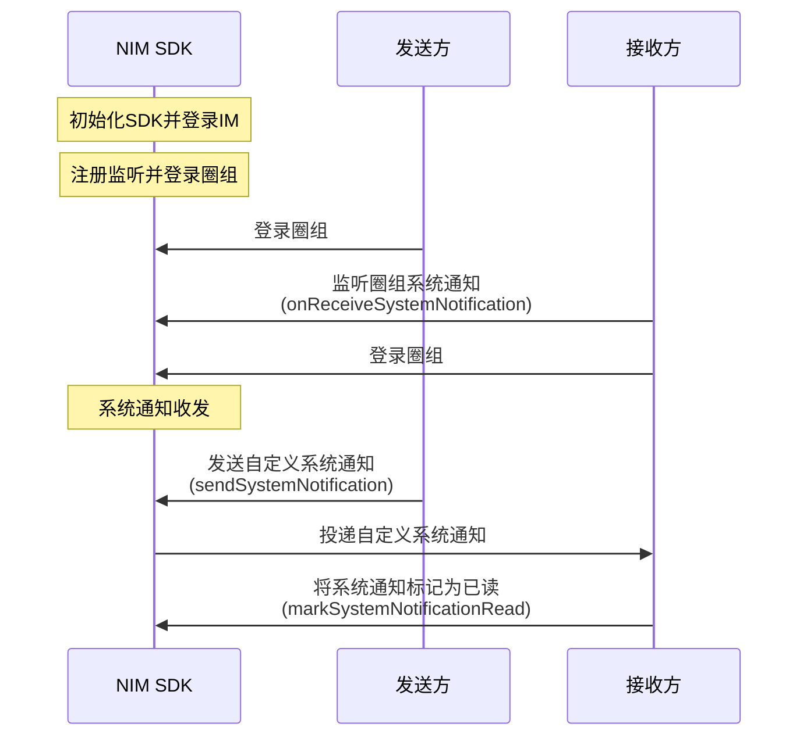

本文介绍如何实现圈组系统通知的收发。 


## 前提条件

已登录圈组。 


::: note important
如果用户所在服务器的成员人数超过 2000 人阈值，该用户还需先订阅相应的服务器或频道，才能收到对应服务器或频道的系统通知。如未超过该阈值，则无需订阅。订阅相关说明，请参见<a href="https://doc.yunxin.163.com/messaging/docs/DM5NTc4NTU?platform=flutter" target="_blank">圈组订阅机制</a>。
:::

## 实现流程

### 接收圈组内置系统通知


圈组的内置系统通知在圈组内置事件发生时触发，用户若要接收内置系统通知，需满足如下条件：

- 已在登录前注册<a href="https://doc.yunxin.163.com/messaging/references/flutter/dartdoc/Latest/zh/nim_core/QChatObserver/onReceiveSystemNotification.html" target="_blank">`onReceiveSystemNotification`</a>圈组系统通知回调。
- 为该事件的参与者或者观察者（两者接收通知的条件不同）。
- 符合接收条件。

::: note note
具体**事件类型**和相应的通知**接收条件**，请参见<a href="https://doc.yunxin.163.com/messaging/docs/TkxMzc1NDg?platform=server#内置系统通知类型" target="_blank">内置系统通知类型</a>。
:::

<br>

注册该回调的示例代码如下：


```
 NimCore.instance.qChatObserver.onReceiveSystemNotification.listen((event) { 
      //todo received system notification
    });
```


### 收发圈组自定义系统通知

NIM SDK 的<a href="https://doc.yunxin.163.com/messaging/references/flutter/dartdoc/Latest/zh/nim_core/QChatMessageService-class.html" target="_blank">`QChatMessageService`</a>类提供发送自定义系统通知的方法。 

#### API调用时序



#### 流程说明

本节仅对上图中标为部分的流程进行说明。

1. 接收方在登录圈组前，注册<a href="https://doc.yunxin.163.com/messaging/references/flutter/dartdoc/Latest/zh/nim_core/QChatObserver/onReceiveSystemNotification.html" target="_blank">`onReceiveSystemNotification`</a>圈组系统通知回调。
2. 发送方调用<a href="https://doc.yunxin.163.com/messaging/references/flutter/dartdoc/Latest/zh/nim_core/QChatMessageService/sendSystemNotification.html" target="_blank">`sendSystemNotification`</a>方法发送自定义系统通知。

    调用时可设置发送给 4 种不同的对象类型：
    
    - 如果只传入服务器ID（`serverId`），则发送给指定服务器下的所有成员
    - 如果传入服务器ID（`serverId`）和频道ID（`channelId`），则发送给指定服务器下指定某个频道下的所有成员
    - 如果传入服务器ID（`serverId`）和用户 IM 账号列表（`toAccids`），则发送给指定服务器下的指定用户
    - 如果传入服务器ID（`serverId`）+ 频道ID（`channelId`）+ 用户 IM 账号列表（`toAccids`），则发送给指定服务器下指定频道里的指定用户

    示例代码如下：

    
    ```
    var paramSendSys = QChatSendSystemNotificationParam(serverId: serverId);
    NimCore.instance.qChatMessageService.sendSystemNotification(paramSendSys).then((value){
      if(value.isSuccess){
        //todo system notification send success
      }
    });
    ```


3. `onReceiveSystemNotification`回调触发，接收方通过该回调收到自定义系统通知。

4. 接收方可调用<a href="https://doc.yunxin.163.com/messaging/references/flutter/dartdoc/Latest/zh/nim_core/QChatMessageService/markSystemNotificationsRead.html" target="_blank">`markSystemNotificationRead`</a>方法将系统通知标记为已读。


    ::: note notice
    标记已读后的系统通知将从服务端删除，其他端后续不会再收到该系统通知。
    :::

    <br>


    示例代码如下：


    ```
    var paramSysMark = QChatMarkSystemNotificationsReadParam(pairs);
      NimCore.instance.qChatMessageService.markSystemNotificationsRead(paramSysMark).then((value){
        if(value.isSuccess){
          //todo system notification mark success
        }
      });
    ```


### 重发自定义系统通知


如果用户发送自定义系统通知失败，可调用<a href="https://doc.yunxin.163.com/messaging/references/flutter/dartdoc/Latest/zh/nim_core/QChatMessageService/resendSystemNotification.html" target="_blank">`resendSystemNotification`</a>方法重发自定义系统通知。


::: note notice
重发已经发送成功的自定义系统通知，通知接收方不会再次收到系统通知。
:::

<br>

示例代码如下：

```
var paramResendSys = QChatResendSystemNotificationParam(systemNotification)
    NimCore.instance.qChatMessageService.resendSystemNotification(paramResendSys).then((value){
      if(value.isSuccess){
        //todo system notification resend success
      }
    });
```


