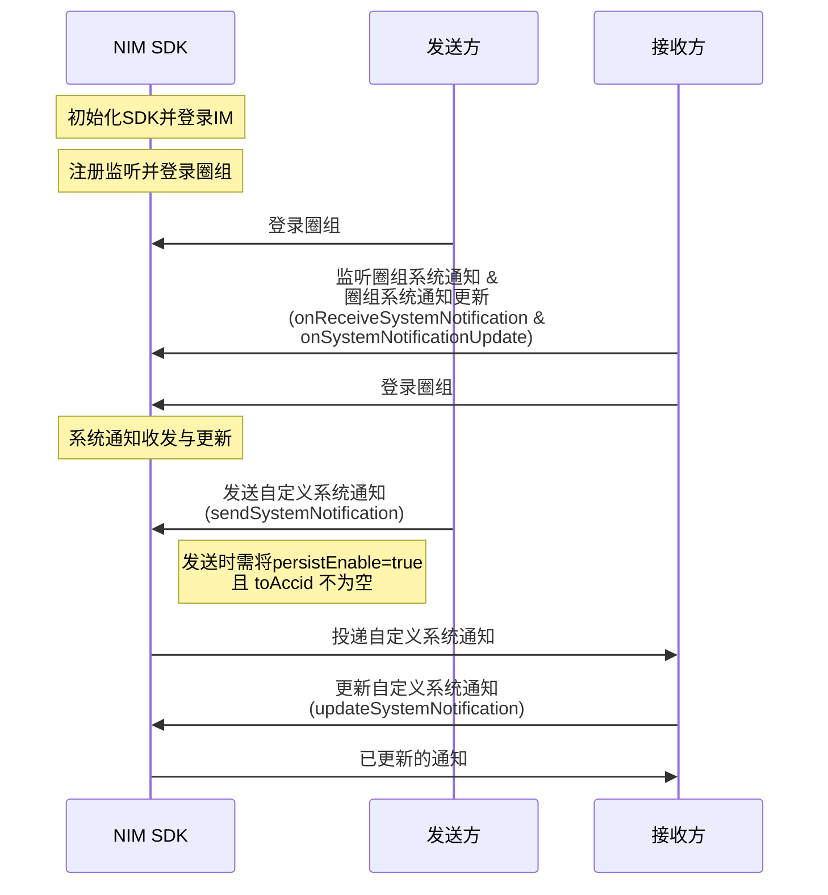
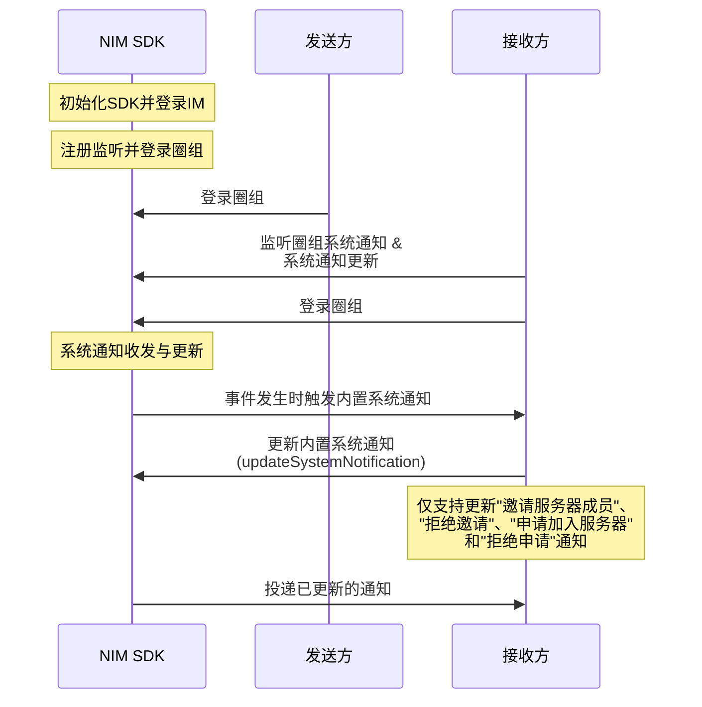

本文介绍如何使用 NIM SDK 的接口，实现系统通知的更新。

## 应用场景


如果系统通知已存离线，接收者可更新系统通知的内容或状态，从而可以下次登录或者换设备登录时获取更新的离线通知。典型终端用户场景：将系统通知（如邀请加入圈组服务器的通知）置为待办。


## 功能介绍

用户可通过<a href="https://doc.yunxin.163.com/messaging/references/flutter/dartdoc/Latest/zh/nim_core/QChatMessageService-class.html" target="_blank">`QChatMessageService`</a>类下的`updateSystemNotification`方法更新如下表格中所列的自定义系统通知和四种内置系统通知的部分信息，例如系统通知中的内容和自定义扩展字段。


系统通知分类 || [QChatSystemNotificationType ](https://doc.yunxin.163.com/messaging/references/flutter/dartdoc/Latest/zh/nim_core/QChatSystemNotificationType.html)的枚举值   | 相关限制
---- | --------------
内置系统通知|邀请服务器成员 | `server_member_invite` | 默认自动存离线。这四种通知每月总共至多存 1000 条离线，**超限后将无法更新通知的信息**
^^|邀请被拒绝  | `server_member_invite_reject`|^^
^^|申请加入服务器 |`server_member_apply` | ^^
^^ |申请被拒绝 |`server_member_apply_reject` | ^^
自定义系统通知|| `custom` |  只有**存离线**的自定义系统通知才能更新。每月至多存 1000 条离线，**超限后将无法更新通知的信息**

::: note notice
其他内置系统通知，不支持更新。具体的内置系统通知类型，请参见<a href="https://doc.yunxin.163.com/messaging/docs/TkxMzc1NDg?platform=server#内置系统通知类型" target="_blank">内置系统通知类型</a>。
:::


## 前提条件

已登录圈组。 


::: note important
如果用户所在服务器的成员人数超过 2000 人阈值，该用户还需先订阅相应的服务器或频道，才能收到对应服务器或频道的系统通知。如未超过该阈值，则无需订阅。订阅相关说明，请参见<a href="https://doc.yunxin.163.com/messaging/docs/DM5NTc4NTU?platform=flutter" target="_blank">圈组订阅机制</a>。
:::

## 实现流程


### API 调用时序


自定义系统通知更新：



内置系统通知更新：



### 流程说明

本节仅对以上时序图中标为部分的步骤进行介绍。

1. 接收方在登录圈组前，注册<a href="https://doc.yunxin.163.com/messaging/references/flutter/dartdoc/Latest/zh/nim_core/QChatObserver/onReceiveSystemNotification.html" target="_blank">`onReceiveSystemNotification`</a>圈组系统通知回调 和 <a href="https://doc.yunxin.163.com/messaging/references/flutter/dartdoc/Latest/zh/nim_core/QChatObserver/onSystemNotificationUpdate.html" target="_blank">`onSystemNotificationUpdate`</a>圈组系统通知更新回调。 


    示例代码如下：

    :::::: div custom-tabs
    ::: tab 圈组系统通知回调
    ```
    NimCore.instance.qChatObserver.onReceiveSystemNotification.listen((event) {
      //todo received system notification
    });
    ```

    :::

    ::: tab 圈组系统通知更新回调
    ```
     NimCore.instance.qChatObserver.onSystemNotificationUpdate.listen((event) {
      //todo received system notification updated
    });
    ```
    :::
    ::::::

2. 发送方调用[`sendSystemNotificaiton`](https://doc.yunxin.163.com/messaging/references/flutter/dartdoc/Latest/zh/nim_core/QChatMessageService/sendSystemNotification.html)方法发送自定义系统通知，调用时需将[`persistEnable`](https://doc.yunxin.163.com/messaging/references/flutter/dartdoc/Latest/zh/nim_core/QChatSendSystemNotificationParam/persistEnable.html)设置为 true，且[`toAccid`](https://doc.yunxin.163.com/messaging/references/flutter/dartdoc/Latest/zh/nim_core/QChatSendSystemNotificationParam/toAccids.html)不为空。 

3. 发送方调用<a href="https://doc.yunxin.163.com/messaging/references/flutter/dartdoc/Latest/zh/nim_core/QChatMessageService/updateSystemNotification.html" target="_blank">`updateSystemNotification`</a>方法更新系统通知。

    必须传入更新操作通用参数`updateParam`、系统通知服务端 ID `msgIdServer`(全局唯一)、系统通知类型`type`。可以修改系统通知中的内容、自定义扩展和状态。
    
    ::: note notice 
    仅自定义系统通知类型才可以更改状态值，且必须大于等于 10000，否则会返回 414 错误码。
    :::

    <br>

    示例代码如下：

    ```
    var paramUpdateSys = QChatUpdateSystemNotificationParam(updateParam: updateParam, msgIdServer: msgIdServer, type: type);
        NimCore.instance.qChatMessageService.updateSystemNotification(paramUpdateSys).then((value){
          if(value.isSuccess){
            //todo system notification update success
          }
        });
    ```
    


    