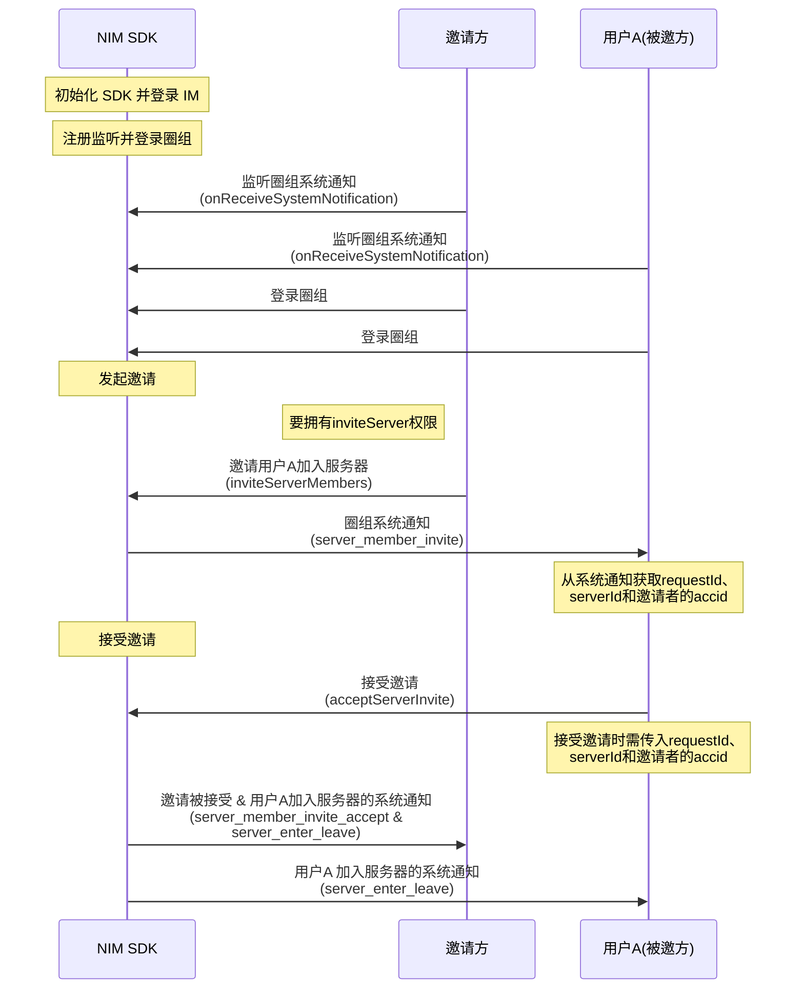
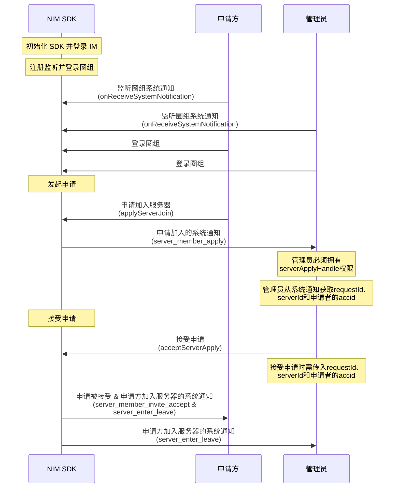

NIM SDK 的<a href="https://doc.yunxin.163.com/messaging/references/flutter/dartdoc/Latest/zh/nim_core/QChatServerService-class.html" target="_blank">`QChatServerService`</a>类提供了管理服务器成员的方法，包括加入服务器、离开服务器和将成员踢出服务器等。

## 服务器成员定义

SDK 的<a href="https://doc.yunxin.163.com/messaging/references/flutter/dartdoc/Latest/zh/nim_core/QChatServerMember-class.html" target="_blank">`QChatServerMember`</a>类定义了服务器成员。该类的成员参数如下：

<details><summary>单击展开查看 QChatServerMember 的成员参数</summary>

参数 | 类型 | 说明
---- | -------------- | ---------
`accid`| String | 成员的云信 IM 账号
`avatar`| String | 成员在服务器内展示的头像
`createTime` |int |  服务器创建时间
`custom` | String  | 成员的自定义扩展字段
`inviter` | String | 邀请当前成员加入服务器的用户
`joinTime`| int | 成员加入服务器的时间
`nick` | String | 成员昵称
`serverId` | int | 服务器 ID 
`type` | `QChatMemberType` | 成员类型：<ul><li>`QChatMemberType.normal`：普通成员</li><li>`QChatMemberType.owner`：服务器所有者，默认为服务器创建者</li></ul>
`updateTime` | int | 更新时间
`valid` | bool | 有效标志

</details>


## 使用限制

服务器存在如下与其成员数量相关的限制：

- 单个用户的服务器的数量上限（包括自己创建的和加入的）默认为 100 个。 
- 单个服务器可容纳人数上限默认为 500000。

若需要扩展上限，可在控制台配置圈组子功能项（**单个用户 server 数** 和 **单 server 容纳人数**），具体请参考[开通和配置圈组功能](https://doc.yunxin.163.com/messaging/docs/DE2MDA5NzA?platform=flutter)。


## 前提条件

在开始调用相关方法前，请确保：
- <a href="https://doc.yunxin.163.com/messaging/docs/DA3NDAwODI?platform=flutter#创建服务器" target="_blank">服务器已创建</a>。
- 已注册[`onReceiveSystemNotification`](https://doc.yunxin.163.com/messaging/references/flutter/dartdoc/Latest/zh/nim_core/QChatObserver/onReceiveSystemNotification.html)事件流，监听系统通知的接收。

  具体**与服务器成员管理相关**的系统通知类型，见本文末尾的[相关系统通知](#相关系统通知)。


## 实现方法


### 加入服务器

#### 邀请用户加入

拥有“邀请他人加入服务器的权限”（`inviteServer`）的用户，可邀请其他用户加入服务器。

::: note notice 
如果没有该权限，无法成功发起邀请。服务器所有者默认拥有全部权限。权限通过身份组进行配置和管理，具体请参见<a href="https://doc.yunxin.163.com/messaging/docs/TM0ODY3Mjk?platform=flutter" target="_blank">身份组概述</a>及其他身份组相关文档。
:::

<br>

根据服务器的不同邀请模式（[`inviteMode`](https://doc.yunxin.163.com/messaging/references/flutter/dartdoc/Latest/zh/nim_core/QChatCreateServerParam/inviteMode.html)），被邀者成功加入服务器的流程略有不同。服务器的邀请模式，在创建服务器时配置，创建后也可修改。

:::::: div custom-tabs 
::: tab “邀请需要同意”模式

如果服务器的邀请模式被设置为“邀请需要同意”，那么被邀方需要接受邀请才能加入服务器。

**API 调用时序**



**流程说明**

1. 用户A 调用<a href="https://doc.yunxin.163.com/messaging/references/flutter/dartdoc/Latest/zh/nim_core/QChatServerService/inviteServerMembers.html" target="_blank">`inviteServerMembers`</a>方法邀请多位用户加入服务器。

    发起邀请后，被邀方将收到邀请服务器成员的系统通知。


    <br>
    
    示例代码如下：
    ```dart
    final param = QChatInviteServerMembersParam(serverId, [accId1, accId2])
      ..postscript = "邀请你加入测试服务器";
    NimCore.instance.qChatServerService.inviteServerMembers(param).then((value) {
      if (value.isSuccess) {
        // 邀请成功,会返回因为用户服务器数量超限导致失败的accid列表
        var servers = value.data?.failedAccids;
      } else {
        // 邀请失败
      }
    });
    ```

2. 被邀方接受或拒绝邀请。

    - 调用<a href="https://doc.yunxin.163.com/messaging/references/flutter/dartdoc/Latest/zh/nim_core/QChatServerService/acceptServerInvite.html" target="_blank">`acceptServerInvite`</a>方法接受邀请加入服务器。

        示例代码如下：
        ```dart
        // 邀请唯一标识requestId可以从邀请服务器成员系统通知附件中获取
        final param = QChatAcceptServerInviteParam(serverId, accid, requestId);
        NimCore.instance.qChatServerService.acceptServerInvite(param).then((value) {
          if (value.isSuccess) {
            // 接受邀请成功
          } else {
            // 接受邀请失败
          }
        });
        ```


    - 调用<a href="https://doc.yunxin.163.com/messaging/references/flutter/dartdoc/Latest/zh/nim_core/QChatServerService/rejectServerInvite.html" target="_blank">`rejectServerInvite`</a>方法拒绝邀请。
    
        示例代码如下：
        ```dart
        // 邀请唯一标识requestId可以从邀请服务器成员系统通知附件中获取
        final param = QChatRejectServerInviteParam(serverId, accid, requestId)
          ..postscript = "拒绝邀请";
        NimCore.instance.qChatServerService.rejectServerInvite(param).then((value) {
          if (value.isSuccess) {
            // 拒绝邀请成功
          } else {
            // 拒绝邀请失败
          }
        });
        ```


:::
::: tab “邀请不需要同意”模式

如果服务器的邀请模式被设置为“邀请不需要同意”，那么邀请方调用<a href="https://doc.yunxin.163.com/messaging/references/flutter/dartdoc/Latest/zh/nim_core/QChatServerService/inviteServerMembers.html" target="_blank">`inviteServerMembers`</a>方法方法发起邀请后，被邀请方自动加入服务器。

示例代码如下：

```dart
final param = QChatInviteServerMembersParam(serverId, [accId1, accId2])
  ..postscript = "邀请你加入测试服务器";
NimCore.instance.qChatServerService.inviteServerMembers(param).then((value) {
  if (value.isSuccess) {
    // 邀请成功,会返回因为用户服务器数量超限导致失败的accid列表
    var servers = value.data?.failedAccids;
  } else {
    // 邀请失败
  }
});
```


:::
::::::


#### 申请加入

用户也可以主动申请加入某个服务器。根据服务器的不同申请模式，申请方成功加入服务器的流程略有不同。

:::::: div custom-tabs 
::: tab “申请需要同意”模式

**API 调用时序**



**流程说明**

1. 申请方调用<a href="https://doc.yunxin.163.com/messaging/references/flutter/dartdoc/Latest/zh/nim_core/QChatServerService/applyServerJoin.html" target="_blank">`applyServerJoin`</a>方法主动申请加入某个服务器。发起申请后，该服务器内拥有“处理加入服务器申请的权限”（`serverApplyHandle`）的用户将收到申请通知。

    示例代码如下：
    ```dart
    final param = QChatApplyServerJoinParam(serverId)
      ..postscript = "申请加入服务器";
    NimCore.instance.qChatServerService.applyServerJoin(param).then((value) {
      if (value.isSuccess) {
        // 申请加入服务器成功
      } else {
        // 申请加入服务器失败
      }
    });
    ```

2. 收到申请通知的用户接受或拒绝申请。申请被同意，申请方才能加入服务器。

    ::: note notice
    接受或拒绝申请，需要拥有“处理加入服务器申请的权限”（`serverApplyHandle`）。权限通过身份组进行配置和管理，具体请参见<a href="https://doc.yunxin.163.com/messaging/docs/TM0ODY3Mjk?platform=flutter" target="_blank">身份组概述</a>及其他身份组相关文档。
    :::

    - 调用<a href="https://doc.yunxin.163.com/messaging/references/flutter/dartdoc/Latest/zh/nim_core/QChatServerService/acceptServerApply.html" target="_blank">`acceptServerApply`</a>方法接受申请。

        示例代码如下：
        ```dart
        // 申请唯一标识requestId可以从申请加入服务器系统通知附件中获取
        final param = QChatAcceptServerApplyParam(serverId, accid, requestId);
        NimCore.instance.qChatServerService.acceptServerApply(param).then((value) {
          if (value.isSuccess) {
            // 接受申请成功
          } else {
            // 接受申请失败
          }
        });
        ```


    - 调用<a href="https://doc.yunxin.163.com/messaging/references/flutter/dartdoc/Latest/zh/nim_core/QChatServerService/rejectServerApply.html" target="_blank">`rejectServerApply`</a>方法拒绝申请。
    
        示例代码如下：
        ```dart
        // 申请唯一标识requestId可以从申请加入服务器系统通知附件中获取
        final param = QChatRejectServerApplyParam(serverId, accid, requestId)
          ..postscript = "拒绝申请";
        NimCore.instance.qChatServerService.rejectServerApply(param).then((value) {
          if (value.isSuccess) {
            // 拒绝申请成功
          } else {
            // 拒绝申请失败
          }
        });
        ```


:::

::: tab “申请不需要同意”模式

如果服务器的申请模式被设置为“申请不需要同意”，那么申请方调用<a href="https://doc.yunxin.163.com/messaging/references/flutter/dartdoc/Latest/zh/nim_core/QChatServerService/applyServerJoin.html" target="_blank">`applyServerJoin`</a>方法发起申请后，将自动加入服务器。

示例代码如下：
```dart
final param = QChatApplyServerJoinParam(serverId)
  ..postscript = "申请加入服务器";
NimCore.instance.qChatServerService.applyServerJoin(param).then((value) {
  if (value.isSuccess) {
    // 申请加入服务器成功
  } else {
    // 申请加入服务器失败
  }
});
```


:::

::::::


#### 通过邀请码加入

用户可通过服务器成员分享的邀请码（通过第三方应用分享，如微信）加入服务器。

1. 用户A 调用<a href="https://doc.yunxin.163.com/messaging/references/flutter/dartdoc/Latest/zh/nim_core/QChatServerService/generateInviteCode.html" target="_blank">`generateInviteCode`</a>方法生成邀请码。

    ::: note notice
    拥有“邀请他人加入服务器的权限”（`inviteServer`）的服务器成员才能生成邀请码。权限通过身份组进行配置和管理，具体请参见<a href="https://doc.yunxin.163.com/messaging/docs/TM0ODY3Mjk?platform=flutter" target="_blank">身份组概述</a>及其他身份组相关文档。
    :::

    <br>

    示例代码如下：

    ```dart
    final param = QChatGenerateInviteCodeParam(serverId)
      ..ttl = 24 * 60 * 60 * 1000;//设置过期时间为1天
    NimCore.instance.qChatServerService.generateInviteCode(param).then((value) {
      if (value.isSuccess) {
        // 生成邀请码成功
      } else {
        // 生成邀请码失败
      }
    });
    ```

    

2. 用户B 调用<a href="https://doc.yunxin.163.com/messaging/references/flutter/dartdoc/Latest/zh/nim_core/QChatServerService/joinByInviteCode.html" target="_blank">`joinByInviteCode`</a>方法，通过邀请码加入服务器。 

    示例代码如下：
    
    ```dart
    final param = QChatJoinByInviteCodeParam(serverId, inviteCode);
    NimCore.instance.qChatServerService.joinByInviteCode(param).then((value) {
      if (value.isSuccess) {
        // 通过邀请码加入服务器成功
      } else {
        // 通过邀请码加入服务器失败
      }
    });
    ```
    

### 退出服务器


用户既可以主动退出服务器，也可以被动退出，即被其他用户踢出服务器。


#### 主动退出服务器

加入服务器后如不想继续待在此服务器中，用户可以调用<a href="https://doc.yunxin.163.com/messaging/references/flutter/dartdoc/Latest/zh/nim_core/QChatServerService/leaveServer.html" target="_blank">`leaveServer`</a>方法主动离开。离开后将不再接收该服务器下的消息和通知。

示例代码如下：

```dart
final param = QChatLeaveServerParam(serverId);
NimCore.instance.qChatServerService.leaveServer(param).then((value) {
  if (value.isSuccess) {
    // 离开Server成功
  } else {
    // 离开Serve失败
  }
});
```


#### 踢出服务器成员


调用<a href="https://doc.yunxin.163.com/messaging/references/flutter/dartdoc/Latest/zh/nim_core/QChatServerService/kickServerMembers.html" target="_blank">`kickServerMembers`</a>方法将其他成员踢出服务器。 

::: note notice
调用该接口需拥有“踢出他人权限”（`kickServer`）。权限通过身份组进行配置和管理，具体请参见<a href="https://doc.yunxin.163.com/messaging/docs/TM0ODY3Mjk?platform=flutter" target="_blank">身份组概述</a>及其他身份组相关文档。
:::

<br>

示例代码如下：

```dart
final param = QChatKickServerMembersParam(serverId, [accId1, accId2]);
NimCore.instance.qChatServerService.kickServerMembers(param).then((value) {
  if (value.isSuccess) {
    // 踢除成员成功
  } else {
    // 踢除成员失败
  }
});
```

### 修改成员信息

#### 修改自己的成员信息

调用<a href="https://doc.yunxin.163.com/messaging/references/flutter/dartdoc/Latest/zh/nim_core/QChatServerService/updateMyMemberInfo.html" target="_blank">`updateMyMemberInfo`</a>方法可修改自己在当前服务器的成员信息。

示例代码如下：

```dart
final antiSpamConfig = QChatAntiSpamConfig()
  ..antiSpamBusinessId = "用户配置的对某些资料内容另外的反垃圾的业务ID";
final param = QChatUpdateMyMemberInfoParam(serverId)
  ..nick = "昵称2"
  ..custom = "xxxxx"
  ..antiSpamConfig = antiSpamConfig;
NimCore.instance.qChatServerService.updateMyMemberInfo(param).then((value) {
  if (value.isSuccess) {
    // 修改成员信息成功,返回最新的成员信息
    var member = value.data?.member;
  } else {
    // 修改成员信息失败
  }
});
```

::: note note 
如上示例代码中的`antiSpamBusinessId`用于成员资料的反垃圾（内容审核）配置。更多说明参见[圈组内容审核](https://doc.yunxin.163.com/messaging/docs/TI3ODIzMDM?platform=flutter)
:::

#### 修改他人的服务器成员信息


调用[`updateServerMemberInfo`](https://doc.yunxin.163.com/messaging/references/flutter/dartdoc/Latest/zh/nim_core/QChatServerService/updateServerMemberInfo.html)方法可修改其他成员的信息。

::: note notice 
- 调用该方法需要拥有修改他人成员信息的权限（`QChatRoleResource.ACCOUNT_INFO_OTHER`)。
- 调用该方法时，昵称（`nick`）在 iOS 端**不能**更新为空字符串，Android 端可置为空。用户在 iOS 端设置了昵称后，不支持再将昵称置空。
:::

调用时需传入对应的服务器 ID （`serverId`）、待修改成员的账号（`accid`）以及相应的修改项。支持修改其他成员的昵称和头像，设置反垃圾配置 `QChatAntiSpamConfig`。更多圈组反垃圾相关说明请参见[圈组内容审核](https://doc.yunxin.163.com/messaging/docs/TI3ODIzMDM?platform=flutter)。


示例代码如下：

```dart
final antiSpamConfig = QChatAntiSpamConfig()
  ..antiSpamBusinessId = "用户配置的对某些资料内容另外的反垃圾的业务ID";
final param = QChatUpdateServerMemberInfoParam(serverId, accId, nick: '新昵称')
  ..antiSpamConfig = antiSpamConfig;
NimCore.instance.qChatServerService.updateServerMemberInfo(param).then((value) {
  if (value.isSuccess) {
    // 修改成员信息成功,返回最新的成员信息
    var member = value.data?.member;
  } else {
    // 修改成员信息失败
  }
});
```


### 成员封禁管理


#### 封禁服务器成员

拥有封禁他人权限（`QChatRoleResource.banServerMember`）的用户可调用[`banServerMember`](https://doc.yunxin.163.com/messaging/references/flutter/dartdoc/Latest/zh/nim_core/QChatServerService/banServerMember.html)方法封禁某位服务器成员。调用时需传入服务器 ID（`serverId`）和待封禁成员的账号（`accid`）。

::: note notice
执行封禁操作，必须拥有封禁他人的权限。
:::

被封禁的成员将直接被踢出服务器，且不能再申请加入服务器或被邀请加入服务器。某成员被封禁后，所有该服务器成员都会收到该封禁成员被踢的系统通知（`QChatSystemNotificationType.server_member_kick`）。

示例代码如下：
```dart
final param = QChatBanServerMemberParam(serverId, accId);
NimCore.instance.qChatServerService.banServerMember(param).then((value) {
  if (value.isSuccess) {
    // 操作成功
  } else {
    // 操作失败
  }
});
```


#### 分页查询封禁成员列表


调用[`getBannedServerMembersByPage`](https://doc.yunxin.163.com/messaging/references/flutter/dartdoc/Latest/zh/nim_core/QChatServerService/getBannedServerMembersByPage.html)方法可分页查询某服务器下被封禁的成员列表。


该方法的入参包括服务器 ID （`serverId`）、查询时间戳（`timeTag`）和查询数量限制（`limit`)，`timeTag`传 0 表示当前时间，limit 默认 100。
该方法的回参结构`QChatGetBannedServerMembersByPageResult`返回被封禁成员`QChatBannedServerMember`列表。

`QChatBannedServerMember`参数说明如下：
 参数  | 类型| 说明     |
|  ----  | ----| ----- |
|`serverId`| int | 服务器ID |
|`accid`|String |用户的云信 IM 账号 |
|`custom`| String | 自定义扩展|
|`banTime`| int | 封禁时间|
|`isValid`| bool | 有效标志：false-无效，true-有效|
|`createTime`| int |  创建时间|
|`updateTime`| int |  更新时间|

示例代码如下：

```dart
final param = QChatGetBannedServerMembersByPageParam(serverId, 0);
NimCore.instance.qChatServerService.getBannedServerMembersByPage(param).then((value) {
  if (value.isSuccess) {
    // 操作成功
    var serverMemberBanInfoList = value.data?.serverMemberBanInfoList;
  } else {
    // 操作失败
  }
});
```


#### 解封服务器成员


调用[`unbanServerMember`](https://doc.yunxin.163.com/messaging/references/flutter/dartdoc/Latest/zh/nim_core/QChatServerService/unbanServerMember.html)方法可将已封禁用户解封。调用时需要传入服务器ID（`serverId`）和待解封成员账号（`accid`）。待解封的成员账号，可通过调用[`getBannedServerMembersByPage`](https://doc.yunxin.163.com/messaging/references/flutter/dartdoc/Latest/zh/nim_core/QChatServerService/getBannedServerMembersByPage.html)方法获取。

被解封的用户可正常申请加入服务器或被邀请加入服务器。

::: note notice 
调用该方法需要拥有封禁他人权限（`QChatRoleResource.banServerMember`）。
:::

示例代码如下：

```dart
final param = QChatUnbanServerMemberParam(serverId, accId);
NimCore.instance.qChatServerService.unbanServerMember(param).then((value) {
  if (value.isSuccess) {
    // 操作成功
  } else {
    // 操作失败
  }
});
```


### 查询服务器成员


#### 分页查询服务器成员


用户登录圈组且进入服务器后，如需要获取当前服务器的成员，可调用<a href="https://doc.yunxin.163.com/messaging/references/flutter/dartdoc/Latest/zh/nim_core/QChatServerService/getServerMembersByPage.html" target="_blank">`getServerMembersByPage`</a>方法，按成员加入服务器的时间倒序（由近及远）分页查询服务器成员列表。 

::: note notice
当前时间往前最多可查 100 条成员信息。
:::


示例代码如下：

```dart
// 当前时间往前查最多100条Server成员信息
final param = QChatGetServerMembersByPageParam(serverId, DateTime.now().millisecond, 100);
NimCore.instance.qChatServerService.getServerMembersByPage(param).then((value) {
  if (value.isSuccess) {
    // 查询Server成员信息成功,返回查询到的Server成员信息
    var serverMembers = value.data?.serverMembers;
  } else {
    // 查询Server成员信息失败
  }
});
```


#### 根据账号 ID 查询服务器成员

用户登录圈组且进入服务器后，如果需要检索当前服务器内的成员，可调用<a href="https://doc.yunxin.163.com/messaging/references/flutter/dartdoc/Latest/zh/nim_core/QChatServerService/getServerMembers.html" target="_blank">`getServerMembers`</a>方法来了解相应的成员信息。调用时需传入由成员的 `accid`和服务器 ID 组成的 PairIntWithString 列表。 

示例代码如下：

```dart
var serverIdAccidPairList = [PairIntWithString(serverId, accId1), PairIntWithString(serverId, accId2)];
final param = QChatGetServerMembersParam(serverIdAccidPairList);
NimCore.instance.qChatServerService.getServerMembers(param).then((value) {
  if (value.isSuccess) {
    // 查询Server成员信息成功,返回查询到的Server成员信息
    var serverMembers = value.data?.serverMembers;
  } else {
    // 查询Server成员信息失败
  }
});
```
<div style="display:none">

申请与邀请记录查询


查询服务器记录

调用[`getInviteApplyRecordOfServer`]()方法可查询服务器下的申请与邀请记录。调用时需要传入服务器 ID， 其他参数值可为空。

::: note notice 
调用该方法需要拥有申请邀请历史查看权限（`QChatRoleResource.inviteApplyHistoryQuery`）。
:::


示例代码如下：

<font color=red>麻烦提供示例代码</font>


查询自己的记录

用户如果需要查询自己的申请或邀请记录，可调用[`getInviteApplyRecordOfSelf`]()方法进行查询。 


::: note notice
调用该方法需要拥有申请邀请记录的查看权限（`QChatRoleResource.inviteApplyHistoryQuery `）。
:::

<br>


示例代码如下：

<font color=red>麻烦提供示例代码</font>


</div>


## 相关系统通知

圈组系统通知的类型在[`QChatSystemNotificationType`](https://doc.yunxin.163.com/messaging/references/flutter/dartdoc/Latest/zh/nim_core/QChatSystemNotificationType.html)枚举中定义，与服务器成员管理相关的内置系统通知类型如下：

枚举值| 说明
---- | --------------
`server_member_invite` | 邀请服务器成员
`server_member_invite_reject`| 拒绝邀请
`server_member_apply` | 申请加入服务器
`server_member_apply_reject`| 拒绝申请
`server_member_invite_done` | 用户已被邀请
`server_member_invite_accept` |接受邀请
`server_member_apply_done`| 已申请加入服务器
`server_member_apply_accept` | 申请被接受
`server_member_kick`| 踢除服务器成员
`server_member_leave`| 主动退出服务器
`server_member_update` | 服务器成员的信息更新
`server_member_join_by_invite_code`| 用户通过邀请码加入服务器
`server_enter_leave` |  服务器成员加入或退出服务器

::: note note 
更多圈组系统通知相关说明，请参见[圈组系统通知相关](https://doc.yunxin.163.com/messaging/docs/jI4MzA3MDU?platform=flutter)。
:::