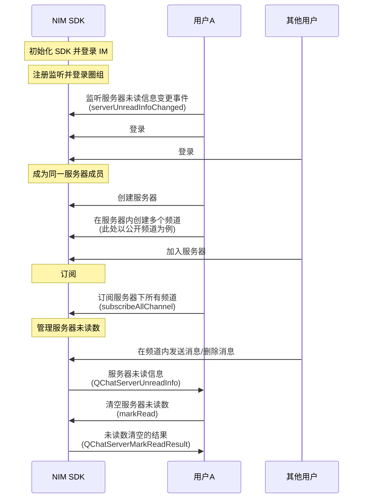

<!--keywords: 未读数, 服务器未读数, 圈组 -->

服务器未读数，指圈组服务器下所有频道的总未读数。网易云信 NIM SDK 的[`QChatServerUnreadInfoChangedEvent`](https://doc.yunxin.163.com/messaging/references/flutter/dartdoc/Latest/zh/nim_core/QChatServerUnreadInfoChangedEvent-class.html)类定义了圈组服务器未读信息变更事件。用户在圈组频道内发送或删除消息后，SDK 触发该事件，事件信息包含未读信息[`QChatServerUnreadInfo`](https://doc.yunxin.163.com/messaging/references/flutter/dartdoc/Latest/zh/nim_core/QChatServerUnreadInfo-class.html)。您可调用[`QChatObserver`](https://doc.yunxin.163.com/messaging/references/flutter/dartdoc/Latest/zh/nim_core/QChatObserver-class.html)类的`serverUnreadInfoChanged `方法监听该事件。 


本文介绍获取服务器未读数并按需清空的实现方法以及相应的示例代码。 

::: note notice
游客接收到的消息无已读未读逻辑。不支持对游客展示消息未读数。
:::

## 前提条件

已[登录圈组](https://doc.yunxin.163.com/messaging/docs/DM2OTkzOTY?platform=flutter)，并已创建服务器和频道。

## 实现流程

本节以用户A 与其他用户在同一圈组服务器下的消息交互为例，介绍获取服务器未读数的实现方法。


### **流程概览**




### **流程说明**


::: note note
本节仅对上图中标为部分的流程进行说明，其他流程请参考相关文档。例如：
- 服务器成员相关说明，参见<a href="https://doc.yunxin.163.com/messaging/docs/jc4ODY5MDA?platform=flutter" target="_blank">圈组服务器成员管理</a>。
- 圈组消息相关说明，参见圈组消息相关文档。
:::

1. 用户A 注册[`serverUnreadInfoChanged`](https://doc.yunxin.163.com/messaging/references/flutter/dartdoc/Latest/zh/nim_core/QChatObserver/serverUnreadInfoChanged.html) 事件流，监听服务器未读数变化事件（`QChatServerUnreadInfoChangedEvent`）。
   
    示例代码如下：
    

    ```dart
    NimCore.instance.qChatObserver.serverUnreadInfoChanged.listen((event) {
      // 获取变更后服务器未读信息列表
      var serverUnreadInfos = event.serverUnreadInfos ?? [];
      //遍历变更的服务器未读信息
      for (var serverUnreadInfo in  serverUnreadInfos) {
      }
    });
    ```


2. 根据服务器下的频道数量，按如下方法订阅服务器下的所有频道的未读数。订阅后 SDK 获取并缓存各频道的初始未读数。
    - 如果目标服务器下的频道数量不超过 200 个，则用户A 可调用[`subscribeAllChannel`](https://doc.yunxin.163.com/messaging/references/flutter/dartdoc/Latest/zh/nim_core/QChatServerService/subscribeAllChannel.html)方法一次性订阅服务器下所有的频道的未读数（单次调用最多可传入 10 个 服务器 ID）。
    - 如果目标服务器下的频道数量超过 200 个，则用户 A 需多次调用[`subscribeChannel`](https://doc.yunxin.163.com/messaging/references/flutter/dartdoc/Latest/zh/nim_core/QChatChannelService/subscribeChannel.html)方法订阅服务器下所有频道的未读数（单次调用最多可订阅 100 个频道）。

    ::: note important
    - 通过`subscribeAllChannel`订阅频道，单次调用可传入的服务器 ID 数量上限为 10 个。即使多次调用，单个服务器下最多仅能订阅 200 个 频道。如果目标服务器下频道数量大于 200，需改用`subscribeChannel`方法订阅服务器下所有频道（单次调用最多可订阅 100 个频道）。
    - 获取服务器的精确未读数，必须订阅服务器下的所有频道的未读数。
    :::
    
    <br>
    示例代码如下：

    :::::: div custom-tabs

    ::: tab 调用 subscribeAllChannel 的示例

      ```dart
      final param = QChatSubscribeAllChannelParam(QChatSubscribeType.channelMsg, serverIds);
      NimCore.instance.qChatServerService.subscribeAllChannel(param).then((value) {
        if (value.isSuccess) {
          // 操作成功
          //订阅成功的频道未读信息
          var unreadInfoList = value.data?.unreadInfoList;
          //订阅失败的频道Id列表
          var failedList = value.data?.failedList;
        } else {
          // 操作失败
        }
      });
      ```

    :::

    ::: tab 调用 subscribeChannel 的示例

      ```dart
      final param = QChatSubscribeChannelParam(type: QChatSubscribeType.channelMsgUnreadCount,
                                              operateType: QChatSubscribeOperateType.sub,
                                              channelIdInfos: channelIdInfos);
      NimCore.instance.qChatChannelService.subscribeChannel(param).then((value) {
        if (value.isSuccess) {
          // 订阅成功
        } else {
          // 订阅失败
        }
      });
      ```
    :::
    ::::::


3. 其他用户[发送消息](https://doc.yunxin.163.com/messaging/docs/jUzMDAyNDU?platform=flutter#实现消息收发)后，SDK 对服务器下所有已订阅频道的未读数进行累加计算。

    未读数**累加规则**如下：

    - 接到新消息，某个频道未读数 +1 时：
        - 如果累加未读数达到未读数上限（`maxCount`），则触发`QChatServerUnreadInfoChangedEvent`，并给出`maxCount`。
        - 如果累加未读数没有达到`maxCount`，则触发`QChatServerUnreadInfoChangedEvent`，并给出累加未读数。
    - 消息被删除，某个频道未读数 - 1 时：
        - 如果累加未读数达到`maxCount`，则触发`QChatServerUnreadInfoChangedEvent`，并给出`maxCount`。
        - 如果累加未读数没有达到`maxCount`，则触发`QChatServerUnreadInfoChangedEvent`，并给出累加未读数。

4. SDK 计算完所有已订阅频道的累加未读数（`QChatServerUnreadInfo`）后，将其返回给用户A。

    ::: note notice 
    服务器累加未读数在达到`maxCount`后，`QChatServerUnreadInfoChangedEvent`事件将不会触发。
    ::: 

5. 如需清空该服务器的未读数，可调用[`markRead`](https://doc.yunxin.163.com/messaging/references/flutter/dartdoc/Latest/zh/nim_core/QChatServerService/markRead.html)方法清空。

    示例代码如下：

    ```dart
    final param = QChatServerMarkReadParam(serverIds);
    NimCore.instance.qChatServerService.markRead(param).then((value) {
      if (value.isSuccess) {
        // 清空未读数成功的服务器Id列表
        var successServerIds = value.data?.successServerIds;
        //清空未读数失败的服务器Id列表
        var failedServerIds = value.data?.failedServerIds;
      } else {
        // 操作失败
      }
    });
    ```


## API参考

| <div style="width:80px">API</div> | <div style="width:120px">说明 </div>| 
| ---- | -------------- | 
|[`subscribeAllChannel`](https://doc.yunxin.163.com/messaging/references/flutter/dartdoc/Latest/zh/nim_core/QChatServerService/subscribeAllChannel.html)| 一次性订阅服务器下最多 200 个频道，可按不同的订阅策略对频道相关事件和系统通知进行订阅。单次调用可传入的服务器 ID 数量上限为 10 个。即使多次调用，单个服务器下最多仅能订阅 200 个 频道 |
| [`subscribeChannel`](https://doc.yunxin.163.com/messaging/references/flutter/dartdoc/Latest/zh/nim_core/QChatChannelService/subscribeChannel.html)  |  订阅服务器下的频道，单次调用最多订阅 100 个频道 |
| [`serverUnreadInfoChanged`](https://doc.yunxin.163.com/messaging/references/flutter/dartdoc/Latest/zh/nim_core/QChatObserver/serverUnreadInfoChanged.html)  | 注册/注销服务器未读通知接收观察者 |
| [`markRead`](https://doc.yunxin.163.com/messaging/references/flutter/dartdoc/Latest/zh/nim_core/QChatServerService/markRead.html) | 清空服务器的未读数，即将服务器下所有频道的消息未读数清空 | 
