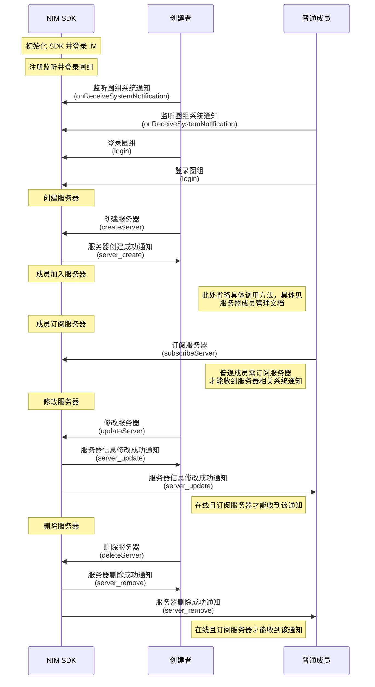

NIM SDK 的<a href="https://doc.yunxin.163.com/messaging/references/flutter/dartdoc/Latest/zh/nim_core/QChatServerService-class.html" target="_blank">`QChatServerService`</a>类提供管理服务器的相关方法，支持圈组服务器的创建、修改、查询和删除。


## 前提条件


- 已注册[`onReceiveSystemNotification`](https://doc.yunxin.163.com/messaging/references/flutter/dartdoc/Latest/zh/nim_core/QChatObserver/onReceiveSystemNotification.html)事件流，监听系统通知的接收。示例代码参见[接收圈组内置系统通知](https://doc.yunxin.163.com/messaging/docs/TQ2MTAwNjk?platform=flutter#接收圈组内置系统通知)

  具体**与服务器管理相关**的系统通知类型以及触发时序，见本文末尾的[相关系统通知](#相关系统通知)。
  
- 已成功<a href="https://doc.yunxin.163.com/messaging/docs/TcyMjc3MTM?platform=android" target="_blank">登录圈组</a>。


## 使用限制

单个用户的服务器的数量上限（包括自己创建的和加入的）默认为 100 个。 


若需要扩展上限，可在控制台配置圈组子功能项（**单个用户 server 数**），具体请参考[开通和配置圈组功能](https://doc.yunxin.163.com/messaging/docs/DE2MDA5NzA?platform=flutter#圈组子功能列表说明)。

  
## 实现方法


  

### 创建服务器


调用<a href="https://doc.yunxin.163.com/messaging/references/flutter/dartdoc/Latest/zh/nim_core/QChatServerService/createServer.html" target="_blank">`createServer`</a>方法可创建一个服务器。

示例代码如下：

```dart
var param = QChatCreateServerParam("测试");
var antiSpamConfig = QChatAntiSpamConfig()
  ..antiSpamBusinessId = "用户配置的对某些资料内容另外的反垃圾的业务ID";
param.antiSpamConfig = antiSpamConfig;
NimCore.instance.qChatServerService.createServer(param).then((value) {
  if (value.isSuccess) {
    // 创建成功
    var server = value.data?.server;
  } else {
    // 创建失败
  }
});
```


::: note note
上述示例代码中的`antiSpamConfig`为圈组内容审核配置，详情请参见<a href="https://doc.yunxin.163.com/messaging/docs/DY0ODI1OTQ?platform=android" target="_blank">圈组内容审核</a>。
:::


### 修改服务器


调用<a href="https://doc.yunxin.163.com/messaging/references/flutter/dartdoc/Latest/zh/nim_core/QChatServerService/updateServer.html" target="_blank">`updateServer`</a>方法可修改服务器的配置信息，包括服务器名称、服务器图标、服务器自定义扩展、服务器邀请模式和服务器申请模式等。


::: note notice
调用该方法需要拥有“管理服务器”的权限（`MANAGE_SERVER`）。权限通过身份组进行配置和管理，具体请参见<a href="" target="_blank">身份组概述</a>及其他身份组相关文档。
:::

<br>

示例代码如下：

```dart
var antiSpamConfig = QChatAntiSpamConfig()
  ..antiSpamBusinessId = "用户配置的对某些资料内容另外的反垃圾的业务ID";
var param = QChatUpdateServerParam(serverId)
  ..name = "修改Server名称"
  ..antiSpamConfig = antiSpamConfig;
NimCore.instance.qChatServerService.updateServer(param).then((value) {
  if (value.isSuccess) {
    // 修改Server信息成功
    var server = value.data?.server;
  } else {
    // 修改Server信息失败
  }
});
```


### 查询服务器

#### 分页查询服务器列表

用户登录圈组后，如果想要获取当前圈组内已有的服务器，可调用<a href="https://doc.yunxin.163.com/messaging/references/flutter/dartdoc/Latest/zh/nim_core/QChatServerService/getServersByPage.html" target="_blank">`getServersByPage`</a>方法，通过时间戳和查询数量分页查询服务器列表。调用时可通过`Future<NIMResult<QChatGetServersByPageResult>> `可设置回调函数，监听操作结果。如果调用成功，回调返回查询到的服务器列表。

示例代码如下：

```dart
final param =
  new QChatGetServersByPageParam(DateTime.now().millisecondsSinceEpoch, 100);
NimCore.instance.qChatServerService.getServersByPage(param).then((value) {
  if(value.isSuccess){
    // 查询Server信息成功
    var servers = value.data?.servers;
  }else{
    // 查询Server信息失败
  }
});
```


#### 根据服务器ID查询服务器列表


用户登录圈组后，如果需要检索服务器，可调用<a href="https://doc.yunxin.163.com/messaging/references/flutter/dartdoc/Latest/zh/nim_core/QChatServerService/getServers.html" target="_blank">`getServers`</a>方法，根据服务器的 ID 查询对应的服务器列表。调用时可通过`Future<NIMResult<QChatGetServersResult>>`可设置回调函数，监听操作结果。如果调用成功，回调返回查询到的服务器列表。


示例代码如下：

```dart
final param = QChatGetServersParam([serverId1, serverId2]);
NimCore.instance.qChatServerService.getServers(param).then((value) {
  if (value.isSuccess) {
    // 查询Server信息成功
    var servers = value.data?.servers;
  } else {
    // 查询Server信息失败
  }
});
```


### 删除服务器


服务器创建者可调用<a href="https://doc.yunxin.163.com/messaging/references/flutter/dartdoc/Latest/zh/nim_core/QChatServerService/deleteServer.html" target="_blank">`deleteServer`</a>方法将自己创建的某个服务器删除。


::: note notice
仅服务器创建者可删除服务器。
:::


<br>

示例代码如下：

```dart
var param = QChatDeleteServerParam(serverId);
NimCore.instance.qChatServerService.deleteServer(param).then((value){
  if(value.isSuccess){
    // 删除Server成功
  }else{
    // 删除Server失败
  }
});
```


## 相关参考


### 相关系统通知


圈组系统通知的类型在[`QChatSystemNotificationType`](https://doc.yunxin.163.com/messaging/references/flutter/dartdoc/Latest/zh/nim_core/QChatSystemNotificationType.html)枚举中定义，与服务器管理相关的内置系统通知类型如下：

枚举值| 说明
---- | --------------
`server_create` | 服务器创建成功
`server_remove`  |  服务器删除成功
`server_update`| 服务器信息修改成功

::: note note 
更多圈组系统通知相关说明，请参见[圈组系统通知相关](https://doc.yunxin.163.com/messaging/docs/jI4MzA3MDU?platform=flutter)。
:::


### API 调用时序





上图中：

- “订阅”相关说明，参见[圈组订阅机制](https://doc.yunxin.163.com/messaging/docs/DM5NTc4NTU?platform=flutter)。
- “成员加入服务器”相关说明，参见[服务器成员管理](https://doc.yunxin.163.com/messaging/docs/jc4ODY5MDA?platform=flutter)。