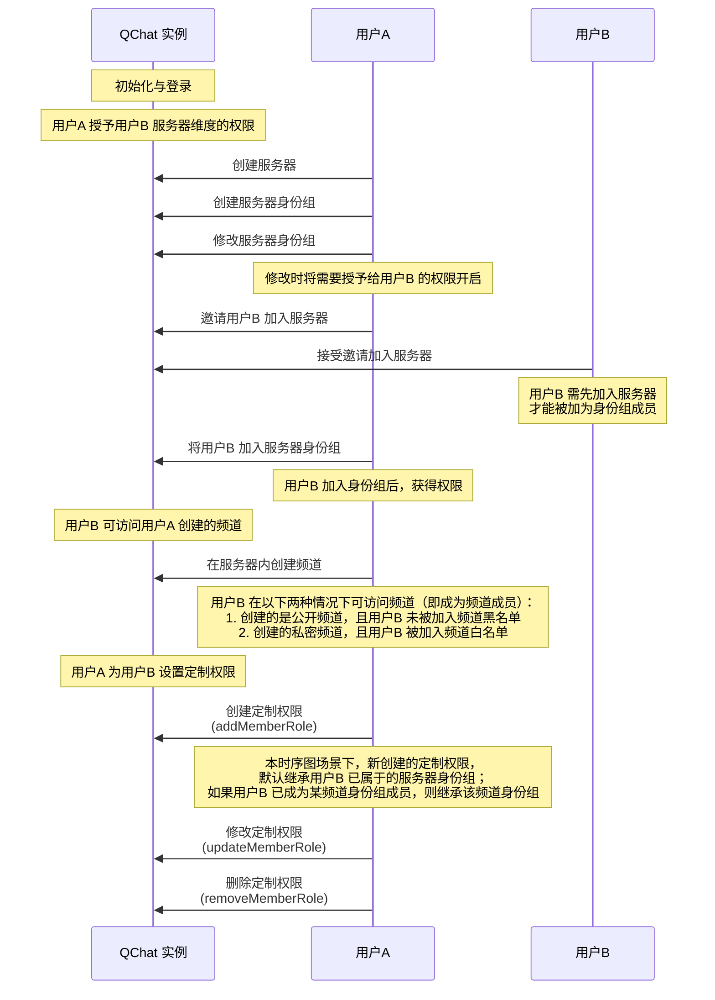

除了可以通过频道身份组对所有身份组成员在频道维度进行权限控制，也可以为某个频道成员专门定制权限，管控其在频道维度的操作。 


## 用户定制权限定义


用户定制权限由<a href="https://doc.yunxin.163.com/messaging/references/flutter/dartdoc/Latest/zh/nim_core/QChatMemberRole-class.html" target="_blank">`QChatMemberRole`</a>类定义。该类的成员参数如下：

<details><summary>点击展开查看 QChatMemberRole 的参数</summary>

方法 | 类型 |说明
:---- | :-------------- | :---------
`serverId` | int | 身份组所属服务器的 ID
`id` | int |  定制权限 ID 
`accid`| String |需要定制权限的用户的 IM 账号 （`accid`）
`channelId` | int | 身份组所属的频道的 ID
`nick` | int  | 需要定制权限的成员在服务器的昵称
`avatar` | String | 需要定制权限的成员在服务器的头像 URL
`custom`| String  | 自定义字段
`resourceAuths`   |Map<`QChatRoleResource`, <a href="https://doc.yunxin.163.com/messaging/references/flutter/dartdoc/Latest/zh/nim_core/QChatRoleOption.html" target="_blank">`QChatRoleOption`</a>>|   身份组的权限列表，其中:<ul><li>`QChatRoleResource`的说明请参见<a href="https://doc.yunxin.163.com/messaging/docs/TM0ODY3Mjk?platform=flutter#身份组权限项" target="_blank">身份组权限项</a></li><li>`QChatRoleOption`定义了权限的配置状态（即用户能否访问各权限），包括：<ul><li>`allow`：有权限</li><li>`deny`：无权限</li><li>`inherit`：继承（针对服务器自定义身份组来说，指继承自服务器的 @everyone 身份组）</li></ul></li></ul>
`type`|  <a href="" target="_blank">`QChatMemberType`</a>   |   成员类型
`createTime` | int | 创建时间
`updateTime` | int |更新时间
`jointime`  | int  | 成员加入服务器的时间
`inviter` | String  | 邀请该成员的用户的 IM 账号（`accid`）


</details>


## 前提条件


- 已注册[`onReceiveSystemNotification`](https://doc.yunxin.163.com/messaging/references/flutter/dartdoc/Latest/zh/nim_core/QChatObserver/onReceiveSystemNotification.html)事件流，监听系统通知的接收。示例代码参见[接收圈组内置系统通知](https://doc.yunxin.163.com/messaging/docs/TQ2MTAwNjk?platform=flutter#接收圈组内置系统通知)。

  具体**用户定制权限相关**的系统通知类型，见本文末尾的[相关系统通知](#相关系统通知)。
- 已创建服务器并已创建服务器身份组。

## 实现方法

::: note note
以下时序图可能因为网络问题显示异常。如显示异常，一般刷新当前页面即可正常显示。
:::




### 创建定制权限

调用<a href="https://doc.yunxin.163.com/messaging/references/flutter/dartdoc/Latest/zh/nim_core/QChatRoleService/addMemberRole.html" target="_blank">`addMemberRole`</a> 方法为某个成员创建定制权限。

::: note notice 
调用该方法必须先拥有`QChatRoleResource.manageRole`和`QChatRoleResource.manageChannel`权限，且是该频道的成员。如果没有权限，调用该方法将返回 `403` 错误码。
:::


- 示例代码
  ```dart
  final channel = getChannel();
  final param = QChatAddMemberRoleParam(channel.serverId, channel.channelId, accId);
  NimCore.instance.qChatRoleService.addMemberRole(param).then((value) {
    if (value.isSuccess) {
      // 操作成功,返回添加成功的成员定制权限
      var role = value.data?.role;
    } else {
      // 操作失败
    }
  });
  ```

  

### 修改定制权限

调用<a href="https://doc.yunxin.163.com/messaging/references/flutter/dartdoc/Latest/zh/nim_core/QChatRoleService/updateMemberRole.html" target="_blank">`updateMemberRole`</a>可修改某成员的定制权限。 

该方法的入参结构为`QChatUpdateMemberRoleParam`，需要传入所属的服务器 ID、频道 ID、目标成员的 IM 账号（`accid`）和需更新的权限 Map。


::: note notice 
- 调用该方法必须先拥有`QChatRoleResource.manageRole`权限。如果没有该权限，调用该方法将返回 `403` 错误码。
- 用户无法配置自己没有的权限。例如用户没有权限A，则无法修改权限A 的配置。
:::


- 示例代码
  ```dart
  final memberRole = getMemberRole();
  final resourceAuths = <QChatRoleResource, QChatRoleOption>{}
    ..[QChatRoleResource.deleteMsg] = QChatRoleOption.allow;
  final param = QChatUpdateMemberRoleParam(memberRole.serverId, memberRole.channelId, accId,resourceAuths);
  NimCore.instance.qChatRoleService.updateMemberRole(param).then((value) {
    if (value.isSuccess) {
      // 操作成功,返回修改后的成员定制权限
      var role = value.data?.role;
    } else {
      // 操作失败
    }
  });
  ```

  


### 删除定制权限

调用<a href="https://doc.yunxin.163.com/messaging/references/flutter/dartdoc/Latest/zh/nim_core/QChatRoleService/removeMemberRole.html" target="_blank">`removeMemberRole`</a>方法可将某人的定制权限删除。


该方法的入参结构为`QChatRemoveMemberRoleParam`，需要传入所属的服务器 ID、频道 ID、目标成员的 IM 账号（`accid`）。


::: note notice 
调用该方法必须先拥有`manageRole`和`manageChannel`权限，且是该频道的成员。如果没有权限，调用该方法将返回 `403` 错误码。
:::


- 示例代码

  ```dart
  final channel = getChannel();
  final param = QChatRemoveMemberRoleParam(channel.serverId, channel.channelId, accId);
  NimCore.instance.qChatRoleService.removeMemberRole(param).then((value) {
    if (value.isSuccess) {
      // 操作成功
    } else {
      // 操作失败
    }
  });
  ```

  


### 查询定制权限

SDK 提供多个查询用户定制权限的方法，具体请参见[用户定制权限相关查询](https://doc.yunxin.163.com/messaging/docs/jk0MzU5MjY?platform=flutter#用户定制权限相关查询)。
## 相关参考


### 相关系统通知


圈组系统通知的类型在[`QChatSystemNotificationType`](https://doc.yunxin.163.com/messaging/references/flutter/dartdoc/Latest/zh/nim_core/QChatSystemNotificationType.html)枚举中定义，与频道身份组相关的内置系统通知类型如下：

枚举值| 说明   
---- | --------------
`member_role_auth_update ` | 更新“用户定制权限”   |


::: note note 
该系统通知的接收条件，请参见服务端文档的[身份组权限相关事件通知](https://doc.yunxin.163.com/messaging/docs/TkxMzc1NDg?platform=server#身份组权限相关事件通知)。
:::

### API 参考


| <div style="width:80px">API</div> | <div style="width:120px">说明 </div>| 
| ---- | -------------- | 
| <a href="https://doc.yunxin.163.com/messaging/references/flutter/dartdoc/Latest/zh/nim_core/QChatRoleService/addMemberRole.html" target="_blank">`addMemberRole`</a>  | 为频道下某人定制权限   |
| <a href="https://doc.yunxin.163.com/messaging/references/flutter/dartdoc/Latest/zh/nim_core/QChatRoleService/updateMemberRole.html" target="_blank">`updateMemberRole`</a> | 修改频道下某成员的定制权限   |
| <a href="https://doc.yunxin.163.com/messaging/references/flutter/dartdoc/Latest/zh/nim_core/QChatRoleService/removeMemberRole.html" target="_blank">`removeMemberRole`</a> | 删除某人的定制权限   |

::: note note
更多相关方法， 请参见[`QChatRoleService`](https://doc.yunxin.163.com/messaging/references/flutter/dartdoc/Latest/zh/nim_core/QChatRoleService-class.html)。
:::


