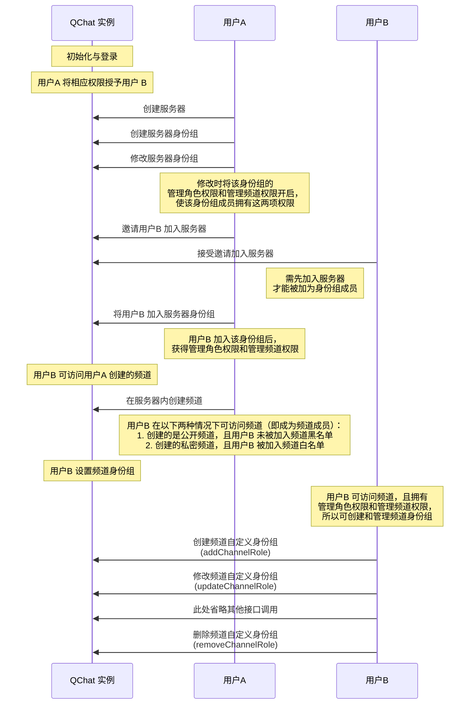
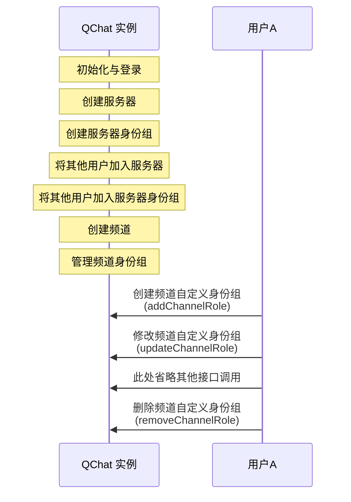

频道身份组用于对用户在频道维度进行权限控制。频道身份组分为两种，@everyone 身份组和自定义身份组。其中 @everyone 身份组在频道创建时默认自动创建，自定义身份组需要用户手动创建。

::: note note
频道下 @everyone 身份组的属性和权限默认继承自服务器的 @everyone 身份组。
:::

## 频道身份组定义
SDK 内定义频道身份组的类为`QChatChannelRole`。该类的成员参数如下：

<details><summary>单击展开查看 QChatChannelRole 的参数</summary>

参数 | 返回数据类型 |说明
:---- | :-------------- | :---------
`roleId`  |  int|  频道身份组 ID
`serverId` | int | 频道身份组所属服务器的 ID
`channelId` | int | 频道身份组所属的频道的 ID
`parentRoleId` | int | 频道身份组所继承的服务器身份组的 ID 
`name` | String  | 频道身份组名称
`icon` | String  | 频道身份组图标的 URL 
`extention`| String  | 频道身份组的扩展字段 
`resourceAuths`   |Map<`QChatRoleResource`, `QChatRoleOption`|   频道身份组的权限列表，其中:<ul><li>`QChatRoleResource`表示身份组权限项，具体说明请参见<a href="https://doc.yunxin.163.com/messaging/docs/TM0ODY3Mjk?platform=flutter#身份组权限项" target="_blank">身份组权限项</a></li><li>`QChatRoleOption`定义了权限的配置状态（开启或关闭），包括：<ul><li>`allow`：开启，身份组成员将拥有该权限</li><li>`deny`：关闭，身份组成员无该权限</li><li>`inherit`：继承（针对频道自定义身份组来说，指继承自频道的 @everyone 身份组中对应的相同权限项的配置状态）</li></ul></li></ul>
`type`|  `QChatRoleType`    |返回身份组的类型，`everyone`表示@everyone 身份组，`custom`表示自定义身份组 
`createTime`  | int  | 频道身份组的创建时间
`updateTime` | int  | 频道身份组配置的更新时间

</details>


## 前提条件


- 已注册[`onReceiveSystemNotification`](https://doc.yunxin.163.com/messaging/references/flutter/dartdoc/Latest/zh/nim_core/QChatObserver/onReceiveSystemNotification.html)事件流，监听系统通知的接收。示例代码参见[接收圈组内置系统通知](https://doc.yunxin.163.com/messaging/docs/TQ2MTAwNjk?platform=flutter#接收圈组内置系统通知)。

  具体**与频道身份组相关**的系统通知类型，见本文末尾的[相关系统通知](#相关系统通知)。
- 已创建服务器。


## 实现方法

以下两个时序图分别展示了服务器普通成员（用户B）和服务器创建者（用户A）进行频道身份组管理前需要实现的业务逻辑。普通成员需要拥有管理频道和管理角色的权限才能创建和管理频道身份组，而服务器创建者默认拥有全量权限，可以在频道内直接创建并管理频道身份组。


服务器普通成员管理频道身份组：



服务器创建者管理频道身份组：



### **创建频道自定义身份组**

默认情况下，频道直接使用服务器身份组来控制权限。如有需要，可调用<a href="https://doc.yunxin.163.com/messaging/references/flutter/dartdoc/Latest/zh/nim_core/QChatRoleService/addChannelRole.html" target="_blank">`addChannelRole`</a>方法新增一个频道身份组，新增的频道身份组的权限配置默认继承自服务器身份组（调用时必须通过`serverRoleId`指定新增的频道身份组继承自哪个服务器身份组）。


::: note notice 
调用该方法必须先拥有`manageRole`权限和`manageChannel`权限，且必须是该频道的成员。如果没有权限，调用该方法将返回 `403` 错误码。
:::

<br>

新创建的频道身份组和被继承的服务器身份组有以下联系：

- 公开频道的身份组成员等于被继承的服务器身份组成员去掉频道黑名单成员和频道黑名单身份组成员；私密频道的身份组成员是同时存在于频道白名单和被继承的服务器身份组的公共成员。
- 刚创建时两者权限一样。频道身份组刚创建时所有权限配置都为继承（`inherit`），因此实际权限和被继承的服务器身份组一样，之后可以调用`updateChannelRole`方法手动修改，使频道身份组和服务器身份组拥有不一样的权限。
- 频道身份组的`parentRoleId`等于被继承的服务器身份组的`roleId`。


- 示例代码

```dart
final param = QChatAddChannelRoleParam(serverId,roleId,channelId);
NimCore.instance.qChatRoleService.addChannelRole(param).then((value) {
  if (value.isSuccess) {
    // 操作成功,返回Channel身份组信息
    var  channelRole = value.data.role;
  } else {
    // 操作失败
  }
});
```


### **修改频道自定义身份组**

调用<a href="https://doc.yunxin.163.com/messaging/references/flutter/dartdoc/Latest/zh/nim_core/QChatRoleService/updateChannelRole.html" target="_blank">`updateChannelRole`</a>方法可修改频道自定义身份组的权限配置。

该方法的入参结构为`QChatUpdateChannelRoleParam`，需要传入频道身份组所属的服务器 ID、频道 ID、频道身份组 ID 和待更新的权限 Map。


::: note notice 
- 调用该方法必须先拥有`manageRole`权限和`manageChannel`权限，且必须是该频道的成员。如果没有权限，调用该方法将返回 `403` 错误码。
- 用户无法配置自己没有的权限。例如用户没有权限A，则无法修改权限A 的配置。
- 用户无法将自己拥有的某个权限在全部所属身份组中都设置为关闭（`deny`）。例如用户属于 10 个身份组且这 10 个身份组都开启了权限A，那么用户最多可以将其中 9 个身份组的权限A 设置为`deny`。
:::


示例代码如下：

```dart
final param = QChatUpdateChannelRoleParam(serverId, channelId, roleId,
                                           {QChatRoleResource.deleteMsg: 
                                            QChatRoleOption.allow});
NimCore.instance.qChatRoleService.updateChannelRole(param).then((value) {
  if (value.isSuccess) {
    // 操作成功,返回修改后的Channel身份组信息
    var channelRole = value.data?.role;
  } else {
    // 操作失败
  }
});
```


### **删除频道身份组**

调用 <a href="https://doc.yunxin.163.com/messaging/references/flutter/dartdoc/Latest/zh/nim_core/QChatRoleService/removeChannelRole.html" target="_blank">`removeChannelRole`</a>可删除频道身份组。

::: note notice 
调用该方法必须先拥有`manageRole`权限和`manageChannel`权限，且必须是该频道的成员。如果没有权限，调用该方法将返回 `403` 错误码。
:::


- 示例代码

```dart
final param = QChatRemoveChannelRoleParam(serverId, channelId, roleId);
NimCore.instance.qChatRoleService.removeChannelRole(param).then((value) {
  if (value.isSuccess) {
    // 操作成功
  } else {
    // 操作失败
  }
});
```


### 查询频道身份组


NIM SDK 提供了查询频道身份组查的方法，具体请参见[频道身份组相关查询](https://doc.yunxin.163.com/messaging/docs/jk0MzU5MjY?platform=flutter#频道身份组相关查询)。


## 相关系统通知


圈组系统通知的类型在[`QChatSystemNotificationType`](https://doc.yunxin.163.com/messaging/references/flutter/dartdoc/Latest/zh/nim_core/QChatSystemNotificationType.html)枚举中定义，与频道身份组相关的内置系统通知类型如下：

枚举值| 说明   
---- | --------------
`channel_role_auth_update` | 更新“频道身份组”权限   |


::: note note 
该系统通知的接收条件，请参见服务端文档的[身份组权限相关事件通知](https://doc.yunxin.163.com/messaging/docs/TkxMzc1NDg?platform=server#身份组权限相关事件通知)。
:::
