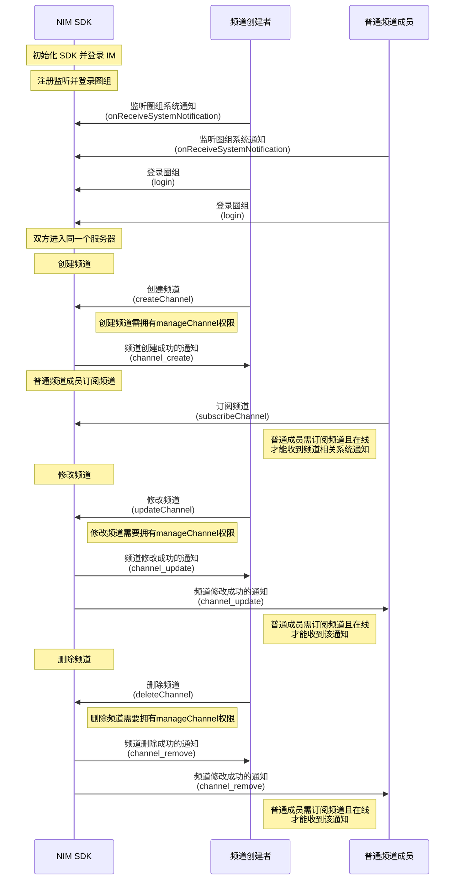

NIM SDK 的<a href="https://doc.yunxin.163.com/messaging/references/flutter/dartdoc/Latest/zh/nim_core/QChatChannelService-class.html" target="_blank">`QChatChannelService`</a>类提供管理频道的方法，支持创建、修改、查询和删除频道。 

 

## 前提条件


- 已注册[`onReceiveSystemNotification`](https://doc.yunxin.163.com/messaging/references/flutter/dartdoc/Latest/zh/nim_core/QChatObserver/onReceiveSystemNotification.html)事件流，监听系统通知的接收。示例代码参见[接收圈组内置系统通知](https://doc.yunxin.163.com/messaging/docs/TQ2MTAwNjk?platform=flutter#接收圈组内置系统通知)。

  具体**与频道管理相关**的系统通知类型以及触发时序，见本文末尾的[相关系统通知](#相关系统通知)。

  
- 已<a href="https://doc.yunxin.163.com/messaging/docs/DA3NDAwODI?platform=flutter#创建服务器" target="_blank">创建服务器</a>。


## 使用限制


单个服务器的频道数量上限默认为 100 个。 

若需要扩展上限，可在控制台配置圈组子功能项（**单 server 可创建的 channel 数**），具体请参考[开通和配置圈组功能](https://doc.yunxin.163.com/messaging/docs/DE2MDA5NzA?platform=flutter#聊天室子功能列表说明)。


## 实现方法


### 创建频道

调用<a href="https://doc.yunxin.163.com/messaging/references/flutter/dartdoc/Latest/zh/nim_core/QChatChannelService/createChannel.html" target="_blank">`createChannel`</a>方法在某个服务器下创建频道。 


示例代码如下：

```   
//serverId 为之前创建好的Server 的Id
    var paramChannel = QChatCreateChannelParam(serverId: serverId, name: "ChannelName", type: QChatChannelType.messageChannel,
    viewMode: QChatChannelMode.public);
    NimCore.instance.qChatChannelService.createChannel(paramChannel).then((value){
      if(value.isSuccess){
        //todo save channelId
      }else{

      }
    });
```

### 修改频道

调用<a href="https://doc.yunxin.163.com/messaging/references/flutter/dartdoc/Latest/zh/nim_core/QChatChannelService/updateChannel.html" target="_blank">`updateChannel`</a>方法修改某个频道的信息，如频道名称、频道主题、对游客是否可见和自定义扩展字段等。

示例代码如下：
``` 
var paramUpdate = QChatUpdateChannelParam(channelId: channelId,name: "更新后的名字");
    NimCore.instance.qChatChannelService.updateChannel(paramUpdate).then((value){
      if(value.isSuccess){
        //todo  success
      }else{

      }
    });
``` 

### 删除频道

调用<a href="https://doc.yunxin.163.com/messaging/references/flutter/dartdoc/Latest/zh/nim_core/QChatChannelService/deleteChannel.html" target="_blank">`deleteChannel`</a>方法可将某个频道删除。 

示例代码如下：
``` 
 var paramDelete = QChatDeleteChannelParam(channelId);
    NimCore.instance.qChatChannelService.deleteChannel(paramDelete).then((value) {
      if(value.isSuccess){
        //todo  success
      }else{

      }
    });
``` 

### 频道查询


#### 分页查询频道列表

用户进入服务器后，如果想要获取当前服务器已有（且对该用户可见）的频道，可调用<a href="https://doc.yunxin.163.com/messaging/references/flutter/dartdoc/Latest/zh/nim_core/QChatChannelService/getChannelsByPage.html" target="_blank">`getChannelsByPage`</a>方法分页查询频道列表。 

示例代码如下：

```
var paramChannels = QChatGetChannelsByPageParam(serverId: serverId, timeTag: timeTag, limit: 100);
    NimCore.instance.qChatChannelService.getChannelsByPage(paramChannels).then((value){
      if(value.isSuccess){
        //todo  success
      }else{

      }
    });

```

#### 根据频道 ID 查询频道列表

用户进入服务器后，如果想要检索当前服务器的频道，可调用<a href="https://doc.yunxin.163.com/messaging/references/flutter/dartdoc/Latest/zh/nim_core/QChatChannelService/getChannels.html" target="_blank">`getChannels`</a>方法根据频道的 ID 进行检索。

示例代码如下：

```
//channelIds 是查询的channel Id 列表
    var paramChannels = QChatGetChannelsParam(channelIds);
    NimCore.instance.qChatChannelService.getChannels(paramChannels).then((value){
        if(value.isSuccess){
          //todo  success
        }else{

        }
    });

```

#### 分页查询频道成员


用户进入频道后，如果想要检索当前频道的成员有哪些（换而言之，当前频道对哪些用户可见），可调用<a href="https://doc.yunxin.163.com/messaging/references/flutter/dartdoc/Latest/zh/nim_core/QChatChannelService/getChannelMembersByPage.html" target="_blank">`getChannelMembersByPage`</a>方法可分页查询频道成员列表。 

示例代码如下：

```
var paramChannelMembers = QChatGetChannelMembersByPageParam(serverId: serverId, channelId: channelId, timeTag: timeTag);
    NimCore.instance.qChatChannelService.getChannelMembersByPage(paramChannelMembers).then((value){
      if(value.isSuccess){
        //todo  success
      }else{

      }
    });
```


#### 查询频道未读信息


用户进入服务器后，如果想获取频道的未读信息（包括未读数和未读状态），可调用<a href="https://doc.yunxin.163.com/messaging/references/flutter/dartdoc/Latest/zh/nim_core/QChatChannelService/getChannelUnreadInfos.html" target="_blank">`getChannelUnreadInfos`</a>方法进行查询。


示例代码如下：

```
var channelIdInfos = [
      QChatChannelIdInfo(serverId: serverId, channelId: channelId)
    ];
    var paramUnread = QChatGetChannelUnreadInfosParam(channelIdInfos);
    NimCore.instance.qChatChannelService.getChannelUnreadInfos(paramUnread).then((value){
      if(value.isSuccess){
        //todo  success
      }else{

      }
    });
```


::: note note
频道未读数管理的更多相关逻辑介绍，请参见<a href="https://doc.yunxin.163.com/messaging/docs/jY4MTE0Njk?platform=flutter" target="_blank">频道未读数管理</a>
:::


## 相关参考


### 相关系统通知


圈组系统通知的类型在[`QChatSystemNotificationType`](https://doc.yunxin.163.com/messaging/references/flutter/dartdoc/Latest/zh/nim_core/QChatSystemNotificationType.html)枚举中定义，与频道管理相关的内置系统通知类型如下：

枚举值| 说明
---- | --------------
`channel_create ` | 创建频道
`channel_remove `  | 删除频道
`channel_update`| 修改频道信息

::: note note 
更多圈组系统通知相关说明，请参见[圈组系统通知相关](https://doc.yunxin.163.com/messaging/docs/jI4MzA3MDU?platform=flutter)。
:::


### API 调用时序





上图中：

- “订阅”相关说明，参见[圈组订阅机制](https://doc.yunxin.163.com/messaging/docs/DM5NTc4NTU?platform=flutter)。
- “权限”相关说明，参见[身份组相关](https://doc.yunxin.163.com/messaging/docs/TM0ODY3Mjk?platform=flutter)。