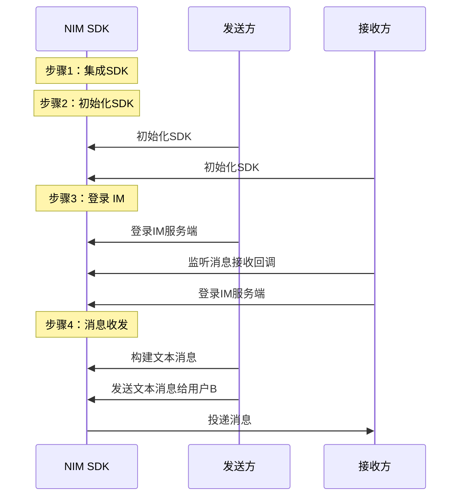

网易云信 IM 即时通讯服务基于网易多年的通信服务技术积累，致力于打造最稳定的即时通讯平台。NetEase Instant Messaging Flutter SDK （以下简称为 NIM Flutter SDK）为 Flutter 应用提供完善的即时通信功能开发框架，屏蔽其内部复杂细节，对外提供较为简洁的 API 接口，方便第三方应用快速集成即时通信功能。

::: note note 
NIM Flutter SDK 目前支持 Android 和 iOS。非移动端（包括 Windows、macOS 和 Web）仍为 Beta 版本，处于内测阶段，敬请期待。
:::

本文介绍如何通过较少的代码集成 NIM Flutter SDK 并调用 API，在您的应用中实现文本消息收发。


## <span id="前提条件">前提条件</span>

- 已在云信控制台[创建应用](https://doc.yunxin.163.com/console/docs/TIzMDE4NTA?platform=console)，获取 App Key。
- 已[注册云信 IM 账号](https://doc.yunxin.163.com/messaging/docs/TU3NDk1OTI?platform=flutter#4-注册-im-账号)，获取 accid 和 token。
- 已准备如下开发环境/工具：

    - Flutter-dart 2.17.0 及以上版本。
    - 各端开发环境要求：
        :::::: div custom-tabs
        ::: tab Android
        - Android Studio 3.5 及以上版本。
        - App 要求 Android 5.0 API 19 及以上版本设备。
        - 1.5.21以上版本的 `kotlin-gradle-plugin`。
        :::
        ::: tab iOS
        - Xcode 11.0 及以上版本。
        - App 要求 iOS 11.0 以上版本设备。
        - 项目已设置有效的开发者签名。
        :::
        <!--
        ::: tab Windows (Beta)
        - 操作系统：Windows 7 SP1 或更高的版本（基于 x86-64 的 64 位操作系统）。
        - 安装 Visual Studio 2019。
        - 安装 CMake 3.10及以上版本。
        :::
        ::: tab macOS (Beta)
        - Xcode 11.0 及以上版本。
        - App 要求 macOS 10.14 及以上版本。
        - 项目已设置有效的开发者签名。
        :::
        ::: tab Web (Beta)
        - 已安装 VSCode, 且在 VSCode 中安装 flutter 插件。
        - 已能熟练使用 Flutter 命令。
        :::
        -->
        ::::::


        ::: note note
        Windows、macOS 和 Web 目前仍为 Beta 版本，处于内测阶段，敬请期待。
        :::
        
## 实现流程

### 流程概览


实现消息收发的流程可分为如下图所示的 4 大步骤。





    
### **步骤1：集成 SDK**

NIM Flutter SDK 已经发布到 pub 库，您可以通过配置 `pubspec.yaml` 自动下载更新。


1. 在项目的 `pubspec.yaml` 文件中添加以下依赖。

    ```
    dependencies: 
    nim_core: ^1.1.0 
    ```

    

2. 通过 Shell 或者 IDE 执行以下命令，下载依赖包。

    ```
    flutter pub get
    ```

<!--Web 端集成

1. 在项目的 `pubspec.yaml` 文件中添加以下依赖。
    ```
    dependencies: 
    nim_core: ^1.1.0 
    ```
2. 通过 Shell 或者 IDE 执行以下命令下载依赖包：

    ```
    flutter pub get
    ```


3. Web 端集成需要在与各端平级的目录创建一个 web 文件夹，并在该 web 文件夹下创建 index.html 文件，文件内容模板如下：


    ::: note important
    如下模板中的链接是云信 IM Flutter Web SDK 的前端 js 资源包的链接，每次版本升级需替换成最新版本的链接，最新版本链接请联系技术支持获取。
    :::

    <br>

    ```
    <!DOCTYPE html>
    <html>
    <head>
        <meta charset="UTF-8" />
        <meta content="IE=Edge" http-equiv="X-UA-Compatible" />
        <meta name="viewport" content="width=device-width, initial-scale=1.0">
        <meta
        name="description"
        content="Flutter web"
        />
        <title>您的页面标题名称</title>
        <script>
        // The value below is injected by flutter build, do not touch.
        var serviceWorkerVersion = null;
        </script>
        <script src="flutter.js"></script>
    </head>
    <body>
        <script>
        //如下链接是云信 IM flutter web sdk的前端 js 资源包的链接，每次版本升级需替换成最新版本的链接，最新版本链接请联系技术支持获取
        var jsConfig = [
            "https://yx-web-nosdn.netease.im/package/1664415864168/index.0.0.6.umd.js",
        ];

        window.onload = function () {
            // Download main.dart.js
            try {
            _flutter.loader
                .loadEntrypoint({
                serviceWorker: {
                    serviceWorkerVersion: serviceWorkerVersion,
                },
                })
                .then(function (engineInitializer) {
                return engineInitializer.initializeEngine()
                }).then(appRunner => {
                require(jsConfig, (RootService) => {
                    window.$flutterWebGlobal = {
                    rootService: new RootService.default(),
                    }
                    appRunner.runApp();
                });
                })
            } catch (error) {
            console.log(error);
            }
        };

        async function dartCallNativeJs(callInfo = {}) {
            const { serviceName, method, params, successCallback, errorCallback } =
                callInfo;
            try {
            console.log('dartCallNativeJs: ', callInfo)
            const service = window.$flutterWebGlobal.rootService[serviceName];
            if (!service) {
                throw new Error(`You do not implement this service: ${serviceName}`);
            }
            if (!service[method]) {
                throw new Error(`This method: ${method} is not implemented on this service: ${serviceName}`);
            }
            // 参数中删除serviceName
            if (params.hasOwnProperty('serviceName')) {
                delete params.serviceName;
            }
            const res = await service[method](params);
            successCallback(res)
            } catch (error) {
            console.error('dartCallNativeJs failed: ', error)
            errorCallback(error)
            throw error
            }
        }
        </script>
    </body>
    </html>
    ```

4. 执行`flutter run -d chrome`命令测试集成是否成功。执行后能看到如下入口页面和 Chrome 控制台调用日志，则表示集成成功。


    

-->

::: note important
集成 SDK 之后，**Android 端** 还需进行**编译与防混淆配置**（其他端不需要），详情参见<a href="https://doc.yunxin.163.com/docs/TM5MzM5Njk/Dg5NjI4MDg?platformId=120326#%E7%BC%96%E8%AF%91%E4%B8%8E%E9%98%B2%E6%B7%B7%E6%B7%86%E9%85%8D%E7%BD%AE%EF%BC%88%E4%BB%85%20Android%EF%BC%89" target="_blank">编译与防混淆配置</a>。
:::


### **步骤2：初始化**

调用<a href="https://doc.yunxin.163.com/messaging/references/flutter/dartdoc/Latest/zh/nim_core/NimCore/initialize.html" target="_blank">`initialize`</a>方法初始化 SDK。

::: note notice
初始化必须在应用的生命周期内进行，且只可进行一次。
:::

- 参数说明

  参数 | 类型 | 说明
  :---- | :-------------- | :---------
  `context` | Context | 应用上下文
  `options` | <a href="https://doc.yunxin.163.com/messaging/references/flutter/dartdoc/Latest/zh/nim_core/NIMSDKOptions-class.html" target="_blank">`NIMSDKOptions`</a> | 初始化配置信息，可为空。不传时会使用默认配置。

- 示例代码

    ```dart

    final NIMSDKOptions options;
    if (Platform.isAndroid) {
    options = NIMAndroidSDKOptions(
        appKey: 'appkey',
        /// 其他 通用/Android 配置
    );
    } else if (Platform.isIOS) {
    options = NIMIOSSDKOptions(
        appKey: 'appkey',
        /// 其他通用配置/iOS 配置
    );
    } else if (KisWeb) {
        options = NIMSDKOptions(
        appKey: 'appKey',
        /// 其他基础通用配置参数    
        )
    }
    NimCore.instance.initialize(options)
        .then((result){
            if (result.isSuccess) {
                /// 初始化成功
            } else {
                /// 初始化失败
            }
        });

    ```


### **步骤3：登录 IM 服务端**

实现消息收发前，需要先建立 SDK 与 IM 服务端的连接，登录 IM 服务端。登录成功后，SDK 会自动同步消息和系统通知等数据。同步完成则登录流程结束。

1. 发送方和接收方注册登录相关监听，包括登录状态监听、数据同步监听和多端登录监听。

    示例代码如下：

    :::::: div custom-tabs
    ::: tab 注册登录状态监听

    ```dart

        /// 开始监听事件
        final subscription = NimCore.instance.authService.authStatus.listen((event) {
        if (event is NIMKickOutByOtherClientEvent) {
            /// 监听到被踢事件
        } else if (event is NIMAuthStatusEvent) {
            /// 监听到其他事件
        }
        });

        /// 不再监听时，需要取消监听，否则造成内存泄漏
        /// subscription.cancel();

    ```
    :::

    ::: tab 注册数据同步监听
    ```dart

    /// 开始监听事件
    final subscription = NimCore.instance.authService.authStatus.listen((event) {
    if (event is NIMDataSyncStatusEvent) {
        /// 监听到数据同步事件
        if (event.status == NIMAuthStatus.dataSyncStart) {
        /// 数据同步开始
        } else if (event.status == NIMAuthStatus.dataSyncFinish) {
        /// 数据同步完成
        }
    }
    });

    /// 不再监听时，需要取消监听，否则造成内存泄漏
    /// subscription.cancel();
    ```
    :::
    ::: tab 注册多端登录监听
    ```dart
    final subscription = NimCore.instance.authService.onlineClients.listen((clients) {
    clients.forEach((client) {
        switch (client.clientType) {
        case NIMClientType.windows:
            // PC端
            break;
        case NIMClientType.macos:
            // MAC端
            break;
        case NIMClientType.web:
            // Web端
            break;
        case NIMClientType.ios:
            // IOS端
            break;
        case NIMClientType.android:
            // Android端
            break;
        default:
            // 未知
            break;
        }
    });
    });
    
    /// 不再监听时，需要取消监听，否则造成内存泄漏
    /// subscription.cancel();
    ```
    :::
    ::::::


2. 接收方注册消息接收事件流（<a href="https://doc.yunxin.163.com/messaging/references/flutter/dartdoc/Latest/zh/nim_core/MessageService/onMessage.html" target="_blank">`onMessage`</a>），监听消息接收。

    示例代码如下：

    ```
    NimCore.instance.messageService.onMessage.listen((List<NIMMessage> list) {
        // 处理新收到的消息，为了上传处理方便，SDK 保证参数 messages 全部来自同一个聊天对象。
    });

    ```
3. 发送方和接收方调用<a href="https://doc.yunxin.163.com/messaging/references/flutter/dartdoc/Latest/zh/nim_core/AuthService/login.html" target="_blank">`login`</a>方法手动登录云信 IM 服务端。

    - 登录信息（`NIMLoginInfo`）必传参数说明

        NIMLoginInfo 参数       | 是否必传 | 说明           
        :----------------------- | :------- |:------------------- 
        `account`                 | 是 | 云信 IM 帐号，即 `accid`     
        `token`                    | 是 | 登录需要用到的令牌，即 `token`


    - 示例代码

        ```dart
        NimCore.instance.authService
            .login(NIMLoginInfo(account: 'account', token: 'token',))
            .then(
            (result) {
                if (result.isSuccess) {
                /// 登录成功
                } else {
                /// 登录失败
                }
            },
            );
        ```
    ::: note note
    更多登录相关说明，请参见<a href="https://doc.yunxin.163.com/docs/TM5MzM5Njk/zk5NTg0NTg?platformId=120326" target="_blank">登录登出</a>。
    :::

### **步骤4：实现消息收发**

本节介绍如何通过 SDK API 实现单聊场景的**文本消息**收发。其他类型消息收发相关 SDK API 的介绍，包括图片消息、语音消息、视频消息、文件消息、地理位置消息、提示消息、通知消息以及自定义消息，请参见<a href="https://doc.yunxin.163.com/messaging/references/flutter/dartdoc/Latest/zh/nim_core/MessageService-class.html" target="_blank">`MessageService`</a>。


1. 消息发送方调用<a href="https://doc.yunxin.163.com/messaging/references/flutter/dartdoc/Latest/zh/nim_core/MessageBuilder/createTextMessage.html" target="_blank">`createTextMessage`</a>方法构建文本消息，然后调用<a href="https://doc.yunxin.163.com/messaging/references/flutter/dartdoc/Latest/zh/nim_core/MessageService/sendMessage.html" target="_blank">`sendMessage`</a>方法发送该消息。

    示例代码如下：
    ```
    // 该帐号为示例
    String account = 'testAccount';
    // 以单聊类型为例
    NIMSessionType sessionType = NIMSessionType.p2p;
    String text = 'this is an example';
    // 创建并且发送一个文本消息
    Future<NIMResult<NIMMessage>> result = MessageBuilder.createTextMessage(
        sessionId: account, sessionType: sessionType, text: text)
        .then((value) => value.isSuccess
        ? NimCore.instance.messageService
            .sendMessage(message: value.data!, resend: false)
        : Future.value(value));
    ```


2. 消息接收事件流触发回调，接收方收到消息。


## 后续步骤


为保障通信安全，如果您在调试环境中的使用的是云信控制台生成的 IM 账号（测试用），请确保在后续的正式生产环境中，将其替换为<a href="https://doc.yunxin.163.com/TM5MzM5Njk/docs/DQ3Nzk1MTY?platform=server" target="_blank">通过 IM 服务端 API</a> 生成的正式 IM 账号。