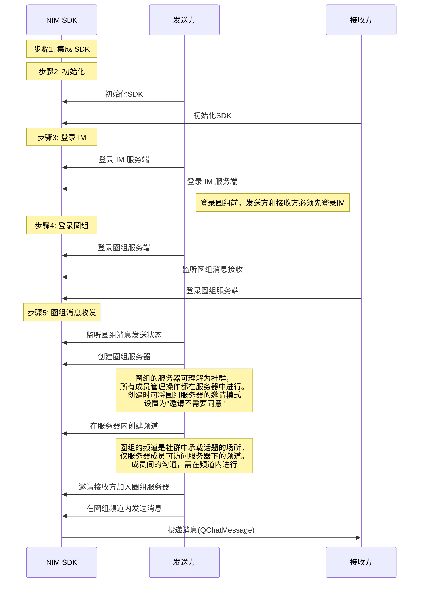

<!--keywords: 圈组,快速开始,消息收发,SDK集成,初始化,登录 -->


圈组是网易云信 IM 即时通讯服务的全新能力，可用来帮助您快速构建 “类 Discord 即时通讯社群”。本文介绍如何通过较少的代码集成 NetEase IM Flutter SDK （以下简称 NIM SDK）并调用 API，在您的应用中实现圈组消息收发。


## 前提条件

- 已在云信控制台[创建应用](https://doc.yunxin.163.com/console/docs/TIzMDE4NTA?platform=console)，获取 App Key。
- 已[注册云信 IM 账号](https://doc.yunxin.163.com/messaging/docs/TU3NDk1OTI?platform=flutter#4-注册-im-账号)，获取 accid 和 token。
- 已[开通和配置圈组功能](https://doc.yunxin.163.com/messaging/docs/DE2MDA5NzA?platform=flutter)。

- 已准备如下开发环境/工具（目前圈组仅支持移动端开发）：

    - Flutter-dart 2.17.0 及以上版本。

    - 开发环境要求：


        :::::: div custom-tabs
        ::: tab Android
        - Android Studio 3.5 及以上版本。
        - App 要求 Android 5.0 API 19 及以上版本设备。
        - 1.5.21以上版本的 `kotlin-gradle-plugin`。
        :::
        ::: tab iOS
        - Xcode 11.0 及以上版本。
        - App 要求 iOS 11.0 以上版本设备。
        - 项目已设置有效的开发者签名。
        :::
        ::::::

##  实现流程


### **流程概览**

实现圈组消息收发的流程，可分为下图所示的 5 大步骤。





::: note notice 
**圈组服务端**与**圈组服务器**是两个不同概念，前者指云信服务端提供圈组功能的部分，后者为圈组的特殊概念，对应 Discord 的 Server, 为社群本身，具体参见<a href="https://doc.yunxin.163.com/messaging/docs/zMyNjEyOTk?platform=flutter#圈组主要概念" target="_blank">圈组主要概念</a>。
:::


### **步骤1: 集成 NIM SDK**


NIM SDK 已经发布到 pub 库，您可以通过配置 `pubspec.yaml` 自动下载更新。


1. 在项目的 `pubspec.yaml` 文件中添加以下依赖。

    ```
    dependencies: 
    nim_core: ^1.3.0 
    ```

    

2. 通过 Shell 或者 IDE 执行以下命令，下载依赖包。

    ```
    flutter pub get
    ```
::: note important
集成 SDK 之后，**Android 端** 还需进行**编译与防混淆配置**（其他端不需要），详情参见<a href="https://doc.yunxin.163.com/TM5MzM5Njk/docs/Dg5NjI4MDg?platform=flutter#编译与防混淆配置仅-android" target="_blank">编译与防混淆配置</a>。
:::


### **步骤2: 初始化 NIM SDK**


将 SDK 集成到客户端后，需要先完成 SDK 的初始化才能使用其他功能。

调用<a href="https://doc.yunxin.163.com/messaging/references/flutter/dartdoc/Latest/zh/nim_core/NimCore/initialize.html" target="_blank">`initialize`</a>方法初始化 SDK。具体的初始化配置参数说明，请参见<a href="https://doc.yunxin.163.com/TM5MzM5Njk/docs/jk1MTg0NjM?platform=flutter#初始化配置参数" target="_blank">初始化配置参数</a>。  


::: note notice
初始化必须在应用的生命周期内进行，且只可进行一次。
:::

- 参数说明

  参数 | 类型 | 说明
  :---- | :-------------- | :---------
  `context` | Context | 应用上下文
  `options` | <a href="https://doc.yunxin.163.com/messaging/references/flutter/dartdoc/Latest/zh/nim_core/NIMSDKOptions-class.html" target="_blank">`NIMSDKOptions`</a> | 初始化配置信息，可为空。不传时会使用默认配置。

- 示例代码

    ```dart

    final NIMSDKOptions options;
    if (Platform.isAndroid) {
    options = NIMAndroidSDKOptions(
        appKey: 'appkey',
        /// 其他 通用/Android 配置
    );
    } else if (Platform.isIOS) {
    options = NIMIOSSDKOptions(
        appKey: 'appkey',
        /// 其他通用配置/iOS 配置
    );
    } else if (KisWeb) {
        options = NIMSDKOptions(
        appKey: 'appKey',
        /// 其他基础通用配置参数    
        )
    }
    NimCore.instance.initialize(options)
        .then((result){
            if (result.isSuccess) {
                /// 初始化成功
            } else {
                /// 初始化失败
            }
        });

    ```
 
### **步骤3：登录云信 IM 服务端**

::: note notice
登录圈组前，必须先建立 SDK 与 IM 服务端的连接，登录 IM 服务端。
:::

1. 注册登录相关监听，包括登录状态监听、数据同步监听和多端登录监听。

    示例代码如下：

    :::::: div custom-tabs
    ::: tab 注册登录状态监听

    ```dart

        /// 开始监听事件
        final subscription = NimCore.instance.authService.authStatus.listen((event) {
        if (event is NIMKickOutByOtherClientEvent) {
            /// 监听到被踢事件
        } else if (event is NIMAuthStatusEvent) {
            /// 监听到其他事件
        }
        });

        /// 不再监听时，需要取消监听，否则造成内存泄漏
        /// subscription.cancel();

    ```
    :::

    ::: tab 注册数据同步监听
    ```dart

    /// 开始监听事件
    final subscription = NimCore.instance.authService.authStatus.listen((event) {
    if (event is NIMDataSyncStatusEvent) {
        /// 监听到数据同步事件
        if (event.status == NIMAuthStatus.dataSyncStart) {
        /// 数据同步开始
        } else if (event.status == NIMAuthStatus.dataSyncFinish) {
        /// 数据同步完成
        }
    }
    });

    /// 不再监听时，需要取消监听，否则造成内存泄漏
    /// subscription.cancel();
    ```
    :::
    ::: tab 注册多端登录监听
    ```dart
    final subscription = NimCore.instance.authService.onlineClients.listen((clients) {
    clients.forEach((client) {
        switch (client.clientType) {
        case NIMClientType.windows:
            // PC端
            break;
        case NIMClientType.macos:
            // MAC端
            break;
        case NIMClientType.web:
            // Web端
            break;
        case NIMClientType.ios:
            // IOS端
            break;
        case NIMClientType.android:
            // Android端
            break;
        default:
            // 未知
            break;
        }
    });
    });
    
    /// 不再监听时，需要取消监听，否则造成内存泄漏
    /// subscription.cancel();
    ```
    :::
    ::::::
2. 调用<a href="https://doc.yunxin.163.com/messaging/references/flutter/dartdoc/Latest/zh/nim_core/AuthService/login.html" target="_blank">`login`</a>方法手动登录云信 IM 服务端。

    - 登录信息（`NIMLoginInfo`）必传参数说明

        NIMLoginInfo 参数       | 是否必传 | 说明           
        :----------------------- | :------- |:------------------- 
        `account`                 | 是 | 云信 IM 帐号，即 `accid`     
        `token`                    | 是 | 登录需要用到的令牌，即 `token`


    - 示例代码

        ```dart
        NimCore.instance.authService
            .login(NIMLoginInfo(account: 'account', token: 'token',))
            .then(
            (result) {
                if (result.isSuccess) {
                /// 登录成功
                } else {
                /// 登录失败
                }
            },
            );
        ```
    ::: note note
    更多 IM 登录相关说明，请参见<a href="https://doc.yunxin.163.com/docs/TM5MzM5Njk/zk5NTg0NTg?platformId=120326" target="_blank">登录登出</a>。
    :::

### **步骤4: 登录云信圈组服务端**


1. 发送方和接收方注册<a href="https://doc.yunxin.163.com/messaging/references/flutter/dartdoc/Latest/zh/nim_core/QChatObserver/onStatusChange.html" target="_blank">`QChatObserver#onStatusChange`</a>事件流监听圈组登录状态变化。登录状态的具体转换流程，请参见<a href="https://doc.yunxin.163.com/messaging/docs/DM2OTkzOTY?platform=flutter#登录状态变化流程" target="_blank">登录状态变化流程</a>。

    示例代码如下：

     ```
    NimCore.instance.qChatObserver.onStatusChange.listen((event) {
      switch(event.status){
        case NIMAuthStatus.unknown: //未知状态
          // TODO: Handle this case.
          break;
        case NIMAuthStatus.unLogin: // 未登录或登录失败
          // TODO: Handle this case.
          break;
        case NIMAuthStatus.connecting: // 正在连接云信服务端
          // TODO: Handle this case.
          break;
        case NIMAuthStatus.logging: // 登录中
          // TODO: Handle this case.
          break;
        case NIMAuthStatus.loggedIn: // 登录成功
          // TODO: Handle this case.
          break;
        case NIMAuthStatus.forbidden: // 被云信服务端禁止登录
          // TODO: Handle this case.
          break;
        case NIMAuthStatus.netBroken: // 网络连接已断开
          // TODO: Handle this case.
          break;
        case NIMAuthStatus.versionError: // SDK版本错误
          // TODO: Handle this case.
          break;
        case NIMAuthStatus.pwdError: // accid或token错误
          // TODO: Handle this case.
          break;
        case NIMAuthStatus.kickOut: // 被其他端的登录踢下线，此时应跳转至手动登录界面
          // TODO: Handle this case.
          break;
        case NIMAuthStatus.kickOutByOtherClient: // 被同时在线的其他端主动踢下线(通过kickOtherClients方法)
          // TODO: Handle this case.
          break;
        case NIMAuthStatus.dataSyncStart: // 正在同步数据，登录成功后开始同步
          // TODO: Handle this case.
          break;
        case NIMAuthStatus.dataSyncFinish: // 数据同步完成
          // TODO: Handle this case.
          break;
      }
    });
    ```

2. 接收方调用<a href="https://doc.yunxin.163.com/messaging/references/flutter/dartdoc/Latest/zh/nim_core/QChatObserver/onReceiveMessage.html" target="_blank">`QChatObserver#onReceiveMessage`</a>事件流监听圈组消息接收。


    示例代码如下：

    ```
    NimCore.instance.qChatObserver.onReceiveMessage.listen((event) { 
      //todo show message
    });
    ```

3. 发送方和接收方调用<a href="https://doc.yunxin.163.com/messaging/references/flutter/dartdoc/Latest/zh/nim_core/QChatService/login.html" target="_blank">`QChatService#login`</a>方法开始登录圈组服务端。


    示例代码如下：
    ```
     var param = QChatLoginParam();
    NimCore.instance.qChatService.login(param).then((value){
      if(value.isSuccess){
        //todo login success
      }else{
        //todo login failed
      }
    });
    ```


3. 登录后，`QChatObserver#onStatusChange`事件流触发，根据实际登录情况返回登录状态。如最终返回`loggedIn`，则代表登录成功。

    ::: note note
    更多圈组登录相关说明，请参见<a href="https://doc.yunxin.163.com/messaging/docs/DM2OTkzOTY?platform=flutter" target="_blank">圈组登录管理</a>。 
    ::: 


### **步骤5: 圈组消息收发**

本节以发送方与接收方的消息交互为例，介绍使用 SDK API 快速实现圈组**文本消息**收发的流程。

::: note note
- 圈组其他类型消息收发相关详情，请参见<a href="https://doc.yunxin.163.com/TM5MzM5Njk/docs/jUzMDAyNDU?platform=flutter" target="_blank">圈组消息收发</a>。
- 本节介绍的实现流程不考虑对圈组的发送方和接收方进行**权限管控**。如需权限管控，可通过<a href="https://doc.yunxin.163.com/TM5MzM5Njk/docs/TM0ODY3Mjk?platform=flutter" target="_blank">身份组</a>实现。
:::

<br>


1. 发送方调用<a href="https://doc.yunxin.163.com/messaging/references/flutter/dartdoc/Latest/zh/nim_core/QChatObserver/onMessageStatusChange.html" target="_blank">`QChatObserver#onMessageStatusChange `</a>方法监听圈组消息发送状态。

    示例代码如下：

    ```
   NimCore.instance.qChatObserver.onMessageStatusChange.listen((event) { 
      //todo message status change
    });
    ```


2. 发送方调用<a href="https://doc.yunxin.163.com/messaging/references/flutter/dartdoc/Latest/zh/nim_core/QChatServerService/createServer.html" target="_blank">`createServer`</a>方法创建圈组服务器。为更加快速实现消息收发，创建时可将<a href="https://doc.yunxin.163.com/messaging/references/flutter/dartdoc/Latest/zh/nim_core/QChatCreateServerParam/inviteMode.html" target="">`inviteMode`</a>设置为，`QChatInviteMode.agreeNeedNot`（发送邀请后，不需要被邀请方同意，被邀请方立即加入服务器）。

    ::: note notice 
    创建成功后，需记录服务器的 ID（`serverId`），后续步骤将需要传入`serverId`。
    :::

    <br>

    示例代码如下：

    ```
    var paramCreateServer = QChatCreateServerParam("ServerName");
    paramCreateServer.inviteMode = QChatInviteMode.agreeNeedNot;
    NimCore.instance.qChatServerService.createServer(paramCreateServer).then((value){
      if(value.isSuccess){
        //todo save server name and id
      }else{

      }
    });
    ```


3. 发送方调用<a href="https://doc.yunxin.163.com/messaging/references/flutter/dartdoc/Latest/zh/nim_core/QChatChannelService/createChannel.html" target="_blank">`createChannel`</a>方法，调用时传入上一步中创建的圈组服务器的`serverId`，且将查看模式`viewMode`和频道类型`type`分别设置为`public`和`messageChannel`，从而在圈组服务器中创建一个消息类型的公开频道。 


    ::: note notice 
    创建成功后，需记录频道的 ID（`channelId`），后续步骤将需要传入`channelId`。
    :::
    
    <br>

    示例代码如下：

    ```
    //serverId 为之前创建好的Server 的Id
    var paramChannel = QChatCreateChannelParam(serverId: serverId, name: "ChannelName", type: QChatChannelType.messageChannel,
    viewMode: QChatChannelMode.public);
    NimCore.instance.qChatChannelService.createChannel(paramChannel).then((value){
      if(value.isSuccess){
        //todo save channelId
      }else{

      }
    });
    ```


4. 发送方调用<a href="https://doc.yunxin.163.com/messaging/references/flutter/dartdoc/Latest/zh/nim_core/QChatServerService/inviteServerMembers.html" target="_blank">`inviteServerMembers`</a>方法，邀请接收方 加入圈组服务器。


    示例代码如下：

    ```
    //serverId 为之前创建好的Server 的Id
    // accids 是需要邀请的用户id列表
    var paramInvite = QChatInviteServerMembersParam(serverId, accids);
    NimCore.instance.qChatServerService.inviteServerMembers(paramInvite).then((value) {
      if(value.isSuccess){
        //todo invite success
      }else{

      }
    });

    ```


5. 发送方调用<a href="https://doc.yunxin.163.com/messaging/references/flutter/dartdoc/Latest/zh/nim_core/QChatMessageService/sendMessage.html" target="_blank">`QChatMessageService#sendMessage`</a>方法，调用时传入圈组服务器与公开频道的ID，从而在公开频道中发送一条消息。


    示例代码如下：

    ```
    //channelId 为之前创建好的Channel 的Id
    //serverId 为之前创建好的Server 的Id
    var paramMessage = QChatSendMessageParam(channelId: channelId, serverId: serverId, type: NIMMessageType.text);
    NimCore.instance.qChatMessageService.sendMessage(paramMessage).then((value){
      if(value.isSuccess){
        //todo  success
      }else{

      }
    });
    ```


6. `QChatObserver#onReceiveMessage`事件流触发，接收方通过该事件流收到消息。


## 后续步骤


为保障通信安全，如果您在调试环境中的使用的是云信控制台生成的 IM 账号（测试用），请确保在后续的正式生产环境中，将其替换为<a href="https://doc.yunxin.163.com/TM5MzM5Njk/docs/DQ3Nzk1MTY?platform=server" target="_blank">通过 IM 服务端 API</a> 生成的正式 IM 账号。


## 相关集成文档


- <a href="https://doc.yunxin.163.com/messaging/docs/DM2OTkzOTY?platform=flutter" target="_blank">圈组登录管理</a>
- <a href="https://doc.yunxin.163.com/messaging/docs/jMzNjg0MjA?platform=flutter" target="_blank">图解圈组消息流转</a>
- <a href="https://doc.yunxin.163.com/messaging/docs/zc0ODQ2NDY?platform=flutter" target="_blank">圈组服务器相关</a>
- <a href="https://doc.yunxin.163.com/messaging/docs/TM5Njg0NjA?platform=flutter" target="_blank">圈组频道相关</a>
- <a href="https://doc.yunxin.163.com/messaging/docs/Dc2NjM5ODE?platform=flutter" target="_blank">搜索服务器与频道</a>
- <a href="https://doc.yunxin.163.com/messaging/docs/TM0ODY3Mjk?platform=flutter" target="_blank">身份组相关</a>
- <a href="https://doc.yunxin.163.com/messaging/docs/DM5NTc4NTU?platform=flutter" target="_blank">圈组订阅机制</a>
- <a href="https://doc.yunxin.163.com/messaging/docs/jUzMDAyNDU?platform=flutter" target="_blank">圈组消息相关</a>
- <a href="https://doc.yunxin.163.com/messaging/docs/jI4MzA3MDU?platform=flutter" target="_blank">圈组系统通知相关</a>

