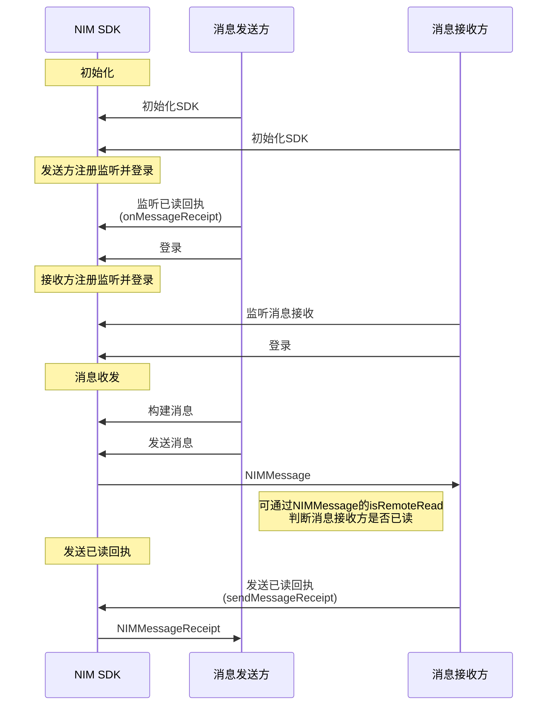
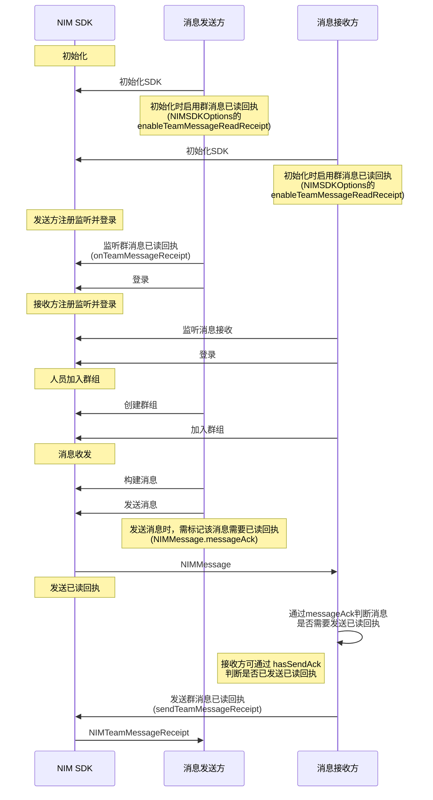

<!--keywords: 已读、已读回执、消息已读回执 -->

当发送方需要知道接收方是否已经阅读了自己发送的消息时，需要使用已读回执的功能。


NIM SDK 的[`MessageService`](https://doc.yunxin.163.com/messaging/references/flutter/dartdoc/Latest/zh/nim_core/MessageService-class.html)类提供监听单聊/群聊消息已读回执和发送单聊消息已读回执的方法。调用发送已读回执的方法时，传入的消息即为需要显示为已读的消息。


## <span id="单聊消息已读回执">单聊消息已读回执</span>


### API 调用时序


  


### **前提条件**

- 双方已完成 [SDK 初始化](https://doc.yunxin.163.com/messaging/docs/DQwNDE4MDM?platform=flutter#步骤2初始化)。


- 消息接收方已注册[`onMessage`](https://doc.yunxin.163.com/messaging/references/flutter/dartdoc/Latest/zh/nim_core/MessageService/onMessage.html)事件流，监听消息的到达事件。


### **实现流程**

1. 发送方注册[`onMessageReceipt`](https://doc.yunxin.163.com/messaging/references/flutter/dartdoc/Latest/zh/nim_core/MessageService/onMessageReceipt.html)事件流，监听已读回执[`NIMMessageReceipt`](https://doc.yunxin.163.com/messaging/references/flutter/dartdoc/Latest/zh/nim_core/NIMMessageReceipt-class.html)的到达。


    - `NIMMessageReceipt`参数说明

     参数 | 类型 |说明                                                         
     :----- | :----------------- | :---------------------
     `sessionId`     | String | 会话 ID，聊天对象的 IM 账号（`accid`）
     `time`  | int         | 该会话最后一条已读消息的时间，早于该时间的消息都视为已读     

    - 示例代码
    ```dart
    NimCore.instance.messageService.onMessageReceipt.listen((event) {
      print('Test_Observer onMessageReceipt ${event.toString()}');
    });

    ```
2. (可选) 发送方在发送消息后，可通过消息体`NIMMessage`的[`isRemoteRead`](https://doc.yunxin.163.com/messaging/references/flutter/dartdoc/Latest/zh/nim_core/NIMMessage/isRemoteRead.html)属性判断接收方是否已读。

3. 消息接收方在收到消息并阅读后，调用[`sendMessageReceipt`](https://doc.yunxin.163.com/messaging/references/flutter/dartdoc/Latest/zh/nim_core/MessageService/sendMessageReceipt.html)方法发送已读回执，调用时传入接收到的消息。

    ::: note note 
    如在会话界面中调用该方法并传入当前会话的最后一条消息，即表示这之前的消息本方都已读。
    :::

    示例代码如下：

    ```dart
    NimCore.instance.messageService.onMessage.listen((event) {
      print('Test_Observer onMessage ${event.toString()}');
      for (NIMMessage m in event) {
        if (m.sessionType == NIMSessionType.p2p) {
          NimCore.instance.messageService.sendMessageReceipt(sessionId: m.fromAccount!, message: m);
        } else if (m.sessionType == NIMSessionType.team) {
          NimCore.instance.messageService.sendTeamMessageReceipt(m);
        }
      }
    });

    ```

4. `onMessageReceipt`的`Stream`回到函数触发，消息发送方通过该回调获取已读回执（`NIMMessageReceipt`）。


## <span id="群聊消息已读回执">群聊消息已读回执</span>

本节以发送方与接收方的消息交互为例，介绍群聊消息已读回执的实现流程。


### API 调用时序



### **前提条件**


- 已创建[云信 IM 账号](https://doc.yunxin.163.com/docs/TM5MzM5Njk/DQ3Nzk1MTY?platformId=60353)。

- 已在控制台开通群聊消息已读回执功能，具体请参见[配置群组功能](https://doc.yunxin.163.com/messaging/docs/DAyODE0MzE?platform=flutter#配置群组功能)。

- 消息接收方已[`onMessage`](https://doc.yunxin.163.com/messaging/references/flutter/dartdoc/Latest/zh/nim_core/MessageService/onMessage.html)事件流，监听消息的到达事件。

### **使用限制**

::: note important
使用群消息已读回执功能，需将群成员控制在 200 人以内。
:::

### **实现流程**

1. 发送方和接收方在[SDK 初始化](https://doc.yunxin.163.com/messaging/docs/DQwNDE4MDM?platform=flutter#步骤2初始化)时，将[`NIMSDKOptions.enableTeamMessageReadReceipt`](https://doc.yunxin.163.com/messaging/references/flutter/dartdoc/Latest/zh/nim_core/NIMSDKOptions/enableTeamMessageReadReceipt.html)设置为`true`，启用群消息已读回执功能。

2. 发送方在登录 IM 前，调用[`onTeamMessageReceipt`](https://doc.yunxin.163.com/messaging/references/flutter/dartdoc/Latest/zh/nim_core/MessageService/onTeamMessageReceipt.html) 注册群消息已读回执观察者，监听群消息的已读回执`<List<NIMTeamMessageReceipt>>`。 


    - [`NIMTeamMessageReceipt`](https://doc.yunxin.163.com/messaging/references/flutter/dartdoc/Latest/zh/nim_core/NIMTeamMessageReceipt-class.html)参数说明


    参数| 类型 |说明
    :--|:---|:---|
    `messageId`| String| 消息 ID
    `ackCount `|int|  消息的已读人数
    `unAckCount`|int | 消息的未读人数

    - 示例代码

    ```dart
    NimCore.instance.messageService.onTeamMessageReceipt.listen((event) {
      print('Test_Observer onTeamMessageReceipt ${event.toString()}');
    });

    ```

3. 发送方创建并发送群消息时，需通过[`NIMMessage.messageAck`](https://doc.yunxin.163.com/messaging/references/flutter/dartdoc/Latest/zh/nim_core/NIMMessage/messageAck.html)标记该消息需要已读回执。

    示例代码如下：

    ```dart
    // 创建待发送消息
          NIMResult<NIMMessage> result = await MessageBuilder.createTextMessage(sessionId: '123', sessionType: NIMSessionType.team, text: 'text');
          if (result.isSuccess) {
            var message = result.data!;
            message.messageAck = true;
            NimCore.instance.messageService.sendMessage(message: message);
          }
    ```
4. 接收方接收到消息后，通过该消息的`NIMMessage.messageAck`属性判断该消息是否需要发送已读回执。

5. 如需要发送已读回执，接收方可调用[`NIMMessage.hasSendAck`](https://doc.yunxin.163.com/messaging/references/flutter/dartdoc/Latest/zh/nim_core/NIMMessage/hasSendAck.html)属性判断是否对该消息已发送过已读回执。

6. 接收方调用 [`sendTeamMessageReceipt`](https://doc.yunxin.163.com/messaging/references/flutter/dartdoc/Latest/zh/nim_core/MessageService/sendTeamMessageReceipt.html)方法发送已读回执。
 
    - 示例代码

    ```dart
    NimCore.instance.messageService.sendTeamMessageReceipt(message)
    ```

7. `onTeamMessageReceipt`的`Stream`回调触发，消息发送方通过该回到接收群消息已读回执。


### 后续操作


消息发送方获取到群聊消息已读回执后，可调用如下方法刷新消息的未读数、查询已读/未读账号列表或查询单条消息的已读/未读数。


#### **批量刷新已读/未读数**

调用[`refreshTeamMessageReceipt`](https://doc.yunxin.163.com/messaging/references/flutter/dartdoc/Latest/zh/nim_core/MessageService/refreshTeamMessageReceipt.html)可批量刷新群聊消息已读/未读数。一般在加载消息时进行批量刷新。如果反复刷新，SDK 实际上不会发出网络请求。该方法没有异步回调，如果已读、未读数有变更，需注册`onTeamMessageReceipt`事件流进行监听，获取批量通知，没有变更则不会通知。


::: note notice
单次调用，最多可传入 50 条消息体。换而言之，单次最多可刷新 50 条消息的已读/未读数。
:::


<br>


```dart
// messages为接收到的批量消息
NimCore.instance.messageService.refreshTeamMessageReceipt(messages);
```

#### **查询群消息的已读/未读账号列表**

调用[`fetchTeamMessageReceiptDetail`](https://doc.yunxin.163.com/messaging/references/flutter/dartdoc/Latest/zh/nim_core/MessageService/fetchTeamMessageReceiptDetail.html)方法可查询单条群组消息的已读/未读账号列表。


```dart
NimCore.instance.messageService.fetchTeamMessageReceiptDetail(message: message, accountList: ['123', '456']);
```


#### **从数据库查询群消息已读/未读账号列表**

调用[`queryTeamMessageReceiptDetail`](https://doc.yunxin.163.com/messaging/references/flutter/dartdoc/Latest/zh/nim_core/MessageService/queryTeamMessageReceiptDetail.html)方法，可从本地数据库查询单条群组消息已读/未读账号列表。

::: note notice 
调用该方法获取的已读/未读账号列表，很可能是过时数据。如需获取准确数据，请调用`fetchTeamMessageReceiptDetail`方法。
:::

<br>

```dart
NimCore.instance.messageService. queryTeamMessageReceiptDetail(message: message, accountList: ['123', '456']);
```

#### **查询群消息已读/未读账号数量**


通过`NIMMessage`的[`ackCount`](https://doc.yunxin.163.com/messaging/references/flutter/dartdoc/Latest/zh/nim_core/NIMMessage/ackCount.html)属性获取群消息已读账号数量，通过[`unAckCount`](https://doc.yunxin.163.com/messaging/references/flutter/dartdoc/Latest/zh/nim_core/NIMMessage/unAckCount.html)属性获取群消息未读账号数量。


## API参考

| <div style="width:80px">API</div> | <div style="width:120px">说明 </div>|
|:---- | :-------------- |
|[`onMessageReceipt`](https://doc.yunxin.163.com/messaging/references/flutter/dartdoc/Latest/zh/nim_core/MessageService/onMessageReceipt.html) | 注册单聊已读回执事件流，监听单聊消息已读回执
| [`sendMessageReceipt`](https://doc.yunxin.163.com/messaging/references/flutter/dartdoc/Latest/zh/nim_core/MessageService/sendMessageReceipt.html)|  发送单聊消息已读回执   |
| [`onTeamMessageReceipt`](https://doc.yunxin.163.com/messaging/references/flutter/dartdoc/Latest/zh/nim_core/MessageService/onTeamMessageReceipt.html)  | 注册群聊已读回执事件流，监听群聊消息已读回执 |
|  [`sendTeamMessageReceipt`](https://doc.yunxin.163.com/messaging/references/flutter/dartdoc/Latest/zh/nim_core/MessageService/sendTeamMessageReceipt.html)  |  发送群聊消息已读回执        |
|[`refreshTeamMessageReceipt`](https://doc.yunxin.163.com/messaging/references/flutter/dartdoc/Latest/zh/nim_core/MessageService/refreshTeamMessageReceipt.html)| 批量刷新群聊消息已读/未读数|
|[`fetchTeamMessageReceiptDetail`](https://doc.yunxin.163.com/messaging/references/flutter/dartdoc/Latest/zh/nim_core/MessageService/fetchTeamMessageReceiptDetail.html) |查询单条群组消息的已读/未读账号列表 |
| [`queryTeamMessageReceiptDetail`](https://doc.yunxin.163.com/messaging/references/flutter/dartdoc/Latest/zh/nim_core/MessageService/queryTeamMessageReceiptDetail.html)     |       从本地数据库查询单条群组消息在指定用户中的已读、未读账号列表  |