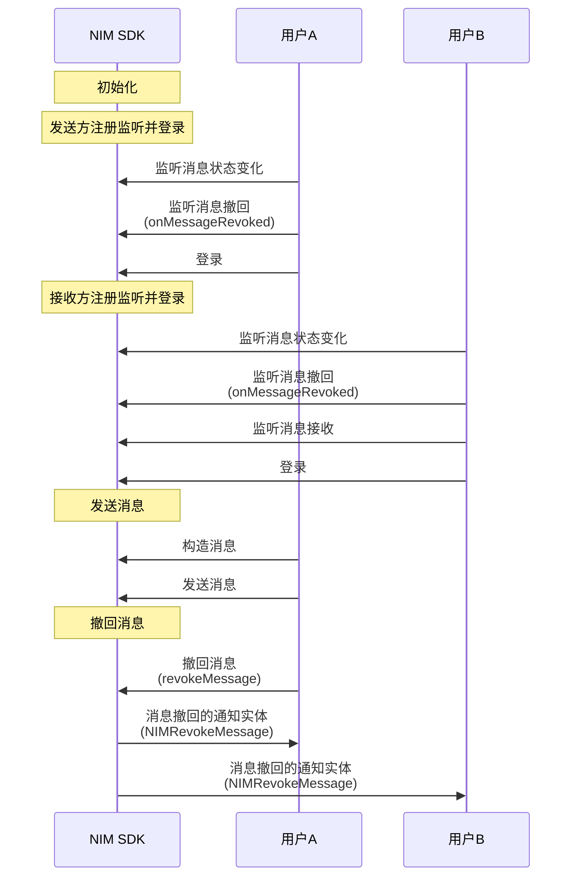

<!--keywords: 消息撤回、撤回、撤回通知、消息撤回通知 -->


NIM SDK 的[`MessageService`](https://doc.yunxin.163.com/messaging/references/flutter/dartdoc/Latest/zh/nim_core/MessageService-class.html)类提供了监听消息撤回的方法和撤回消息的方法。SDK 支持多种撤回类型，如单聊单向撤回和群聊双向撤回，可通过[`revokeType`](https://doc.yunxin.163.com/messaging/references/flutter/dartdoc/Latest/zh/nim_core/NIMRevokeMessage/revokeType.html)设置。


## 功能介绍


撤回类型 | 说明
---- | --------------
双向撤回 | 可双向撤回一定时间内（默认 2 分钟，可在云信控制台配置）的单聊消息与群聊消息。撤回之后，消息接收者和发送者都将收到一条消息撤回通知，并删除对应的离线消息、漫游消息和历史消息。
单向撤回 | 可以在一定时间内（默认 2 分钟，可在云信控制台配置）单向撤回单聊消息和群消息。撤回之后，消息接收者会收到一条单向撤回的通知，并删除对应的离线消息、漫游消息和历史消息；撤回之后，消息发送者无感知，可以正常使用漫游消息和历史消息。


::: note notice 
- <a href="https://doc.yunxin.163.com/messaging/docs/DQwNDE4MDM?platform=flutter#步骤2初始化" target="_blank">初始化SDK</a> 时，配置`NIMSDKOptions`的参数[`shouldConsiderRevokedMessageUnreadCount`](https://doc.yunxin.163.com/messaging/references/flutter/dartdoc/Latest/zh/nim_core/NIMSDKOptions/shouldConsiderRevokedMessageUnreadCount.html)为 true 可实现消息撤回后重新计算未读数。
- 单聊和群聊消息的撤回功能存在些许区别：
    - 单聊：用户只能撤回自己发送的消息。
    - 群聊：普通群成员只能撤回自己发送的消息。客户端 SDK 支持管理员撤回其他群成员的消息(服务端 API 不支持)。
:::


## 前提条件

已完成 [SDK 初始化](https://doc.yunxin.163.com/messaging/docs/jk1MTg0NjM?platform=flutter)。

## 实现流程

不同类型消息撤回的流程相似，本节以用户A（消息发送方）与 用户B（消息接收方）的单聊消息交互为例，介绍消息撤回的实现流程。

### **API调用时序**

以下时序图仅以**单聊双向撤回**的场景为例。



  


### **流程说明**

1. 用户A 和 用户B 在登录 IM 前调用[`onMessageRevoked`](https://doc.yunxin.163.com/messaging/references/flutter/dartdoc/Latest/zh/nim_core/MessageService/onMessageRevoked.html)方法注册消息撤回的观察者，监听消息撤回的通知实体[`NIMRevokeMessage`](https://doc.yunxin.163.com/messaging/references/flutter/dartdoc/Latest/zh/nim_core/NIMRevokeMessage-class.html)。

    - `NIMRevokeMessage`参数说明


        <div style="width:140px">参数</div> | <div style="width:120px">类型</div> | 说明
        ---- | -------------- | ---------
        `attach` | String | 消息附件
        `customInfo` | Stirng |通过服务端 API（[`nimservermsg/recall.action`](https://doc.yunxin.163.com/messaging/docs/zE1NjUyNDg?platform=server#请求参数)）撤回消息时设置的 `msg` 字段。该字段表示消息撤回的相应描述，默认值为“撤回了一条信息”
        `message` | `NIMMessage`| 被撤回的消息
        `notificationType` |  int | 消息撤回通知的类型：1 表示是离线，2 表示是漫游 ， 默认 0 （表示在线）
        `revokeType`| [`RevokeMessageType`](https://doc.yunxin.163.com/messaging/references/flutter/dartdoc/Latest/zh/nim_core/RevokeMessageType.html)| 消息撤回类型，分为单聊（点对点）双向撤回、群聊双向撤回、超大群双向撤回、单聊单向撤回和未定义（Windows 和 macOS 暂不支持）
        `revokeAccount` | String| 撤回消息的操作帐号
        `callbackExt` | String | 第三方扩展字段


    - 示例代码

        ```dart
        NimCore.instance.messageService.onMessageRevoked.listen((event) {
        print('Test_Observer onMessageRevoked ${event.toString()}');
        });


        ```

2. 用户A 在发送消息后，调用[`revokeMessage`](https://doc.yunxin.163.com/messaging/references/flutter/dartdoc/Latest/zh/nim_core/MessageService/revokeMessage.html)方法撤回消息。调用成功后，SDK 会先触发回调通知应用上层消息撤回成功，再自动将本地的这条消息删除。如果需要在撤回后显示一条本方已撤回的提示，可自行构造一条提示消息并调用[插入本地消息的方法]()。

    ::: note notice 
    以下情况消息撤回会失败：
    - 消息为空
    - 消息没有发送成功
    - 消息超过撤回时限
    - 消息被反垃圾（内容审核）命中
    :::

    <br>
    
    <div style="width:170px">参数</div>                | <div style="width:130px">类型</div>                 | 说明                                                
    ------------------- | -------------------- | -------------
    `message`             | `NIMMessage`           | 待撤回的消息                                       
    `customApnsText`      | String           | 可选，第三方透传消息推送文本，不填则不推送               
    `pushPayload`         | Map<String, Object>| 可选，第三方自定义的推送属性，限制 json 类型，长度 2048  
    `shouldNotifyBeCount` | bool            | 可选，撤回通知是否更新未读数（Windows 和 macOS 暂不支持） 
    `postscript`          | String          | 可选，附言（Windows 和 macOS 暂不支持）                   
    `attach`              | String           | 可选，扩展字段                                            


    **示例代码如下**：
    
    ```dart
    NimCore.instance.messageService.revokeMessage(message: message);
    ```


### 相关特殊需求说明

针对撤回场景的通知栏内容覆盖需求（具体为：用户A 发消息给用户B，触发 APNs 推送，文案内容为“你好“。然后用户A 撤回该消息，此时通知栏中的“你好”变为预设的“对方撤回了一条消息”），建议的实现方式如下：

- 在发送消息时，需要通过[`NIMMessage.pushPayload`](https://doc.yunxin.163.com/messaging/references/flutter/dartdoc/Latest/zh/nim_core/NIMMessage/pushPayload.html)方法插入`key`为`apns-collapse-id`的键值对，`value`的内容建议使用`uuid`等字符串，用以唯一标识该消息。
- 当要撤回这条消息时，在`revokeMessage`方法中传参`customApnsText`中设置覆盖文案，在`pushPayload`中插入与被撤回消息相同的`apns-collapse-id`键值对。


    
## API参考

| <div style="width:80px">API</div> | <div style="width:120px">说明 </div>|
|:---- | :-------------- |
|   [`onMessageRevoked`](https://doc.yunxin.163.com/messaging/references/flutter/dartdoc/Latest/zh/nim_core/MessageService/onMessageRevoked.html)     | 注册消息撤回事件流，监听消息撤回|
|    [`revokeMessage`](https://doc.yunxin.163.com/messaging/references/flutter/dartdoc/Latest/zh/nim_core/MessageService/revokeMessage.html)      |      撤回消息         |


