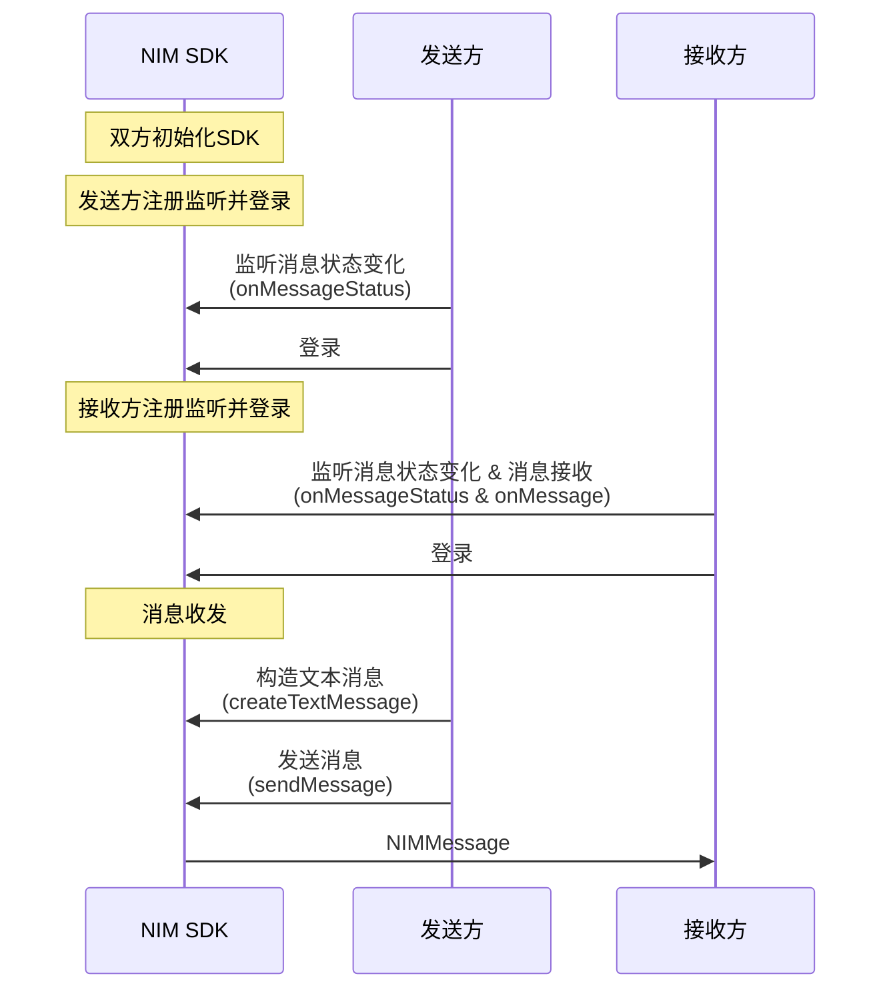
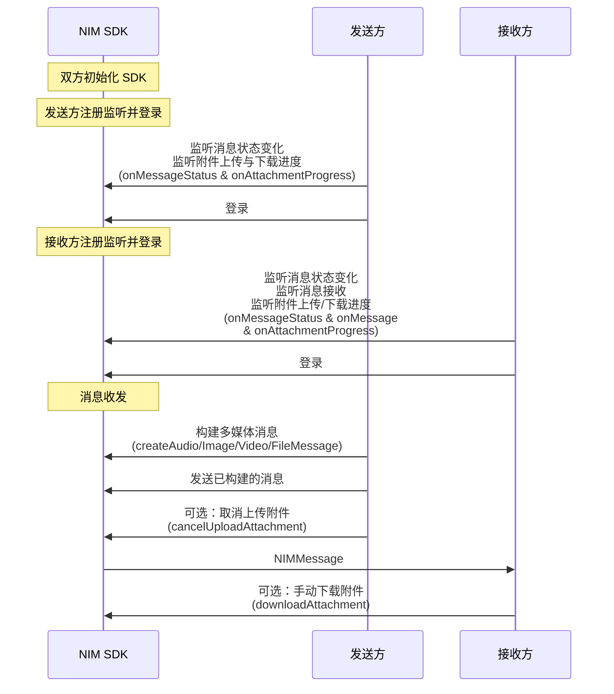
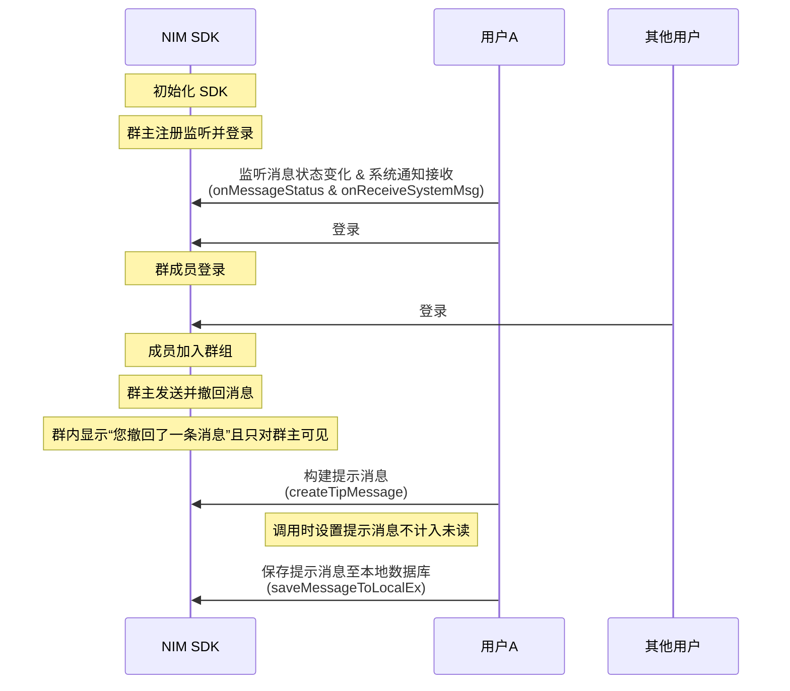

<!--keywords: 消息收发, 消息, 发送消息, 接收消息, 文本消息，图片消息，音频消息，视频消息，多媒体消息，广播消息，提示消息，自定义消息 -->

NetEase IM Flutter SDK（以下简称“NIM SDK”）支持收发多种消息类型，助您快速实现多样化的消息业务场景。NIM SDK 提供[`MessageBuilder`](https://doc.yunxin.163.com/messaging/references/flutter/dartdoc/Latest/zh/nim_core/MessageBuilder-class.html)类和[`MessageService`](https://doc.yunxin.163.com/messaging/references/flutter/dartdoc/Latest/zh/nim_core/MessageService-class.html)类，支持构建、监听和收发多种类型的消息。SDK 中定义消息的结构为[`NIMMessage`](https://doc.yunxin.163.com/messaging/references/flutter/dartdoc/Latest/zh/nim_core/NIMMessage-class.html)（不支持继承扩展），不同消息类型以[`NIMMessageType`](https://doc.yunxin.163.com/messaging/references/flutter/dartdoc/Latest/zh/nim_core/NIMMessageType.html)作区分。发送不同类型消息的方法均为`sendMessage`。单聊消息和群聊消息都通过该方法发送，通过参数`NIMSessionType `设置发送的为单聊消息还是群聊消息。

本文介绍通过网易云信 NIM SDK 实现消息收发的技术原理、前提条件以及具体的实现流程。

::: note note 
- 聊天室和圈组的消息收发，需**单独配置**。具体实现流程请分别参见[聊天室消息收发](https://doc.yunxin.163.com/messaging/docs/zQzNzQ1MTU?platform=flutter#聊天室消息收发)和[圈组消息收发](https://doc.yunxin.163.com/messaging/docs/jUzMDAyNDU?platform=flutter)。
- 本文的时序图可能因为网络问题而显示异常。如显示异常，一般刷新当前页面即可正常显示。
:::


## 技术原理


应用集成 NIM SDK 并完成 SDK 初始化后，消息收发流程如下图所示（**本地提示消息**和**通知消息**除外）。


上图中的流程可归纳为如下三步：

1. 账号集成与登录。
    1. 开发者将应用的用户账号传入云信 IM 服务器，[注册云信 IM 账号](https://doc.yunxin.163.com/docs/TM5MzM5Njk/DQ3Nzk1MTY?platformId=60353)（又称 accid）。
    2. 云信 IM 服务器返回 Token 给应用服务器。
    3. 应用客户端登录应用服务器。
    4. 应用服务器将 Token 返回给应用客户端。
    5. 用户带 Token 登录云信 IM 服务器。
6. 用户A 发送一条消息到云信 IM 服务器。 
7. 云信 IM 服务器投递消息至其他用户，分为如下两种情况：
    - 如为单聊消息，IM 服务器将其投递至用户B。
    - 如为群聊消息，IM 服务器将其投递至群内其他每一位用户。


::: note notice 
上图仅以静态 Token 登录为例展示消息收发流程。网易云信 IM 还支持动态 Token 登录鉴权和第三方回调登录鉴权，相关详情请参见[登录鉴权](https://doc.yunxin.163.com/docs/TM5MzM5Njk/zE2NzA3Mjc?platformId=60353)。
:::


## 前提条件 ##

在实现消息收发之前，请确保：

- 已完成 [SDK 初始化](https://doc.yunxin.163.com/messaging/docs/DQwNDE4MDM?platform=flutter#步骤2初始化)。
- 已[创建群组](https://doc.yunxin.163.com/messaging/docs/jE1NjkyNzA?platform=flutter#创建群组)（如需发送群聊消息）。
- 已了解各消息类型的[使用限制](https://doc.yunxin.163.com/messaging/docs/Tg1MjcyMjg?platform=flutter#消息类型)。

## API使用限制 ##

::: note important :::
发送消息（`sendMessage`）的方法调用存在频控，一分钟内默认最多可调用 300 次。
:::


## 实现消息收发

### 收发文本消息 




  
**实现流程** 

1. 发送方注册[`onMessageStatus`](https://doc.yunxin.163.com/messaging/references/flutter/dartdoc/Latest/zh/nim_core/MessageService/onMessageStatus.html)事件流，监听消息状态变化。

    ```
    NimCore.instance.messageService.onMessageStatus.listen((NIMMessage message) {
        // 1、根据sessionId判断是否是自己的消息
        // 2、更改内存中消息的状态
        // 3、刷新界面
    });
    ```

2. 接收方注册[`onMessage`](https://doc.yunxin.163.com/messaging/references/flutter/dartdoc/Latest/zh/nim_core/MessageService/onMessage.html)事件流和[`onMessageStatus`](https://doc.yunxin.163.com/messaging/references/flutter/dartdoc/Latest/zh/nim_core/MessageService/onMessageStatus.html)事件流，分别监听消息接收和消息状态变化。

    ```
    NimCore.instance.messageService.onMessage.listen((List<NIMMessage> list) {
        // 处理新收到的消息，为了上传处理方便，SDK 保证参数 messages 全部来自同一个聊天对象。
    });
    ```

    


3. 发送方调用[`createTextMessage`](https://doc.yunxin.163.com/messaging/references/flutter/dartdoc/Latest/zh/nim_core/MessageBuilder/createTextMessage.html)方法，构建一条文本消息。

    ::: note notice :::
    通过`sessionType`参数，可设置发送的文本消息为**单聊**消息或**群聊**消息。如设置为群聊消息，请确保已创建相应的群组。
    :::

     参数        | 类型| 类型说明                                                         
     :---------- | :------|:----------------------------------------------------- 
     `sessionId`  |String | 聊天对象的 ID，根据会话类型`sessionType`判断<br><div><ul><li>如果是单聊，则`sessionId`为用户的云信IM帐号（即`accid`）</li><li>如果是群聊，则`sessionId`为群组 ID</li> </ul></div>
     `sessionType` |[`NIMSessionType`](https://doc.yunxin.163.com/messaging/references/flutter/dartdoc/Latest/zh/nim_core/NIMSessionType.html)| 会话类型
     `text`        | String |文本消息内容    

    
4. 发送方调用[`sendMessage`](https://doc.yunxin.163.com/messaging/references/flutter/dartdoc/Latest/zh/nim_core/MessageService/sendMessage.html)方法，发送已构建的文本消息。


    ::: note note :::
    可通过消息配置选项[`NIMCustomMessageConfig`](https://doc.yunxin.163.com/messaging/references/flutter/dartdoc/Latest/zh/nim_core/NIMCustomMessageConfig-class.html)设置该消息是否存入云端、写入漫游、计入未读数等。具体配置示例请参见[消息配置选项](https://doc.yunxin.163.com/messaging/docs/jY1NzU1MDg?platform=flutter)。
    :::

    <br>

    **创建并发送文本消息的示例代码**如下：

    ```
    // 该帐号为示例
    String account = 'testAccount';
    // 以单聊类型为例
    NIMSessionType sessionType = NIMSessionType.p2p;
    String text = 'this is an example';
    // 创建并且发送一个文本消息
    Future<NIMResult<NIMMessage>> result = MessageBuilder.createTextMessage(
        sessionId: account, sessionType: sessionType, text: text)
        .then((value) => value.isSuccess
        ? NimCore.instance.messageService
            .sendMessage(message: value.data!, resend: false)
        : Future.value(value));
    ```    


5. 接收方通过`onMessage`回调收到文本消息。


  


### 收发多媒体消息

多媒体消息包括图片消息、语音消息、视频消息和文件消息。


::: note note 
NIM SDK 提供了高清语音的录制与播放的功能，用于处理语音消息。相关详情请参见[语音消息处理](https://doc.yunxin.163.com/messaging/docs/zQwNTA4MTU?platform=flutter)。
:::


**API调用时序**




**实现流程**

1. 发送方注册如下事件流。

    - 注册[`onMessageStatus`](https://doc.yunxin.163.com/messaging/references/flutter/dartdoc/Latest/zh/nim_core/MessageService/onMessageStatus.html)事件流，监听消息状态[`NIMMessageStatus`](https://doc.yunxin.163.com/messaging/references/flutter/dartdoc/Latest/zh/nim_core/NIMMessageStatus.html)和消息附件接收或发送状态[`NIMMessageAttachmentStatus`](https://doc.yunxin.163.com/messaging/references/flutter/dartdoc/Latest/zh/nim_core/NIMMessageAttachmentStatus.html)的变化。
    - 注册[`onAttachmentProgress`](https://doc.yunxin.163.com/messaging/references/flutter/dartdoc/Latest/zh/nim_core/MessageService/onAttachmentProgress.html)事件流，监听监听消息附件的上传/下载进度。(<font color=red>注</font>：Web 端不支持该事件流)

    
    :::::: div custom-tabs

    ::: tab 监听消息状态变化
    ```
    NimCore.instance.messageService.onMessageStatus.listen((NIMMessage message) {
        // 1、根据sessionId判断是否是自己的消息
        // 2、更改内存中消息的状态
        // 3、刷新界面
    });
    ```

    :::
    ::: tab 监听消息附件上传/下载进度

    ```
    NimCore.instance.messageService.onAttachmentProgress.listen((NIMAttachmentProgress process) {
      // todo 根据附件下载/上传进度更新UI
    });
    ```
    :::
    ::::::

2. 接收方注册如下事件流。

    - 注册[`onMessage`](https://doc.yunxin.163.com/messaging/references/flutter/dartdoc/Latest/zh/nim_core/MessageService/onMessage.html)事件流，监听消息接收。
    - 注册[`onAttachmentProgress`](https://doc.yunxin.163.com/messaging/references/flutter/dartdoc/Latest/zh/nim_core/MessageService/onAttachmentProgress.html)事件流，监听消息附件上传/下载进度。

    :::::: div custom-tabs

    ::: tab 监听消息接收

    ```
    NimCore.instance.messageService.onMessage.listen((List<NIMMessage> list) {
        // 处理新收到的消息，为了上传处理方便，SDK 保证参数 messages 全部来自同一个聊天对象。
    });
    ```

    :::

    ::: tab 监听消息附件上传/下载进度
    ```
    NimCore.instance.messageService.onAttachmentProgress.listen((NIMAttachmentProgress process) {
      // todo 根据附件下载/上传进度更新UI
    });
    ```
    :::

    ::::::

3. 发送方构建多媒体消息。


    <div style="width:100px">消息类型</div> | <div style="width:150px">构建方法</div> | 多媒体资源云端存储配置
    ---- | -------------- 
    图片消息| [`createImageMessage`](https://doc.yunxin.163.com/messaging/references/flutter/dartdoc/Latest/zh/nim_core/MessageBuilder/createImageMessage.html)| 调用时可指定多媒体资源（图片、语音、视频或文件）在网易对象存储（Netease Object Storage，NOS）服务上的过期时间，具体参见[多媒体资源存储场景](https://doc.yunxin.163.com/TM5MzM5Njk/docs/jIzNjg1MDU?platform=flutter)。
    语音消息 | [`createAudioMesssage`](https://doc.yunxin.163.com/messaging/references/flutter/dartdoc/Latest/zh/nim_core/MessageBuilder/createAudioMessage.html) | ^^
    视频消息 | [`createVideoMessage`](https://doc.yunxin.163.com/messaging/references/flutter/dartdoc/Latest/zh/nim_core/MessageBuilder/createVideoMessage.html) | ^^
    文件消息 | [`createFileMessage`](https://doc.yunxin.163.com/messaging/references/flutter/dartdoc/Latest/zh/nim_core/MessageBuilder/createFileMessage.html) | ^^

    上述方法的**部分重要参数**说明如下：

     参数        | 类型| 类型说明                                                         
     :---------- | :------|:----------------------------------------------------- 
     `sessionId`  |String | 聊天对象的 ID，根据会话类型`sessionType`判断<br><div><ul><li>如果是单聊，则`sessionId`为用户的云信IM帐号（即`accid`）</li><li>如果是群聊，则`sessionId`为群组 ID</li> </ul></div>
     `sessionType` |[`NIMSessionType`](https://doc.yunxin.163.com/messaging/references/flutter/dartdoc/Latest/zh/nim_core/NIMSessionType.html)| 会话类型
     `filePath` | String | 多媒体资源的文件路径，web 端可传空字符串


4. 发送方调用[`sendMessage`](https://doc.yunxin.163.com/messaging/references/flutter/dartdoc/Latest/zh/nim_core/MessageService/sendMessage.html)方法，发送已构建的多媒体消息。

    ::: note note :::
    - 可通过消息配置选项[`NIMCustomMessageConfig`](https://doc.yunxin.163.com/messaging/references/flutter/dartdoc/Latest/zh/nim_core/NIMCustomMessageConfig-class.html)设置该消息是否存入云端、写入漫游、计入未读数等。具体配置示例请参见[消息配置选项](https://doc.yunxin.163.com/messaging/docs/jY1NzU1MDg?platform=flutter)。
    - 发送多媒体消息后可调用[`cancelUploadAttachment`](https://doc.yunxin.163.com/messaging/references/flutter/dartdoc/Latest/zh/nim_core/MessageService/cancelUploadAttachment.html)方法取消上传多媒体资源。如果多媒体资源已经上传成功，操作将会失败。如果成功取消了多媒体资源的上传，那么相应的消息会发送失败，对应的消息状态是`NIMMessageStatus.fail`，附件状态是`NIMMessageAttachmentStatus.cancel`。
    - 如果同一个多媒体消息需要多次发送时，建议控制时序依次发送，避免出现发送失败的问题。
    :::

    <br>

    **构建并发送多媒体消息的示例代码**如下：

    :::::: div custom-tabs
    ::: tab 图片消息
    ```
    // 该帐号为示例
        String account = 'testAccount';
    // 以单聊类型为例
        NIMSessionType sessionType = NIMSessionType.p2p;
    // 示例图片，需要开发者在相应目录下有图片
        File file = new File('filePath');
    // 显示名称
        String displayName = 'this is a file';
    // web 端需要base64,其他端可忽略
        String base64 = 'this is base64';
    // 发送图片消息
        Future<NIMResult<NIMMessage>> result =
        MessageBuilder.createImageMessage(
            sessionId: account,
            sessionType: sessionType,
            filePath: file.path,
            fileSize: file.lengthSync(),
            displayName: displayName,
            base64: base64,
            nosScene: NIMNosScene.defaultIm)
            .then((value) => value.isSuccess
            ? NimCore.instance.messageService
            .sendMessage(message: value.data!, resend: false)
            : Future.value(value));
    ```


    :::

    ::: tab 语音消息
    ```
    // 该帐号为示例
        String account = 'testAccount';
    // 以单聊类型为例
        NIMSessionType sessionType = NIMSessionType.p2p;
    // 示例音频，需要开发者在相应目录下有文件
        File file = new File('filePath');
    // 显示名称
        String displayName = 'this is a file';
        // web 端需要base64,其他端可忽略 
        String base64 = 'this is base64';
    // 发送语音消息
        Future<NIMResult<NIMMessage>> result =
        MessageBuilder.createAudioMessage(
            sessionId: account,
            sessionType: sessionType,
            filePath: file.path,
            fileSize: file.lengthSync(),
            base64: base64,
            duration: 2000,
            displayName: displayName,
            nosScene: NIMNosScene.defaultIm)
            .then((value) => value.isSuccess
            ? NimCore.instance.messageService
            .sendMessage(message: value.data!, resend: false)
            : Future.value(value));
    ```
    :::

    ::: tab 视频消息
    ```
    // 该帐号为示例
    String account = 'testAccount';
    // 以单聊类型为例
        NIMSessionType sessionType = NIMSessionType.p2p;
    // 示例视频，需要开发者在相应目录下有文件
        File file = new File('filePath');
    // 显示名称
        String displayName = 'this is a file';
        // web 端需要base64,其他端可忽略 
        String base64 = 'this is base64';
    // 发送消息
        Future<NIMResult<NIMMessage>> result =
        MessageBuilder.createVideoMessage(
            sessionId: account,
            sessionType: sessionType,
            filePath: file.path,
            fileSize: file.lengthSync(),
            base64: base64,
            duration: 2000,
            width: 1080,
            height: 720,
            displayName: displayName,
            nosScene: NIMNosScene.defaultIm)
            .then((value) => value.isSuccess
            ? NimCore.instance.messageService
            .sendMessage(message: value.data!, resend: false)
            : Future.value(value));
    ```

    :::

    ::: tab 文件消息

    ```
    // 该帐号为示例
        String account = 'testAccount';
    // 以单聊类型为例
        NIMSessionType sessionType = NIMSessionType.p2p;
    // 示例文件，需要开发者在相应目录下有文件
        File file = new File('filePath');
    // 显示名称
        String displayName = 'this is a file';
        // web 端需要base64,其他端可忽略 
        String base64 = 'this is base64';
    // 发送消息
        Future<NIMResult<NIMMessage>> result = MessageBuilder.createFileMessage(
            sessionId: account,
            sessionType: sessionType,
            filePath: file.path,
            fileSize: file.lengthSync(),
            base64: base64,
            displayName: displayName,
            nosScene: NIMNosScene.defaultIm)
            .then((value) => value.isSuccess
            ? NimCore.instance.messageService
            .sendMessage(message: value.data!, resend: false)
            : Future.value(value));
    ```

    :::
    ::::::
5. 接收方通过`onMessage`事件流的回调接收多媒体消息。

    多媒体资源一般默认自动下载，但不同消息类型的默认下载策略稍有区别，具体请参见下表：

    消息类型 | 默认资源下载策略
    ---- | -------------- 
    图片/视频消息 | SDK 在收到消息时，自动下载缩略图和封面图片
    语音消息 | SDK 在收到消息时，自动下载原音频
    文件消息 | SDK 默认**不下载**原文件

    - 如果需要下载文件消息的文件资源，可调用[`downloadAttachment`](https://doc.yunxin.163.com/messaging/references/flutter/dartdoc/Latest/zh/nim_core/MessageService/downloadAttachment.html)方法手动下载。其他类型多媒体消息的资源如自动下载失败，也可调用该方法手动重新下载。

        <details><summary>downloadAttachment方法的参数</summary>

        <div style="width:130px">参数</div>    | <div style="width:90px">类型</div>   | 说明      
        :------ | :----------------- | :-----------------------
        `message` | `NIMMessage` | 附件所在的消息体                                                                                  
        `thumb`   | bool      | 是否只下载缩略图。为 true 时，仅下载缩略图。该参数仅对图片和视频类消息有效（Windows 和 macOS 暂不支持该参数）
        </details>
    - 如需自主选择下载时机，需将初始化配置参数[`NIMSDKOptions.enablePreloadMessageAttachment`](https://doc.yunxin.163.com/messaging/references/flutter/dartdoc/Latest/zh/nim_core/NIMSDKOptions/enablePreloadMessageAttachment.html)设置为`false`，关闭默认资源下载策略，再在合适的时机调用`downloadAttachment`方法。


    <br>

    手动下载多媒体资源示例如下：

    ```
    NimCore.instance.messageService.downloadAttachment(message, true);
    ```


6. 接收方可以在多媒体资源下载完成后，通过对应的`NIMMessageAttachment`获取到具体的附件内容。多媒体附件的基类[`NIMFileAttachment`](https://doc.yunxin.163.com/messaging/references/flutter/dartdoc/Latest/zh/nim_core/NIMFileAttachment-class.html)，继承自`NIMMessageAttachment`。它的子类主要有：

    - [`NIMVideoAttachment`](https://doc.yunxin.163.com/messaging/references/flutter/dartdoc/Latest/zh/nim_core/NIMVideoAttachment-class.html)：视频消息附件
    - [`NIMImageAttachment`](https://doc.yunxin.163.com/messaging/references/flutter/dartdoc/Latest/zh/nim_core/NIMImageAttachment-class.html)：图片消息附件
    - [`NIMAudioAttachment`](https://doc.yunxin.163.com/messaging/references/flutter/dartdoc/Latest/zh/nim_core/NIMAudioAttachment-class.html)：音频消息附件

    <details><summary>多媒体附件的部分参数说明</summary>

    参数 | 类型        | 说明              
    :--------------------- | :---------- | :--------------------- | -----
    path                   | String   | 可选参数，文件本地路径，若文件不存在，返回 null。 <br>语音消息的文件路径，在附件下载完成之后可以获取。<br>图片或视频的文件路径，需要手动下载之后获取，收到消息时，SDK 只默认自动下载缩略图文件 
    thumbPath              | String    | 可选参数，缩略图文件的本地路径，若文件不存在，返回 null。<br>当消息状态显示缩略图下载完成之后，可获取缩略图文件路径（Windows 和 macOS 暂不支持）        
    thumbUrl               | String  | 可选参数，缩略远程路径（Windows 和 macOS 暂不支持）           
    size                   | int       | 可选参数，获取文件大小，单位为 byte                                          
    md5                    | String   | 可选参数，获取文件内容 MD5       
    url                    | String   | 可选参数，获取文件在服务器上的下载 url。若文件还未上传，返回 null        
    extension              | String    | 可选参数，文件后缀名          
    expire                 | int       | 可选参数，过期时间（Windows 和 macOS 暂不支持）       
    nosScene               | NIMNosScene | 上传文件时用的对 token 对应的场景，默认 [NIMNosScenes.defaultIm]          
    displayName            | String    | 可选参数，文件的显示名。可以和文件名不同，仅用于界面展示      
    base64     |   String   | 通用可选字段，目前用于 Web 传入文件信息，Web 端发送文件必传

    </details>


    ::: note note
    文件消息附件为`NIMFileAttachment`本身。
    :::


### 收发地理位置消息

地理位置消息收发流程与文本消息收发流程基本一致，区别在于构建消息的调用方法不同。本节仅简要展示相关调用示例，具体实现流程请参考上文的[收发文本消息](#收发文本消息)。


1. 调用[`createLocationMessage`](https://doc.yunxin.163.com/messaging/references/flutter/dartdoc/Latest/zh/nim_core/MessageBuilder/createLocationMessage.html)方法构建地理位置消息。


    参数        | 类型           | 说明                                                                         
    :---------- | :------------- | :------------------------------------------------------------------------
    `sessionId`   | String         | 聊天对象的 ID，如果是单聊，为用户帐号（`accid`），如果是群聊，为群组 ID (`teamId`)             
    `sessionType` | NIMSessionType | 会话类型， `NIMSessionType.p2p` 为单聊类型，`NIMSessionType.team` 为群聊类型 
    `latitude`    | double         | 纬度                                                                         
    `longitude`   | double         | 经度                                                                         
    `address`     | String         | 地理位置描述信息                                                             


    ::: note note :::
    可通过消息配置选项[`NIMCustomMessageConfig`](https://doc.yunxin.163.com/messaging/references/flutter/dartdoc/Latest/zh/nim_core/NIMCustomMessageConfig-class.html)设置该消息是否存入云端、写入漫游、计入未读数等。具体配置示例请参见[消息配置选项](https://doc.yunxin.163.com/messaging/docs/jY1NzU1MDg?platform=flutter)。
    :::


2. 调用[`sendMessage`](https://doc.yunxin.163.com/messaging/references/flutter/dartdoc/Latest/zh/nim_core/MessageService/sendMessage.html)方法方法将构建的地理位置消息发送至接收方。

    **创建并发送地理位置消息的示例代码**如下：

    ```
    // 该帐号为示例
    String account = 'testAccount';
    // 以单聊类型为例
    NIMSessionType sessionType = NIMSessionType.p2p;
    // 显示名称
    String address = 'this is a address';
    // 发送消息
    Future<NIMResult<NIMMessage>> result =
        MessageBuilder.createLocationMessage(
                sessionId: account,
                sessionType: sessionType,
                latitude: 30.3,
                longitude: 120.2,
                address: address)
            .then((value) => value.isSuccess
                ? NimCore.instance.messageService
                    .sendMessage(message: value.data!, resend: false)
                : Future.value(value));
    ```


### 收发提示消息

提示消息（又叫做 Tip 消息）主要用于会话内的通知提醒，可以看做是自定义消息的简化，有独立的消息类型`NIMMessageType.tip`。 区别于自定义消息，Tip 消息暂不支持通过[`setAttachment`](https://doc.yunxin.163.com/messaging/references/flutter/dartdoc/Latest/zh/nim_core/QChatSendMessageParam/setAttachment.html)方法设置附件，**如需使用附件请使用自定义消息**。 Tip 消息的典型使用场景包括**进入会话时出现的欢迎消息**和**会话过程中命中敏感词后的提示**等。这些应用场景也可以用自定义消息实现，但会相对复杂。

本节以 “**您撤回了一条消息**提示出现在群组中（仅对发送者可见且不发送到服务端）” 这个应用场景为例，介绍实现提示消息收发的流程。

**API调用时序**




  

**实现流程**

1. 用户A 在登录 IM 前，注册[`onMessageStatus`]()和`onReceiveSystemMsg`事件流，分别监听消息状态[`NIMMessageStatus`]()的变化和系统通知的接收（本场景下为监听消息撤回系统通知）。


    :::::: div custom-tabs
    ::: tab 监听消息状态变化

    ```
    NimCore.instance.messageService.onMessageStatus.listen((NIMMessage message) {
        // 1、根据sessionId判断是否是自己的消息
        // 2、更改内存中消息的状态
        // 3、刷新界面
    });
    ```

    :::

    ::: tab 监听系统通知接收

    ```
    NimCore.instance.systemMessageService.onReceiveSystemMsg.  NimCore.instance.systemMessageService.onReceiveSystemMsg.listen((SystemMessage event) {

            });

    ```

    :::
    ::::::


2. 用户A 调用[`createTeam`](https://doc.yunxin.163.com/messaging/references/flutter/dartdoc/Latest/zh/nim_core/TeamService/createTeam.html)方法创建高级群，相关示例代码请参见[创建群组](https://doc.yunxin.163.com/messaging/docs/jE1NjkyNzA?platform=flutter#创建群组)。

3. 其他用户加入用户A 创建的高级群，具体加入方法请参见[入群操作](https://doc.yunxin.163.com/messaging/docs/jE1NjkyNzA?platform=flutter#入群操作)。

4. 用户A 调用[`createTipMessage`](https://doc.yunxin.163.com/messaging/references/flutter/dartdoc/Latest/zh/nim_core/MessageBuilder/createTipMessage.html)方法构建提示消息，调用时将`enableUnreadCount`参数设置为`false`，使该提示消息不计入未读计数。

    该方法的部分参数说明如下：
    
     参数        | 类型| 类型说明                                                         
     :---------- | :------|:----------------------------------------------------- 
     `sessionId`  |String | 聊天对象的 ID，根据会话类型`sessionType`判断<br><div><ul><li>如果是单聊，则`sessionId`为用户的云信IM帐号（即`accid`）</li><li>如果是群聊，则`sessionId`为群组 ID</li> </ul></div>
     `sessionType` |[`NIMSessionType`](https://doc.yunxin.163.com/messaging/references/flutter/dartdoc/Latest/zh/nim_core/NIMSessionType.html)| 会话类型


5. 用户A 调用[`saveMessageToLocalEx`](https://doc.yunxin.163.com/messaging/references/flutter/dartdoc/Latest/zh/nim_core/MessageService/saveMessageToLocalEx.html)方法，保存该提示消息到本地数据库，但不发送到服务器。

    第 4 至 5 步的示例代码如下：

```
 //创建消息
      var tipMessageBuild = await MessageBuilder.createTipMessage(sessionId: sessionId, sessionType: sessionType,content: "content");
      var message = tipMessageBuild.data!;
      message.config = NIMCustomMessageConfig(enableUnreadCount:false);
      //保存消息
      NimCore.instance.messageService.saveMessageToLocalEx(message: message, time: time).then((value) {
        if(value.isSuccess){
          //todo success
        }
      });
```


### 接收通知消息

针对一些特定场景的事件，云信服务器预置了一些通知消息，在事件发生时下发到 SDK。通知消息也是一种特定消息，开发者需解析消息中附带的信息，来获取通知内容。如最常见的通知消息——群通知事件，如有新成员进群，则群内已有成员将收到此通知消息。通知消息与系统通知的区别，见[通知消息和系统通知](https://doc.yunxin.163.com/messaging/docs/Tg1MjcyMjg?platform=flutter#通知消息和系统通知)

- 通知消息属于会话内的一种消息，其对应的数据结构为 `NIMMessage`，消息类型为 `NIMMessageType.notification`。通知消息目前用于在群和聊天室的事件通知。

- 通知消息需要进行解析，具体请参见[群组通知消息](https://doc.yunxin.163.com/messaging/docs/jE1NjkyNzA?platform=flutter#群组通知消息)。

### 收发自定义消息 

除了上述消息类型以外，NIM SDK 还支持收发自定义消息类型。SDK 不负责定义和解析自定义消息的具体内容，解释工作由开发者完成。SDK 会将自定义消息存入消息数据库，会和其他类型消息一并展现在消息记录中。

为了使用更加方便，自定义消息采用附件的方式展示给开发者。体现在 `NIMMessage` 类中，自定义消息的内容会被解析为 `NIMCustomMessageAttachment` 对象。


## 常见问题

### 发送消息后如何获取消息内容

注册 [`onMessageStatus`]()事件流，监听消息状态变化，该方法可以监听消息发送状态变化中回调`NIMMessage`对象。

可以通过[`NIMMessage`](https://doc.yunxin.163.com/messaging/references/flutter/dartdoc/Latest/zh/nim_core/NIMMessage-class.html)对象的如下参数获取消息内容：
- `messageDirection`：消息方向（发送或接收）
- `sessionId`：聊天对象的账号（`accid`）或群组 ID（`teamId`）
- `content`：文本消息具体内容
- `messageAttachment`：消息附件对象
- `status`：消息收发状态
- `timestamp`：消息发送时间（单位为毫秒）


### 如何设置消息的扩展字段

单聊或群聊消息具有服务端扩展字段和客户端扩展字段。服务端扩展字段只能在消息发送前设置，会同步到其他端；客户端扩展字段在消息发送前后设置均可，不会同步到其他端。

::: note notice
扩展字段，请使用 JSON 格式封装，并传入非格式化的 JSON 字符串，最大长度1024字节。
:::

<br>

具体方法如下：

:::::: div custom-tabs 
::: tab 更新客户端扩展字段

1. 对于单聊或群聊消息，构造`NIMMessage`对象时，通过<a href="https://doc.yunxin.163.com/messaging/references/flutter/dartdoc/Latest/zh/nim_core/NIMMessage/localExtension.html" target="_blank">`localExtension`</a>参数设置客户端扩展字段。

2. 调用<a href="https://doc.yunxin.163.com/messaging/references/flutter/dartdoc/Latest/zh/nim_core/MessageService/updateMessage.html" target="_blank">`updateMessage`</a>方法更新消息的本地扩展字段。

    ::: note notice 
    设置消息的客户端扩展字段后，必须调用`updateMessage`方法，否则无法生效。
    :::

:::

::: tab 更新服务端扩展字段

对于单聊或群聊消息，构造`NIMMessage`对象时，通过[`remoteExtension`](https://doc.yunxin.163.com/messaging/references/flutter/dartdoc/Latest/zh/nim_core/NIMMessage/remoteExtension.html)方法设置消息的服务端扩展字段。

:::
::::::

