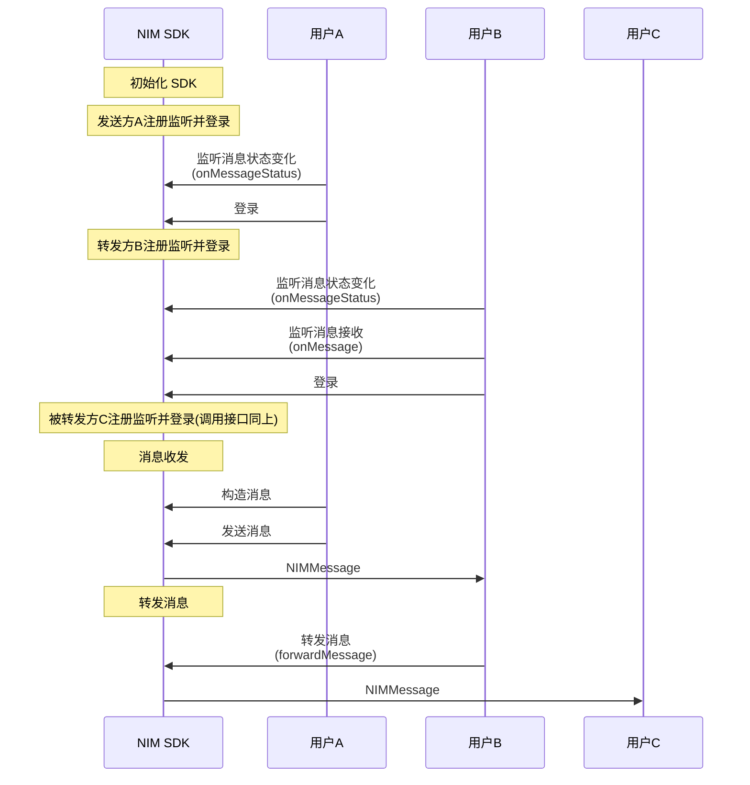

<!--keywords: 消息重发,重发消息,重发,转发,转发消息,转发合并消息,转发多条消息,合并转发, -->

NIM SDK 的[`MessageService`](https://doc.yunxin.163.com/messaging/references/flutter/dartdoc/Latest/zh/nim_core/MessageService-class.html)类提供了监听消息转发/重发的方法和转发/重发消息的方法。发送转发消息与发送不同类型（如文本、音频、视频等）的消息的方法一致，需要先构建待转发的消息再调用`sendMessage`方法将其发送至目标用户。


::: note notice
除了**通知消息**外，其他类型消息均支持转发给其他会话。
:::


## 前提条件

已完成 [SDK 初始化](https://doc.yunxin.163.com/messaging/docs/DQwNDE4MDM?platform=flutter#步骤2初始化)。


## API使用限制 

::: note important :::
发送消息（`sendMessage`）的方法调用存在频控，一分钟内默认最多可调用 300 次。
:::

## <span id="消息重发">重发消息</span>


消息发送失败之后，可以重发消息。消息重发和消息发送共用[`sendMessage`](https://doc.yunxin.163.com/messaging/references/flutter/dartdoc/Latest/zh/nim_core/MessageService/sendMessage.html)方法，如果`resend`参数设置为`true`，则重发消息。

## <span id="消息转发">转发一条消息</span>

NIM SDK 支持转发通知和音视频通话事件消息以外所有其他消息类型。


### **API调用时序**

::: note note 
转发不同类型消息的实现方法类似，本节仅以转发一条文本消息为例进行介绍。
:::




### **实现流程**

本节以上述 API 时序图中用户A、B、C 的消息交互场景为例，介绍转发一条消息的实现流程。

1. 用户C 注册[`onMessage`](https://doc.yunxin.163.com/messaging/references/flutter/dartdoc/Latest/zh/nim_core/MessageService/onMessage.html)事件流，监听消息接收。

2. 用户B 接收到用户A 发送的消息，调用[`forwardMessage`](https://doc.yunxin.163.com/messaging/references/flutter/dartdoc/Latest/zh/nim_core/MessageService/forwardMessage.html)转发该消息，调用时将`message`参数设置为接收到的消息，将`sessionId`设置为用户C 的云信 IM 账号 ID。


    示例代码如下：

    ```dart
    NIMResult<NIMMessage> message = await MessageBuilder.createTextMessage(sessionId: '123', sessionType: NIMSessionType.p2p, text: '转发');
    if (message.isSuccess) {
        NimCore.instance.messageService.forwardMessage(message.data!, '123', NIMSessionType.p2p);
    }

    ```

4. `onMessage`触发`Stream`回调，用户C 通过该回调接收被转发的消息。


## API参考

| <div style="width:80px">API</div> | <div style="width:120px">说明 </div>|
|:---- | :-------------- |
|[`onMessage`](https://doc.yunxin.163.com/messaging/references/flutter/dartdoc/Latest/zh/nim_core/MessageService/onMessage.html) | 注册消息接收事件流，监听消息的到达事件|
|[`forwardMessage`](https://doc.yunxin.163.com/messaging/references/flutter/dartdoc/Latest/zh/nim_core/MessageService/forwardMessage.html)| 转发一条消息 |


