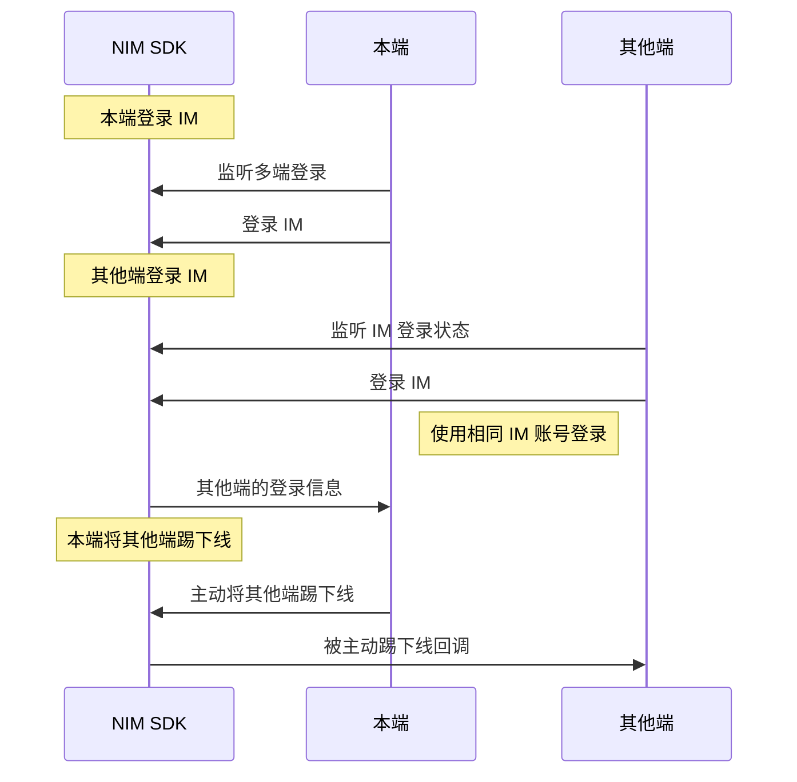

<!-- keywords: 即时通讯,IM,登录, 多端登录, 互踢, 多个设备端同时在线 -->


您可通过两种方式实现 IM 的多端登录与互踢。 


## 方式1：通过云信控制台配置

当前 NIM SDK 支持通过云信控制台配置四种不同的 IM 多端登录策略：

- 只允许一端登录，Windows、Web、Android、iOS 彼此互踢。
- 桌面端 PC 与 Web 互踢，移动端 Android 和 iOS 互踢，且桌面端与移动端可同时登录
- 各端均可以同时登录在线（最多10个设备同时在线）
- 自定义多端登录配置

通过该方式的配置，可实现自动管控 IM 的多端登录。具体如何配置，请参见[多端登录与互踢策略](https://doc.yunxin.163.com/messaging/docs/DQ0MDkyMjA?platform=flutter)。


## 方式2：主动将其他端踢下线

### API 调用时序


  
### 踢方操作

#### <span id="多端登录监听">步骤1：注册多端登录监听</span>


通过多端登录事件流（`onlineClients` ）监听其他端的登录信息（`NIMOnlineClient`）。本端未登录时，如有其他端使用相同的 IM 账号登录或注销，本端会收到通知；登录成功后，当有其他端登录或者注销时，本端也会收到通知。


NIMOnlineClient 接口说明：

| 参数       |  类型      |说明                 |
| :------------ | :--------- | :------|:------------- |
| `os`         | String? |客户端的操作系统信息 |
| `clientType` |  <a href="https://doc.yunxin.163.com/messaging/references/flutter/dartdoc/Latest/zh/nim_core/NIMClientType.html" target="_blank">`NIMClientType`</a> |客户端类型           |
| `loginTime`  |int | 登录时间             |
| `customTag`  | String? |登录自定义属性       |

示例代码如下：

```dart
final subscription = NimCore.instance.authService.onlineClients.listen((clients) {
  clients.forEach((client) {
    switch (client.clientType) {
      case NIMClientType.windows:
        // PC端(Windows)
        break;
      case NIMClientType.macos:
        // PC端(macOS)
        break;
      case NIMClientType.web:
        // Web端
        break;
      case NIMClientType.ios:
        // 移动端(iOS)
        break;
      case NIMClientType.android:
        // 移动端(Android)
        break;
      default:
        // 未知
        break;
    }
  });
});

/// 不再监听时，需要取消监听，否则造成内存泄漏
/// subscription.cancel();
```

#### <span id="互踢">步骤2：将其他端踢下线</span>

本端调用<a href="https://doc.yunxin.163.com/messaging/references/flutter/dartdoc/Latest/zh/nim_core/AuthService/kickOutOtherOnlineClient.html" target="_blank">`kickOutOtherOnlineClient`</a>方法主动将使用相同 IM 账号登录的其他设备端踢下线。调用时需要传入 `NIMOnlineClient` 类型的对象（表示当前登录 IM 的在线设备列表），该对象通过监听多端登录事件（ <a href="https://doc.yunxin.163.com/messaging/references/flutter/dartdoc/Latest/zh/nim_core/AuthService/onlineClients.html" target="_blank">`onlineClients`</a>）获取。


示例代码如下：

```dart

  NimCore.instance.authService
    .kickOutOtherOnlineClient(client)
    .then(
      (result) {
        if (result.isSuccess) {
          /// 成功
        } else {
          /// 失败
        }
      }
    );

```

### 被踢方操作

被踢的设备端可在登录 IM 前，通过登录状态事件流（`authStatus`）监听自己的登录状态变化。收到被踢回调后，**建议登出（注销）IM 并切换到登录界面**。

被踢（`NIMKickOutByOtherClientEvent`）事件参数说明如下：

| 参数        | 类型 | 说明                         |
| :------------ | :-----|:---------- | :-------  |:----------------------- |
| `status`          | <a href="https://doc.yunxin.163.com/messaging/references/flutter/dartdoc/Latest/zh/nim_core/NIMAuthStatus.html" target="_blank">`NIMAuthStatus`</a>|   当前登录状态                  |
| `clientType`       | int?   | 获取将当前客户端踢下线的客户端的类型       |
| `customClientType` | int? |获取将当前客户端踢下线的客户端的自定义类型 |


