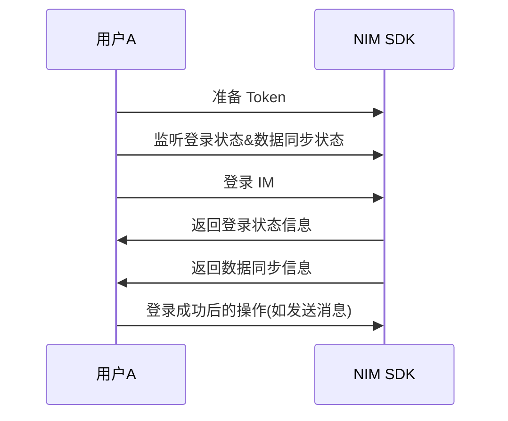

完成 NIM SDK 的初始化之后，您需要先调用 SDK 的登录接口登录 IM。登录成功后，您才能正常调用消息和会话等其他 SDK 接口。

本文介绍账号集成与登录的技术原理、实现 IM 登录的流程、IM 登录状态转换流程，以及 [相关常见问题](#常见问题)。

## 技术原理


IM 的登录与账号集成密切相关。上图展示了应用集成 NIM SDK 后，从账号集成到登录 IM 成功的主要流程：

1. 用户在应用客户端注册用户账号时，由应用服务端向网易云信服务端发起 [创建 IM 账号](https://doc.yunxin.163.com/messaging/server-apis/DQ3Nzk1MTY?platform=server) 的请求。
2. IM 账号创建成功后，网易云信服务端会返回该 IM 账号（即 `accid`）和 `token` 等信息。此时，应用服务端需要负责保存 `accid` 和 `token` 的映射关系。
3. 应用客户端发起登录请求时，先走应用自有的登录验证逻辑，如账号和密码的验证。
4. 验证成功后，应用服务端将与该用户对应的 `accid` 和 `token` 等信息返回给应用客户端。此时，应用客户端需要负责保存 `accid` 和 `token` 的映射关系。
5. 当应用客户端需要调用网易云信的 IM 服务时，需要先进行 `token` 验证，以登录 IM 服务。
6. `token` 验证成功后，应用客户端登录 IM 服务成功。之后用户便可调用 NIM SDK 的相关接口使用 IM 服务，如进行 IM 消息收发。

::: note note
- 终端用户使用网易云信 IM 服务时，应用本身的用户账号和网易云信的 IM 账号（`accid`） **彼此独立**。网易云信的 IM 账号只用于网易云信 IM 服务的鉴权，**IM 账号并不等同于应用的用户账号**。
- 应用的用户账号和密码，与网易云信登录 IM 使用的 `accid` 和 `token` 完全不一致。`accid` 和 `token` 不由终端用户创建，而是由应用服务端分配，以保证安全性。
:::

## 前提条件

- 已完成 [初始化](https://doc.yunxin.163.com/messaging/guide/jk1MTg0NjM?platform=flutter)。
- 已在 [网易云信控制台](https://app.yunxin.163.com/global/home) 配置应用的 [IM 登录策略](https://doc.yunxin.163.com/messaging/concept/jE0NjA3NTU?platform=client)。如未配置相应的登录策略，可能导致后续调用登录接口时因无登录权限而报错（状态码：403）。
- （可选）已在 [网易云信控制台](https://app.yunxin.163.com/global/home) [配置客户端应用标识](https://doc.yunxin.163.com/console/guide/jU3MDY4Njk?platform=console#标识管理)。

## API 调用时序

下图展示了与用户首次登录登出相关的 API 的调用时序，图中的 NIM 表示 NIM Flutter SDK。



## 步骤 1：准备 Token

登录 IM 需要通过 Token 进行鉴权。网易云信支持静态和动态两种 Token 类型，您可根据业务需求进行选择。

- 静态 Token：默认为永久有效。如有需要，可通过网易云信服务端 API [主动刷新 Token](https://doc.yunxin.163.com/messaging/server-apis/DUxNDQ3NjA?platform=server)。

- 动态 Token：具备时效性，可在生成时设置有效期。

### **获取静态 Token**

- 方式 1：在 [网易云信控制台](https://app.yunxin.163.com/global/home) 获取静态 Token

    如果您只需要进行简单的 **体验或者快速测试**，那么可以在 [网易云信控制台](https://app.yunxin.163.com/global/home) 创建测试用的 IM 账号，并获取与该 IM 账号相应的静态 `token`<!-- ，具体参考 [注册调试用的 IM 账号](https://doc.yunxin.163.com/messaging/docs/jE5ODcwMjI?platform=flutter) -->。获取的静态 `token` 可用于下文提及的[静态 Token 登录](#静态Token登录)。

- 方式 2：调用服务端 API 获取静态 Token

    如果您有正式的 **生产环境**，且您的业务 **仅需保障基础的用户信息安全**，那么可通过网易云信 IM 服务端 API 注册 IM 账号，并获取与之相对应的静态 `token`，具体参考 [注册网易云信 IM 账号](https://doc.yunxin.163.com/messaging/server-apis/DQ3Nzk1MTY?platform=server)。获取的静态 `token` 可用于 [静态 Token 登录](#静态Token登录) 的鉴权。

### **获取动态 Token**

如果您有正式的 **生产环境**，且您的业务 **对用户信息安全有较高的要求**，可使用动态 `token`。动态 `token` 可用于 [动态 Token 登录](#动态Token登录) 的鉴权。

1. [注册网易云信 IM 账号](https://doc.yunxin.163.com/messaging/server-apis/DQ3Nzk1MTY?platform=server)，获取 IM 账号（`accid`）和静态 `token`。

2. 基于 App Key、App Secret 和 `accid`，通过 [约定算法](https://doc.yunxin.163.com/TM5MzM5Njk/server-apis/zE2NzA3Mjc?platform=server#动态token鉴权) 在应用服务端生成 **动态 `token`**。

    ::: note note
    如果使用该方式，且您的应用需要调用网易云信的聊天室能力，那么要实现动态 token 登录，既要传入动态 `token`（通过下文提及的 `AuthService#dynamicTokenProvider`），也要传入静态 `token`。
    :::

## 步骤 2：监听登录状态

通过登录状态事件流（<a href="https://doc.yunxin.163.com/messaging/references/flutter/dartdoc/Latest/zh/nim_core/AuthService/authStatus.html" target="_blank">`authStatus`</a>）监听当前登录状态。

目前登录状态事件包含两类：

- `NIMAuthStatusEvent`：通用登录状态事件，包含 `NIMAuthStatus` 登录状态枚举（具体枚举值见下表）。
- `NIMKickOutByOtherClientEvent`：被踢事件，包含状态字段与额外属性。在使用时，需要根据具体类型进行解析。

    NIMAuthStatus | 说明 |
    ---- | ---- |
    `unknown` | 未定义 |
    `unLogin` | 未登录/登录失败 |
    `netBroken` | 网络连接已断开 |
    `connecting` | 正在连接网易云信服务端 |
    `logging` | 正在登录中 |
    `loggedIn` | 已成功登录 |
    `kickOut` | 被其他端的登录踢掉，此时应该跳转至手动登录界面。被踢后，无法自动登录 |
    `kickOutByOtherClient` | 被同时在线的其他端主动踢掉（通过 <a href="https://doc.yunxin.163.com/messaging/references/flutter/dartdoc/Latest/zh/nim_core/AuthService/kickOutOtherOnlineClient.html" target="_blank">`kickOutOtherOnlineClient`</a> 方法），此时应该跳转至手动登录界面。被踢后，无法自动登录 |
    `forbidden` | 被网易云信服务端禁止登录 <a href="https://doc.yunxin.163.com/messaging/server-apis/TUzOTA4NTY?platform=server#%E5%B0%81%E7%A6%81%E8%B4%A6%E5%8F%B7" target="_blank">网易云信 IM 账号被禁用</a>。被禁止登录后，无法自动登录 |
    `versionError` | SDK 版本错误。出现该登录异常后，无法自动登录 |
    `pwdError` | 网易云信 IM 账号（`account`）或 `token` 错误。出现该登录异常后，无法自动登录 |

    ::: note notice
    - SDK 暂不支持主动查询当前账号是否处于在线状态，请监听登录状态变化并进行状态缓存。
    - 登录状态变化流程相关详情，请参考下文的 [登录状态变化流程](#登录状态转换流程)。
    :::

    示例代码如下：

    ```Dart
    /// 开始监听事件
    final subscription = NimCore.instance.authService.authStatus.listen((event) {
    if (event is NIMKickOutByOtherClientEvent) {
        /// 监听到被踢事件
    } else if (event is NIMAuthStatusEvent) {
        /// 监听到其他事件
    }
    });

    /// 不再监听时，需要取消监听，否则造成内存泄漏
    /// subscription.cancel();
    ```

## 步骤 3：监听数据同步状态

登录成功后，SDK 会自动同步群信息、离线消息、漫游消息和系统通知等数据。数据同步过程会广播数据同步状态变更事件（<a href="https://doc.yunxin.163.com/messaging/references/flutter/dartdoc/Latest/zh/nim_core/NIMDataSyncStatusEvent-class.html" target="_blank">`NIMDataSyncStatusEvent`</a>），可通过以下接口监听该事件。

```Dart
class AuthService {
    /// 登录状态变更事件
    Stream<NIMAuthStatusEvent> get authStatus;
}
```

数据同步状态事件包含一个类型为 `NIMAuthStatus` 的登录状态字段，标识当前同步状态：
| NIMAuthStatus | 说明 |
| ---- | ---- |
| `NIMAuthStatus.dataSyncStart` | 数据同步开始 |
| `NIMAuthStatus.dataSyncFinish` | 数据同步完成 |

::: note notice
- Windows 和 macOS 暂不支持监听数据同步状态变化。
- 数据同步完成时，整个登录过程才算真正完成。
:::

示例代码如下：

```Dart
/// 开始监听事件
final subscription = NimCore.instance.authService.authStatus.listen((event) {
    if (event is NIMDataSyncStatusEvent) {
    /// 监听到数据同步事件
    if (event.status == NIMAuthStatus.dataSyncStart) {
        /// 数据同步开始
    } else if (event.status == NIMAuthStatus.dataSyncFinish) {
        /// 数据同步完成
    }
    }
});

/// 不再监听时，需要取消监听，否则造成内存泄漏
/// subscription.cancel();
```

## 步骤 4：登录 IM

### **<span id="登录方式概览">登录方式概览</span>**

NIM SDK 登录方式分为两大类，即手动登录和自动登录。其中手动登录可进一步分为静态 `token` 登录、动态 `token` 登录和通过第三方回调登录。

您可按需实现 **一种或多种** 手动登录方式，并 **在手动登录成功后**，实现自动登录。

<div style="width:100px">登录方式</div> | 子方式 | 鉴权方式 | 使用场景
---- | ---- | ----
手动登录 | [静态 Token 登录](#静态Token登录) | [静态 Token 鉴权](https://doc.yunxin.163.com/messaging/server-apis/zE2NzA3Mjc?platform=server#静态token鉴权) | 如下登录场景，用户需要手动登录 IM：<ul><li>在新设备上首次登录 IM</li><li>被同时在线的其他设备踢下线后再次登录 IM</li><li>切换 IM 账号后再次登录 IM</li><li>注销登录后再次登录 IM</li></ul>
^^ | [动态 Token 登录](#动态Token登录) | [动态 Token 鉴权](https://doc.yunxin.163.com/messaging/server-apis/zE2NzA3Mjc?platform=server#动态token鉴权) | ^^
^^ | [通过第三方回调登录](#通过第三方回调登录) | [通过第三方回调鉴权](https://doc.yunxin.163.com/messaging/server-apis/zE2NzA3Mjc?platform=server#基于第三方回调的鉴权) | ^^
[自动登录](#自动登录) | 继承手动登录的方式 | 继承手动登录的鉴权方式 | 应用被清理后，用户再次单击应用图标启动应用时，无需输入用户名和密码即可完成登录的场景。**自动登录需在手动登录成功后使用**

::: note note
**推荐** 在手动登录成功后，将 `accid` 和 `token` **保存到本地**，方便下次应用启动进行初始化时，在 `NIMSDKOptions` 的 `autoLoginInfo` 中传入，实现自动登录。更多相关说明，参考 [IM 登录最佳实践](https://doc.yunxin.163.com/messaging/guide/zEwMTU1ODc?platform=flutter)。
:::

### **<span id="手动登录">方式 1：手动登录</span>**

#### **<span id="静态 Token 登录"><b>静态 Token 登录</b></span>**

调用 <a href="https://doc.yunxin.163.com/messaging/references/flutter/dartdoc/Latest/zh/nim_core/AuthService/login.html" target="_blank">`login`</a> 方法手动登录 IM。调用时需将 `authType` 参数设置为 `authTypeDefault`。

调用后，NIM SDK 会自动连接网易云信服务端，传递用户信息，返回登录结果。登录过程中可主动取消登录。如果因为网络或其他原因导致网易云信服务端长时间未响应，用户也没有主动取消登录，NIM SDK 将在 45 秒后自动重新连接网易云信服务端，并返回错误码，错误码详情参考下文的 [手动登录错误码](#手动登录错误码)。

<div style="width:130px">[`NIMLoginInfo`](https://doc.yunxin.163.com/messaging/references/flutter/dartdoc/Latest/zh/nim_core/NIMLoginInfo-class.html) 参数</div> | 是否必传 | 说明
---- | --- | ----
`account` | 是 | 用户的 IM 账号，即 `accid`
`token` | 是 | 获取到的静态 `token`
`authType` | 否 | 登录 IM 的鉴权方式。采用静态 `token` 登录时，使用 **默认的 authTypeDefault** 即可，即静态 `token` 鉴权
`customClientType` | 否 | 自定义客户端类型，小于或等于 0 则视为没有自定义类型

示例代码如下：

```Dart
NimCore.instance.authService
    .login(NIMLoginInfo(account: 'account', token: 'token',))
    .then(
      (result) {
        if (result.isSuccess) {
          /// 登录成功
        } else {
          /// 登录失败
        }
      },
    );
```

#### **<span id="动态 Token 登录"><b>动态 Token 登录</b></span>**

动态 `token` 具备时效性，可有效提升 `token` 破解难度，降低密码泄露风险。

要实现动态 `token` 登录 IM，需完成如下两步操作：

1. 通过 [`AuthService#dynamicTokenProvider`](https://doc.yunxin.163.com/messaging/references/flutter/dartdoc/Latest/zh/nim_core/AuthService/dynamicTokenProvider.html)方法获取上文中提及的[基于 App Secret 生成的动态 Token](#获取动态token)。

2. 调用 <a href="https://doc.yunxin.163.com/messaging/references/flutter/dartdoc/Latest/zh/nim_core/AuthService/login.html" target="_blank">`login`</a> 方法手动登录 IM，**调用时需将 `authType` 设置为 authTypeDynamic**。

    调用后，NIM SDK 会自动连接网易云信服务端，传递用户信息，返回登录结果。登录过程中可主动取消登录。如果因为网络或其他原因导致网易云信服务端长时间未响应，用户也没有主动取消登录，NIM SDK 将在 45 秒后自动重新连接网易云信服务端，并返回错误码，错误码详情参考下文的 [手动登录错误码](#手动登录错误码)。

    具体参数说明如下：

    <div style="width:130px">[`NIMLoginInfo`](https://doc.yunxin.163.com/messaging/references/flutter/dartdoc/Latest/zh/nim_core/NIMLoginInfo-class.html) 参数</div> | 是否必传 | 说明
    ---- | --- | ----
    `account` | 是 | 用户的 IM 账号，即 `accid`
    `authType` | 该登录方式必传 | **采用动态 `token` 登录时必须传入 authTypeDynamic**，表示通过动态 `token` 鉴权，动态 `token`[基于 App Secret 计算生成](https://doc.yunxin.163.com/messaging/server-apis/zE2NzA3Mjc?platform=server#动态token鉴权)
    `token` | 视情况而定 | 获取到的静态 `token`。采用动态 `token` 登录时，如果您的应用<b>不需要</b>调用网易云信的聊天室能力，那么<b>不需要传入</b>静态 `token`。如果需要，那么<b>必须传入</b>静态 `token`
    `customClientType` | 否 | 自定义客户端类型，小于或等于 0 则视为没有自定义类型

    示例代码如下：

    ```Dart
    NimCore.instance.authService.dynamicTokenProvider = (account) async {
            //...生成动态 token
            return token;
        };

    loginResult = await NimCore.instance.authService.login(NIMLoginInfo(
            account: account,
            token: token,
            authType: NIMAuthType.authTypeDynamic,
        ));
    ```

#### **<span id="通过第三方回调登录"><b>通过第三方回调登录</b></span>**

如采用该登录方式，**网易云信服务端不做 IM 登录鉴权**，鉴权工作需由指定的第三方服务器（可以是应用服务器）进行。

实现该登录方式，需完成如下 3 步操作：

1. 前往网易云信控制台，并进入 **IM 即时通讯 > 功能配置 > 第三方回调** 配置第三方回调的环境地址（即第三方服务器地址）和回调失败时放行（通过）与否。

    

2. 调用 <a href="https://doc.yunxin.163.com/messaging/references/flutter/dartdoc/Latest/zh/nim_core/AuthService/login.html" target="_blank">`login`</a> 方法手动登录 IM，**调用时需将 `authType` 设置为 authTypeThirdParty，且必须传入 `loginExt`**。

    调用后，NIM SDK 会自动连接网易云信服务端，传递用户信息，返回登录结果。登录过程中可主动取消登录。如果因为网络或其他原因导致网易云信服务端长时间未响应，用户也没有主动取消登录，NIM SDK 将在 45 秒后自动重新连接网易云信服务端，并返回错误码，错误码详情参考下文的 [手动登录错误码](#手动登录错误码)。

    具体参数说明如下：

    <div style="width:130px">[`NIMLoginInfo`](https://doc.yunxin.163.com/messaging/references/flutter/dartdoc/Latest/zh/nim_core/NIMLoginInfo-class.html) 参数</div> | 是否必传 | 说明
    ---- | --- | ----
    `account` | 是 | 用户的 IM 账号，即 `accid`。
    `authType` | 该登录方式必传 | **采用第三方回调登录时必须传入 `authTypeThirdParty`**，表示通过第三方回调进行鉴权。
    `loginExt` | 该登录方式必传 | 登录自定义扩展字段，长度上限为 1k 字符。采用该登录方式时，必须传入，用于第三方服务器鉴权。如未传入，将返回 `LoginInfo is invalid` 的报错信息。
    `token` | 视情况而定 | 获取到的静态 `token`。采用动态 `token` 登录时，如果您的应用<b>不需要</b>调用网易云信的聊天室能力，那么<b>不需要传入</b>静态 `token`。如果需要，那么 <b>必须传入</b> 静态 `token`。
    `customClientType` | 否 | 自定义客户端类型，小于或等于 0 则视为没有自定义类型。

3. 发起 [登录相关回调](https://doc.yunxin.163.com/messaging/server-apis/jc3MzA5NTk?platform=server) 的请求，由第三方服务器进行鉴权并判定 IM 登录事件是否放行通过。

    若不通过，网易云信服务端将返回 302 错误码。

### **<span id="自动登录">方式 2：自动登录</span>**

自动登录一般用于应用被清理后，用户再次单击应用图标启动应用时，无需输入用户名和密码即可完成登录的场景。此时应用可以在无网络、未登录成功的状态下直接访问用户本地 SDK 数据。自动登录与手动登录在客户端侧和服务端逻辑上的区别，参考文末的 [常见问题](#手动登录和自动登录的主要区别是什么)。

实现自动登录的方式为，在调用 <a href="https://doc.yunxin.163.com/messaging/references/flutter/dartdoc/Latest/zh/nim_core/NimCore/initialize.html" targe="_blank">`initialize`</a> 方法初始化 SDK 时，将本地保存的 `account` 和 `token` 传入 <a href="https://doc.yunxin.163.com/messaging/references/flutter/dartdoc/Latest/zh/nim_core/NIMAndroidSDKOptions-class.html" target="_blank">`NIMAndroidSDKOptions`</a> 或 <a href="https://doc.yunxin.163.com/messaging/references/flutter/dartdoc/Latest/zh/nim_core/NIMIOSSDKOptions-class.html" target="_blank">`NIMIOSSDKOptions`</a> 的自动登录信息（`autoLoginInfo`）。

::: note note
- **推荐** 参考 [自动登录最佳实践](https://doc.yunxin.163.com/messaging/guide/zEwMTU1ODc?platform=flutter#%E8%87%AA%E5%8A%A8%E7%99%BB%E5%BD%95) 和 [登录状态处理最佳实践](https://doc.yunxin.163.com/messaging/guide/zEwMTU1ODc?platform=flutter#%E7%99%BB%E5%BD%95%E7%8A%B6%E6%80%81%E5%A4%84%E7%90%86) 实现自动登录以及相应的登录状态处理逻辑。
- 目前仅 Android 和 iOS 支持自动登录，Windows 和 macOS 不支持。
:::

示例代码如下：

```Dart
NimCore.instance.initialize(
  NIMAndroidSDKOptions(
    appKey: 'appkey',
    autoLoginInfo: NIMLoginInfo(
      account: 'account',
      token: 'token',
    ),
  ),
).then(
  (result) {
    if (result.isSuccess) {
      /// 初始化成功
    } else {
      /// 初始化失败
    }
  },
);
```

## 相关信息

### 手动登录错误码

手动登录失败的错误码说明如下：

错误码 | 说明
---- | ----
302 | App Key、`accid` 和 `token` 三者不对应
408 | 与网易云信服务端的连接超时
415 | 网络断开或者连接网易云信服务端失败
416 | 调用手动登录接口过于频繁
1000 | 本地数据库未打开。请在手动登录成功后打开本地数据库

### <span id="断网重连">断网重连机制</span>

SDK 提供了自动重连机制（自动重新建立与网易云信服务端的连接并重新登录），所有重连的登录状态变更都会触发 [`NIMAuthStatusEvent`](https://doc.yunxin.163.com/messaging/references/flutter/dartdoc/Latest/zh/nim_core/NIMAuthStatusEvent-class.html) 事件回调。

SDK 在两种场景下会自动进行重连：

- 手动/自动登录成功后，网络不佳导致连接断开的情况。
- 网络不佳时，账号密码本身正常（未被 [封禁](https://doc.yunxin.163.com/messaging/server-apis/TUzOTA4NTY?platform=server#%E5%B0%81%E7%A6%81%E8%B4%A6%E5%8F%B7)，且账号密码均正确），启动应用时调用自动登录接口的情况。

满足上述中一个条件，当用户遇到普通网络问题如连接超时等，会自动进行重连登录，**不需要上层开发者去做额外的重登逻辑**。

### 多端登录与互踢

当前 NIM SDK 支持配置四种不同的 IM 多端登录与互踢策略，具体参考 [多端登录与互踢](https://doc.yunxin.163.com/messaging/guide/TQ5MjM1NzE?platform=flutter)。

### 登录状态转换流程

登录状态变化流程（不包含被踢下线和被 IM 服务端禁止登录等特殊状态）参考下图。图中，深蓝色元素代表登录状态，浅绿色元素代表自动登录或调用 `login` 方法的手动登录。

<svg xmlns="http://www.w3.org/2000/svg" xmlns:xlink="http://www.w3.org/1999/xlink" version="1.1" width="426px" height="1286px" viewBox="-0.5 -0.5 426 1286" style="background-color: rgb(255, 255, 255);"><defs><style type="text/css">@import url(https://fonts.googleapis.com/css?family=Open+Sans);&#xa;</style></defs><g><path d="M 177 140 L 87 140 L 87 303.63" fill="none" stroke="rgb(0, 0, 0)" stroke-miterlimit="10" pointer-events="stroke"/><path d="M 87 308.88 L 83.5 301.88 L 87 303.63 L 90.5 301.88 Z" fill="rgb(0, 0, 0)" stroke="rgb(0, 0, 0)" stroke-miterlimit="10" pointer-events="all"/><rect x="177" y="120" width="120" height="40" rx="6" ry="6" fill="#0050ef" stroke="#001dbc" pointer-events="all"/><g transform="translate(-0.5 -0.5)"><switch><foreignObject pointer-events="none" width="100%" height="100%" requiredFeatures="http://www.w3.org/TR/SVG11/feature#Extensibility" style="overflow: visible; text-align: left;"><div xmlns="http://www.w3.org/1999/xhtml" style="display: flex; align-items: unsafe center; justify-content: unsafe center; width: 118px; height: 1px; padding-top: 140px; margin-left: 178px;"><div data-drawio-colors="color: #ffffff; " style="box-sizing: border-box; font-size: 0px; text-align: center;"><div style="display: inline-block; font-size: 12px; font-family: &quot;Open Sans&quot;; color: rgb(255, 255, 255); line-height: 1.2; pointer-events: all; white-space: normal; overflow-wrap: normal;">unLogin</div></div></div></foreignObject><text x="237" y="144" fill="#ffffff" font-family="Open Sans" font-size="12px" text-anchor="middle">unLogin</text></switch></g><path d="M 87 350 L 87 443.63" fill="none" stroke="rgb(0, 0, 0)" stroke-miterlimit="10" pointer-events="stroke"/><path d="M 87 448.88 L 83.5 441.88 L 87 443.63 L 90.5 441.88 Z" fill="rgb(0, 0, 0)" stroke="rgb(0, 0, 0)" stroke-miterlimit="10" pointer-events="all"/><path d="M 87 490 L 87 528.63" fill="none" stroke="rgb(0, 0, 0)" stroke-miterlimit="10" pointer-events="stroke"/><path d="M 87 533.88 L 83.5 526.88 L 87 528.63 L 90.5 526.88 Z" fill="rgb(0, 0, 0)" stroke="rgb(0, 0, 0)" stroke-miterlimit="10" pointer-events="all"/><rect x="27" y="450" width="120" height="40" rx="6" ry="6" fill="#0050ef" stroke="#001dbc" pointer-events="all"/><g transform="translate(-0.5 -0.5)"><switch><foreignObject pointer-events="none" width="100%" height="100%" requiredFeatures="http://www.w3.org/TR/SVG11/feature#Extensibility" style="overflow: visible; text-align: left;"><div xmlns="http://www.w3.org/1999/xhtml" style="display: flex; align-items: unsafe center; justify-content: unsafe center; width: 118px; height: 1px; padding-top: 470px; margin-left: 28px;"><div data-drawio-colors="color: #ffffff; " style="box-sizing: border-box; font-size: 0px; text-align: center;"><div style="display: inline-block; font-size: 12px; font-family: &quot;Open Sans&quot;; color: rgb(255, 255, 255); line-height: 1.2; pointer-events: all; white-space: normal; overflow-wrap: normal;">connecting</div></div></div></foreignObject><text x="87" y="474" fill="#ffffff" font-family="Open Sans" font-size="12px" text-anchor="middle">connecting</text></switch></g><path d="M 147 560 L 270.63 560" fill="none" stroke="rgb(0, 0, 0)" stroke-miterlimit="10" pointer-events="stroke"/><path d="M 275.88 560 L 268.88 563.5 L 270.63 560 L 268.88 556.5 Z" fill="rgb(0, 0, 0)" stroke="rgb(0, 0, 0)" stroke-miterlimit="10" pointer-events="all"/><g transform="translate(-0.5 -0.5)"><switch><foreignObject pointer-events="none" width="100%" height="100%" requiredFeatures="http://www.w3.org/TR/SVG11/feature#Extensibility" style="overflow: visible; text-align: left;"><div xmlns="http://www.w3.org/1999/xhtml" style="display: flex; align-items: unsafe center; justify-content: unsafe center; width: 1px; height: 1px; padding-top: 559px; margin-left: 176px;"><div data-drawio-colors="color: rgb(0, 0, 0); background-color: rgb(255, 255, 255); " style="box-sizing: border-box; font-size: 0px; text-align: center;"><div style="display: inline-block; font-size: 11px; font-family: &quot;Open Sans&quot;; color: rgb(0, 0, 0); line-height: 1.2; pointer-events: all; background-color: rgb(255, 255, 255); white-space: nowrap;">否</div></div></div></foreignObject><text x="176" y="562" fill="rgb(0, 0, 0)" font-family="Open Sans" font-size="11px" text-anchor="middle">否</text></switch></g><path d="M 87 585 L 87 643.63" fill="none" stroke="rgb(0, 0, 0)" stroke-miterlimit="10" pointer-events="stroke"/><path d="M 87 648.88 L 83.5 641.88 L 87 643.63 L 90.5 641.88 Z" fill="rgb(0, 0, 0)" stroke="rgb(0, 0, 0)" stroke-miterlimit="10" pointer-events="all"/><g transform="translate(-0.5 -0.5)"><switch><foreignObject pointer-events="none" width="100%" height="100%" requiredFeatures="http://www.w3.org/TR/SVG11/feature#Extensibility" style="overflow: visible; text-align: left;"><div xmlns="http://www.w3.org/1999/xhtml" style="display: flex; align-items: unsafe center; justify-content: unsafe center; width: 1px; height: 1px; padding-top: 610px; margin-left: 88px;"><div data-drawio-colors="color: rgb(0, 0, 0); background-color: rgb(255, 255, 255); " style="box-sizing: border-box; font-size: 0px; text-align: center;"><div style="display: inline-block; font-size: 11px; font-family: &quot;Open Sans&quot;; color: rgb(0, 0, 0); line-height: 1.2; pointer-events: all; background-color: rgb(255, 255, 255); white-space: nowrap;">是</div></div></div></foreignObject><text x="88" y="613" fill="rgb(0, 0, 0)" font-family="Open Sans" font-size="11px" text-anchor="middle">是</text></switch></g><path d="M 87 535 L 147 560 L 87 585 L 27 560 Z" fill="#dae8fc" stroke="#6c8ebf" stroke-miterlimit="10" pointer-events="all"/><g transform="translate(-0.5 -0.5)"><switch><foreignObject pointer-events="none" width="100%" height="100%" requiredFeatures="http://www.w3.org/TR/SVG11/feature#Extensibility" style="overflow: visible; text-align: left;"><div xmlns="http://www.w3.org/1999/xhtml" style="display: flex; align-items: unsafe center; justify-content: unsafe center; width: 118px; height: 1px; padding-top: 560px; margin-left: 28px;"><div data-drawio-colors="color: rgb(0, 0, 0); " style="box-sizing: border-box; font-size: 0px; text-align: center;"><div style="display: inline-block; font-size: 12px; font-family: &quot;Open Sans&quot;; color: rgb(0, 0, 0); line-height: 1.2; pointer-events: all; white-space: normal; overflow-wrap: normal;">网络连接是否良好</div></div></div></foreignObject><text x="87" y="564" fill="rgb(0, 0, 0)" font-family="Open Sans" font-size="12px" text-anchor="middle">网络连接是否良好</text></switch></g><path d="M 177 230 L 87 230 L 87 303.63" fill="none" stroke="rgb(0, 0, 0)" stroke-miterlimit="10" pointer-events="stroke"/><path d="M 87 308.88 L 83.5 301.88 L 87 303.63 L 90.5 301.88 Z" fill="rgb(0, 0, 0)" stroke="rgb(0, 0, 0)" stroke-miterlimit="10" pointer-events="all"/><rect x="177" y="210" width="120" height="40" rx="6" ry="6" fill="#0050ef" stroke="#001dbc" pointer-events="all"/><g transform="translate(-0.5 -0.5)"><switch><foreignObject pointer-events="none" width="100%" height="100%" requiredFeatures="http://www.w3.org/TR/SVG11/feature#Extensibility" style="overflow: visible; text-align: left;"><div xmlns="http://www.w3.org/1999/xhtml" style="display: flex; align-items: unsafe center; justify-content: unsafe center; width: 118px; height: 1px; padding-top: 230px; margin-left: 178px;"><div data-drawio-colors="color: #ffffff; " style="box-sizing: border-box; font-size: 0px; text-align: center;"><div style="display: inline-block; font-size: 12px; font-family: &quot;Open Sans&quot;; color: rgb(255, 255, 255); line-height: 1.2; pointer-events: all; white-space: normal; overflow-wrap: normal;">netBroken</div></div></div></foreignObject><text x="237" y="234" fill="#ffffff" font-family="Open Sans" font-size="12px" text-anchor="middle">netBroken</text></switch></g><path d="M 337 530 L 337 230 L 303.37 230" fill="none" stroke="rgb(0, 0, 0)" stroke-miterlimit="10" pointer-events="stroke"/><path d="M 298.12 230 L 305.12 226.5 L 303.37 230 L 305.12 233.5 Z" fill="rgb(0, 0, 0)" stroke="rgb(0, 0, 0)" stroke-miterlimit="10" pointer-events="all"/><g transform="translate(-0.5 -0.5)"><switch><foreignObject pointer-events="none" width="100%" height="100%" requiredFeatures="http://www.w3.org/TR/SVG11/feature#Extensibility" style="overflow: visible; text-align: left;"><div xmlns="http://www.w3.org/1999/xhtml" style="display: flex; align-items: unsafe center; justify-content: unsafe center; width: 1px; height: 1px; padding-top: 413px; margin-left: 337px;"><div data-drawio-colors="color: rgb(0, 0, 0); background-color: rgb(255, 255, 255); " style="box-sizing: border-box; font-size: 0px; text-align: center;"><div style="display: inline-block; font-size: 11px; font-family: &quot;Open Sans&quot;; color: rgb(0, 0, 0); line-height: 1.2; pointer-events: all; background-color: rgb(255, 255, 255); white-space: nowrap;">否</div></div></div></foreignObject><text x="337" y="416" fill="rgb(0, 0, 0)" font-family="Open Sans" font-size="11px" text-anchor="middle">否</text></switch></g><path d="M 397 560 L 417 560 L 417 90 L 237 90 L 237 113.63" fill="none" stroke="rgb(0, 0, 0)" stroke-miterlimit="10" pointer-events="stroke"/><path d="M 237 118.88 L 233.5 111.88 L 237 113.63 L 240.5 111.88 Z" fill="rgb(0, 0, 0)" stroke="rgb(0, 0, 0)" stroke-miterlimit="10" pointer-events="all"/><g transform="translate(-0.5 -0.5)"><switch><foreignObject pointer-events="none" width="100%" height="100%" requiredFeatures="http://www.w3.org/TR/SVG11/feature#Extensibility" style="overflow: visible; text-align: left;"><div xmlns="http://www.w3.org/1999/xhtml" style="display: flex; align-items: unsafe center; justify-content: unsafe center; width: 1px; height: 1px; padding-top: 527px; margin-left: 419px;"><div data-drawio-colors="color: rgb(0, 0, 0); background-color: rgb(255, 255, 255); " style="box-sizing: border-box; font-size: 0px; text-align: center;"><div style="display: inline-block; font-size: 11px; font-family: &quot;Open Sans&quot;; color: rgb(0, 0, 0); line-height: 1.2; pointer-events: all; background-color: rgb(255, 255, 255); white-space: nowrap;">是</div></div></div></foreignObject><text x="419" y="530" fill="rgb(0, 0, 0)" font-family="Open Sans" font-size="11px" text-anchor="middle">是</text></switch></g><path d="M 337 530 L 397 560 L 337 590 L 277 560 Z" fill="#dae8fc" stroke="#6c8ebf" stroke-miterlimit="10" pointer-events="all"/><g transform="translate(-0.5 -0.5)"><switch><foreignObject pointer-events="none" width="100%" height="100%" requiredFeatures="http://www.w3.org/TR/SVG11/feature#Extensibility" style="overflow: visible; text-align: left;"><div xmlns="http://www.w3.org/1999/xhtml" style="display: flex; align-items: unsafe center; justify-content: unsafe center; width: 118px; height: 1px; padding-top: 560px; margin-left: 278px;"><div data-drawio-colors="color: rgb(0, 0, 0); " style="box-sizing: border-box; font-size: 0px; text-align: center;"><div style="display: inline-block; font-size: 12px; font-family: &quot;Open Sans&quot;; color: rgb(0, 0, 0); line-height: 1.2; pointer-events: all; white-space: normal; overflow-wrap: normal;">是否存在物理网络</div></div></div></foreignObject><text x="337" y="564" fill="rgb(0, 0, 0)" font-family="Open Sans" font-size="12px" text-anchor="middle">是否存在物理网络</text></switch></g><path d="M 87 695 L 87 763.63" fill="none" stroke="rgb(0, 0, 0)" stroke-miterlimit="10" pointer-events="stroke"/><path d="M 87 768.88 L 83.5 761.88 L 87 763.63 L 90.5 761.88 Z" fill="rgb(0, 0, 0)" stroke="rgb(0, 0, 0)" stroke-miterlimit="10" pointer-events="all"/><rect x="27" y="650" width="120" height="45" rx="6.75" ry="6.75" fill="#0050ef" stroke="#001dbc" pointer-events="all"/><g transform="translate(-0.5 -0.5)"><switch><foreignObject pointer-events="none" width="100%" height="100%" requiredFeatures="http://www.w3.org/TR/SVG11/feature#Extensibility" style="overflow: visible; text-align: left;"><div xmlns="http://www.w3.org/1999/xhtml" style="display: flex; align-items: unsafe center; justify-content: unsafe center; width: 118px; height: 1px; padding-top: 673px; margin-left: 28px;"><div data-drawio-colors="color: #ffffff; " style="box-sizing: border-box; font-size: 0px; text-align: center;"><div style="display: inline-block; font-size: 12px; font-family: &quot;Open Sans&quot;; color: rgb(255, 255, 255); line-height: 1.2; pointer-events: all; white-space: normal; overflow-wrap: normal;">connecting</div></div></div></foreignObject><text x="87" y="676" fill="#ffffff" font-family="Open Sans" font-size="12px" text-anchor="middle">connecting</text></switch></g><path d="M 147 795 L 212 795 L 212 560 L 270.63 560" fill="none" stroke="rgb(0, 0, 0)" stroke-miterlimit="10" pointer-events="stroke"/><path d="M 275.88 560 L 268.88 563.5 L 270.63 560 L 268.88 556.5 Z" fill="rgb(0, 0, 0)" stroke="rgb(0, 0, 0)" stroke-miterlimit="10" pointer-events="all"/><g transform="translate(-0.5 -0.5)"><switch><foreignObject pointer-events="none" width="100%" height="100%" requiredFeatures="http://www.w3.org/TR/SVG11/feature#Extensibility" style="overflow: visible; text-align: left;"><div xmlns="http://www.w3.org/1999/xhtml" style="display: flex; align-items: unsafe center; justify-content: unsafe center; width: 1px; height: 1px; padding-top: 796px; margin-left: 184px;"><div data-drawio-colors="color: rgb(0, 0, 0); background-color: rgb(255, 255, 255); " style="box-sizing: border-box; font-size: 0px; text-align: center;"><div style="display: inline-block; font-size: 11px; font-family: &quot;Open Sans&quot;; color: rgb(0, 0, 0); line-height: 1.2; pointer-events: all; background-color: rgb(255, 255, 255); white-space: nowrap;">否</div></div></div></foreignObject><text x="184" y="799" fill="rgb(0, 0, 0)" font-family="Open Sans" font-size="11px" text-anchor="middle">否</text></switch></g><path d="M 87 820 L 87 903.63" fill="none" stroke="rgb(0, 0, 0)" stroke-miterlimit="10" pointer-events="stroke"/><path d="M 87 908.88 L 83.5 901.88 L 87 903.63 L 90.5 901.88 Z" fill="rgb(0, 0, 0)" stroke="rgb(0, 0, 0)" stroke-miterlimit="10" pointer-events="all"/><g transform="translate(-0.5 -0.5)"><switch><foreignObject pointer-events="none" width="100%" height="100%" requiredFeatures="http://www.w3.org/TR/SVG11/feature#Extensibility" style="overflow: visible; text-align: left;"><div xmlns="http://www.w3.org/1999/xhtml" style="display: flex; align-items: unsafe center; justify-content: unsafe center; width: 1px; height: 1px; padding-top: 871px; margin-left: 88px;"><div data-drawio-colors="color: rgb(0, 0, 0); background-color: rgb(255, 255, 255); " style="box-sizing: border-box; font-size: 0px; text-align: center;"><div style="display: inline-block; font-size: 11px; font-family: &quot;Open Sans&quot;; color: rgb(0, 0, 0); line-height: 1.2; pointer-events: all; background-color: rgb(255, 255, 255); white-space: nowrap;">是</div></div></div></foreignObject><text x="88" y="874" fill="rgb(0, 0, 0)" font-family="Open Sans" font-size="11px" text-anchor="middle">是</text></switch></g><path d="M 87 770 L 147 795 L 87 820 L 27 795 Z" fill="#dae8fc" stroke="#6c8ebf" stroke-miterlimit="10" pointer-events="all"/><g transform="translate(-0.5 -0.5)"><switch><foreignObject pointer-events="none" width="100%" height="100%" requiredFeatures="http://www.w3.org/TR/SVG11/feature#Extensibility" style="overflow: visible; text-align: left;"><div xmlns="http://www.w3.org/1999/xhtml" style="display: flex; align-items: unsafe center; justify-content: unsafe center; width: 118px; height: 1px; padding-top: 795px; margin-left: 28px;"><div data-drawio-colors="color: rgb(0, 0, 0); " style="box-sizing: border-box; font-size: 0px; text-align: center;"><div style="display: inline-block; font-size: 12px; font-family: &quot;Open Sans&quot;; color: rgb(0, 0, 0); line-height: 1.2; pointer-events: all; white-space: normal; overflow-wrap: normal;">网络连接是否良好</div></div></div></foreignObject><text x="87" y="799" fill="rgb(0, 0, 0)" font-family="Open Sans" font-size="12px" text-anchor="middle">网络连接是否良好</text></switch></g><path d="M 87 950 L 87 980 L 87 1003.63" fill="none" stroke="rgb(0, 0, 0)" stroke-miterlimit="10" pointer-events="stroke"/><path d="M 87 1008.88 L 83.5 1001.88 L 87 1003.63 L 90.5 1001.88 Z" fill="rgb(0, 0, 0)" stroke="rgb(0, 0, 0)" stroke-miterlimit="10" pointer-events="all"/><rect x="27" y="910" width="120" height="40" rx="6" ry="6" fill="#0050ef" stroke="#001dbc" pointer-events="all"/><g transform="translate(-0.5 -0.5)"><switch><foreignObject pointer-events="none" width="100%" height="100%" requiredFeatures="http://www.w3.org/TR/SVG11/feature#Extensibility" style="overflow: visible; text-align: left;"><div xmlns="http://www.w3.org/1999/xhtml" style="display: flex; align-items: unsafe center; justify-content: unsafe center; width: 118px; height: 1px; padding-top: 930px; margin-left: 28px;"><div data-drawio-colors="color: #ffffff; " style="box-sizing: border-box; font-size: 0px; text-align: center;"><div style="display: inline-block; font-size: 12px; font-family: &quot;Open Sans&quot;; color: rgb(255, 255, 255); line-height: 1.2; pointer-events: all; white-space: normal; overflow-wrap: normal;">logging</div></div></div></foreignObject><text x="87" y="934" fill="#ffffff" font-family="Open Sans" font-size="12px" text-anchor="middle">logging</text></switch></g><path d="M 147 1037.5 L 212 1037.5 L 212 560 L 270.63 560" fill="none" stroke="rgb(0, 0, 0)" stroke-miterlimit="10" pointer-events="stroke"/><path d="M 275.88 560 L 268.88 563.5 L 270.63 560 L 268.88 556.5 Z" fill="rgb(0, 0, 0)" stroke="rgb(0, 0, 0)" stroke-miterlimit="10" pointer-events="all"/><g transform="translate(-0.5 -0.5)"><switch><foreignObject pointer-events="none" width="100%" height="100%" requiredFeatures="http://www.w3.org/TR/SVG11/feature#Extensibility" style="overflow: visible; text-align: left;"><div xmlns="http://www.w3.org/1999/xhtml" style="display: flex; align-items: unsafe center; justify-content: unsafe center; width: 1px; height: 1px; padding-top: 1038px; margin-left: 177px;"><div data-drawio-colors="color: rgb(0, 0, 0); background-color: rgb(255, 255, 255); " style="box-sizing: border-box; font-size: 0px; text-align: center;"><div style="display: inline-block; font-size: 11px; font-family: &quot;Open Sans&quot;; color: rgb(0, 0, 0); line-height: 1.2; pointer-events: all; background-color: rgb(255, 255, 255); white-space: nowrap;">否</div></div></div></foreignObject><text x="177" y="1041" fill="rgb(0, 0, 0)" font-family="Open Sans" font-size="11px" text-anchor="middle">否</text></switch></g><path d="M 87 1065 L 87 1123.63" fill="none" stroke="rgb(0, 0, 0)" stroke-miterlimit="10" pointer-events="stroke"/><path d="M 87 1128.88 L 83.5 1121.88 L 87 1123.63 L 90.5 1121.88 Z" fill="rgb(0, 0, 0)" stroke="rgb(0, 0, 0)" stroke-miterlimit="10" pointer-events="all"/><g transform="translate(-0.5 -0.5)"><switch><foreignObject pointer-events="none" width="100%" height="100%" requiredFeatures="http://www.w3.org/TR/SVG11/feature#Extensibility" style="overflow: visible; text-align: left;"><div xmlns="http://www.w3.org/1999/xhtml" style="display: flex; align-items: unsafe center; justify-content: unsafe center; width: 1px; height: 1px; padding-top: 1089px; margin-left: 88px;"><div data-drawio-colors="color: rgb(0, 0, 0); background-color: rgb(255, 255, 255); " style="box-sizing: border-box; font-size: 0px; text-align: center;"><div style="display: inline-block; font-size: 11px; font-family: &quot;Open Sans&quot;; color: rgb(0, 0, 0); line-height: 1.2; pointer-events: all; background-color: rgb(255, 255, 255); white-space: nowrap;">是</div></div></div></foreignObject><text x="88" y="1092" fill="rgb(0, 0, 0)" font-family="Open Sans" font-size="11px" text-anchor="middle">是</text></switch></g><path d="M 87 1010 L 147 1037.5 L 87 1065 L 27 1037.5 Z" fill="#dae8fc" stroke="#6c8ebf" stroke-miterlimit="10" pointer-events="all"/><g transform="translate(-0.5 -0.5)"><switch><foreignObject pointer-events="none" width="100%" height="100%" requiredFeatures="http://www.w3.org/TR/SVG11/feature#Extensibility" style="overflow: visible; text-align: left;"><div xmlns="http://www.w3.org/1999/xhtml" style="display: flex; align-items: unsafe center; justify-content: unsafe center; width: 118px; height: 1px; padding-top: 1038px; margin-left: 28px;"><div data-drawio-colors="color: rgb(0, 0, 0); " style="box-sizing: border-box; font-size: 0px; text-align: center;"><div style="display: inline-block; font-size: 12px; font-family: &quot;Open Sans&quot;; color: rgb(0, 0, 0); line-height: 1.2; pointer-events: all; white-space: normal; overflow-wrap: normal;">网络连接是否良好</div></div></div></foreignObject><text x="87" y="1041" fill="rgb(0, 0, 0)" font-family="Open Sans" font-size="12px" text-anchor="middle">网络连接是否良好</text></switch></g><path d="M 87 1170 L 87 1223.63" fill="none" stroke="rgb(0, 0, 0)" stroke-miterlimit="10" pointer-events="stroke"/><path d="M 87 1228.88 L 83.5 1221.88 L 87 1223.63 L 90.5 1221.88 Z" fill="rgb(0, 0, 0)" stroke="rgb(0, 0, 0)" stroke-miterlimit="10" pointer-events="all"/><rect x="27" y="1130" width="120" height="40" rx="6" ry="6" fill="#0050ef" stroke="#001dbc" pointer-events="all"/><g transform="translate(-0.5 -0.5)"><switch><foreignObject pointer-events="none" width="100%" height="100%" requiredFeatures="http://www.w3.org/TR/SVG11/feature#Extensibility" style="overflow: visible; text-align: left;"><div xmlns="http://www.w3.org/1999/xhtml" style="display: flex; align-items: unsafe center; justify-content: unsafe center; width: 118px; height: 1px; padding-top: 1150px; margin-left: 28px;"><div data-drawio-colors="color: #ffffff; " style="box-sizing: border-box; font-size: 0px; text-align: center;"><div style="display: inline-block; font-size: 12px; font-family: &quot;Open Sans&quot;; color: rgb(255, 255, 255); line-height: 1.2; pointer-events: all; white-space: normal; overflow-wrap: normal;">loggedIn</div></div></div></foreignObject><text x="87" y="1154" fill="#ffffff" font-family="Open Sans" font-size="12px" text-anchor="middle">loggedIn</text></switch></g><path d="M 147 1257.5 L 212 1257.5 L 212 560 L 270.63 560" fill="none" stroke="rgb(0, 0, 0)" stroke-miterlimit="10" pointer-events="stroke"/><path d="M 275.88 560 L 268.88 563.5 L 270.63 560 L 268.88 556.5 Z" fill="rgb(0, 0, 0)" stroke="rgb(0, 0, 0)" stroke-miterlimit="10" pointer-events="all"/><g transform="translate(-0.5 -0.5)"><switch><foreignObject pointer-events="none" width="100%" height="100%" requiredFeatures="http://www.w3.org/TR/SVG11/feature#Extensibility" style="overflow: visible; text-align: left;"><div xmlns="http://www.w3.org/1999/xhtml" style="display: flex; align-items: unsafe center; justify-content: unsafe center; width: 1px; height: 1px; padding-top: 1257px; margin-left: 184px;"><div data-drawio-colors="color: rgb(0, 0, 0); background-color: rgb(255, 255, 255); " style="box-sizing: border-box; font-size: 0px; text-align: center;"><div style="display: inline-block; font-size: 11px; font-family: &quot;Open Sans&quot;; color: rgb(0, 0, 0); line-height: 1.2; pointer-events: all; background-color: rgb(255, 255, 255); white-space: nowrap;">否</div></div></div></foreignObject><text x="184" y="1260" fill="rgb(0, 0, 0)" font-family="Open Sans" font-size="11px" text-anchor="middle">否</text></switch></g><path d="M 27 1257.5 L 7 1257.5 L 7 1200 L 87 1200 L 87 1223.63" fill="none" stroke="rgb(0, 0, 0)" stroke-miterlimit="10" pointer-events="stroke"/><path d="M 87 1228.88 L 83.5 1221.88 L 87 1223.63 L 90.5 1221.88 Z" fill="rgb(0, 0, 0)" stroke="rgb(0, 0, 0)" stroke-miterlimit="10" pointer-events="all"/><g transform="translate(-0.5 -0.5)"><switch><foreignObject pointer-events="none" width="100%" height="100%" requiredFeatures="http://www.w3.org/TR/SVG11/feature#Extensibility" style="overflow: visible; text-align: left;"><div xmlns="http://www.w3.org/1999/xhtml" style="display: flex; align-items: unsafe center; justify-content: unsafe center; width: 1px; height: 1px; padding-top: 1220px; margin-left: 6px;"><div data-drawio-colors="color: rgb(0, 0, 0); background-color: rgb(255, 255, 255); " style="box-sizing: border-box; font-size: 0px; text-align: center;"><div style="display: inline-block; font-size: 11px; font-family: &quot;Open Sans&quot;; color: rgb(0, 0, 0); line-height: 1.2; pointer-events: all; background-color: rgb(255, 255, 255); white-space: nowrap;">是</div></div></div></foreignObject><text x="6" y="1223" fill="rgb(0, 0, 0)" font-family="Open Sans" font-size="11px" text-anchor="middle">是</text></switch></g><path d="M 87 1230 L 147 1257.5 L 87 1285 L 27 1257.5 Z" fill="#dae8fc" stroke="#6c8ebf" stroke-miterlimit="10" pointer-events="all"/><g transform="translate(-0.5 -0.5)"><switch><foreignObject pointer-events="none" width="100%" height="100%" requiredFeatures="http://www.w3.org/TR/SVG11/feature#Extensibility" style="overflow: visible; text-align: left;"><div xmlns="http://www.w3.org/1999/xhtml" style="display: flex; align-items: unsafe center; justify-content: unsafe center; width: 118px; height: 1px; padding-top: 1258px; margin-left: 28px;"><div data-drawio-colors="color: rgb(0, 0, 0); " style="box-sizing: border-box; font-size: 0px; text-align: center;"><div style="display: inline-block; font-size: 12px; font-family: &quot;Open Sans&quot;; color: rgb(0, 0, 0); line-height: 1.2; pointer-events: all; white-space: normal; overflow-wrap: normal;">网络连接是否良好</div></div></div></foreignObject><text x="87" y="1261" fill="rgb(0, 0, 0)" font-family="Open Sans" font-size="12px" text-anchor="middle">网络连接是否良好</text></switch></g><path d="M 237 60 L 237 113.63" fill="none" stroke="rgb(0, 0, 0)" stroke-miterlimit="10" pointer-events="stroke"/><path d="M 237 118.88 L 233.5 111.88 L 237 113.63 L 240.5 111.88 Z" fill="rgb(0, 0, 0)" stroke="rgb(0, 0, 0)" stroke-miterlimit="10" pointer-events="all"/><ellipse cx="237" cy="30" rx="60" ry="30" fill="#dae8fc" stroke="#6c8ebf" pointer-events="all"/><g transform="translate(-0.5 -0.5)"><switch><foreignObject pointer-events="none" width="100%" height="100%" requiredFeatures="http://www.w3.org/TR/SVG11/feature#Extensibility" style="overflow: visible; text-align: left;"><div xmlns="http://www.w3.org/1999/xhtml" style="display: flex; align-items: unsafe center; justify-content: unsafe center; width: 118px; height: 1px; padding-top: 30px; margin-left: 178px;"><div data-drawio-colors="color: rgb(0, 0, 0); " style="box-sizing: border-box; font-size: 0px; text-align: center;"><div style="display: inline-block; font-size: 12px; font-family: &quot;Open Sans&quot;; color: rgb(0, 0, 0); line-height: 1.2; pointer-events: all; white-space: normal; overflow-wrap: normal;">开始</div></div></div></foreignObject><text x="237" y="34" fill="rgb(0, 0, 0)" font-family="Open Sans" font-size="12px" text-anchor="middle">开始</text></switch></g><rect x="27" y="310" width="120" height="40" fill="#d5e8d4" stroke="#82b366" pointer-events="all"/><g transform="translate(-0.5 -0.5)"><switch><foreignObject pointer-events="none" width="100%" height="100%" requiredFeatures="http://www.w3.org/TR/SVG11/feature#Extensibility" style="overflow: visible; text-align: left;"><div xmlns="http://www.w3.org/1999/xhtml" style="display: flex; align-items: unsafe center; justify-content: unsafe center; width: 118px; height: 1px; padding-top: 330px; margin-left: 28px;"><div data-drawio-colors="color: rgb(0, 0, 0); " style="box-sizing: border-box; font-size: 0px; text-align: center;"><div style="display: inline-block; font-size: 12px; font-family: &quot;Open Sans&quot;; color: rgb(0, 0, 0); line-height: 1.2; pointer-events: all; white-space: normal; overflow-wrap: normal;">连接/重连</div></div></div></foreignObject><text x="87" y="334" fill="rgb(0, 0, 0)" font-family="Open Sans" font-size="12px" text-anchor="middle">连接/重连</text></switch></g></g><switch><g requiredFeatures="http://www.w3.org/TR/SVG11/feature#Extensibility"/><a transform="translate(0,-5)" xlink:href="https://www.diagrams.net/doc/faq/svg-export-text-problems" target="_blank"><text text-anchor="middle" font-size="10px" x="50%" y="100%">Text is not SVG - cannot display</text></a></switch></svg>

## 常见问题

### 手动登录和自动登录的主要区别是什么？

手动登录和自动登录主要在于：

<div style="width:100px">差异点</div> | 说明
---- | ----
NIM SDK 是否接管登录失败后的处理 | <ul><li>手动登录：NIM SDK 认为手动登录即是终端用户发起登录的流程，因此在登录失败后（如网络情况不佳、密码错误），NIM SDK 会触发相应回调，并停止重连操作，等待用户再次发起登录操作</li><li>自动登录：自动登录失败后仍旧尝试重连，直到登录成功为止（密码错误等情况除外）</li></ul>
网易云信服务端是否验证当前登录设备的安全性 | <ul><li>手动登录：不验证</li><li>自动登录：自动登录时，如果当前登录设备不是上一次登录设备，网易云信服务端会自动禁止其登录，以保证安全性。</li></ul>

::: note note
如您选择自动登录，当您的应用在后台被唤起时，会计算为 1 次登录行为，计入日活统计作为计费依据。
:::

### 断线后是否会自动重连？

一旦登录成功后（或者调用过自动登录），NIM SDK 将接管所有的重连情况：在网络正常的情况下不停重试重连直到正常登录为止，并不需要做额外的登录操作（聊天室同理）。

### 如何根据产品形态选择 IM 登录方式？

接入网易云信 IM 服务的产品大致分为两种形态：

- IM 产品：通讯作为其核心模块。典型例子如微信、易信、网络直播相关应用。
- 非 IM 产品：通讯只是其附带模块，典型例子如各种有私信模块的应用。

对于 IM 产品，由于通讯能力是核心能力，如果网易云信无法登录成功则整个应用将无法正常表现，所以推荐在执行业务逻辑前，首先完成应用服务端和网易云信服务端的登录。只有应用服务端和网易云信服务端都登录成功才认为整个登录完成。而对于非 IM 产品而言，通讯能力是可以在登录应用服务端成功后延迟加载，登录成功拿到服务端下发的网易云信 IM 账号和 `token` 后进行自动登录即可。