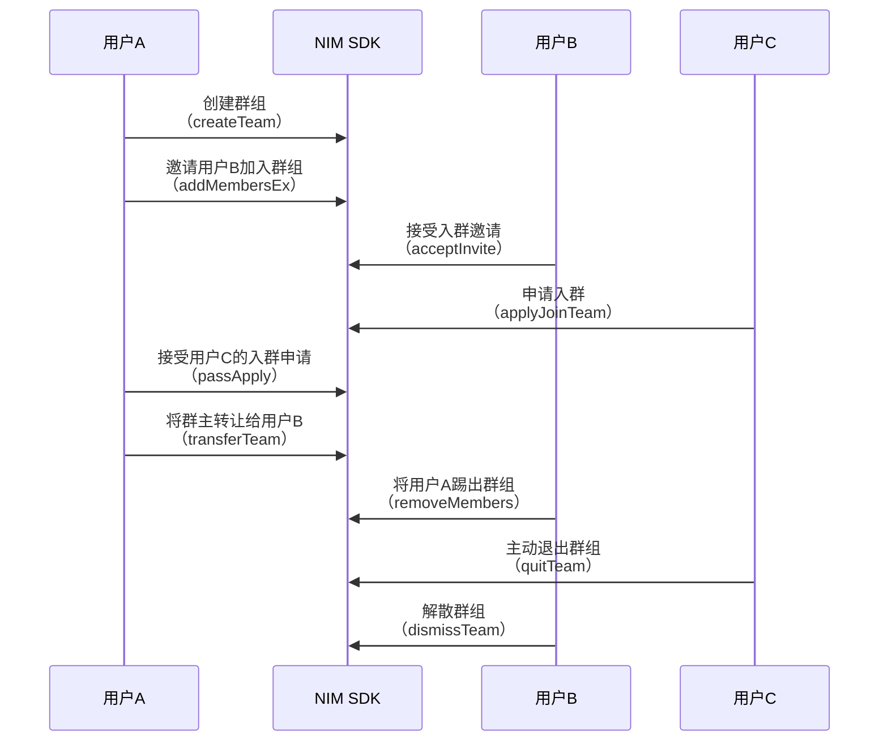

<!-- keywords: IM群组,高级群,群组管理,创建,解散,转让,更新,退出 -->


网易云信 NIM SDK 提供了高级群形式的群组功能，支持用户创建、加入、退出、转让、修改、查询、解散群组，拥有完善的管理功能。


## 技术原理

网易云信 NIM SDK 的 [`TeamService`](https://doc.yunxin.163.com/messaging/references/flutter/dartdoc/Latest/zh/nim_core/TeamService-class.html) 提供群组操作相关接口以及群组相关观察者通知接口，帮助您快速实现和使用群组的管理功能。 


## 群组相关事件监听

在进行群组操作前，您可以提前注册监听群相关事件。监听后，在进行群组管理相关操作时，会收到对应的通知。

可以根据用户需求，调用以下方法进行监听。

- [`onTeamListRemove`](https://doc.yunxin.163.com/messaging/references/flutter/dartdoc/Latest/zh/nim_core/TeamService/onTeamListRemove.html)：监听群组移除，即移除群的观察者通知。自己退群，群被解散，自己被踢出群时，会收到该通知。
- [`onTeamListUpdate`](https://doc.yunxin.163.com/messaging/references/flutter/dartdoc/Latest/zh/nim_core/TeamService/onTeamListUpdate.html)：监听群组更新，即群信息变动观察者通知。新建群和群更新的通知都通过该接口传递。

示例代码如下：

```dart
  /// 群信息变动观察者通知。新建群和群更新的通知都通过该接口传递
  /// observer 观察者, 参数为有更新的群资料列表
  final result = await NimCore.instance.teamService.onTeamListUpdate.listen((event) {
          print('=======onTeamListUpdate event : $event');
        });
```

```dart
 /// 移除群的观察者通知。自己退群，群被解散，自己被踢出群时，会收到该通知
 /// observer 观察者, 参数为被移除的群信息
 /// 移除成功后，Team#isMyTeam 返回 false
   final result = await NimCore.instance.teamService.onTeamListRemove.listen((event) {
          print('=======onTeamListRemove event : $event');
        });
```


:::note note
由于获取群组信息和群成员信息需要跨进程异步调用，开发者最好能在第三方 APP 中做好群组和群成员信息缓存，查询群组和群成员信息时都从本地缓存中访问。在群组或者群成员信息有变化时，SDK 会告诉注册的观察者，此时，第三方 APP 可更新缓存，并刷新界面。
:::

## 实现流程

本章节通过群主、管理员、普通成员之间的交互为例，介绍群组管理的实现流程。




## 创建群组

通过调用 [`createTeam`](https://doc.yunxin.163.com/messaging/references/flutter/dartdoc/Latest/zh/nim_core/TeamService/createTeam.html) 方法创建群组，创建者即为该群群主。


**参数说明：**

| 参数  | 说明     |
|  ----   | --------- |
|CreateTeamOptions| 预设的群组信息，具体请参见[`NIMCreateTeamOptions`](https://doc.yunxin.163.com/messaging/references/flutter/dartdoc/Latest/zh/nim_core/NIMCreateTeamOptions-class.html)<note type=important>群组类型请选择 `advanced` 创建高级群，高级群拥有完善的成员权限体系及管理功能。为避免产生问题，不建议使用其他取值。</note> |
|members | 邀请加入的成员帐号列表|

:::note note
- 预设的群组属性的字段说明请参见[群组对象](https://doc.yunxin.163.com/messaging/docs/zYxODUxODM?platform=flutter#群组对象)。
- 群组创建成功后，返回 `team` 对象以及被邀请成员中群组数量已达上限的成员列表(`failedInviteAccounts`)。
:::
**示例代码：**

```
// 群组类型
    NIMTeamTypeEnum type = NIMTeamTypeEnum.advanced;
// 创建时可以预设群组的一些相关属性。
// fields 中，key 为数据字段，value 对对应的值，该值类型必须和 field 中定义的 fieldType 一致
    NIMCreateTeamOptions  options= NIMCreateTeamOptions();
    final result = await NimCore.instance.teamService.createTeam(
        createTeamOptions: options,
        members: ['members']);
```


## 加入群组

加入群组可以通过以下两种方式：
- 用户接受邀请入群。
- 用户主动申请入群。

### 邀请入群

::: note note
邀请入群的权限可以通过 `inviteMode` 来定义，设为 `manager`（默认），那么仅限群主和管理员可以邀请人进群；设为 `all` ，那么群组内的所有人都可以邀请人进群。
:::

通过调用 [`addMembersEx`](https://doc.yunxin.163.com/messaging/references/flutter/dartdoc/Latest/zh/nim_core/TeamService/addMembersEx.html) 方法邀请其他用户进入群组。
  - 若群组的被邀请模式 `beInviteMode` 为 `noAuth`，那么无需验证，其他用户可直接加入群组。
  - 若群组的被邀请模式 `beInviteMode` 为 `needAuth`（默认），那么需要被邀请用户同意才能加入群组。
  
如果在被邀请成员中存在成员拥有的群组数量已达上限，则会返回失败成员的账号列表。

**参数说明：**

| 参数   | 说明     |
|  ----    | --------- |
|teamId  | 群ID |
|accounts| 邀请入群的用户账号列表|
|customInfo|自定义扩展字段，不需要的话设置为空 ，最大长度 512 字符|
|msg|邀请附言，不需要的话设置为空|


  
- 发起邀请后，被邀请用户会收到 [`SystemMessage`](https://doc.yunxin.163.com/messaging/references/flutter/dartdoc/Latest/zh/nim_core/SystemMessage-class.html) 系统通知，其通知类型为`teamInvite`。
- 被邀请用户可以调用 [`acceptInvite`](https://doc.yunxin.163.com/messaging/references/flutter/dartdoc/Latest/zh/nim_core/TeamService/acceptInvite.html) 方法接受入群邀请，接受即入群。所有群成员会收到群组通知消息（消息类型为 `NIMMessageType.notification`），触发事件为`acceptInvite`。
- 也可以调用 [`declineInvite`](https://doc.yunxin.163.com/messaging/references/flutter/dartdoc/Latest/zh/nim_core/TeamService/declineInvite.html) 方法拒绝入群邀请。拒绝后，邀请者会收到 [`SystemMessage`](https://doc.yunxin.163.com/messaging/references/flutter/dartdoc/Latest/zh/nim_core/SystemMessage-class.html) 系统通知，其通知类型为 `declineTeamInvite`。


**示例代码：**

```
   final result = await NimCore.instance.teamService.addMembersEx(
      teamId: teamId,
      accounts: [accid1,accid2],
      msg: 'message',
      customInfo: 'message',
    );

//接受邀请
    final result = await NimCore.instance.teamService.acceptInvite(
      teamId,
      inviter,
    );

//拒绝邀请
    final result = await NimCore.instance.teamService.declineInvite(
      teamId,
      inviter,
        reason
    );
```  


### 申请入群

通过调用 [`applyJoinTeam`](https://doc.yunxin.163.com/messaging/references/flutter/dartdoc/Latest/zh/nim_core/TeamService/applyJoinTeam.html) 方法申请加入群组。
  - 若群组的加入模式 `verifyType` 为 `free`，那么无需验证，其他用户可直接加入群组。
  - 若群组的加入模式 `verifyType` 为 `apply`，那么需要群主或者群管理员同意才能加入群组。
  - 若群组的加入模式 `verifyType` 为 `private`，那么该群组不接受入群申请，仅能通过邀请方式入群。

:::note note
直接加入群或者进入等待验证状态时，返回群组信息。
:::

**参数说明：**

| 参数 | 说明     |
|  ----  | --------- |
|teamId | 群ID |
|postscript|申请附言|


- 当用户发起入群申请后，该群群主和管理员会收到 [`SystemMessage`](https://doc.yunxin.163.com/messaging/references/flutter/dartdoc/Latest/zh/nim_core/SystemMessage-class.html) 系统通知，其通知类型为`applyJoinTeam`。
- 群主和群管理员可以调用 [`passApply`](https://doc.yunxin.163.com/messaging/references/flutter/dartdoc/Latest/zh/nim_core/TeamService/passApply.html) 方法接受入群申请，接受即入群。所有群成员会收到群组通知消息（消息类型为 `NIMMessageType.notification`），触发事件为`passTeamApply`。
- 群主和群管理员也可以调用 [`rejectApply`](https://doc.yunxin.163.com/messaging/references/flutter/dartdoc/Latest/zh/nim_core/TeamService/rejectApply.html) 方法拒绝入群申请。拒绝后，申请者会收到 [`SystemMessage`](https://doc.yunxin.163.com/messaging/references/flutter/dartdoc/Latest/zh/nim_core/SystemMessage-class.html)系统通知，其通知类型为 `rejectTeamApply`。

**示例代码：**

```
  final result = await NimCore.instance.teamService.applyJoinTeam(
      'teamId',
      'postscript',
    );

//同意入群申请
    final result = await NimCore.instance.teamService.passApply(
      'teamId',
      'account'
    );

//拒绝入群申请
    final result = await NimCore.instance.teamService.rejectApply(
      'teamId',
      'account',
      'reason'
    );
```


## 转让群组

::: note note
只有群主才有转让群组的权限。
:::

通过调用 [`transferTeam`](https://doc.yunxin.163.com/messaging/references/flutter/dartdoc/Latest/zh/nim_core/TeamService/transferTeam.html) 方法将群组转让给其他成员。

- 转让群后, 群主身份转移，所有群成员会收到群组通知消息（消息类型为 `NIMMessageType.notification`），触发事件为`transferOwner`。
- 如果转让群的同时离开群, 那么相当于同时调用[`quitTeam`](https://doc.yunxin.163.com/messaging/references/flutter/dartdoc/Latest/zh/nim_core/TeamService/quitTeam.html)主动退群。所有群成员会收到群组通知消息（消息类型为 `NIMMessageType.notification`），触发事件为`leaveTeam`。


**参数说明：**

| 参数  | 说明     |
|  ----   | --------- |
|teamId| 群ID |
|account|转让后的群主账号|
|quit|转让群的同时是否退出该群<br/>true：退出<br/>false：不退出，身份变为普通群成员|

**示例代码：**

```
// false表示群主转让后不退群
 final result = await NimCore.instance.teamService.transferTeam(
      'teamId',
      'account',
      false,
    );
```

## 退出群组

退出群组可以通过以下两种方式：
- 群主或群组管理员将用户踢出群组。
- 用户主动退群。

### 踢人出群
::: note note
- 只有群主和管理员才能将成员踢出群组。
- 管理员不能踢群主和其他管理员。
:::

通过调用 [`removeMembers`](https://doc.yunxin.163.com/messaging/references/flutter/dartdoc/Latest/zh/nim_core/TeamService/removeMembers.html) 方法将成员踢出群组。
移除成员后，所有群成员会收到群组通知消息（消息类型为 `NIMMessageType.notification`），触发事件为`kickMember`。


**参数说明：**

| 参数 | 说明     |
|  ----  | --------- |
|teamId  | 群ID |
|members|被踢出的群成员账号列表|


**示例代码：**

```
// teamId表示群ID，account表示被踢出的成员帐号
    final result = await NimCore.instance.teamService.removeMembers(
      'teamId',
      ['accids'],
    );
```

### 主动退群


通过调用 [`quitTeam`](https://doc.yunxin.163.com/messaging/references/flutter/dartdoc/Latest/zh/nim_core/TeamService/quitTeam.html) 方法主动退出群组。

除群主（需先转让群主）外，其他用户均可以直接主动退群。主动退群后, 所有群成员会收到群组通知消息（消息类型为 `NIMMessageType.notification`），触发事件为`leaveTeam`。


**示例代码：**

```
  final result = await NimCore.instance.teamService.quitTeam(
      'teamId',
    );
```


## 解散群组

::: note note
只有群主才能解散群组。
:::

通过调用 [`dismissTeam`](https://doc.yunxin.163.com/messaging/references/flutter/dartdoc/Latest/zh/nim_core/TeamService/dismissTeam.html) 方法解散群组。

解散群后, 所有群成员会收到群组通知消息（消息类型为 `NIMMessageType.notification`），触发事件为`dismissTeam`。


**示例代码：**

```
  final result = await NimCore.instance.teamService.dismissTeam(
        'teamId'
    );
```


## 修改群组信息

::: note note
修改群信息需要权限。若该群组的群信息修改权限（`teamUpdateMode`）为 `manager`（默认），那么只有群主和管理员才能修改群组信息；若为 `all`，则群组内的所有人都可以修改群组信息。
:::

可更新的群组属性请参见[`NIMTeamUpdateFieldRequest`](https://doc.yunxin.163.com/messaging/references/flutter/dartdoc/Latest/zh/nim_core/NIMTeamUpdateFieldRequest-class.html)。

| 接口  |数据类型| 说明     |
|---|----|---|
|setAnnouncement|String?|	设置群公告	
|setBeInviteMode|[`NIMTeamBeInviteModeEnum`](https://doc.yunxin.163.com/messaging/references/flutter/dartdoc/Latest/zh/nim_core/NIMTeamBeInviteModeEnum.html)|	设置被邀请方入群模式：是否需要被邀请人同意	
|setExtension|String?|	设置群扩展字段（客户端自定义信息）	
|setIcon|String?|	设置群头像，头像若要上传到云信服务器上，则需要使用[头像资源处理](https://doc.yunxin.163.com/messaging/docs/jIwMDQ1MTg?platform=flutter#%E5%A4%B4%E5%83%8F%E8%B5%84%E6%BA%90%E5%A4%84%E7%90%86)
|setIntroduce|	String?|设置群简介	
|setInviteMode|[`NIMTeamInviteModeEnum`](https://doc.yunxin.163.com/messaging/references/flutter/dartdoc/Latest/zh/nim_core/NIMTeamInviteModeEnum.html)|	设置邀请模式：谁可以邀请他人入群
|setName|String?|	设置群名称	
|setTeamExtensionUpdateMode|[`NIMTeamExtensionUpdateModeEnum`](https://doc.yunxin.163.com/messaging/references/flutter/dartdoc/Latest/zh/nim_core/NIMTeamExtensionUpdateModeEnum.html)	|设置群资料扩展字段修改模式：谁可以修改群自定义属性(扩展字段)
|setTeamUpdateMode|[`NIMTeamUpdateModeEnum`](https://doc.yunxin.163.com/messaging/references/flutter/dartdoc/Latest/zh/nim_core/NIMTeamUpdateModeEnum.html)	|设置群资料修改模式：谁可以修改群资料
|setVerifyType| [`NIMVerifyTypeEnum`](https://doc.yunxin.163.com/messaging/references/flutter/dartdoc/Latest/zh/nim_core/NIMVerifyTypeEnum.html)|设置申请加入群的验证模式	
|setMaxMemberCount|int|	设置最大群成员数量	
|toMap|Map<String, dynamic>?|群属性集合|


通过调用 [`updateTeamFields`](https://doc.yunxin.163.com/messaging/references/flutter/dartdoc/Latest/zh/nim_core/TeamService/updateTeamFields.html) 方法批量修改群组的多个属性信息。

当用户更新群组信息后，所有群成员会收到群组通知消息（消息类型为 `NIMMessageType.notification`），触发事件为`updateTeam`。


**参数说明：**
| 参数    | 说明     |
|  ----    | --------- |
|teamId|群ID|
|request|待更新的所有字段的新的信息，具体请参考[`NIMTeamUpdateFieldRequest`](https://doc.yunxin.163.com/messaging/references/flutter/dartdoc/Latest/zh/nim_core/NIMTeamUpdateFieldRequest-class.html)|

**示例代码：**

```
// 以名字，介绍，公告为例
 NIMTeamUpdateFieldRequest request = NIMTeamUpdateFieldRequest();
 request.setName('更新群名');
 request.setIntroduce('更新群简介');
 request.setAnnouncement('更新群公告');
 final result = await NimCore.instance.teamService.updateTeamFields(
          teamId,
          request,
        );
```


## 查询群组信息

### 查询自己加入的所有群组

通过异步调用[`queryTeamList`](https://doc.yunxin.163.com/messaging/references/flutter/dartdoc/Latest/zh/nim_core/TeamService/queryTeamList.html)方法从本地查询自己加入的所有群组（不包括退出的群和被移除群）。示例代码如下：
```
final result = await NimCore.instance.teamService.queryTeamList();
        handleCaseResult = ResultBean(
            code: result.code, message: methodName, data: result.data);
```

### 查询指定群组

通过异步调用[`queryTeam`](https://doc.yunxin.163.com/messaging/references/flutter/dartdoc/Latest/zh/nim_core/TeamService/queryTeam.html)方法在本地查询指定群组信息。

:::note notice

- 如果本地没有该群组信息，则去服务器查询。
- 如果自己不在该群组中，接口返回的可能是过期信息，如需最新的，请调用 [`searchTeam`](https://doc.yunxin.163.com/messaging/references/flutter/dartdoc/Latest/zh/nim_core/TeamService/searchTeam.html) 方法去服务器查询。
:::

示例代码如下：
```
     final result = await NimCore.instance.teamService
        .queryTeam('teamId');
```
**群组信息 SDK 本地存储说明：**

- 解散群、退出群或者被移出群时，本地数据库会继续保留该群组信息，只是设置了无效标记，此时依然可以通过 `queryTeam` 接口查询该群组信息，只是 `isMyTeam` 返回 false 。 如果用户手动清空全部本地数据，下次登录同步时，服务器将不同步无效的群组，用户将无法取得已退出群的群组信息。

- 群解散后，通过 `searchTeam` 接口从服务器查询结果将返回 `null` 。

### 从云端查询指定群组

- 通过调用[`searchTeam`](https://doc.yunxin.163.com/messaging/references/flutter/dartdoc/Latest/zh/nim_core/TeamService/searchTeam.html)方法从云端获取指定的单个群组。示例代码如下：
```
  final result = await NimCore.instance.teamService
        .searchTeam('teamId');

```


## 群组检索

- 通过调用[`searchTeamIdByName`](https://doc.yunxin.163.com/messaging/references/flutter/dartdoc/Latest/zh/nim_core/TeamService/searchTeamIdByName.html)方法根据群名称搜索群组 ID。示例代码如下：
```
 final result = await NimCore.instance.teamService.searchTeamIdByName(
          'name',
        );
```

- 通过调用[`searchTeamsByKeyword`](https://doc.yunxin.163.com/messaging/references/flutter/dartdoc/Latest/zh/nim_core/TeamService/searchTeamsByKeyword.html)方法搜索与关键字匹配的所有群。

示例代码如下：
```
final result = await NimCore.instance.teamService.searchTeamsByKeyword(
          'keyword',
        );
```


## API 参考

| <div style="width:300px">API</div> | <div style="width:300px">说明 </div>|
|:---- | :-------------- |
| [`createTeam`](https://doc.yunxin.163.com/messaging/references/flutter/dartdoc/Latest/zh/nim_core/TeamService/createTeam.html)| 创建群组 |
|[`addMembersEx`](https://doc.yunxin.163.com/messaging/references/flutter/dartdoc/Latest/zh/nim_core/TeamService/addMembersEx.html) | 邀请入群 |
| [`acceptInvite`](https://doc.yunxin.163.com/messaging/references/flutter/dartdoc/Latest/zh/nim_core/TeamService/acceptInvite.html) | 接受入群邀请 |
| [`declineInvite`](https://doc.yunxin.163.com/messaging/references/flutter/dartdoc/Latest/zh/nim_core/TeamService/declineInvite.html) | 拒绝入群邀请 |
| [`applyJoinTeam`](https://doc.yunxin.163.com/messaging/references/flutter/dartdoc/Latest/zh/nim_core/TeamService/applyJoinTeam.html)| 申请入群 |
|[`passApply`](https://doc.yunxin.163.com/messaging/references/flutter/dartdoc/Latest/zh/nim_core/TeamService/passApply.html)| 接受入群申请 |
| [`rejectApply`](https://doc.yunxin.163.com/messaging/references/flutter/dartdoc/Latest/zh/nim_core/TeamService/rejectApply.html)  |    拒绝入群申请       |
|[`removeMembers`](https://doc.yunxin.163.com/messaging/references/flutter/dartdoc/Latest/zh/nim_core/TeamService/removeMembers.html)|踢人出群|
|[`quitTeam`](https://doc.yunxin.163.com/messaging/references/flutter/dartdoc/Latest/zh/nim_core/TeamService/quitTeam.html) | 主动退群 |
| [`transferTeam`](https://doc.yunxin.163.com/messaging/references/flutter/dartdoc/Latest/zh/nim_core/TeamService/transferTeam.html)| 转让群组 |
| [`dismissTeam`](https://doc.yunxin.163.com/messaging/references/flutter/dartdoc/Latest/zh/nim_core/TeamService/dismissTeam.html) |    解散群组       |
| [`updateTeamFields`](https://doc.yunxin.163.com/messaging/references/flutter/dartdoc/Latest/zh/nim_core/TeamService/updateTeamFields.html) |批量修改群组的多个属性信息|
|[`queryTeamList`](https://doc.yunxin.163.com/messaging/references/flutter/dartdoc/Latest/zh/nim_core/TeamService/queryTeamList.html)|从查询自己加入的所有群组|
|[`queryTeam`](https://doc.yunxin.163.com/messaging/references/flutter/dartdoc/Latest/zh/nim_core/TeamService/queryTeam.html)|查询指定群组信息|
|[`searchTeam`](https://doc.yunxin.163.com/messaging/references/flutter/dartdoc/Latest/zh/nim_core/TeamService/searchTeam.html)|从云端批量获取指定群组|
|[`searchTeamIdByName`](https://doc.yunxin.163.com/messaging/references/flutter/dartdoc/Latest/zh/nim_core/TeamService/searchTeamIdByName.html)|根据群名称查询群组 ID|
|[`searchTeamsByKeyword`](https://doc.yunxin.163.com/messaging/references/flutter/dartdoc/Latest/zh/nim_core/TeamService/searchTeamsByKeyword.html)|搜索与关键字匹配的所有群|