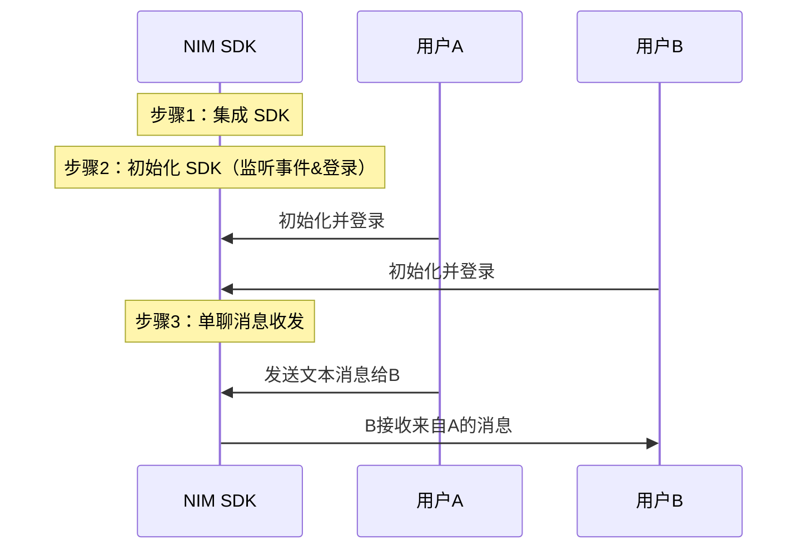

<!-- keywords: 即时通讯,IM,基本功能,消息收发,实现 -->

网易云信 IM 即时通讯服务提供一整套即时通讯基础能力，助您快速实现多样化的即时通讯场景。

本文主要介绍通过集成 NetEase IM SDK（NIM SDK）并调用 API，快速实现单聊消息收发功能。

## NIM SDK 说明


网易云信 NIM SDK 为 PC/移动 Web 应用及 NodeJS、微信小程序等跨平台应用，提供完善的即时通信功能开发能力，屏蔽其内部复杂细节，对外提供较为简洁的 API 接口，方便第三方应用快速集成即时通信功能。

<!-- 网易云信 NIM SDK 为 PC/移动 Web 应用及 NodeJS、React Native、微信小程序、字节跳动小程序等跨平台应用，提供完善的即时通信功能开发能力，屏蔽其内部复杂细节，对外提供较为简洁的 API 接口，方便第三方应用快速集成即时通信功能。 -->

NIM SDK 浏览器环境兼容 IE9+、Edge、Chrome 58+、 Safari 10+、Firefox 54+ 等主流桌面版浏览器，兼容 iPhone 5s 以上机型(操作系统 iOS 8.0+)的 Safari 浏览器及其内置微信浏览器、主流机型 Android 5+ 系统的 Chrome 浏览器及其内置微信浏览器。

<!-- NIM SDK 跨平台环境支持微信/字节跳动小程序、React Native、Nodejs 等场景应用。 -->

## 使用前准备

- 已在云信控制台[创建应用](https://doc.yunxin.163.com/console/docs/TIzMDE4NTA?platform=console)，获取 App Key。
- 已[注册云信 IM 账号](https://doc.yunxin.163.com/messaging/guide/TY1OTU4NDQ?platform=android#4-注册-im-账号)，获取 accid 和 token。

## 实现流程

### 流程概览

实现单聊消息收发的流程，可分为下图所示的 3 大步骤。





### **步骤 1：集成 SDK**

执行以下命令安装 npm 包。

```
npm install @yxim/nim-web-sdk@latest
```

  ::: note note
  - 云信 NIM SDK 兼容到 IE9+ (5.0.0 以下版本支持 IE8)。IE8/IE9 需要将项目部署在 HTTPS 环境下才能连接到云信服务器，其它高级浏览器可以在 HTTP 或者 HTTPS 环境下连接到云信 IM 服务器。

  - 云信 NIM SDK 所提供的跨平台相关能力的接口使用方式，基本与浏览器环境下的 JavaScript 调用方式相同。当然，根据不同平台所特有的一些差异点，SDK 也做了一些适配，主要分布在诸如数据库使用、文件上传、WebSocket 限制等方面。具体请参见[集成](https://doc.yunxin.163.com/messaging/guide/jMyNTU0ODI?platform=web)。
  :::

### **步骤 2：初始化与登录**

将 SDK 集成到客户端后，需要先完成 SDK 的初始化才能使用其他功能。

在初始化中同时完成消息收发的监听，以及账号的登录。

::: note note
- 以下示例中的 `account` 即 IM 账号中的 accid，`token` 即 IM 账号中的 token。
- 示例中的 `onxxxx` 表示监听事件，在初始化中注册监听后，后续会触发回调，NIM 的初始化参数请参见 [`getInstance`](https://doc.yunxin.163.com/messaging/api-refer/web/typedoc/Latest/zh/NIM/index.html#nimgetinstance)。
:::

示例代码如下：
```
var nim = NIM.getInstance({
  debug: true,   // 是否开启日志，将其打印到console。集成开发阶段建议打开。
  appKey: 'appKey',
  account: 'account',//用于登录IM
  token: 'token',//用于登录IM
  db:true, //若不要开启数据库请设置false。SDK 默认为true。
  // privateConf: {}, // 私有化部署方案所需的配置
  onconnect: onConnect,
  onwillreconnect: onWillReconnect,
  ondisconnect: onDisconnect,
  onerror: onError
  //消息收发的监听事件
  onroamingmsgs: onRoamingMsgs,
  onofflinemsgs: onOfflineMsgs,
  onmsg: onMsg
});
function onMsg(msg) {
    console.log('收到消息', msg.scene, msg.type, msg);
    pushMsg(msg); // pushMsg需要用户自己实现，将消息压入到自己的数据中
    switch (msg.type) {
    case 'custom':
        onCustomMsg(msg);
        break;
    case 'notification':
        onTeamNotificationMsg(msg);
        break;
    // 其它case
    default:
        break;
    }
}
```


### **步骤 3：文本消息收发**
本节以用户 A 和用户 B 的消息交互为例，介绍快速实现单聊消息收发的流程。

1. 用户 A 向用户 B 发送消息。

  目前 NIM SDK 支持多种消息类型，包括文本消息、图片消息、语音消息、视频消息、文件消息、地理位置消息、提示消息、通知消息以及自定义消息。具体请参见[消息收发](https://doc.yunxin.163.com/messaging/guide/jg0NTA4NjE?platform=web)。 
  这里主要以发送文本消息为例，示例代码如下：

  ```
var msg = nim.sendText({
    scene: 'p2p',
    to: 'account',
    text: 'hello',
    done: sendMsgDone
});
console.log('正在发送p2p text消息, id=' + msg.idClient);
function sendMsgDone(error, msg) {
    console.log(error);
    console.log(msg);
    console.log('发送' + msg.scene + ' ' + msg.type + '消息' + (!error?'成功':'失败') + ', id=' + msg.idClient);
}
  ```

2. 用户 B 收到 msg 事件消息。

3. （可选）用户 A 登出/销毁实例。示例代码如下：

  ```
  // 断开 IM
  nim.disconnect();
  ```

## 后续步骤


为保障通信安全，如果您在调试环境中的使用的是云信控制台生成的测试用 IM 账号 和 `token`，请确保在后续的正式生产环境中，将其替换为通过 <a href="https://doc.yunxin.163.com/messaging/guide/DQ3Nzk1MTY?platform=server" target="_blank">IM 服务端 API</a> 生成的正式 IM 账号（`accid`）和 `token`。
