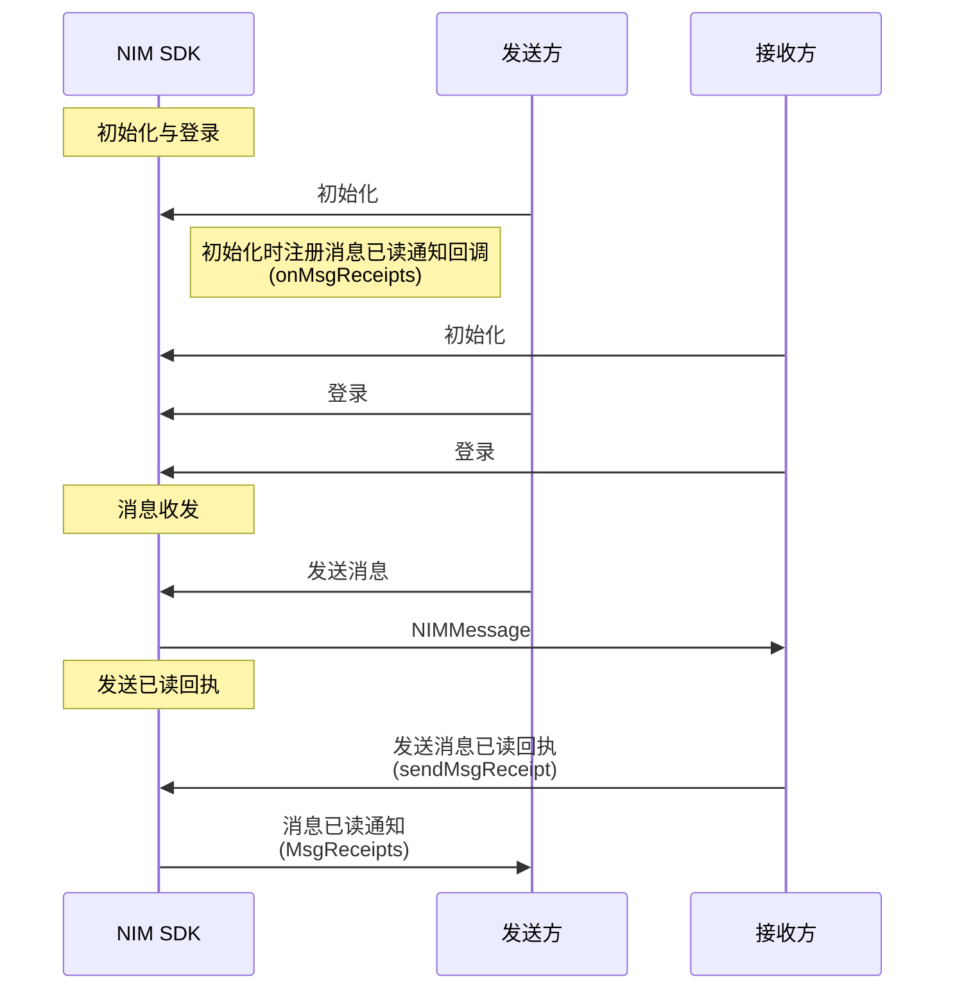
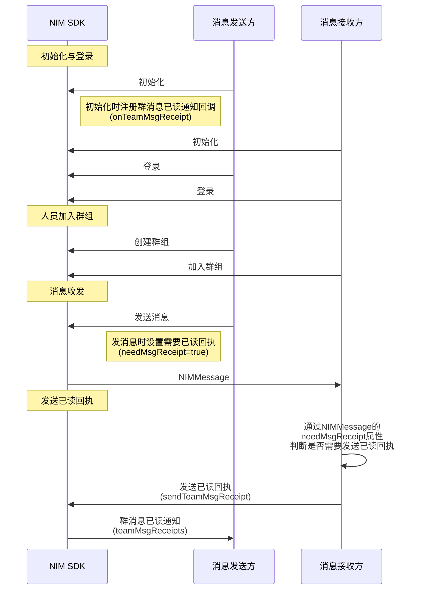

<!--keywords: 已读、已读回执、消息已读回执 -->

当发送方需要知道接收方是否已经阅读了自己发送的消息时，需要使用已读回执的功能。


## <span id="单聊消息已读回执">单聊消息已读回执</span>

本节以发送方和接收方的消息交互场景为例，介绍单聊消息已读回执的实现流程。


### API 调用时序


  


### **前提条件**

- 已集成 SDK。
- 已[注册云信 IM 账号](https://doc.yunxin.163.com/messaging/guide/DU1MTQxNDU?platform=web#4-注册-im-账号)，获取 accid 和 token。


### **实现流程**

1. 消息发送方在[初始化](https://doc.yunxin.163.com/messaging/guide/zE0NDY4Njc?platform=web)时注册 `onMsgReceipts` 接收消息已读回执回调函数（注：仅在发送方在线时可触发回调）。

2. 消息接收方在收到消息并阅读后，调用<a href="https://doc.yunxin.163.com/docs/interface/messaging/web/typedoc/Latest/zh/NIM/classes/nim.NIM.html#sendMsgReceipt" target="_blank">`sendMsgReceipt`</a>方法发送已读回执，调用时传入接收到的消息。

    ::: note note 
    如在会话界面中调用该方法并传入当前会话的最后一条消息，即表示这之前的消息本方都已读。
    :::


    <br>
    
    示例代码如下：

    ```
    nim.sendMsgReceipt({
        msg: session.lastMsg,
        done: sendMsgReceiptDone
    });
    function sendMsgReceiptDone(error, obj) {
        console.log('发送消息已读回执' + (!error?'成功':'失败'), error, obj);
    }

    ```
3. 如果发送方在线，那么发送方将收到消息已读通知。
  
  通知消息格式如下：
  ```
  {
    MsgReceipts: [
      {
        idClient: "",
        msgReceiptTime: "",
        sessionId: ""
      }
    ]
  ```


## <span id="群聊消息已读回执">群聊消息已读回执</span>

本节以发送方与接收方的消息交互为例，介绍群聊消息已读回执的实现流程。


### API 调用时序



### **前提条件**

- 已在控制台开通群消息已读回执功能，具体请参见[配置圈组功能](https://doc.yunxin.163.com/messaging/guide/TMwMzgyODI?platform=web#配置群组功能)。


- 已创建[云信 IM 账号](https://doc.yunxin.163.com/messaging/guide/DQ3Nzk1MTY?platformId=60353)。


### **使用限制**

::: note important
使用群消息已读回执功能，需将群成员控制在 200 人以内。
:::

### **实现流程**

1. 发送方在[初始化](https://doc.yunxin.163.com/messaging/guide/zE0NDY4Njc?platform=web)时，注册`onTeamMsgReceipt`接收群消息已读回执回调函数（注：仅在发送方在线时可触发回调）。


2. 发送方发送群消息时，将`needMsgReceipt`设置为 true，标记该消息需要已读回执。只有设置为需要已读回执，后续才会触发已读回执的通知。

    ::: note note 
    - 发送群消息只需要把消息发送接口的`scene`设置为`team`即可。更多消息收发相关说明参见[消息收发](https://doc.yunxin.163.com/TM5MzM5Njk/docs/zQ5MjI3ODY?platform=web)。
    - 发送单聊消息（p2p 场景）时，无需设置 `needMsgReceipt` 属性。
    :::


3. 接收方接收到消息后，通过该消息的`needMsgReceipt`属性判断该消息是否需要发送已读回执。


4. 接收方调用 [`sendTeamMsgReceipt`](https://doc.yunxin.163.com/docs/interface/messaging/web/typedoc/Latest/zh/NIM/classes/nim.NIM.html#sendTeamMsgReceipt)方法发送已读回执。


    ::: note notice
    该接口可以发送多个群组、多条消息的已读回执。需注意的是，传参中`teamMsgReceipts`可传入的群消息个数上限为**50**。
    :::

    请求参数 | 说明
    ----- |-------
    `teamMsgReceipts`  |需要发送回执的消息配置列表
    `teamMsgReceipt.teamId`  | 群组 ID 
    `teamMsgReceipt.idServer` | 云信服务端生成的消息 ID 
    `done` | 回调函数


    done 的回调结果 |说明
    ------ |------
    `error`| 第一个参数，如果为null表示成功
    `obj` | 第二个参数，发送的参数(用于校验)
    `content` | 第三个参数，`content.teamMsgReceipts`：失败的账号列表
    
    示例代码如下：


    ```
    nim.sendTeamMsgReceipt({
        teamMsgReceipts: [{
        teamId: '1027484',
        idServer: '68953284018302'
        }],
        done: sendTeamMsgReceiptDone
    })
    function sendTeamMsgReceiptDone (error, obj, content) {
        console.log('标记群组消息已读' + (!error?'成功':'失败'));
    }
    ```


5. 如果发送方在线，那么发送方将收到群消息已读通知。

    通知消息格式如下：


    ```
      {
        teamMsgReceipts: [
          {
            account: "cs3",
            idClient: "5b77d3ff7eb06af5567f56647518694b",
            idServer: "68953284018340",
            read: "1",
            teamId: "1027484",
            unread: "1"
          }
        ]
    ```


### 后续操作


消息发送方获取到群聊消息已读回执后，可调用如下方法查询已读/未读账号列表或查询单条消息的已读/未读数。


#### **查询群消息已读/未读账号列表**

调用[`getTeamMsgReadAccounts`](https://doc.yunxin.163.com/docs/interface/messaging/web/typedoc/Latest/zh/NIM/classes/nim.NIM.html#getTeamMsgReadAccounts)方法可查询单条群组消息的已读/未读账号列表。


请求参数 | 说明
--- |----
`teamMsgReceipt` | 待查询的群消息列表
`teamMsgReceipt.teamId` | 群组 ID 
`teamMsgReceipt.idServer` | 云信服务端生成的消息 ID
`done` | 回调函数


done 的回调结果 | 说明
----- | ----
`error` | 第一个参数，如果为 null 表示成功
`obj`  | 第二个参数，发送的参数(用于校验)
`content` | 第三个参数，账号列表<ul><li>`idClient`：客户端生成的消息 ID </li><li>`readAccounts`：已读帐号列表</li><li>`unreadAccounts`：未读帐号列表</li></ul>  

**示例代码**

```
  nim.getTeamMsgReadAccounts({
    teamMsgReceipt: {
      teamId: '1027484',
      idServer: '68953284018302'
    },
    done: getTeamMsgReadAccountsDone
  })
  function getTeamMsgReadAccountsDone (error, obj, content) {
    console.log('获取群组消息已读' + (!error?'成功':'失败'));
    /* content.teamMsgReceipt 为
      idClient: "c7575fca32bf142787986e752fdeff6a",
      readAccounts: Array[],
      unreadAccounts: Array[]
    */
```


#### **查询群消息已读/未读数量**

调用[`getTeamMsgReads`](https://doc.yunxin.163.com/docs/interface/messaging/web/typedoc/Latest/zh/NIM/classes/nim.NIM.html#getTeamMsgReads)方法可从本地数据库查询单条或多条群组消息已读/未读账号列表。


::: note notice
传参中`teamMsgReceipts`可传入的群消息个数上限为**50**。
:::

<br>


请求参数 | 说明
---- | -----
`teamMsgReceipts` |  待查询的群消息列表
`teamMsgReceipt.teamId` | 群组 ID 
`teamMsgReceipt.idServer` | 云信服务端生成的群消息 ID 
`done`  | 回调函数


done 的回调结果 | 说明
---- | -----
`error` | 第一个参数，如果为 null 表示成功
`obj` | 第二个参数，发送的参数(用于校验)
`content`  | 第三个参数，查询结果。如果是多个群消息配置的结果，则该字段的`teamMsgReceipts` 数组顺序与查询配置一致


**示例代码**


```
  nim.getTeamMsgReads({
    teamMsgReceipts: [{
      teamId: '1027484',
      idServer: '68953284018302'
    }],
    done: getTeamMsgReadsDone
  })
  function getTeamMsgReadsDone (error, obj, content) {
    console.log('获取群组消息已读' + (!error?'成功':'失败'));
    /* content.teamMsgReceipts 为
      [ {
        idClient: "c7575fca32bf142787986e752fdeff6a"
        idServer: "68527276949899"
        read: "0"
        teamId: "1021136"
        unread: "187"
      } ]
    */
```


## API参考

| <div style="width:80px">API</div> | <div style="width:120px">说明 </div>|
|:---- | :-------------- |
| <a href="https://doc.yunxin.163.com/docs/interface/messaging/web/typedoc/Latest/zh/NIM/classes/nim.NIM.html#sendMsgReceipt" target="_blank">`sendMsgReceipt`</a>|  发送单聊消息已读回执   |
|   [`sendTeamMsgReceipt`](https://doc.yunxin.163.com/docs/interface/messaging/web/typedoc/Latest/zh/NIM/classes/nim.NIM.html#sendTeamMsgReceipt) |  发送群聊消息已读回执        |
|[`getTeamMsgReadAccounts`](https://doc.yunxin.163.com/docs/interface/messaging/web/typedoc/Latest/zh/NIM/classes/nim.NIM.html#getTeamMsgReadAccounts) |查询单条群组消息的已读/未读账号列表 |
|   [`getTeamMsgReads`](https://doc.yunxin.163.com/docs/interface/messaging/web/typedoc/Latest/zh/NIM/classes/nim.NIM.html#getTeamMsgReads)  |      查询群组消息的已读、未读数量  |