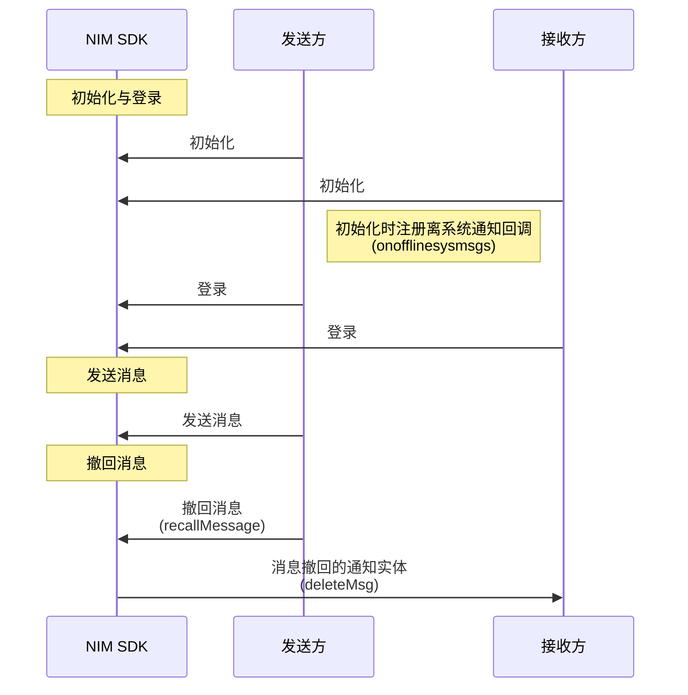

<!--keywords: 消息撤回、撤回、撤回通知、消息撤回通知 -->


NIM SDK 的[`MessageInterface`](https://doc.yunxin.163.com/docs/interface/messaging/web/typedoc/Latest/zh/NIM/interfaces/nim_MessageInterface.MessageInterface.html)类提供了监听消息撤回的方法和撤回消息的方法。


::: note notice
原撤回消息方法[`deleteMsg`](https://doc.yunxin.163.com/docs/interface/messaging/web/typedoc/Latest/zh/NIM/interfaces/nim_MessageInterface.MessageInterface.html#deleteMsg)**即将废弃**，推荐使用[`recallMsg`](https://doc.yunxin.163.com/docs/interface/messaging/web/typedoc/Latest/zh/NIM/interfaces/nim_MessageInterface.MessageInterface.html#recallMsg) 。
:::

## 功能介绍


可以在一定时间内（默认 2 分钟，可在云信控制台配置）撤回单聊消息和群消息。

- 单聊场景下，发送方撤回之后，对应的离线消息、漫游消息和历史消息将被删除，消息接收方会收到一条类型为 [`deleteMsg`](https://doc.yunxin.163.com/messaging/api-refer/web/typedoc/Latest/zh/NIM/enums/nim_SystemMessageInterface.NIMEnumSystemMessageType.html#deleteMsg) 的系统通知；群聊场景下, 所有群成员都会收到该系统通知。

- 如果接收方同时在多个端登录了同一个账号, 那么其它端也会收到这条系统通知。

- 消息撤回后，无论是发送方还是接收方，都无法在历史消息、漫游消息或者离线消息的接口返回中，查到该消息。

- 初始化 SDK 时，配置`rollbackDelMsgUnread` 为 true 可实现消息撤回后重新计算未读数（默认值为 false，该参数也适用于：未读消息被删除，是否重新计算未读数）。


::: note notice 
- 如果消息发送失败或者消息发送者被拉黑，那么即使在可撤回时长内也无法撤回。
- 单聊和群聊消息的撤回功能存在些许区别：
    - 单聊：用户只能撤回自己发送的消息。
    - 群聊：普通群成员只能撤回自己发送的消息。客户端 SDK 支持管理员撤回其他群成员的消息(服务端 API 不支持)。
:::


## 前提条件
- 已集成 SDK。
- 已[注册云信 IM 账号](https://doc.yunxin.163.com/messaging/guide/DU1MTQxNDU?platform=web#4-注册-im-账号)，获取 accid 和 token。


## 实现流程

不同类型消息撤回的流程相似，本节以消息发送方与消息接收方的单聊消息交互为例，介绍消息撤回的实现流程。

### **API调用时序**




### **流程说明**

1. 接收方在调用[`getInstance`](https://doc.yunxin.163.com/docs/interface/messaging/web/typedoc/Latest/zh/NIM/classes/nim.NIM.html#getInstance)方法初始化 SDK 时注册`onofflinesysmsgs`回调，监听离线系统通知。

    ::: note notice
    接收方未注册该回调函数时，如果消息被撤回时接收方离线，那么接收方将无法收到消息被撤回通知。
    :::

2. 发送方在发送消息后，调用[`recallMsg`](https://doc.yunxin.163.com/docs/interface/messaging/web/typedoc/Latest/zh/NIM/interfaces/nim_MessageInterface.MessageInterface.html#recallMsg)方法撤回消息。调用成功后，SDK 会先触发回调通知应用上层消息撤回成功，再自动将本地的这条消息删除。


    以下情况消息撤回会**失败**：
    
    - 消息为空
    - 消息没有发送成功
    - 消息超过撤回时限
    - 消息被反垃圾（内容审核）命中

    ```
    nim.sendText({
        scene: 'p2p', 
        to: 'zk3', 
        text: '会被撤回的消息', 
        done: function(err, msg) {
            if (!err) {
                /**
                * 撤回刚刚发出的消息
                */
                nim.recallMsg({
                    msg, 
                    done: function (err, msg) {
                        if (!err) {
                            console.log('撤回了刚刚发出的消息')
                        }
                    }
                })
            }
        }
    })
    ```

3. 如果需要在撤回后显示一条本方已撤回的提示，可发送一条提示消息[插入本地消息](https://doc.yunxin.163.com/messaging/guide/jg4NTI3NDk?platform=web#插入本地消息)。


    
## API参考

| <div style="width:80px">API</div> | <div style="width:120px">说明 </div>|
|:---- | :-------------- |
|    [`recallMsg`](https://doc.yunxin.163.com/docs/interface/messaging/web/typedoc/Latest/zh/NIM/interfaces/nim_MessageInterface.MessageInterface.html#recallMsg)      |      撤回消息         |


