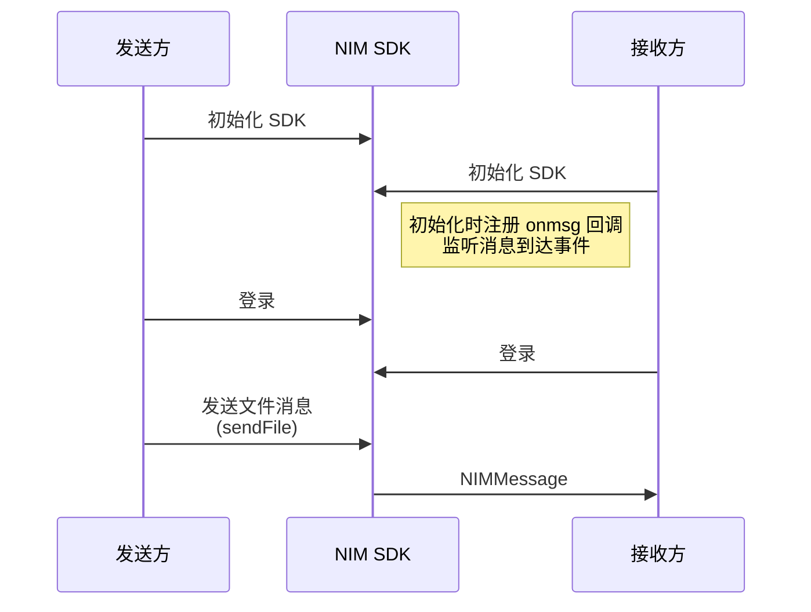
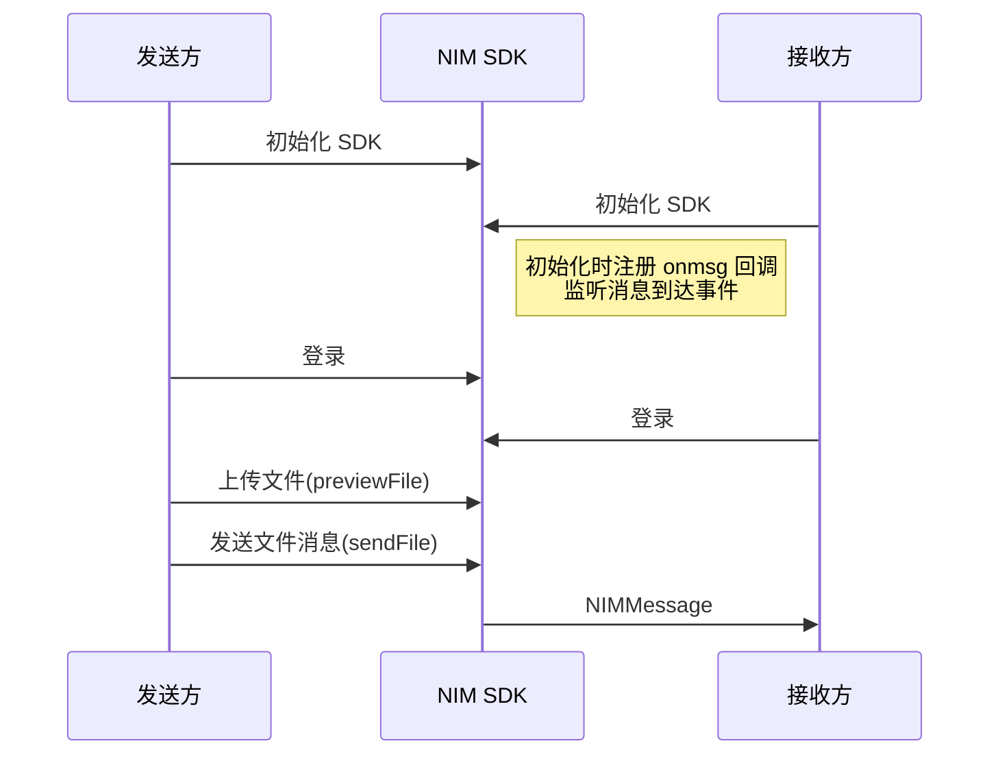
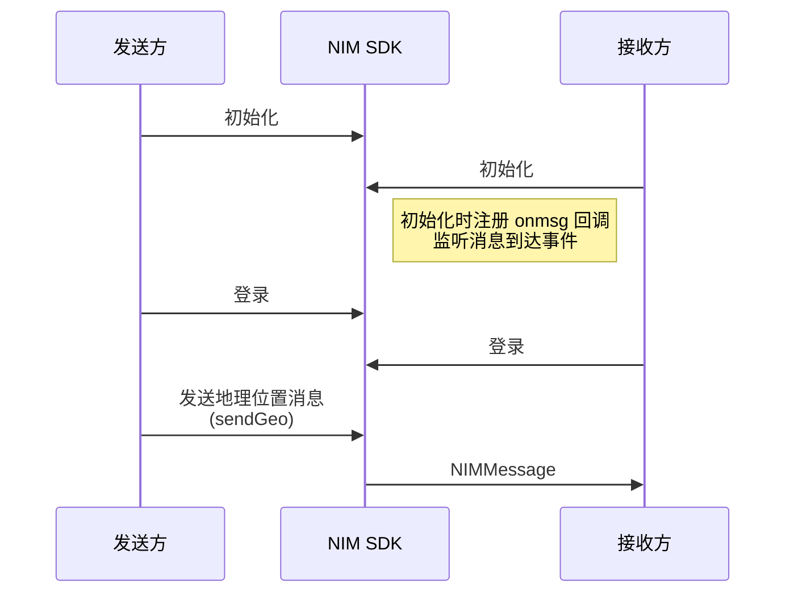

<!--keywords: 消息收发, 消息, 发送消息, 接收消息, 文本消息，图片消息，音频消息，视频消息，多媒体消息，广播消息，提示消息，自定义消息 -->

网易云信即时通讯 Web 版 SDK（以下简称 **NIM SDK**）支持收发多种消息类型，助您快速实现多样化的消息业务场景。本文介绍通过网易云信 NIM SDK 实现消息收发的技术原理、前提条件以及具体的实现流程。

::: note note
本节的示例代码皆以发送单聊消息（`scene` 为 `p2p`）为例。如需发送群消息, 请将 `scene` 的值替换为 `team`, 将 `to` 的值替换为群 ID（`teamId`）。如需发送超大群消息，请将 `scene` 的值替换为 `superTeam`，将 `to` 替换为超大群的 ID（`teamId`）。
:::

## 消息类型

NIM SDK 支持的消息类型包括文本消息、文件（包括音视、视频、图片等）消息、地理位置消息、提示消息、通知消息、和自定义消息。SDK 中定义消息对象的结构为 [`NIMMessage`](https://doc.yunxin.163.com/docs/interface/messaging/web/typedoc/Latest/zh/NIM/modules/nim_MessageInterface.html#NIMMessage)，相同类型的消息，通过在调用相应类型的消息发送接口时配置 `scene` 参数进行区分，该参数值配置为 `p2p` 时表示为单聊消息，为 `team` 时表示为群聊消息，为 `superTeam` 时表示为超大群消息。

## 使用限制

发送消息的方法调用均存在频控，一分钟内默认最多可调用 300 次。

## 前提条件

在实现消息收发之前，请确保：
- 已集成 SDK。
- 已 [注册 IM 账号](https://doc.yunxin.163.com/messaging/guide/DU1MTQxNDU?platform=web#4-注册-im-账号)，获取账号 ID（`accid`）和凭证（Token）。
- 已了解各消息类型的 [使用限制](https://doc.yunxin.163.com/messaging/guide/zg3NzA3NTA?platform=web#消息类型)。
- 已创建群组（如果需要发送群消息）。

## 初始化配置

在收发送消息前，用户需要在初始化时按需完成消息相关参数配置。例如，为了保证能接收到消息，必须注册 `onmsg` 回调来监听消息接收。

以下仅列出于消息强相关的初始化参数，完整的初始化参数参考 [`NIMGetInstanceOptions`](https://doc.yunxin.163.com/docs/interface/messaging/web/typedoc/Latest/zh/NIM/interfaces/nim_types.NIMGetInstanceOptions.html)。

<div style="width:180px">参数</div> | <div style="width:80px">类型</div> | 说明
:---- | :----
`shouldIgnoreNotification` | function | 该参数类型为函数(function)，表示是否要忽略某条通知类消息。该方法会将接收到的通知类消息对象，按照用户上层定义的逻辑进行过滤, 如果该方法返回 true，那么 SDK 将忽略此条通知类消息
`onmsg` | function | 消息（`NIMMessage`）到达事件的回调<note type=note>当前登录账号在其它端发送消息之后也会收到此回调, 此时消息对象的 `from` 字段就是当前登录的账号。</note>
`onroamingmsgs` | function | 同步漫游消息的回调。每个会话对应一个回调, 会传入消息数组
`onofflinemsgs` | function | 同步离线消息对象的回调, 每个会话对象对应一个回调, 会传入消息数组

::: note note
在支持数据库且启用了多 tab 同时登录时，多个 tab 页同时断线重连之后, 只会有一个 tab 页负责存储漫游消息和离线消息, 即只会有一个 tab 页会收到 `onroamingmsgs` 和 `onofflinemsgs` 回调, 其它 tab 页在 <a href="https://doc.yunxin.163.com/TM5MzM5Njk/docs/zE0NDY4Njc?platform=web#%E5%90%8C%E6%AD%A5%E5%AE%8C%E6%88%90" target="_blank">同步完成</a> 之后, 需要调用 <a href="https://doc.yunxin.163.com/TM5MzM5Njk/docs/jg5MjQ4MTM?platform=web#%E8%8E%B7%E5%8F%96%E6%9C%AC%E5%9C%B0%E5%8E%86%E5%8F%B2%E8%AE%B0%E5%BD%95" target="_blank">获取本地历史记录</a> 接口从本地缓存中拉取消息记录。
:::

```JavaScript
var nim = NIM.getInstance({
    onroamingmsgs: onRoamingMsgs,
    onofflinemsgs: onOfflineMsgs,
    onmsg: onMsg
});
function onRoamingMsgs(obj) {
    console.log('收到漫游消息', obj);
    pushMsg(obj.msgs);
}
function onOfflineMsgs(obj) {
    console.log('收到离线消息', obj);
    pushMsg(obj.msgs);
}
function onMsg(msg) {
    console.log('收到消息', msg.scene, msg.type, msg);
    pushMsg(msg);
    switch (msg.type) {
    case 'custom':
        /**
         * 收到自定义消息，用户根据消息内容处理
         */
        break;
    case 'notification':
        /**
         * 收到群通知消息，用户根据群通知的消息进行进一步处理
         */
        break;
    // 其它 case
    default:
        break;
    }
}

function pushMsg(msgs) {
    if (!Array.isArray(msgs)) { msgs = [msgs]; }
    var sessionId = msgs[0].scene + '-' + msgs[0].account;
    data.msgs = data.msgs || {};
    data.msgs[sessionId] = nim.mergeMsgs(data.msgs[sessionId], msgs);
}
```

## **收发文本消息**

**API 调用时序**


**具体说明**

1. 接收方在进行 SDK 初始化时，注册 `onmsg` 回调实现对消息接收事件的监听。

2. 发送方调用 <a href="https://doc.yunxin.163.com/docs/interface/messaging/web/typedoc/Latest/zh/NIM/classes/nim.NIM.html#sendText" target="_blank">`sendText`</a> 方法发送一条文本消息。

    ::: note note
    消息是否存入云端（`isHistoryable`）、写入漫游（`isRoamingable`）、计入未读数（`isUnreadable`）等配置选项说明，请参考 <a href="https://doc.yunxin.163.com/TM5MzM5Njk/docs/TAxNDY5Mzc?platform=web" target="_blank">消息配置选项</a>。
    :::

    示例代码如下：
    ```JavaScript
    var msg = nim.sendText({
        scene: 'p2p',
        to: 'account',
        text: 'hello',
        done: sendMsgDone
    });
    console.log('正在发送 p2p text 消息, id=' + msg.idClient);
    pushMsg(msg); // pushMsg 需要用户自己实现，将消息压入到自己的数据中
    function sendMsgDone(error, msg) {
        console.log(error);
        console.log(msg);
        console.log('发送' + msg.scene + ' ' + msg.type + '消息' + (!error?'成功':'失败') + ', id=' + msg.idClient);
        pushMsg(msg);
    }
    ```

3. SDK 触发 `onmsg` 回调，接收方通过该回调收到消息。

## **收发文件消息**

文件消息可附带的文件类型包括图片、音频、视频和普通文件，它们的区别在于具体的文件信息不一样。文件信息在消息对象的 `file` 字段内定义。

### 文件对象类型 

:::::: div linked-codes
::: code 图片对象

当发送图片消息或收到图片消息时, 消息对象（`NIMMessage`）的 `file` 字段代表图片对象, 包含以下属性:

属性 | 说明
:---- | :----
`name` | 图片名称
`size` | 图片大小，单位 byte
`url` | 图片的 URL
`ext` | 扩展字段
`w` | 图片宽度，单位 px
`h` | 图片高度，单位 px

:::

::: code 音频对象

当发送音频消息, 消息对象（`NIMMessage`）的 `file` 字段代表音频对象, 包含以下属性:

属性 | 说明
:---- | :----
`name` | 音频文件名称
`size` | 音频文件大小, 单位 byte
`url` | 音频文件 URL
`ext` | 扩展字段
`dur` | 音频时长, 单位 ms

:::

::: code 视频对象

当发送视频消息或收到视频消息时, 消息对象（`NIMMessage`）的 `file` 字段代表视频对象, 包含以下属性:

属性 | 说明
:---- | :----
`name` | 视频文件名称
`size` | 视频文件大小, 单位 byte
`url` | 视频文件 URL
`ext` | 扩展字段
`dur` | 视频长度, 单位 ms
`w` | 宽, 分辨率, 单位 px
`h` | 高, 分辨率, 单位 px

::: note note
视频对象取封面(首帧图片)：
获取到的视频对象后加 `vframe` 即可，例如：原视频地址为 `http://img-sample.nos-eastchina1.126.net/sample.wmv`，则封面(首帧)图片地址为 `http://img-sample.nos-eastchina1.126.net/sample.wmv?vframe`

:::

::: code 普通文件对象

当发送普通文件消息或收到普通文件消息时, 消息对象（`NIMMessage`）的 `file` 字段代表文件对象, 包含以下属性:

属性 | 说明
:---- | :----
`name` | 文件名称
`size` | 文件大小, 单位 byte
`url` | 文件的 URL
`ext` | 扩展字段

:::
::::::

### 实现流程 

您可通过两种方式发送文件消息，**直接发送** 或者 **先上传文件再发送**。

:::::: div linked-codes
::: code 直接发送文件消息

**API 调用时序**



**具体说明**

1. 接收方在进行 SDK 初始化时，注册 `onmsg` 回调实现对消息接收事件的监听。

2. 发送方调用 <a href="https://doc.yunxin.163.com/docs/interface/messaging/web/typedoc/Latest/zh/NIM/classes/nim.NIM.html#sendFile" target="_blank">`sendFile`</a> 方法发送文件消息。

    - 支持以下几种场景传入文件：

        - 通过参数 `fileInput` 传入文件：选择 dom 节点或者节点 ID，SDK 会读取该节点下的文件，在上传完成前请不要操作该节点下的文件
        - 通过参数 `blob` 传入 Blob 对象
        - 通过参数 `dataURL` 传入包含 MIME type 和 base64 数据的 data URL，此用法需要浏览器支持 Blob

        SDK 会先将文件上传到文件服务器, 然后把获取的文件对象在 `uploaddone` 回调中传给发送方, 然后将其拼装成文件消息发送出去。
    - 参数 `type` 指定了要发送的文件类型, 包括图片、音频、视频和普通文件, 对应的值分别为 `image`、`audio`、`video` 和 `file`, 不传默认为 `file`。

    ::: note note
    - 在小程序环境中，上传的文件需要小于 100 MB。
    - 消息是否存入云端（`isHistoryable`）、写入漫游（`isRoamingable`）、计入未读数（`isUnreadable`）等配置选项说明，请参考 <a href="https://doc.yunxin.163.com/TM5MzM5Njk/docs/TAxNDY5Mzc?platform=web" target="_blank">消息配置选项</a>。
    :::

    示例代码如下：
    ```JavaScript
    nim.sendFile({
        scene: 'p2p',
        to: 'account',
        type: 'image',
        fileInput: fileInput,
        fastPass: '{"w":200,"h":110,"md5":"xxxxxxxxx"}',
        beginupload: function(upload) {
            // - 如果开发者传入 fileInput, 在此回调之前不能修改 fileInput
            // - 在此回调之后可以取消图片上传, 此回调会接收一个参数 `upload`, 调用 `upload.abort();` 来取消文件上传
        },
        uploadprogress: function(obj) {
            console.log('文件总大小: ' + obj.total + 'bytes');
            console.log('已经上传的大小: ' + obj.loaded + 'bytes');
            console.log('上传进度: ' + obj.percentage);
            console.log('上传进度文本: ' + obj.percentageText);
        },
        uploaddone: function(error, file) {
            console.log(error);
            console.log(file);
            console.log('上传' + (!error?'成功':'失败'));
        },
        beforesend: function(msg) {
            console.log('正在发送 p2p image 消息, id=' + msg.idClient);
            pushMsg(msg); // pushMsg 需要用户自己实现，将消息压入到自己的数据中
        },
        done: sendMsgDone
    });

    ```
3. `onmsg` 回调触发，接收方通过该回调收到消息。

:::

::: code 先上传文件再发送

**API 调用时序**



**具体说明**

1. 接收方在进行 SDK 初始化时，注册 `onmsg` 回调实现对消息接收事件的监听。

2. 发送方调用 <a href="https://doc.yunxin.163.com/messaging/api-refer/web/typedoc/Latest/zh/NIM/classes/nim.NIM.html#previewFile" target="_blank">`previewFile`</a> 方法上传文件。SDK 会将文件上传到文件服务器, 然后将拿到的文件对象在 done 回调中传给发送方。发送方拿到文件对象后，再调用 <a href="https://doc.yunxin.163.com/docs/interface/messaging/web/typedoc/Latest/zh/NIM/classes/nim.NIM.html#sendFile" target="_blank">`sendFile`</a> 方法发送文件消息。

    调用 `previewFile` 时，您可通过以下方式传入文件：
    
    - 通过参数 `fileInput` 传入文件，选择 dom 节点或者节点 ID, SDK 会读取该节点下的文件, 在上传完成前请不要操作该节点下的文件。
    - 通过参数 `blob` 传入 Blob 对象
    - 通过参数 `dataURL` 传入包含 MIME type 和 base64 数据的 data URL, 此用法需要浏览器支持 Blob
    - 通过参数 `filePath` 传入文件路径(跨平台系列)，支持小程序(5.1.0+)、nodejs(5.4.0+ 内测中)、react-native(5.3.0+)，。该参数不支持浏览器环境

    ::: note note
    - 在小程序环境中，上传的文件需要小于 100 MB。
    - 消息是否存入云端（`isHistoryable`）、写入漫游（`isRoamingable`）、计入未读数（`isUnreadable`）等配置选项说明，请参考 <a href="https://doc.yunxin.163.com/TM5MzM5Njk/docs/TAxNDY5Mzc?platform=web" target="_blank">消息配置选项</a>。
    :::

    示例代码如下：
    ```JavaScript
    nim.previewFile({
        type: 'image',
        fileInput: fileInput,
        uploadprogress: function(obj) {
            console.log('文件总大小: ' + obj.total + 'bytes');
            console.log('已经上传的大小: ' + obj.loaded + 'bytes');
            console.log('上传进度: ' + obj.percentage);
            console.log('上传进度文本: ' + obj.percentageText);
        },
        done: function(error, file) {
            console.log('上传 image' + (!error?'成功':'失败'));
            // show file to the user
            if (!error) {
                var msg = nim.sendFile({
                    scene: 'p2p',
                    to: 'account',
                    file: file,
                    done: sendMsgDone
                });
                console.log('正在发送 p2p image 消息, id=' + msg.idClient);
                pushMsg(msg); // pushMsg 需要用户自己实现，将消息压入到自己的数据中
            }
        }
    });
    ```
    ::: note note
    如果直接发送文件消息，`sendFile` 方法会在 `beforesend` 回调里传入 SDK 生成的消息 ID（`idClient`）, 如果先上传文件再发送, 那么此方法会直接返回 `idClient`。
    :::

3. SDK 触发 `onmsg` 回调，接收方通过该回调收到消息。

:::
::::::

## **收发地理位置消息**

当发送地理位置消息或收到地理位置消息时, 消息对象（`NIMMessage`）的 `geo` 字段代表地理位置对象, 包含以下属性:

属性 | 说明
:---- | :----
`lng` | 经度
`lat` | 纬度
`title` | 地址描述

**API 调用时序**



**具体说明**

1. 接收方在进行 SDK 初始化时，注册 `onmsg` 回调实现对消息接收事件的监听。

2. 发送方调用 <a href="https://doc.yunxin.163.com/docs/interface/messaging/web/typedoc/Latest/zh/NIM/classes/nim.NIM.html#sendGeo" target="_blank">`sendGeo`</a> 发送地理位置消息。

    ::: note note
    消息是否存入云端（`isHistoryable`）、写入漫游（`isRoamingable`）、计入未读数（`isUnreadable`）等配置选项说明，请参考 <a href="https://doc.yunxin.163.com/TM5MzM5Njk/docs/TAxNDY5Mzc?platform=web" target="_blank">消息配置选项</a>。
    :::

    示例代码如下：
    ```JavaScript
    var msg = nim.sendGeo({
        scene: 'p2p',
        to: 'account',
        geo: {
            lng: 116.3833,
            lat: 39.9167,
            title: 'Beijing'
        },
        done: sendMsgDone
    });
    console.log('正在发送 p2p geo 消息, id=' + msg.idClient);
    pushMsg(msg); // pushMsg 需要用户自己实现，将消息压入到自己的数据中

    ```
3. `onmsg` 回调触发，接收方通过该回调收到消息。

## **收发提示消息**

提示消息（又叫做 Tip 消息）主要用于会话内的通知提醒，典型使用场景包括 **进入群组时出现的欢迎消息** 和 **会话过程中命中敏感词后的提示** 等。

调用 <a href="https://doc.yunxin.163.com/docs/interface/messaging/web/typedoc/Latest/zh/NIM/classes/nim.NIM.html#sendGeo" target="_blank">`sendTipMsg`</a> 发送提示消息。

::: note note
消息是否存入云端（`isHistoryable`）、写入漫游（`isRoamingable`）、计入未读数（`isUnreadable`）等配置选项说明，请参考 <a href="https://doc.yunxin.163.com/TM5MzM5Njk/docs/TAxNDY5Mzc?platform=web" target="_blank">消息配置选项</a>。
:::

示例代码如下：

```JavaScript
var msg = nim.sendTipMsg({
    scene: 'p2p',
    to: 'account',
    tip: 'tip content',
    done: sendMsgDone
});
console.log('正在发送 p2p 提醒消息, id=' + msg.idClient);
pushMsg(msg); // pushMsg 需要用户自己实现，将消息压入到自己的数据中
```

## **接收通知消息**

一些特定场景的行为，网易云信服务端预置了一些系统通知消息。通知消息也是一种特定消息，开发者需解析消息中附带的信息，来获取通知内容。如最常见的通知消息：群通知事件，如有新成员进群，则群内已有成员将收到此通知消息。

通知消息属于会话内的一种消息，其对应的数据结构为 `NIMMessage`，消息类型为 `type.notification`。目前用于群通知。

::: note note
- 更多通知消息相关说明，参考 [群通知消息](https://doc.yunxin.163.com/messaging/guide/TIxMjk0ODU?platform=web)和[超大群通知消息](https://doc.yunxin.163.com/messaging/guide/DIzMDI5NjQ?platform=web)。
- 目前不支持从客户端发送通知消息。
:::

## **收发自定义消息**

调用 <a href="https://doc.yunxin.163.com/docs/interface/messaging/web/typedoc/Latest/zh/NIM/classes/nim.NIM.html#sendCustomMsg" target="_blank">`sendCustomMsg`</a> 发送自定义消息。

::: note note
消息是否存入云端（`isHistoryable`）、写入漫游（`isRoamingable`）、计入未读数（`isUnreadable`）等配置选项说明，请参考 <a href="https://doc.yunxin.163.com/TM5MzM5Njk/docs/TAxNDY5Mzc?platform=web" target="_blank">消息配置选项</a>。
:::

在网易云信开放的 <a href="https://github.com/netease-kit/NIM_Web_Demo" target="_blank">旧版 web-demo 源码</a> 中，type-1 为 [石头剪刀布]，type-2 为 [阅后即焚]，type-3 为 [贴图表情]，type-4 为 [白板教学]。如下代码用自定义消息实现了 **石头剪刀布** 游戏：

```JavaScript
var value = Math.ceil(Math.random()*3);
var content = {
    type: 1,
    data: {
        value: value
    }
};
var msg = nim.sendCustomMsg({
    scene: 'p2p',
    to: 'account',
    content: JSON.stringify(content),
    done: sendMsgDone
});
console.log('正在发送 p2p 自定义消息, id=' + msg.idClient);
pushMsg(msg); // pushMsg 需要用户自己实现，将消息压入到自己的数据中
```

## 收发流式消息

1. 进行 SDK 初始化时，注册 `onmsg` 和 `onReceiveMessagesModified` 回调实现对消息接收事件和消息更新事件的监听。

2. **发送方** 调用服务端 API [发送流式消息](https://doc.yunxin.163.com/messaging2/server-apis/TgyMTY2NzE?platform=server)。

    ::: note note
    根据调用返回的状态，处理输出的流式消息。
    :::

3. **接收方** 处理流式消息。

    - 通过 `onmsg` 回调收到占位消息。
    - 通过 `onReceiveMessagesModified` 回调持续收到分片消息，直到消息接收完毕。

## API 参考

| <div style="width:150px">API</div> | <div style="width:120px">说明 </div> |
| :---- | :---- |
| <a href="https://doc.yunxin.163.com/docs/interface/messaging/web/typedoc/Latest/zh/NIM/classes/nim.NIM.html#sendText" target="_blank">`sendText`</a> | 发送文本消息 |
| <a href="https://doc.yunxin.163.com/docs/interface/messaging/web/typedoc/Latest/zh/NIM/classes/nim.NIM.html#sendFile" target="_blank">`sendFile`</a> | 发送文件消息，包括图片消息、视频消息、音频消息和普通文件消息 |
| <a href="https://doc.yunxin.163.com/docs/interface/messaging/web/typedoc/Latest/zh/NIM/classes/nim.NIM.html#sendGeo" target="_blank">`sendGeo`</a> | 发送地理位置消息 |
| <a href="https://doc.yunxin.163.com/docs/interface/messaging/web/typedoc/Latest/zh/NIM/classes/nim.NIM.html#sendTipMsg" target="_blank">`sendTipMsg`</a> | 发送提示消息 |
| <a href="https://doc.yunxin.163.com/docs/interface/messaging/web/typedoc/Latest/zh/NIM/classes/nim.NIM.html#sendCustomMsg" target="_blank">`sendCustomMsg`</a> | 发送自定义消息 |

## **公共参数**

所有发送消息的 SDK API 都有如下参数。

:::::: div linked-codes

::: code 公共入参

参数 | 说明
:---- | :----
`scene` | 指定发送消息的场景，包括：<ul><li>p2p：单聊消息</li><li>team：群聊消息</li><li>superTeam：超大群消息</li></ul>
`to` | 指定消息的接收方, 发送单聊消息时填接收方的 IM 账号, 发送群消息时填群 ID（`teamId`），发送超大群消息时填超大群的 ID (`teamId`)
:::

::: code 公共回参

参数 | 说明
:---- | :----
`idClient` | 发送消息的 SDK API （除了直接发送文件消息）会返回 SDK 生成的消息 ID。<note type=note>直接发送文件消息时，`idClient` 字段从 `beforesend` 回调中获取。</note>
`error` | 在 `done` 回调中可以根据 `error` 对象和消息对象的 `idClient` 字段来确定对应的消息的发送状态。<ul><li>如果 `error` 为空, 那么表明 `idClient` 对应的消息发送成功</li><li>如果 `error` 不为空, 表明 `idClient` 对应的消息发送失败, `error` 包含详细的错误信息</li></ul>
:::
::::::

## 常见问题

### **发送消息后怎么获取消息内容**

在发送消息接口的 `done` 回调中返回 `NIMMessage` 对象。可以通过 `flow` 属性获取消息方向，通过 `to` 属性获取聊天对象的 accid/群组 ID，通过 `text` 属性获取文本消息的内容，通过 `file` 属性获取文件消息的文件对象，通过 `status` 属性获取消息发送状态，通过 time 属性获取消息时间戳。

### **如何判断消息发送成功**

在消息发送的 `done` 回调中根据消息对象的 `status` 字段和 `error` 对象来确定消息的发送状态。如果 `status` 为 `success`，`error` 为空则表示消息发送成功。

### **如何设置消息的扩展字段**

单聊或群聊消息具有服务端扩展字段和客户端扩展字段。服务端扩展字段只能在消息发送前设置，会同步到其他端。客户端扩展字段在消息发送前后设置均可，不会同步到其他端。

::: note notice
扩展字段，请使用 JSON 格式封装，并传入非格式化的 JSON 字符串，最大长度 1024 字节。
:::

具体方法如下：

:::::: div linked-codes
::: code 更新客户端扩展字段

1. 调用发送单聊或群聊消息的方法时，构造的消息对象中，设置 `localCustom` 字段。

2. 调用 `updateLocalMsg` 方法更新消息的本地扩展字段。

    ```JavaScript
    nim.updateLocalMsg({
    idClient: msg.idClient, localCustom: '{"key","value"}',
    done: updateLocalMsgDone
    })
    ```

    ::: note notice
    设置消息的客户端扩展字段后，必须调用该方法，否则无法生效。
    :::

:::

::: code 更新服务端扩展字段

调用发送单聊或群聊消息的方法时，构造的消息对象中，设置 `custom` 字段。

:::
::::::