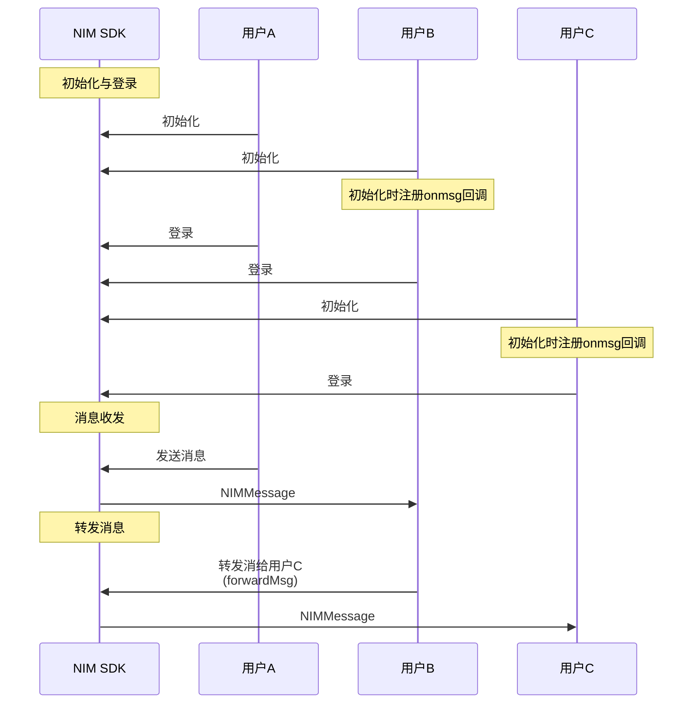

<!--keywords: 消息重发,重发消息,重发,转发,转发消息,转发合并消息,转发多条消息,合并转发, -->

NIM SDK 的[`MessageInterface`](https://doc.yunxin.163.com/docs/interface/messaging/web/typedoc/Latest/zh/NIM/interfaces/nim_MessageInterface.MessageInterface.html#deleteMsg)类提供了消息转发/重发的方法。


::: note notice
除了**通知消息**外，其他类型消息均支持转发给其他会话。
:::


## 前提条件

- 已集成 SDK。
- 已[注册云信 IM 账号](https://doc.yunxin.163.com/messaging/guide/DU1MTQxNDU?platform=web#4-注册-im-账号)，获取 accid 和 token。


## <span id="消息重发">重发消息</span>


消息发送失败之后，可调用[`resendMsg`](https://doc.yunxin.163.com/docs/interface/messaging/web/typedoc/Latest/zh/NIM/interfaces/nim_MessageInterface.MessageInterface.html#resendMsg)方法重发消息。

```
nim.resendMsg({
  msg: someMsg,
  done: sendMsgDone
})
console.log('正在重发消息', someMsg)
```

V9.10.0 新增重发拉黑状态消息相关开关，默认不开启。开启后使用优化的发送逻辑。如有需要，请联系商务经理或技术支持进行开启。优化后的重发拉黑消息逻辑如下：

- 若重发拉黑状态消息时，用户还处于黑名单中，此时会产生一条新消息，发送端会收到 7101 错误码，接收端则无法接收到该消息。
    :::note notice
    处于拉黑状态时，无论重发多少次消息，产生的新消息都是同一条，即同一个 msgid。
    :::
- 若重发拉黑状态消息时，用户已不在黑名单中，此时产生一条新消息，发送端会收到 200 状态码，接收端正常接收到该消息。

## <span id="消息转发">转发一条消息</span>

NIM SDK 支持转发通知和音视频通话事件消息以外所有其他消息类型。


### **API调用时序**




### **实现方法**


调用[`forwardMsg`](https://doc.yunxin.163.com/docs/interface/messaging/web/typedoc/Latest/zh/NIM/interfaces/nim_MessageInterface.MessageInterface.html#forwardMsg)方法转发消息。


```javascript
nim.forwardMsg({
  msg: someMsg,
  scene: 'p2p',
  to: 'account',
  done: sendMsgDone
})
console.log('正在转发消息', someMsg)
```


