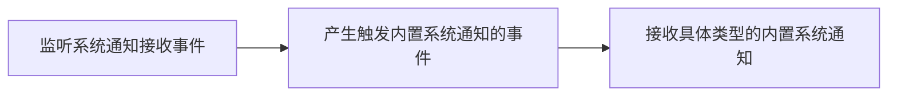

<!--keywords: 系统通知,通知,监听,获取,删除,更新,内置-->

网易云信 NIM SDK 支持接收和存储内置系统通知。同时提供查询、删除内置系统通知、修改通知状态等内置系统通知管理功能。


## 技术原理

内置系统通知是云信系统内建的通知，由云信服务器推送给用户或群组，用于云信系统类的事件通知。

系统通知相关 API，具体请参见 [`SystemMessageInterface`](https://doc.yunxin.163.com/docs/interface/messaging/web/typedoc/Latest/zh/NIM/interfaces/nim_SystemMessageInterface.SystemMessageInterface.html)。


## <span id="监听系统通知">监听系统通知</span>

只有在注册监听系统通知相关事件后，用户才会收到对应的系统通知。




在初始化时，您可以调用 [`getInstance`](https://doc.yunxin.163.com/docs/interface/messaging/web/typedoc/Latest/zh/NIM/classes/nim.NIM.html#getInstance) 提前注册监听系统通知相关事件。监听后，当产生触发事件后，会收到对应的系统通知。

初始化参数中涉及系统通知事件监听的参数如下：
- `onofflinesysmsgs`：同步离线系统通知的回调，会传入系统通知数组
    - 在**支持数据库**并启用多 tab 同时登录时，如果多个 tab 页同时断线重连，那么只会有一个 tab 页负责存储离线系统通知，即只会有一个 tab 页会收到 `onofflinesysmsgs`回调，其它 tab 页需要在**同步完成**后调用[`getLocalSysMsgs`](https://doc.yunxin.163.com/docs/interface/messaging/web/typedoc/Latest/zh/NIM/classes/nim.NIM.html#getLocalSysMsgs)从本地缓存中拉取系统通知
- `onsysmsg`：收到系统通知的回调，会传入系统通知
- `onupdatesysmsg`：更新系统通知后的回调，会传入系统通知
    - 会触发该回调的事件包括：通过/拒绝好友申请，接受/拒绝入群邀请，通过/拒绝入群申请
    - 上述操作的发起方会收到此回调，接收被更新的系统通知，根据操作的类型系统通知会被更新为两种状态：已通过（`passed`）、已拒绝（`rejected`）。每个操作都会返回 `from`和`type`字段来进行区分触发的事件，如“通过/拒绝好友申请”事件对应的 `type` 为 `applyFriend`
- `onsysmsgunread`: 收到系统通知未读数的回调
- `onupdatesysmsgunread`: 更新系统通知未读数的回调
- `onofflinecustomsysmsgs`：同步离线自定义系统通知的回调，会传入系统通知数组
- `oncustomsysmsg`：收到自定义系统通知的回调，会传入系统通知


示例代码如下：
```
var nim = NIM.getInstance({
    onofflinesysmsgs: onOfflineSysMsgs,
    onsysmsg: onSysMsg,
    onupdatesysmsg: onUpdateSysMsg,
    onsysmsgunread: onSysMsgUnread,
    onupdatesysmsgunread: onUpdateSysMsgUnread,
    onofflinecustomsysmsgs: onOfflineCustomSysMsgs,
    oncustomsysmsg: onCustomSysMsg,
});
function onOfflineSysMsgs(sysMsgs) {
    console.log('收到离线系统通知', sysMsgs);
    pushSysMsgs(sysMsgs);
    handleSysMsgs(sysMsgs);
}
function onSysMsg(sysMsg) {
    console.log('收到系统通知', sysMsg)
    pushSysMsgs(sysMsg);
    handleSysMsgs([sysMsg]);
}
function onUpdateSysMsg(sysMsg) {
    pushSysMsgs(sysMsg);
}
function pushSysMsgs(sysMsgs) {
    data.sysMsgs = nim.mergeSysMsgs(data.sysMsgs, sysMsgs);
    refreshSysMsgsUI();
}
function onSysMsgUnread(obj) {
    console.log('收到系统通知未读数', obj);
    data.sysMsgUnread = obj;
    refreshSysMsgsUI();
}
function onUpdateSysMsgUnread(obj) {
    console.log('系统通知未读数更新了', obj);
    data.sysMsgUnread = obj;
    refreshSysMsgsUI();
}
function refreshSysMsgsUI() {
    // 刷新界面
}
function onOfflineCustomSysMsgs(sysMsgs) {
    console.log('收到离线自定义系统通知', sysMsgs);
}
function onCustomSysMsg(sysMsg) {
    console.log('收到自定义系统通知', sysMsg);
}
```

目前云信内置的能触发系统通知的事件以及具体的通知内容请参见[系统通知类型](https://doc.yunxin.163.com/messaging/guide/zA0ODM2OTI?platform=web#%E7%B3%BB%E7%BB%9F%E9%80%9A%E7%9F%A5%E7%B1%BB%E5%9E%8B)。


## <span id="查询系统通知">查询系统通知</span>

通过调用 [`getLocalSysMsgs`](https://doc.yunxin.163.com/docs/interface/messaging/web/typedoc/Latest/zh/NIM/interfaces/nim_SystemMessageInterface.SystemMessageInterface.html#getLocalSysMsgs) 方法查询本地所有的系统通知。

:::note note
仅从本地数据库中查询。
:::

**参数说明：**

|参数|说明|
|:---|:---|
|lastIdServer|上次查询的最后一条系统通知的 idServer，第一次不填|
|limit|本次查询的系统通知数量，最多和默认都为 100 条|
|reverse|查询的顺序，默认为 false<br/>false：从最近的系统通知开始往前查找本地系统通知<br/>true：从第一条系统通知开始往后查找本地系统通知|
|type|系统通知类型，具体请参见[`NIMSystemMessageType`](https://doc.yunxin.163.com/docs/interface/messaging/web/typedoc/Latest/zh/NIM/modules/nim_SystemMessageInterface.html#NIMSystemMessageType)|
|category|内置系统系统通知种类，分为`teamInvite`和`friend`|
|read|不传，则默认获取所有已读和未读的系统通知<br/>若传入 true，只获取已读的系统通知<br/>如传入 false，只获取未读的系统通知|
|done|结果回调函数，成功时返回系统通知列表|

:::note note
- 在支持数据库时，SDK 会将内置系统通知存储于数据库中。
- 当系统通知的未读数大于系统通知数量时，说明有未读系统通知存储于数据库，需要从本地获取这部分系统通知。
- 通过配置不同的参数，可以按需查询目标系统通知，比如通过配置 `read` 查询未读/已读的所有系统通知，配置 `type` 查询具体某一类型的系统通知。
:::

**示例代码：**

```
nim.getLocalSysMsgs({
    lastIdServer: 'lastIdServer',
    limit: 100,
    done: getLocalSysMsgsDone
});
function getLocalSysMsgsDone(error, obj) {
    console.log(error);
    console.log(obj);
    console.log('获取本地系统通知' + (!error?'成功':'失败'));
    if (!error) {
        console.log(obj.sysMsgs);
    }
}
```

## <span id="删除系统通知">删除系统通知</span>

### <span id="删除所有系统通知">删除所有系统通知</span>

通过调用 [`deleteAllLocalSysMsgs`](https://doc.yunxin.163.com/docs/interface/messaging/web/typedoc/Latest/zh/NIM/interfaces/nim_SystemMessageInterface.SystemMessageInterface.html#deleteAllLocalSysMsgs) 方法删除所有本地系统通知。

调用该方法后，同时会清空系统通知未读数，会触发 `onupdatesysmsgunread` 回调。

:::note note
仅从本地数据库中删除。
:::

示例代码如下：

```
nim.deleteAllLocalSysMsgs({
    done: deleteAllLocalSysMsgsDone
});
function deleteAllLocalSysMsgsDone(error, obj) {
    console.log(error);
    console.log(obj);
    console.log('删除所有本地系统通知' + (!error?'成功':'失败'));
}
```


### <span id="删除指定的系统通知">删除指定的系统通知</span>

通过调用 [`deleteLocalSysMsg`](https://doc.yunxin.163.com/docs/interface/messaging/web/typedoc/Latest/zh/NIM/interfaces/nim_SystemMessageInterface.SystemMessageInterface.html#deleteLocalSysMsg) 方法根据 `idServer`（系统通知唯一标识）删除指定的系统通知。示例代码如下：

:::note note
仅从本地数据库中删除。
:::

```
nim.deleteLocalSysMsg({
    idServer: '1234',
    done: deleteLocalSysMsgDone
});
function deleteLocalSysMsgDone(error, obj) {
    console.log(error);
    console.log(obj);
    console.log('删除本地系统通知' + (!error?'成功':'失败'));
}
```


## <span id="设置系统通知状态">设置系统通知状态</span>

SDK 的系统通知状态通过 `state` 来定义，目前主要内置了以下四种状态。
- `init`：未处理状态
- `passed`：已通过验证
- `rejected`：已拒绝
- `error`：错误

当用户处理过系统通知后，相应的系统通知状态会自动变更；也可以主动调用 [`updateLocalSysMsg`](https://doc.yunxin.163.com/docs/interface/messaging/web/typedoc/Latest/zh/NIM/interfaces/nim_SystemMessageInterface.SystemMessageInterface.html#updateLocalSysMsg) 方法手动变更某个系统通知的状态。

**参数说明：**

|参数|说明|
|:---|:---|
|idServer |指定系统通知，本地系统通知唯一标识|
|state    |待设置的状态|
|localCustom|自定义字段|
|done|结果回调函数，成功时返回系统通知|

:::note note
更新的字段只会在本地数据库中更新，服务器上不会更新。
:::

**示例代码：**

```
nim.updateLocalSysMsg({
    idServer: '1234',
    state: 'init',
    localCustom: '{"key","value"}',
    done: updateLocalSysMsgDone
});
function updateLocalSysMsgDone(error, obj) {
    console.log(error);
    console.log(obj);
    console.log('更新本地系统通知' + (!error?'成功':'失败'));
}
```


## API 参考

| <div style="width:300px">API</div> | <div style="width:300px">说明 </div>|
|:---- | :-------------- |
| [`getLocalSysMsgs`](https://doc.yunxin.163.com/docs/interface/messaging/web/typedoc/Latest/zh/NIM/interfaces/nim_SystemMessageInterface.SystemMessageInterface.html#getLocalSysMsgs) |查询系统通知|
|[`deleteAllLocalSysMsgs`](https://doc.yunxin.163.com/docs/interface/messaging/web/typedoc/Latest/zh/NIM/interfaces/nim_SystemMessageInterface.SystemMessageInterface.html#deleteAllLocalSysMsgs) |删除所有本地系统通知 |
| [`deleteLocalSysMsg`](https://doc.yunxin.163.com/docs/interface/messaging/web/typedoc/Latest/zh/NIM/interfaces/nim_SystemMessageInterface.SystemMessageInterface.html#deleteLocalSysMsg) |根据 `idServer`（系统通知唯一标识）删除指定的系统通知 |
|[`updateLocalSysMsg`](https://doc.yunxin.163.com/docs/interface/messaging/web/typedoc/Latest/zh/NIM/interfaces/nim_SystemMessageInterface.SystemMessageInterface.html#updateLocalSysMsg)|设置系统通知状态|
