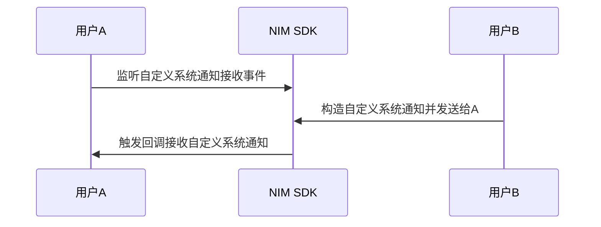

<!--keywords: 自定义系统通知,构造,发送,接收,推送-->


NIM SDK 支持自定义系统通知的收发，帮助您快速实现多样化的业务场景。

本文介绍通过网易云信 NIM SDK 实现自定义系统通知的技术原理、具体的实现流程以及典型的应用场景。

## 技术原理

NIM SDK 提供自定义系统通知收发。自定义系统通知既可以由客户端发起，也可以由开发者服务器发起。

SDK 仅透传自定义系统通知，不负责解析和存储，也不管理其未读数，通知内容由第三方 APP 自由扩展。开发者可以根据其业务逻辑自定义一些事件状态的通知，来实现各种业务场景。例如实现单聊场景中的对方“正在输入”的功能。

自定义系统通知的相关 API，具体请参见 [`SystemMessageInterface`](https://doc.yunxin.163.com/docs/interface/messaging/web/typedoc/Latest/zh/NIM/interfaces/nim_SystemMessageInterface.SystemMessageInterface.html)。

## <span id="实现流程">实现流程</span>



1. 调用 [`getInstance`](https://doc.yunxin.163.com/docs/interface/messaging/web/typedoc/Latest/zh/NIM/classes/nim.NIM.html#getInstance) 在初始化时提前注册监听自定义系统通知接收事件。监听后，当产生触发事件后，会收到相应的的通知。

初始化参数中涉及自定义系统通知事件监听的参数如下：
- `onofflinecustomsysmsgs`：同步离线自定义系统通知的回调，会传入系统通知数组
- `oncustomsysmsg`：收到自定义系统通知的回调，会传入系统通知

示例代码如下：
```
var nim = NIM.getInstance({
    onofflinecustomsysmsgs: onOfflineCustomSysMsgs,
    oncustomsysmsg: onCustomSysMsg,
});
function onOfflineCustomSysMsgs(sysMsgs) {
    console.log('收到离线自定义系统通知', sysMsgs);
}
function onCustomSysMsg(sysMsg) {
    console.log('收到自定义系统通知', sysMsg);
}
function refreshSysMsgsUI() {
    // 刷新界面
}
```

2. 通过调用[`sendCustomSysMsg`](https://doc.yunxin.163.com/docs/interface/messaging/web/typedoc/Latest/zh/NIM/interfaces/nim_SystemMessageInterface.SystemMessageInterface.html#sendCustomSysMsg) 方法发送自定义系统通知。

**参数说明：**

|参数  |说明   |
|---  | ---|
|to   |  接收者 ID，群 ID或者用户 ID  |
|scene   | 自定义系统通知场景，分为单聊（`p2p`）、高级群（`team`）、超大群（`superteam`） |
|content|自定义系统通知的具体内容，使用 JSON 格式构建|
|sendToOnlineUsersOnly|是否只发送给在线用户<br/>true：只发送给在线用户，适用于发送即时通知场景，如“正在输入”<br/>false：若目标用户或群不在线时，会在其上线后再推送<br/>该参数只对单聊场景的自定义系统通知有效，对群自定义系统通知无效，群自定义系统通知只会发给在线的群成员，不会存离线|
|apnsText  |APNS 推送文案，仅对接收方为 iOS 设备有效 |
|pushPayload  |  自定义系统通知的推送属性 <br/>建议使用 JSON 格式构建，若使用非 JSON 格式，Web 端正常接收，但是会被其它端丢弃|
|cc|自定义系统通知是否抄送
|env|环境变量，用于指向不同的抄送、第三方回调等配置|
|isPushable|是否需要推送|
|needPushNick|是否需要推送昵称|
|done|结果回调函数|


::: note notice
开发者可以向其他用户或群发送自定义系统通知，默认只发给在线用户，如果需要发送给离线用户，那么需要设置参数 `sendToOnlineUsersOnly=false`。
:::


**示例代码：**
```objc
var content = {
    type: 'type',
    value: 'value'
};
content = JSON.stringify(content);
var msgId = nim.sendCustomSysMsg({
    scene: 'p2p',
    to: 'account',
    content: content,
    sendToOnlineUsersOnly: false,
    apnsText: content,
    done: sendCustomSysMsgDone
});
console.log('正在发送p2p自定义系统通知, id=' + msgId);
function sendCustomSysMsgDone(error, msg) {
    console.log(error);
    console.log(msg);
    console.log('发送' + msg.scene + '自定义系统通知' + (!error?'成功':'失败') + ', id=' + msg.idClient);
}
```


3. 触发回调，收到自定义系统通知。


## 典型应用场景

这里以实现单聊场景中的对方“正在输入”的功能为例，示例代码如下：

```
//发送方
input.onfocus = () = {
    nim.sendCustomSysMsg({
        scene: 'p2p',
        to: 'account',
        content: JSON.stringify({editing: true}),
        sendToOnlineUsersOnly: true,
        done: () => {}
    })
}

input.onblur = () => {
    nim.sendCustomSysMsg({
        scene: 'p2p',
        to: 'account',
        content: JSON.stringify({editing: false}),
        sendToOnlineUsersOnly: true,
        done: () => {}
    })   
}

//接收方
//收到editing消息后，设置正在输入提示
//收到editing=false消息，或者隔10s没有消息时，清空提示
let timer
function onCustomSysMsg(sysMsg) {
    if (sysMsg.content && sysMsg.content) {
        try {
            const content = JSON.parse(sysMsg.content)
            if (content && content.editing === true) {
                clearTimeout(timer)
                setEditHint()
                setTimeout(() => {
                   unsetEditHint();                    
                }, 10000)    
            } else if (content && content.editing === false) {
                clearTimeout(timer)
                unsetEditHint();            
            }   
        } catch(err) {
            console.error('JSON parse error')        
        }
    } 
}
```


## API 参考

| <div style="width:300px">API</div> | <div style="width:300px">说明 </div>|
|:---- | :-------------- |
|[`getInstance`](https://doc.yunxin.163.com/docs/interface/messaging/web/typedoc/Latest/zh/NIM/classes/nim.NIM.html#getInstance)|在初始化中监听自定义系统通知接收事件|
|[`sendCustomSysMsg`](https://doc.yunxin.163.com/docs/interface/messaging/web/typedoc/Latest/zh/NIM/interfaces/nim_SystemMessageInterface.SystemMessageInterface.html#sendCustomSysMsg)  | 发送自定义系统通知 |